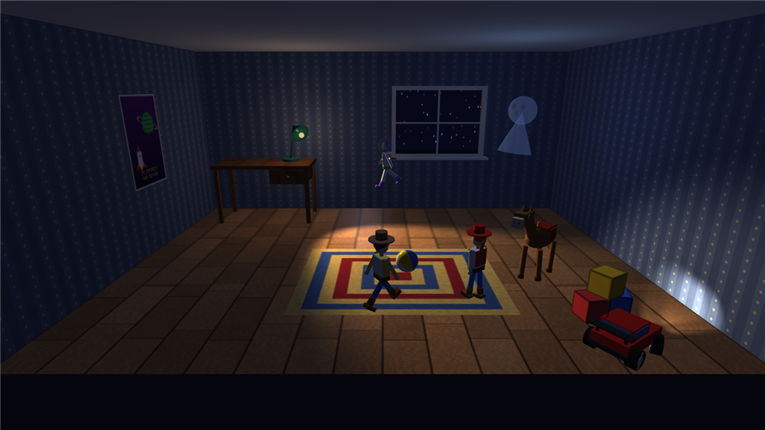
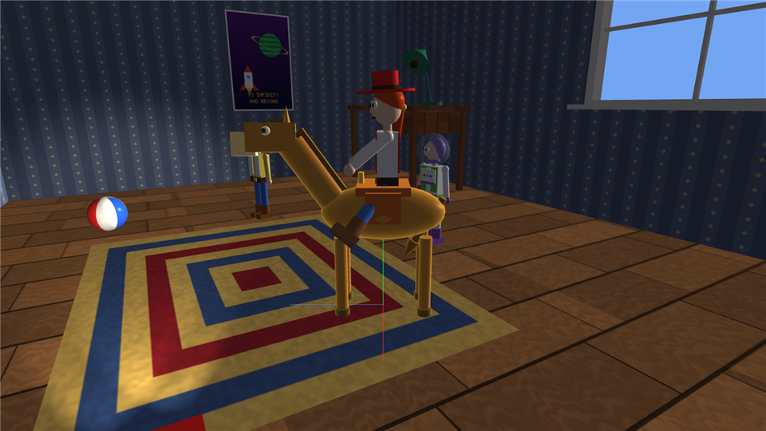
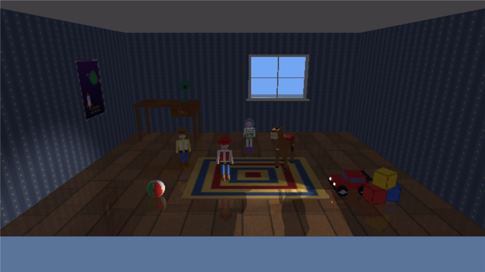
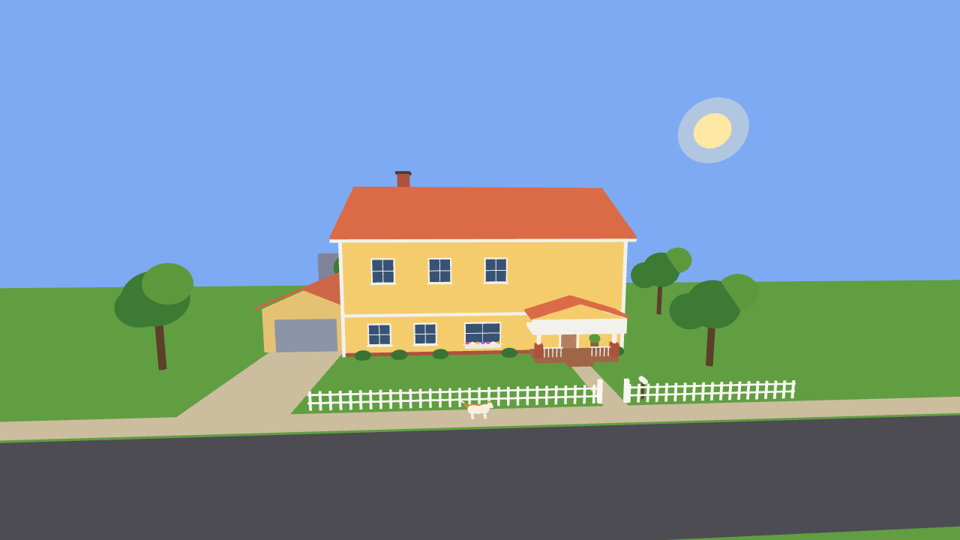

# Haunted Toy Room — Documentation

A C++ / OpenGL 3.3 computer graphics project. At night a child's toy room comes alive: Woody, Jessie,
Buzz, Bullseye and an RC car wander around, the desk lamp flickers and looks around, a beach ball rolls
by itself and a ghost floats through the room. At dawn every toy returns to its place. Every object can be
selected, driven, inspected up close and transformed live; the scene can be rendered with four shading
models or with a real-time GPU ray tracer.

Everything is built from scratch: vertices and indices of the primitives, transformation matrices,
the scene hierarchy, illumination, shading, textures (procedural + a hand-written BMP loader) and the ray
tracer. Only GLFW (window), GLAD (GL function loading) and GLM (vector/matrix types) are used.

| | |
|---|---|
|  |  |
| Jessie mounted on Bullseye (hierarchy) | GPU ray tracing: floor reflections, sunlight only through the window |

## Chapters

| # | Chapter | Course topic |
|---|---|---|
| 01 | [Environment setup](01-environment-setup.md) — libraries, linking, renaming, build & run | setup |
| 02 | [OpenGL pipeline fundamentals](02-opengl-pipeline-fundamentals.md) — VBO/VAO/EBO, shaders, culling, depth | pipeline |
| 03 | [Primitives: vertices, indices, triangles](03-primitives.md) — full tables for every shape | modelling |
| 04 | [3D transformations](04-transformations.md) — every matrix, composite transforms, normal matrix | **L3** |
| 05 | [Camera, viewing and projection](05-camera.md) — lookAt, perspective, camera modes, picking | viewing |
| 06 | [Scene graph and hierarchy](06-scene-graph-hierarchy.md) — MatrixStack, mounting with re-parenting | **L3** |
| 07 | [Characters and props](07-characters-and-props.md) — how each object is assembled | modelling |
| 08 | [Illumination](08-illumination.md) — Phong model, light types, attenuation, spot lights | **L8** |
| 09 | [Shading](09-shading.md) — Flat, Gouraud, Phong, Blinn-Phong | **L9** |
| 10 | [Textures](10-textures.md) — UV mapping, filtering, mipmaps, procedural textures, BMP format | texturing |
| 11 | [Environment, animation and story](11-environment-animation.md) — day/night, lamp, ball, ghost, autopilot | animation |
| 12 | [Ray tracing](12-ray-tracing.md) — analytic intersections, shadows, reflections, transparency | ray tracing |
| 13 | [Controls reference](13-controls.md) — every key | usage |
| 14 | [Code architecture](14-code-architecture.md) — modules, ownership, efficiency | design |

New: [Physics, scene detail and on-screen controls](15-physics-and-interface.md).

Also: [project-context.md](project-context.md) (original idea and requirements) and
[implementation-plan.md](implementation-plan.md) (the plan this implementation follows).

**The prologue.** The program opens in front of a yellow two-storey house in the afternoon sun. Penny,
a white cat with ginger patches, walks in through the front door, climbs the stairs and settles on the bed
in the toy room; then the Midnight Mission starts. **Y** skips it.

## Quick start

1. Open `HauntedToyRoom.slnx` in Visual Studio 2026, choose `Release | x64`, press **F5**.
2. Press **H** for help. Try: **2** (Jessie) → walk her to Bullseye with **W/A/D** → **R** to mount →
   drive with **W/A/S/D** → **R** to dismount.
3. **F** to orbit the selected object, scroll to zoom, **F2** shading models, **F4** ray tracing.
4. **]** speeds up time: watch the room go from night to morning.

## Requirement checklist (from project-context.md)

| Requirement | Where |
|---|---|
| Toys made only from primitives (cubes, spheres, cylinders, cones, planes) | [03](03-primitives.md), [07](07-characters-and-props.md) |
| Woody, Jessie, Bullseye, Buzz, Car — each directly controllable, one at a time | [07](07-characters-and-props.md), [13](13-controls.md) |
| Selection 1–5 (plus 6–8 props), only the selected object responds | `ToyRoomApp::HandleSelection` |
| W/S move along heading, A/D turn, SPACE = stop (not boost), delta time | `Character::Drive` |
| Walking animation (legs alternate, arms opposite), neutral pose on stop | `Humanoid::Animate` |
| Hierarchical models with local transforms, MatrixStack | [06](06-scene-graph-hierarchy.md) |
| Jessie mounts Bullseye (R, distance check), becomes a child of the saddle, follows moves and turns | `ToyRoomApp::Mount` |
| Dismount without teleporting, beside Bullseye, controllable again | `ToyRoomApp::Dismount` |
| Edge-detected one-shot keys | `Input::Pressed` |
| Console output only on state changes | `ToyRoomApp::OnUpdate`, `Select`, `Mount` |
| On-screen indication of the selection | window title + highlight + gizmo |
| Translation, rotation, scaling, shear, reflection, composite transforms | [04](04-transformations.md), edit mode |
| Illumination (ambient, diffuse, specular, light types) | [08](08-illumination.md) |
| Shading models | [09](09-shading.md) |
| Textures (own work, no library) | [10](10-textures.md) |
| Ray tracing | [12](12-ray-tracing.md) |
| Full camera control, zoom, close inspection of any object | [05](05-camera.md) |
| Environment with its own motion; toys come alive at night, return in the morning | [11](11-environment-animation.md) |

- [16 - The Midnight Mission](16-midnight-mission.md): seven coordinated scenes, manual takeover, car activation and the compact interface.
- [17 - Performance](17-performance.md): measured bottlenecks, level of detail, culling and why surface detail belongs in textures.
- [18 - The house, Penny the cat and the arrival](18-house-and-penny.md): the house around the toy room, Penny's model and poses, the prologue's route, doors, camera and sunset.
- [19 - Rendering mathematics](19-rendering-mathematics.md): one frame formula by formula, from input to pixel, with links to every worked example.

## Showcase deliverables

The final report, presentation, demo, study guide and validation records are linked from [START-HERE](showcase/START-HERE.md). Selection during mission playback now supports live takeover while other actors continue; 0 releases the actor, N retains full manual/story switching.
