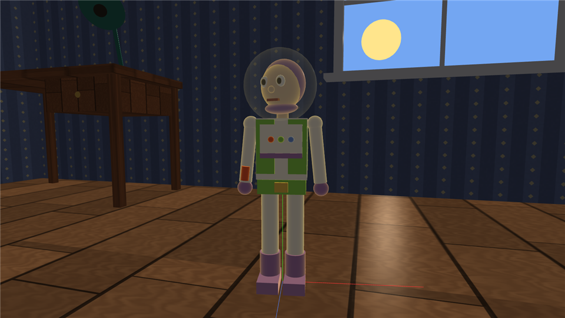

# 07 — Characters and Props: How Each Object Is Built

Every object is a tree of scene nodes (see [06](06-scene-graph-hierarchy.md)) whose shapes are the five
unit primitives of [03](03-primitives.md). Positions/sizes below are in world units (the room is 16 × 12 × 7;
a humanoid toy is about 2 units tall). "pos" is the shape's local position relative to its parent joint,
"size" is the local scale applied to the unit primitive, "rot" is Euler degrees (pitch, yaw, roll).

All characters face **+Z** in their own space, stand with their feet at y = 0 and have their left side on
**+X**. The heading rotates the whole tree about Y.

To see the real numbers live: select an object and press **V** (list of parts with local and world
positions) or **Shift+V** (plus all vertex/index tables).

## 1. Design for reuse

* **One humanoid builder** (`Humanoid`, `src/characters/Humanoid.cpp`) makes Woody, Jessie and Buzz from a
  `HumanoidStyle` (colours + options: vest, hat, long hair braid, space-ranger parts).
* Helper functions `BuildLeg` and `BuildArm` build one limb under a joint; they are called twice per
  character.
* **One `Character` base class** (`src/characters/Character.*`) provides driving, delta-time movement,
  acceleration, the walk phase, autopilot steering, home position and smooth transitions for all five
  controllable toys. Each subclass only adds its model and its own `Animate`.
* **Materials are shared by name** (`Assets::Mat`): e.g. `eye-white`, `eye-pupil`, `brass` are one material
  each, used by every character.

## 2. Humanoid (Woody, Jessie, Buzz)

```
Root (feet on floor, heading)
└─ Pelvis                 joint  pos (0, 0.85, 0)          bobs while walking
   ├─ Belt                cube   pos (0, 0.03, 0)      size (0.40, 0.12, 0.25)
   ├─ Buckle              cube   pos (0, 0.03, 0.13)   size (0.11, 0.08, 0.03)
   ├─ LeftHip             joint  pos ( 0.11, 0, 0)          rotX = walk swing
   │  ├─ Leg              cyl    pos (0, −0.31, 0)     size (0.15, 0.62, 0.15)
   │  ├─ BootShaft        cyl    pos (0, −0.67, 0)     size (0.18, 0.22, 0.18)
   │  └─ Foot             cube   pos (0, −0.80, 0.05)  size (0.18, 0.10, 0.30)
   ├─ RightHip            joint  pos (−0.11, 0, 0)          (same children)
   └─ Torso               joint  pos (0, 0.09, 0)
      ├─ Chest            cube   pos (0, 0.25, 0)      size (0.42, 0.50, 0.24)
      ├─ VestLeft/Right   cube   pos (±0.13, 0.27, 0.125) size (0.15, 0.44, 0.02)   (if hasVest)
      ├─ VestBack         cube   pos (0, 0.27, −0.125) size (0.43, 0.44, 0.02)
      ├─ Neck             cyl    pos (0, 0.54, 0)      size (0.10, 0.10, 0.10)
      ├─ LeftShoulder     joint  pos ( 0.27, 0.46, 0)       rotX = −swing·0.8, rotZ = 6°
      │  ├─ UpperArm      cyl    pos (0, −0.25, 0)     size (0.11, 0.50, 0.11)
      │  ├─ ShoulderBall  sphere pos (0, 0, 0)         size 0.13
      │  └─ Hand          sphere pos (0, −0.55, 0)     size 0.13
      ├─ RightShoulder    joint  pos (−0.27, 0.46, 0)       (same children)
      └─ Head             joint  pos (0, 0.56, 0)           idle: rotY look-around, rotX nod
         ├─ Skull         sphere pos (0, 0.20, 0)      size (0.34, 0.38, 0.34)
         ├─ EyeLeft/Right sphere pos (±0.07, 0.24, 0.145) size (0.08, 0.09, 0.05)
         ├─ PupilL/R      sphere pos (±0.07, 0.24, 0.165) size (0.04, 0.05, 0.03)
         ├─ Nose          sphere pos (0, 0.18, 0.17)   size 0.055
         ├─ Mouth         cube   pos (0, 0.10, 0.15)   size (0.10, 0.02, 0.03)
         ├─ Hair          sphere pos (0, 0.27, −0.035) size (0.36, 0.32, 0.35)
         ├─ Braid (Jessie) joint pos (0, 0.22, −0.17) rot (−12, 0, 0)
         │  ├─ Plait      cyl    pos (0, −0.28, 0)     size (0.10, 0.56, 0.10)
         │  ├─ Bow        sphere pos (0, −0.02, −0.02) size (0.16, 0.09, 0.09)
         │  └─ Tip        sphere pos (0, −0.58, 0)     size 0.12
         ├─ HatBrim       cyl    pos (0, 0.38, 0)      size (0.66, 0.03, 0.66)
         ├─ HatCrown      cyl    pos (0, 0.49, 0)      size (0.30, 0.20, 0.30)
         └─ HatBand       cyl    pos (0, 0.42, 0)      size (0.31, 0.04, 0.31)
```

Height check: feet 0 → hips 0.85 → chest top 0.85 + 0.09 + 0.5 = 1.44 → head joint 1.50 → hat top ≈ 2.1.

### Styles

| | Woody | Jessie | Buzz |
|---|---|---|---|
| shirt | yellow (0.95, 0.85, 0.35) | white | white |
| vest | white cow-print colour | red yoke | green side panels |
| pants | blue jeans | blue jeans | white |
| boots | brown | tan | purple |
| hair | short brown | red + braid with yellow bow | none (purple hood) |
| hat | brown cowboy hat | red cowboy hat | none (glass helmet) |

### Buzz extras (`class Buzz : Humanoid`)

```
Head  + Hood (purple sphere behind the face), Chin (purple), Helmet (sphere 0.6, glass: opacity 0.22,
        reflectivity 0.25 → drawn in the transparent pass, reflective in ray tracing)
Torso + ChestPlate, ChestStripe, three buttons (red/green/blue spheres)
      + Wings joint pos (0, 0.33, −0.16): Pack, WingLeft/Right (cube 0.75×0.06×0.22, rolled ±8°), red tips
        scale.x of the joint = 0.08 (folded) … 1.0 (open) — opens when Buzz is airborne
RightShoulder + LaserEmitter (red cylinder), LaserBeam (thin emissive cylinder, 6 long), LaserTip anchor
```
**L** toggles the laser: the right arm blends up to −90° pitch (pointing forward), the beam appears and a
red point light follows the laser tip. **Q / E** fly up / down.



### Humanoid animation (`Humanoid::Animate`)

```
walkPhase += speed · dt · 4            (advances with distance → feet don't slide)
moveBlend  → 1 while moving, → 0 when stopped (exponential ease, so limbs return to neutral smoothly)
swing = sin(walkPhase) · 35° · moveBlend

LeftHip.rotX  = +swing      RightHip.rotX  = −swing          legs in opposite phase
LeftShoulder  = −0.8·swing  RightShoulder  = +0.8·swing      arms opposite to the legs
Pelvis.y      = 0.85 + |sin(walkPhase)|·0.04·moveBlend        body bob (twice per stride)
Head.rotY     = sin(0.6·t)·25°·(1 − moveBlend)               idle look-around
Seated pose   : hips (−40°, 0, ±32°) astride, shoulders −50° (hands on the reins), blended by seatBlend
```

## 3. Bullseye (`src/characters/Bullseye.cpp`)

```
Root (hooves on floor, heading)
└─ Body                     joint    y bob = |cos(1.2·phase)|·0.06 while galloping
   ├─ Barrel                sphere   pos (0, 1.25, 0)    size (0.72, 0.66, 1.50)   ellipsoid body
   ├─ Belly                 sphere   pos (0, 1.08, 0)    size (0.50, 0.30, 1.00)   lighter colour
   ├─ Saddle                joint    pos (0, 1.55, 0)
   │  ├─ SaddlePad          cube     size (0.62, 0.10, 0.62)
   │  ├─ SaddleFlapL/R      cube     pos (±0.33, −0.18, 0) size (0.05, 0.35, 0.40)
   │  ├─ Horn               cyl      pos (0, 0.10, 0.26) size (0.07, 0.16, 0.07)  brass
   │  └─ Seat               joint    pos (0, 0.06, −0.05)      ← Jessie attaches here
   ├─ Neck                  joint    pos (0, 1.42, 0.62) rot (35, 0, 0)   leans forward, nods while galloping
   │  ├─ NeckShape          cyl      pos (0, 0.38, 0)    size (0.30, 0.80, 0.34)
   │  ├─ Mane               cube     pos (0, 0.42, −0.16) size (0.07, 0.85, 0.12)
   │  └─ Head               joint    pos (0, 0.80, 0) rot (−35, 0, 0)   cancels the neck tilt → level head
   │     ├─ Skull           cube     pos (0, 0.05, 0.20)  size (0.32, 0.32, 0.55)
   │     ├─ Muzzle          cube     pos (0, −0.02, 0.50) size (0.28, 0.26, 0.26)
   │     ├─ NostrilL/R      sphere   pos (±0.07, 0, 0.63) size 0.05
   │     ├─ EyeL/R, PupilL/R sphere  pos (±0.165, 0.12, 0.25) …
   │     ├─ EarL/R          cone     pos (±0.10, 0.30, 0.02) size (0.10, 0.22, 0.08)
   │     └─ Forelock        cube
   ├─ Tail                  joint    pos (0, 1.42, −0.72) rot (−30, 0, 0)   swish (rotZ) when idle
   │  ├─ TailShape          cyl      pos (0, −0.35, 0)   size (0.10, 0.70, 0.10)
   │  └─ TailTip            cone     pos (0, −0.80, 0)   size (0.18, 0.30, 0.18) rot (180, 0, 0)
   └─ FrontLeftHip / FrontRightHip / BackLeftHip / BackRightHip   joints at (±0.22, 1.0, ±0.5)
      ├─ Leg                cyl      pos (0, −0.45, 0)   size (0.15, 0.90, 0.15)
      └─ Hoof               cyl      pos (0, −0.95, 0)   size (0.18, 0.10, 0.18)
```

Gallop: diagonal pairs move together — `FL = BR = sin(1.2·phase)·32°`, `FR = BL = −FL`.
Controls: W/S, A/D, Shift gallop faster, SPACE stop. Faster (2.6 u/s) than the humanoids (1.8 u/s).

## 4. RC Car (`src/characters/RCCar.cpp`)

```
Root (heading)
├─ Chassis           Body cube (0.8, 0.3, 1.4) · Cabin cube (0.7, 0.28, 0.7) · 4 glass windows
│                    bumpers · spoiler + posts · antenna · 2 headlight bulbs (emissive when on)
│                    HeadlightL / HeadlightR anchors → two spot lights
└─ WheelFL/FR/BL/BR  joints at (±0.45, 0.22, ±0.45); front ones steer (rotY = steering)
   └─ Spin           joint, rotX = wheelAngle
      ├─ Tyre        cylinder rot (0, 0, 90) size (0.44, 0.20, 0.44)   ← axis turned from Y to X
      ├─ Hub         cylinder rot (0, 0, 90)
      └─ Spoke       cube (makes the rolling visible)
```

* **Rolling without slipping:** `wheelAngle += degrees(speed · dt / radius)` with radius 0.22.
* **Car steering:** a car can only turn while moving — `TurnFactor = clamp(speed / maxSpeed) · 1.3`,
  so turning reverses when reversing. Front wheels show the steering angle (±28°).
* **L** toggles the headlights (two spot lights with 12°/22° cones).

## 5. Props (`src/world/Room.cpp`)

| Prop | Construction | Behaviour |
|---|---|---|
| Floor | plane 16 × 12, wood-plank texture ×(4, 3), reflectivity 0.18 | mirror-like reflections in ray tracing |
| Walls | 3 planes + back wall made of 4 planes around a window opening, wallpaper texture | one-sided (doll's house view) |
| Ceiling | plane rotated 180° about X | |
| Window | 4 frame cubes + cross mullions + sill | shows the sky outside |
| Sky | huge plane 34 units behind the window, unlit, star texture | colour follows the day/night cycle |
| Sun / Moon | unlit spheres on an arc behind the window | positions drive the directional light |
| Rug | plane 6 × 4.5, procedural rug texture | |
| Poster | plane on the left wall, texture loaded from `assets/textures/poster.bmp` by our BMP loader | |
| Toy blocks | 3 cubes, one star-block texture tinted red / blue / yellow | |
| Desk | top + 4 legs + drawer cubes, knob sphere | |
| Desk lamp (key 7) | Base cyl → ArmJoint (tilt) → Arm cyl + Elbow sphere → HeadJoint (tilt) → Shade cone, Bulb sphere (emissive), LightAnchor | point + spot light, flickers and looks around at night; A/D swivel, W/S tilt, R power |
| Ball (key 6) | root → BallShape sphere Ø 0.7 with beach-ball texture | rolls by itself at night; W/S/A/D push relative to the camera, bounces off walls |
| Ghost (key 8) | Body joint → Head sphere, Sheet cone, eyes and mouth | transparent, fades in at night, circles the room, bluish point light |

## 6. Selection summary

| Key | Object | Controls |
|---|---|---|
| 1 | Woody | W/S move, A/D turn, Shift run, SPACE stop |
| 2 | Jessie | same + R mount/dismount Bullseye (when mounted, W/S/A/D drive Bullseye) |
| 3 | Bullseye | same + R mount/dismount |
| 4 | Buzz | same + Q/E fly, L laser |
| 5 | RC Car | same + L headlights |
| 6 | Ball | W/S/A/D push, SPACE stop |
| 7 | Desk lamp | A/D swivel, W/S tilt, R power, , / . brightness |
| 8 | Ghost | (inspect / edit mode) |
| 0 | nothing | camera only |
