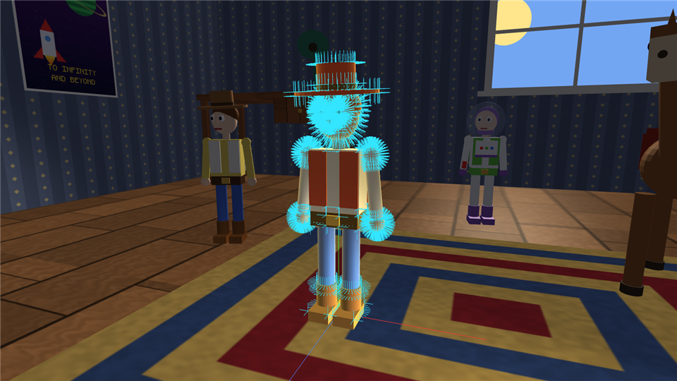
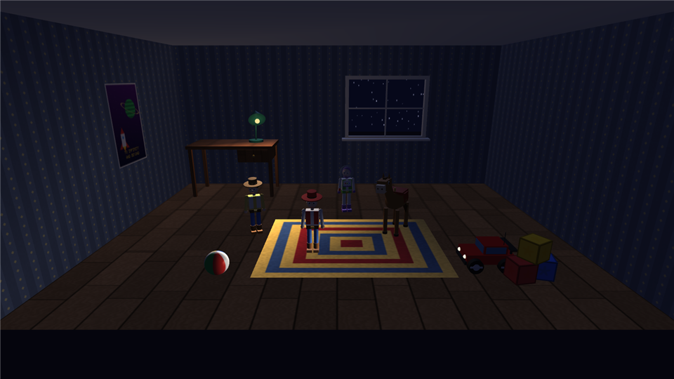

# 09 — The Pipeline and Shading Models (Lecture 9)

Illumination ([08](08-illumination.md)) says *how much light a point reflects*. Shading says *where we
evaluate that formula*: once per triangle, once per vertex or once per pixel. This chapter first follows a
vertex all the way to a pixel (with numbers), then explains how values are interpolated across a
triangle, and finally compares the four shading models. **F2** cycles them live (it also switches shading
on if the Settings panel had it off); the title bar shows the active one.

| Mode (F2) | Normal used | Where lighting is computed | Shader files |
|---|---|---|---|
| **Flat** | one per triangle (face normal) | per fragment, constant over the face | `lit.vert` + `lit.frag` (`uShadingMode = 0`) |
| **Gouraud** | vertex normals | **per vertex**, colours interpolated | `gouraud.vert` + `gouraud.frag` |
| **Phong** | vertex normals interpolated per pixel | **per pixel**, Phong specular (R·V) | `lit.vert` + `lit.frag` (`uShadingMode = 2`, `uBlinn = 0`) |
| **Blinn-Phong** (default) | as Phong | per pixel, half-vector specular (N·H) | `lit.frag` (`uBlinn = 1`) |

## 1. From a vertex to a pixel

Each vertex goes through five coordinate systems:

```
object (model) space ──M──▶ world space ──V──▶ eye (view) space ──P──▶ clip space ──÷w──▶ NDC ──viewport──▶ window
   unit primitive          the room           camera at origin,       homogeneous        cube [−1,1]³      pixels + depth
                                              looking down −Z
gl_Position = uProj · uView · uModel · (x, y, z, 1)           (lit.vert / gouraud.vert)
```

| Stage | Formula | Code |
|---|---|---|
| Model | `p_world = M · p_object`, M = product of local matrices down the scene graph | `SceneNode::UpdateWorld` |
| View | rows of V are the camera axes r, u, −f; last column `(−r·eye, −u·eye, f·eye)` | `t3d::lookAt` |
| Projection | `x_c = x_e / (aspect·tan(fov/2))`, `y_c = y_e / tan(fov/2)`, `z_c = −(f+n)/(f−n)·z_e − 2fn/(f−n)`, `w_c = −z_e` | `t3d::perspective` |
| Perspective divide | `ndc = (x_c, y_c, z_c) / w_c` (done by the GPU) | fixed function |
| Viewport | `x_win = (ndc.x + 1)/2 · width`, `y_win = (ndc.y + 1)/2 · height` (from the bottom), `depth = (ndc.z + 1)/2` | `glViewport` |

### Worked example (default camera, 1600 × 900 window)

Camera at `eye = (0, 5, 8.2)` looking at `(0, 1, 0)`, fov 65°, near 0.05, far 200. The vertex is the
top-front-right corner (0.5, 0.5, 0.5) of the unit cube used for a toy's left boot ("Foot", size
0.18 × 0.10 × 0.30) when the toy stands at the origin: its model matrix is
`T(0.11, 0.05, 0.05) · S(0.18, 0.10, 0.30)`.

| Step | Value |
|---|---|
| world | (0.11 + 0.09, 0.05 + 0.05, 0.05 + 0.15) = **(0.20, 0.10, 0.20)** |
| camera axes | f = normalize((0,1,0) − eye) = (0, −0.4384, −0.8988); r = normalize(f × up) = (1, 0, 0); u = r × f = (0, 0.8988, −0.4384) |
| eye space | (r·(p − eye), u·(p − eye), −f·(p − eye)) = **(0.200, −0.897, −9.338)** — 9.34 units in front of the camera |
| projection constants | 1/(aspect·tan 32.5°) = 1/(1.778 · 0.6371) = 0.8829; 1/tan 32.5° = 1.5697 |
| clip | (0.8829·0.200, 1.5697·(−0.897), 9.243, 9.338) = **(0.1766, −1.4073, 9.2431, 9.3384)** |
| NDC (÷ w) | **(0.0189, −0.1507, 0.9898)** — inside [−1, 1]³, so it is not clipped |
| window | x = 1.0189/2 · 1600 = **815.1**, y = 0.8493/2 · 900 = 382.2 from the bottom (**517.8** from the top) |
| depth | (0.9898 + 1)/2 = **0.9949** |

Note how non-linear the depth is: a point only 9.3 units away already uses 99.5 % of the depth range.
Depth precision is concentrated near the near plane (`z_ndc` depends on `1/z_e`), which is why the near
plane is 0.05 and not smaller.

**Clipping and culling.** Triangles outside the clip cube are clipped by the GPU. Before that, our
renderer already skipped every shape whose bounding sphere lies completely outside one of the six
frustum planes (`Frustum` in `Renderer.cpp`, [17](17-performance.md)). After projection the GPU computes
each triangle's signed screen area ([03](03-primitives.md)) and drops back faces (`glCullFace(GL_BACK)`).

## 2. Rasterisation and interpolation

For every pixel centre p inside a projected triangle (v0, v1, v2) the rasteriser computes screen-space
barycentric weights from sub-triangle areas:

```
α = area(p, v1, v2) / area(v0, v1, v2),   β = area(v0, p, v2) / area,   γ = 1 − α − β
```

A naïve `a = α a0 + β a1 + γ a2` would be wrong under perspective (textures would swim), because equal
steps on screen are not equal steps on the 3D triangle. OpenGL interpolates **perspective-correctly**,
using the clip-space w of each vertex:

```
a(p) = ( α·a0/w0 + β·a1/w1 + γ·a2/w2 ) / ( α/w0 + β/w1 + γ/w2 )
```

Every vertex-shader `out` variable (world position, normal, uv, Gouraud colour) is interpolated this way.
The depth value is interpolated linearly in screen space (it was already divided by w) and compared with
the depth buffer (`GL_DEPTH_TEST`, keep the nearer fragment). With 4× MSAA each pixel stores 4 coverage
and depth samples, which smooths the edges.

## 3. Flat shading

Every triangle gets one normal, so each facet has one uniform brightness: the sphere looks like a
faceted gem, which makes the triangle structure of our meshes (and their level of detail) visible.

Instead of storing duplicate vertices with face normals, the fragment shader **reconstructs the face
normal** from screen-space derivatives of the interpolated world position:

```glsl
N = normalize(cross(dFdx(vWorldPos), dFdy(vWorldPos)));
```

`dFdx` / `dFdy` are the differences of `vWorldPos` between neighbouring pixels in x and y (the GPU shades
pixels in 2 × 2 quads, so it has them for free). Both vectors lie in the triangle's plane, so their cross
product is perpendicular to the triangle. Because screen x and y form a right-handed pair with the view
direction, this normal always faces the camera, so it is never flipped for back faces.



*Flat shading (F2) with the selected object's vertex normals shown (F9). Every facet has one brightness.*

## 4. Gouraud shading

The full illumination model runs in the **vertex shader** (`gouraud.vert`):

```glsl
computeLighting(world.xyz, N, V, diffuse, specular);   // per vertex, including the lamp shadow lookup
vLight    = ambientTerm() + diffuse;                    // interpolated by the rasteriser
vSpecular = specular;
```

The fragment shader only combines the interpolated values with the colour and texture:
`color = albedo · vLight + vSpecular + emissive`.

* **Cost:** lighting runs once per vertex — 925 times for a full-detail sphere, 77 times for a low-detail
  one — instead of once per covered pixel (tens of thousands for a large object).
* **Artefacts:** highlights look blotchy or star-shaped on coarse meshes and vanish entirely when the
  highlight falls between vertices. The level-of-detail meshes ([03 §8](03-primitives.md)) make this easy
  to see: a distant sphere has only 77 vertices to carry its lighting. The floor is a single 4-vertex
  plane, so the lamp's pool of light can disappear completely: the spot cone is evaluated only at the
  four corners and linearly blended.



*Gouraud at night: the lamp's spot light misses the floor's four vertices, so its pool of light is missing.*

## 5. Phong shading

The **normal** (not the colour) is interpolated across the triangle, re-normalised per fragment, and the
illumination model is evaluated **per pixel**:

```glsl
vec3 N = normalize(vNormal);                 // interpolated normal, unit length again
vec3 V = normalize(uCameraPos - vWorldPos);
if (!gl_FrontFacing) N = -N;                 // thin double-sided surfaces: light the visible side
computeLighting(vWorldPos, N, V, diffuse, specular);
```

Why re-normalise: the linear blend of two unit vectors is shorter than 1 (for two normals 60° apart, the
midpoint has length cos 30° = 0.87), which would dim the lighting in the middle of every triangle.

Smooth surfaces look smooth even with few triangles, highlights are round and sharp, and the lamp's spot
forms a correct pool on the floor even though the floor is only two triangles.

## 6. Blinn-Phong

Same as Phong; only the specular term uses `max(N·H, 0)^(4n)` with `H = normalize(L + V)` instead of
`max(R·V, 0)^n` ([08 §2.3](08-illumination.md)). It is the default mode.

## 7. Comparing the costs

For one object covering F pixels with V vertices and k lights:

| Model | Lighting evaluations per frame | Quality |
|---|---|---|
| Flat | F (one normal per face, but computed per pixel here) | faceted |
| Gouraud | V · k | smooth diffuse, unreliable highlights |
| Phong / Blinn | F · k | smooth everything |

A full-screen close-up of Woody's head covers ~200 000 pixels but has only 925 vertices, so Gouraud is
~200× cheaper there; for a distant toy covering 2 000 pixels the difference almost disappears. Modern GPUs
make per-pixel lighting affordable, which is why Blinn-Phong is the default.

## 8. The normal matrix again

All modes transform normals with `uNormalMatrix = transpose(inverse(mat3(model)))`
([08 §8](08-illumination.md), [04](04-transformations.md)). Try: select Bullseye, Tab, T → Scale, stretch him on
one axis — lighting stays correct in every shading mode.

## 9. What to show the teacher

1. Select the ball (6) or Woody (1), press **F** to orbit close, **F2** to cycle modes.
2. **F1** wireframe shows the actual triangles that Flat shading makes visible; zoom out and watch the
   level of detail switch to coarser meshes.
3. **F9** shows the vertex normals used by Gouraud/Phong (cyan lines), **F10** the vertices themselves.
4. At night with the lamp on: compare the lamp's spot on the floor in Gouraud (almost missing) and in
   Phong (a clean circle with soft shadows from the shadow map).
