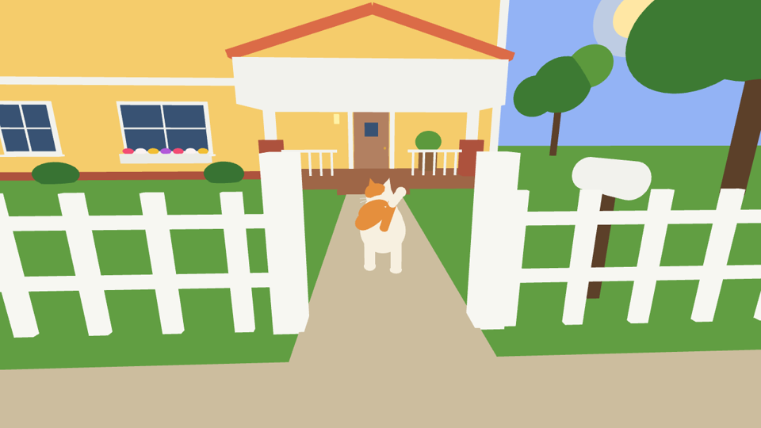
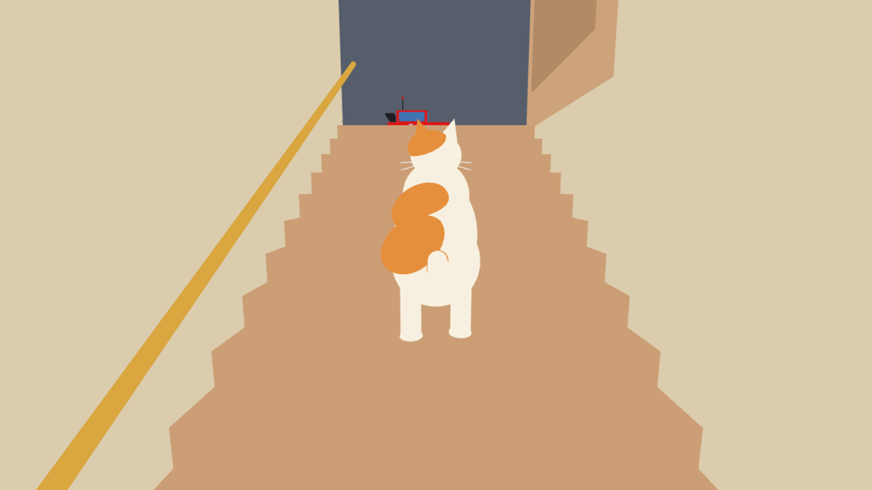
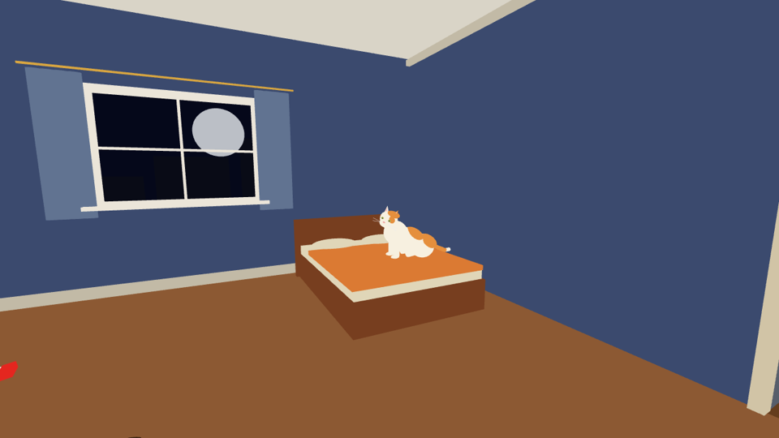
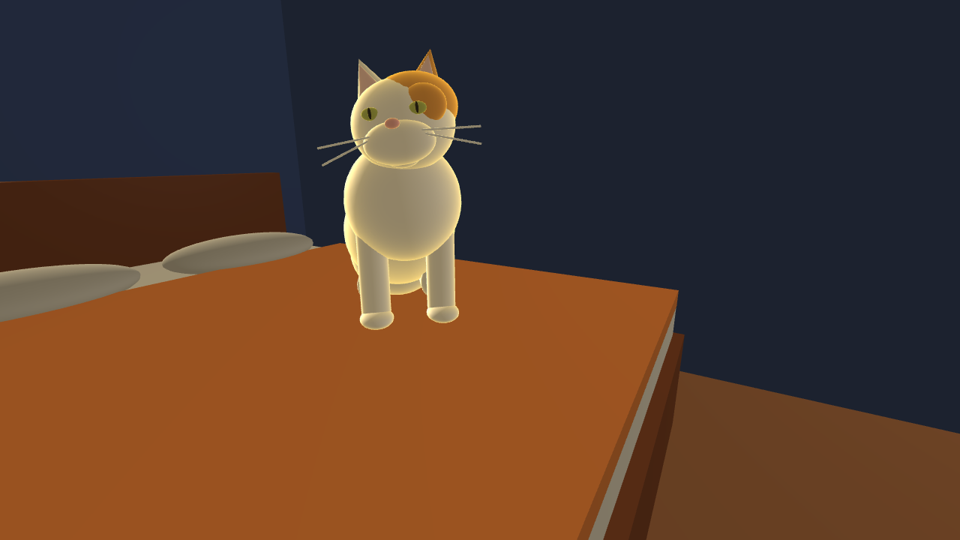
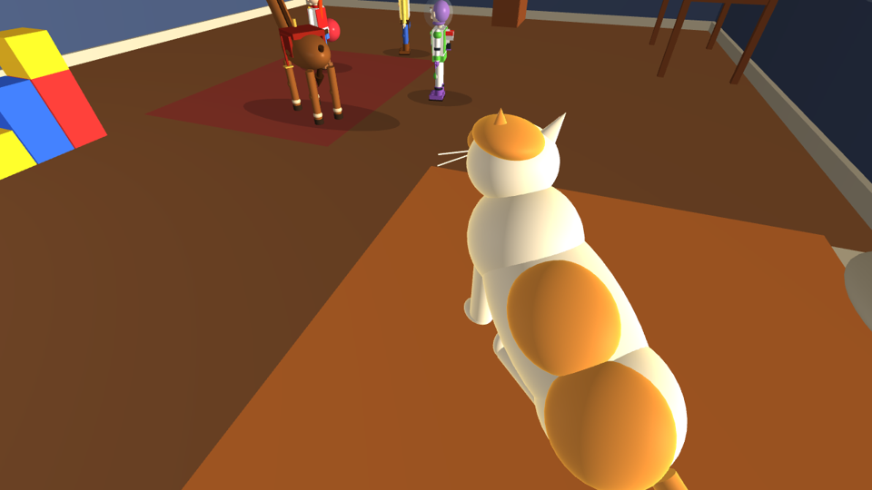
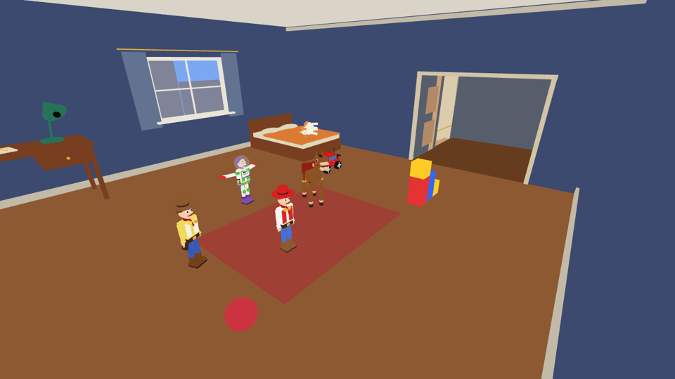

# 18 — The House, Penny the Cat and the Arrival

Files: `src/world/House.*` (the house), `src/characters/Cat.*` (Penny), `src/world/PennyArrival.*` (the
prologue), `src/world/Room.h` (`RoomSize` dimensions), `src/render/ProceduralTextures.cpp` (siding,
shingles, brick, grass), `Environment::OutdoorSunPosition`.

Before the Midnight Mission starts, the program opens on a sunny street in front of a yellow two-storey
house. **Penny**, a white cat with ginger patches, walks home: along the pavement, through the garden
gate, up the porch, in through the front door, along the hall, up the stairs and through the toy room's
double door. She jumps onto the bed and sits there to watch the story. The sun sets while she walks, so it
is night when she reaches the toy room. In the morning, at the end of the story, she is asleep on her side.

**Y** skips the arrival; **Shift+N** replays it together with the story; `--no-intro` starts directly with
the story. Scripted captures skip it unless `--intro` is given.

| | |
|---|---|
|  |  |
| Late afternoon: the establishing shot (16:18, sun in the sky) | The chase camera follows Penny through the gate |
|  |  |
| Up the 18 steps to the hallway; the car waits upstairs | On the orange plaid bed, night outside |

## 1. The house around the toy room

The toy room becomes the **upper floor** of the house. Nothing in the room moved: its floor is still
y = 0, so the story, the physics and every earlier coordinate still hold. The house is built around it and
below it (`RoomSize` in `Room.h`):

| Part | Dimensions (world units) |
|---|---|
| Toy room (upper floor) | x ∈ [−10, 10], z ∈ [−9, 9], y ∈ [0, 7.5] |
| Hallway (upper floor) | x ∈ [10, 17], z ∈ [1, 7], height 4.8; the car waits here |
| Ground floor | y = −4.5 (`Ground`); ceiling = underside of the upper floor at y = −0.3 (`Slab`) |
| Corridor | x ∈ [10.5, 13.5], from the front door (z = 9.2) to the back wall (z = −9) |
| Stairs | x ∈ [13.5, 16.5]; 18 steps from z = −7 (y = −4.5) to z = 1 (y = 0): rise 0.25, tread 0.444, pitch atan(4.5 / 8) = 29.4° |
| Outer walls | x ∈ [−10.45, 17.45], z ∈ [−9.35, 9.35], 0.3 thick, from the ground to y = 7.5 |
| Roof | ridge along X at z = 0, y = 12.5; eaves 0.8 beyond the walls at y = 7.1; pitch 28° |
| Porch | x ∈ [8, 16], z ∈ [9.35, 12.5], deck 0.45 high, 3 steps, own gable roof |
| Garage | x ∈ [−19, −10.45], z ∈ [−5, 7.5], 4.5 high, gable roof |
| Garden | lawn 320 × 320, path, pavement (z ≈ 23.4), street, picket fence at z = 21.5 with a gate at x = 12 |

```
            plan view (y up out of the page, +X right, +Z down)                 section through the stairs (x = 15)

  z=-9 ┌───────────────────────── back wall (window) ──┬───┬─────┐          y=0   hall ────┐▓
       │                                               │   │ ▄▄▄ │                         ▓▓▓
       │                                               │ C │ ▄▄▄ │ stairs                ▓▓▓▓▓   18 steps
       │             TOY ROOM  (upper floor)           │ O │ ▄▄▄ │ climb +Z           ▓▓▓▓▓▓▓
       │                                               │ R │ ▄▄▄ │             y=-4.5 ▓▓▓▓▓▓▓▓▓▓
  z=1  │                                     door ═════╪═══╧══╤══╡  stair door      z=-7 ───── z=1
       │                                     (x=10)    │  HALLWAY │
  z=7  │                                               │  (car)  │
  z=9  └────────────────────── front wall ─────────────┴──┬─┬────┘
                                                  front door  porch
```

(The corridor C lies *under* the hallway's level, beside the stairs; Penny walks it on the ground floor.)

### Construction

Everything is made from the five primitives:

* **Walls** are 0.3-thick cubes outside the room's one-sided wall planes (`SidedBox`). The room's planes face
  inward and are culled from outside, so from the garden you see the siding; from inside you see the
  wallpaper. The back wall has an opening exactly around the toy room's window, so the moon is still visible.
* **Roof slabs**, **gables** and **door hinges** are rotated and non-uniformly scaled cubes — see
  [04 §4.2](04-transformations.md) for the matrices (the triangular gables are a 45°-rotated cube stretched
  by its parent joint).
* **Windows** on the facade are decorative: frame, glass (reflective in ray tracing), cross mullions and sill.
* **Garden**: lawn plane, path, pavement, street, ~50 white pickets and 4 rails, gate posts, mailbox, shrubs,
  five trees (trunk + three foliage spheres each), and a flower box with seven flowers.
* **Interior**: corridor floor, runner rug, ceiling with a lamp, walls (one-sided planes facing inward),
  stair landing, 18 solid step boxes inset 2 cm from the side walls (so their faces never coincide with the
  wall planes, which would flicker — z-fighting), a brass handrail tilted along the slope, the stairwell walls
  and ceiling.
* **Doors**: the front door, the toy room's double door and a door at the top of the stairs, each a leaf
  with panels and a brass knob hanging from a hinge joint.

New greyscale procedural textures, tinted by their materials: **siding**, **shingles**, **brick**, **grass**
(formulas in [10](10-textures.md)). The bed in the toy room now has the orange plaid sheet and beige
pillows of the photos of Penny asleep.

### Visibility switching

None of the outside can be seen from inside the house, and nothing downstairs can be seen from the upper
floor once the stair door is shut. So:

```
HouseExterior.visible = Penny has not yet reached the foot of the stairs
HouseInterior.visible = the arrival is still running (the stair door shuts behind Penny)
```

A hidden subtree is skipped by both the world-matrix update and the draw list ([06](06-scene-graph-hierarchy.md)),
so during the story the house costs nothing but its three doors. Without this the ground floor's large walls
would be shaded behind the room's walls every frame (overdraw), and in ray tracing they would be tested by
every ray (they belong to the always-tested scenery group).

## 2. Penny (`class Cat : Character`)

Modelled on the reference photos: creamy white fur, a large ginger patch in the middle of her back and a
second one over her hip on the same (left) flank, a ginger cap over the top of her head running down
around her left eye to her left ear (the right side of her face is white), white legs and paws, a pink
nose, pink inner ears and white whiskers. Her closed eyes are thin dark lines.

|  |  |
|---|---|
| The ginger patch over her left eye and ear | The two ginger patches on her back and flank |



*The end of the story: the toys are back in place and Penny is asleep on her side on the orange bed.*

```
Root (paws on the ground, heading)
└─ Body                   joint (0, 0.62, 0)       pitch on stairs / sitting, roll 88° when asleep
   ├─ Torso               sphere (0, 0, −0.02)      size (0.64, 0.58, 1.30)   white fur
   ├─ Chest               sphere (0, 0.03, 0.42)    size (0.58, 0.60, 0.62)
   ├─ Haunch              sphere (0, 0, −0.42)      size (0.62, 0.62, 0.66)
   ├─ BackPatch           sphere (0.12, 0.20, −0.02) size (0.46, 0.24, 0.52) roll −22°  ginger
   ├─ HipPatch            sphere (0.15, 0.18, −0.46) size (0.48, 0.26, 0.50) roll −26°  ginger
   ├─ Head                joint (0, 0.26, 0.74)     yaw = look-at, levelled against the body pitch
   │  ├─ Skull            sphere size (0.46, 0.40, 0.42)
   │  ├─ Muzzle, Chin     spheres
   │  ├─ GingerCap        sphere (0.05, 0.07, −0.02) size (0.40, 0.30, 0.38)   only its top-left rises above the skull
   │  ├─ GingerEyePatch   sphere (0.11, 0.05, 0.13)  size (0.20, 0.17, 0.12)
   │  ├─ Ear ×2           cone (±0.13, 0.21, −0.03)  size (0.20, 0.22, 0.11)   left ginger, right white
   │  ├─ InnerEar ×2      cone, pink
   │  ├─ Eye ×2, Pupil ×2 spheres (yellow-green iris, vertical slit pupil)   hidden when the eyes close
   │  ├─ ClosedEye ×2     thin dark cubes                                       shown when asleep or blinking
   │  ├─ Whisker ×4       thin cylinders
   │  └─ Nose             sphere, pink
   ├─ Tail → TailTip      joints; ginger base cylinder, white end + tip sphere
   └─ 4 legs              joints under the chest / haunch → Leg cylinder + Paw sphere
```

34 shapes, 34 656 triangles at full detail (mostly spheres; with level of detail she is usually drawn with
a few thousand).

**A patch that looks painted on.** The ginger patches are spheres that overlap the white body. Where a
patch sphere lies inside the body it is hidden by the depth test; only the cap that rises a few
centimetres above the body's surface is visible, and its edge follows the intersection curve of the two
ellipsoids. That is what makes it read as a patch of fur rather than a separate object.

### Animation (`Cat::Animate`)

```
gait      stride = sin(1.6 · walkPhase) · 30° · moveBlend · (1 − rest)       rest = max(sitBlend, sleepBlend)
          front-left = back-right = +stride,  front-right = back-left = −stride       (a diagonal trot)
          body bob = |cos(1.6 · walkPhase)| · 0.03 · moveBlend
blends    sitBlend, sleepBlend += (target − blend) · (1 − e^(−5·dt))        smooth pose changes, frame-rate independent
stairs    body pitch = −slope (29.4° nose up), each leg +slope so the legs stay vertical
sit       body pitch −30°, body lowered to 0.47 and moved back 0.12; front legs +30° (vertical), hind legs −62° (tucked)
sleep     body roll 88° (lying on her right side, patches up), height 0.31; legs stretched (−35° / +25°);
          head down 18° and tilted; tail flat behind her
head      yaw = clamp( wrap( atan2(dx, dz) − heading ), −70°, 70° ), eased      looks at the toy that is acting
eyes      closed when sleepBlend > 0.5, plus a 0.13 s blink every 4.1 s
```

During the story she sits on the bed and her head follows the action — Buzz while his laser is on, else
Bullseye while Jessie rides him, else Woody. When the story reaches **Morning** she lies down and sleeps.

## 3. The arrival (`PennyArrival`)

### Route
15 waypoints in 3D (the y coordinate climbs the porch steps and the stairs):

| # | Waypoint | Leg length |
|---|---|---|
| 0 → 1 | pavement (2, −4.5, 23.4) → (11, −4.5, 23.3) | 9.0 |
| 2, 3 | through the gate (12, −4.5, 21.9), up the path to (12, −4.5, 14) | 9.6 |
| 4, 5 | up the porch steps to (12, −4.05, 12.5), across the porch to (12, −4.05, 9.9) | 4.2 |
| 6, 7 | over the threshold, along the corridor to (12, −4.48, −7.9) | 17.9 |
| 8, 9 | onto the landing (15, −4.48, −8.1), foot of the stairs (15, −4.48, −7) | 4.1 |
| 10 | top of the stairs (15, 0.02, 1) | 9.2 |
| 11 → 14 | hallway, through the toy room door, past the crate, in front of the bed (7.3, 0, −2.4) | 11.5 |

Total 65.4 units at 2 units/s (`Character::FollowWaypoint`): ~33 s, plus a 1.5 s pause for the opening
shot, a 0.7 s jump and a 2 s settle — **about 37 s**.

`FollowWaypoint` turns the heading towards the waypoint at most `turnRate·dt` per frame and moves
`min(distance, speed·dt)` along the straight line, so she walks at constant speed and turns smoothly at
corners. The walk cycle uses `speed = step / dt`, so her legs match her speed.

**The jump** onto the bed (from (7.3, 0, −2.4) to (7.5, 1.17, −4.9), 0.7 s):

```
p(t) = mix(start, end, s(t)) + (0, 1.0 · sin(π t), 0)        s(t) = t²(3 − 2t)
```

The arc's peak is 1 unit above the straight line, so she clears the bed frame (0.82) and lands on the
blanket (1.16).

### Doors
Each hinge angle eases exponentially towards its target, `angle += (target − angle)(1 − e^(−2.5·dt))`:

| Door | Opens when | Angle |
|---|---|---|
| Front door | Penny within 4 units of it | 85° inward |
| Stair door | she reaches the foot of the stairs | 90°, then shuts once she is in the toy room |
| Toy room double door | she is near the top of the stairs (z > −2) | ±90° into the hallway, stays open for the story |

### Camera
```
0 – 6 s     establishing shot: from (0, 9, 52) pushing in to (6, 4, 36), looking at the house (3.5, 3, 0)
3 – 7 s     blend from the establishing shot to the chase camera, weight smoothstep((t − 3) / 4)
chase       target position = Penny − forward · back + (0, up, 0)     back/up = 4.2/1.9 outside, 2.4/1.3 indoors
            look-at          = Penny + forward · 1.2 + (0, 0.6, 0)
            camera += (target − camera) · (1 − e^(−2.6·dt))                    first-order exponential smoothing
toy room    fixed vantage (3.2, 3.4, 2.6) looking at Penny's head while she crosses the room and jumps
```

The exponential factor `1 − e^(−k·dt)` makes the smoothing independent of the frame rate: two frames of
dt/2 move the camera exactly as far as one frame of dt.

### Clock and sun
```
progress = distance walked / 65.4
hour     = 16.3 + 7.6 · smoothstep(progress)          16:18 on the street, ~18:40 at the front door (progress 0.37),
                                                      23:54 in front of the bed, midnight once she has jumped
```

The sky, the ambient light and the sun/moon light follow the hour exactly as in [08 §5](08-illumination.md).
The garden's sun disc (radius 3.5, with a translucent halo) is placed at
`(−60 cos a, 4 + 55 sin a, −37)` with `a = (hour − 6)/12 · π`; at 16:18 it stands high to the right of the
house and sinks while Penny walks. The story then sets the clock to midnight.

## 4. Integration (`ToyRoomApp::StepScene`)

While the arrival runs:

* the arrival owns the camera (the room's camera collision is not applied: the camera flies through the
  garden and the house) and the clock;
* the toys keep the rest pose given by the story's restart (they are only toys until midnight);
* selection, camera keys and object controls are ignored; the HUD shows "Prologue: Penny comes home" with a
  caption per stage and "Y skip the arrival".

When it ends the story starts (Scene 1, The Discovery) and its camera glides to the first shot. Penny is not
part of the story's character list and not a collision actor: the toys' routes never come near the bed, and
she can still be selected with the mouse and inspected (F orbit, V parts, edit mode).
