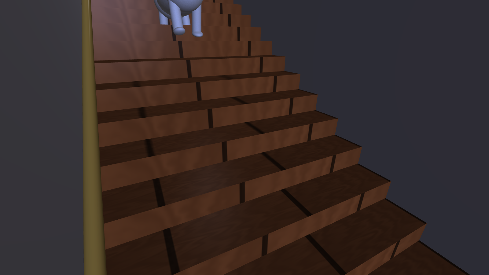

# 18 — The House, Penny the Cat and the Arrival

Files: `src/world/House.*` (the house), `src/characters/Cat.*` (Penny), `src/world/PennyArrival.*` (the
prologue), `src/world/Room.h` (`RoomSize` dimensions), `src/render/ProceduralTextures.cpp` (siding,
shingles, brick, grass), `Environment::OutdoorSunPosition`.

The project opens at night. Penny walks through the garden, front door, corridor and staircase,
then stops at the upper hallway before the combination-locked toy-room door. Y skips the arrival;
Shift+N restarts it. The downstairs remains connected for the final escape.




## 1. The house around the toy room

The toy room becomes the **upper floor** of the house. Nothing in the room moved: its floor is still
y = 0, so the story, the physics and every earlier coordinate still hold. The house is built around it and
below it (`RoomSize` in `Room.h`):

| Part | Dimensions (world units) |
|---|---|
| Toy room (upper floor) | x ∈ [−10, 10], z ∈ [−9, 9], y ∈ [0, 7.5] |
| Hallway (upper floor) | x ∈ [10, 17], z ∈ [1, 7], height 4.8; the three clues and keypad stand here |
| Ground floor | y = −4.5 (`Ground`); ceiling = underside of the upper floor at y = −0.3 (`Slab`) |
| Corridor | x ∈ [10.5, 13.5], from the front door (z = 9.2) to the back wall (z = −9) |
| Stairs | x ∈ [13.5, 16.5]; 18 steps from z = −7 (y = −4.5) to z = 1 (y = 0): rise 0.25, tread 0.444, pitch atan(4.5 / 8) = 29.4° |
| Outer walls | x ∈ [−10.45, 17.45], z ∈ [−9.35, 9.35], 0.3 thick, from the ground to y = 7.5 |
| Roof | ridge along X at z = 0, y = 12.5; eaves 0.8 beyond the walls at y = 7.1; pitch 28° |
| Porch | x ∈ [8, 16], z ∈ [9.35, 12.5], deck 0.45 high, 3 steps, own gable roof |
| Garage | x ∈ [−19, −10.45], z ∈ [−5, 7.5], 4.5 high, gable roof |
| Garden | lawn 320 × 320, path, pavement (z ≈ 23.4), street, picket fence at z = 21.5 with a gate at x = 12 |

```
            plan view (y up out of the page, +X right, +Z down)                 section through the stairs (x = 15)

  z=-9 ┌───────────────────────── back wall (window) ──┬───┬─────┐          y=0   hall ────┐▓
       │                                               │   │ ▄▄▄ │                         ▓▓▓
       │                                               │ C │ ▄▄▄ │ stairs                ▓▓▓▓▓   18 steps
       │             TOY ROOM  (upper floor)           │ O │ ▄▄▄ │ climb +Z           ▓▓▓▓▓▓▓
       │                                               │ R │ ▄▄▄ │             y=-4.5 ▓▓▓▓▓▓▓▓▓▓
  z=1  │                                     door ═════╪═══╧══╤══╡  stair door      z=-7 ───── z=1
       │                                     (x=10)    │  HALLWAY │
  z=7  │                                               │  (car)  │
  z=9  └────────────────────── front wall ─────────────┴──┬─┬────┘
                                                  front door  porch
```

(The corridor C lies *under* the hallway's level, beside the stairs; Penny walks it on the ground floor.)

### Construction

Everything is made from the five primitives:

* **Walls** are 0.3-thick cubes outside the room's one-sided wall planes (`SidedBox`). The room's planes face
  inward and are culled from outside, so from the garden you see the siding; from inside you see the
  wallpaper. The back wall has an opening exactly around the toy room's window, so the moon is still visible.
* **Roof slabs**, **gables** and **door hinges** are rotated and non-uniformly scaled cubes — see
  [04 §4.2](04-transformations.md) for the matrices (the triangular gables are a 45°-rotated cube stretched
  by its parent joint).
* **Windows** on the facade are decorative: a white frame box and one pane box whose texture draws the
  glass, inner frame and cross mullions (reflective in ray tracing).
* **Garden**: lawn plane, path, pavement, street, the white picket fence as two **alpha cut-out** panels
  (one box each; the texture's transparent gaps make the pickets, [10](10-textures.md)), gate posts,
  mailbox, shrubs, five trees (trunk + three foliage spheres each), and a flower box with a textured flower
  bed. The porch railings are cut-out panels too.
* The house went from about 220 to 135 shapes this way (fence ~55 → 2, railing ~12 → 2, windows 35 → 14,
  flowers 7 → 1).
* **Interior**: corridor floor, runner rug, ceiling with a lamp, walls (one-sided planes facing inward),
  stair landing, 18 solid step boxes inset 2 cm from the side walls (so their faces never coincide with the
  wall planes, which would flicker — z-fighting), a brass handrail tilted along the slope, the stairwell walls
  and ceiling.
* **Doors**: the front door, the toy room's double door and a door at the top of the stairs, each a leaf
  with panels and a brass knob hanging from a hinge joint.

New greyscale procedural textures, tinted by their materials: **siding**, **shingles**, **brick**, **grass**
(formulas in [10](10-textures.md)). The bed in the toy room now has the orange plaid sheet and beige
pillows of the photos of Penny asleep.

### Visibility switching

The exterior is visible during the garden approach and after the entrance breaks. Indoor play
hides the exterior subtree. The ground-floor interior stays visible and traversable throughout
gameplay so every rescued actor can descend the stairs. Hidden ancestors remove both draws and
static contacts; changing a door's visible/solid state is reflected by the physics scenery refresh.

## 2. Penny (`class Cat : Character`)

Modelled on the reference photos: creamy white fur, a large ginger patch in the middle of her back and a
second one over her hip on the same (left) flank, a ginger cap over the top of her head running down
around her left eye to her left ear (the right side of her face is white), white legs and paws, a pink
nose, pink inner ears and white whiskers. Her closed eyes are thin dark lines.

|  |  |
|---|---|
| The ginger patch over her left eye and ear | The two ginger patches on her back and flank |


*The end of the story: the toys are back in place and Penny is asleep on her side on the orange bed.*

```
Root (paws on the ground, heading)
└─ Body                   joint (0, 0.62, 0)       pitch on stairs / sitting, roll 88° when asleep
   ├─ Torso               sphere (0, 0, −0.02)      size (0.64, 0.58, 1.30)   white fur
   ├─ Chest               sphere (0, 0.03, 0.42)    size (0.58, 0.60, 0.62)
   ├─ Haunch              sphere (0, 0, −0.42)      size (0.62, 0.62, 0.66)
   ├─ BackPatch           sphere (0.12, 0.20, −0.02) size (0.46, 0.24, 0.52) roll −22°  ginger
   ├─ HipPatch            sphere (0.15, 0.18, −0.46) size (0.48, 0.26, 0.50) roll −26°  ginger
   ├─ Head                joint (0, 0.26, 0.74)     yaw = look-at, levelled against the body pitch
   │  ├─ Skull            sphere size (0.46, 0.40, 0.42)
   │  ├─ Muzzle, Chin     spheres
   │  ├─ GingerCap        sphere (0.05, 0.07, −0.02) size (0.40, 0.30, 0.38)   only its top-left rises above the skull
   │  ├─ GingerEyePatch   sphere (0.11, 0.05, 0.13)  size (0.20, 0.17, 0.12)
   │  ├─ Ear ×2           cone (±0.13, 0.21, −0.03)  size (0.20, 0.22, 0.11)   left ginger, right white
   │  ├─ InnerEar ×2      cone, pink
   │  ├─ Eye ×2, Pupil ×2 spheres (yellow-green iris, vertical slit pupil)   hidden when the eyes close
   │  ├─ ClosedEye ×2     thin dark cubes                                       shown when asleep or blinking
   │  ├─ Whisker ×4       thin cylinders
   │  └─ Nose             sphere, pink
   ├─ Tail → TailTip      joints; ginger base cylinder, white end + tip sphere
   └─ 4 legs              joints under the chest / haunch → Leg cylinder + Paw sphere
```

34 shapes, 34 656 triangles at full detail (mostly spheres; with level of detail she is usually drawn with
a few thousand).

**A patch that looks painted on.** The ginger patches are spheres that overlap the white body. Where a
patch sphere lies inside the body it is hidden by the depth test; only the cap that rises a few
centimetres above the body's surface is visible, and its edge follows the intersection curve of the two
ellipsoids. That is what makes it read as a patch of fur rather than a separate object.

### Animation (`Cat::Animate`)

```
gait      stride = sin(1.6 · walkPhase) · 30° · moveBlend · (1 − rest)       rest = max(sitBlend, sleepBlend)
          front-left = back-right = +stride,  front-right = back-left = −stride       (a diagonal trot)
          body bob = |cos(1.6 · walkPhase)| · 0.03 · moveBlend
blends    sitBlend, sleepBlend += (target − blend) · (1 − e^(−5·dt))        smooth pose changes, frame-rate independent
stairs    body pitch = −slope (29.4° nose up), each leg +slope so the legs stay vertical
sit       body pitch −30°, body lowered to 0.47 and moved back 0.12; front legs +30° (vertical), hind legs −62° (tucked)
sleep     body roll 88° (lying on her right side, patches up), height 0.31; legs stretched (−35° / +25°);
          head down 18° and tilted; tail flat behind her
head      yaw = clamp( wrap( atan2(dx, dz) − heading ), −70°, 70° ), eased      looks at the toy that is acting
eyes      closed when sleepBlend > 0.5, plus a 0.13 s blink every 4.1 s
```

During the story she sits on the bed and her head follows the action — Buzz while his laser is on, else
Bullseye while Jessie rides him, else Woody. When the story reaches **Morning** she lies down and sleeps.

## 3. Night arrival and connected movement

`PennyArrival` follows twelve 3D waypoints from the pavement through the gate, porch, entrance,
ground-floor corridor, landing and stairs to `(13.3,0,4.5)`. Arrival uses the cat's temporary vertical
route movement; completion restores grounded character input. The toy-room door stays locked;
the front door closes behind Penny and the stair door stays open.

The 4.5-unit stair rise over an 8-unit run gives pitch `atan2(4.5,8)=29.36 degrees`. Gameplay support
matches eighteen steps, each 0.25 high. The whole cast uses the same stair contacts during escape.
See [the support equation and floor guards](20-escape-gameplay.md).

```
q = distanceWalked / totalRouteLength
hour = 20.5 + 2.5 * q*q*(3-2*q)
angle += (target-angle) * (1-exp(-2.5*dt))
camera += (desired-camera) * (1-exp(-2.6*dt))
```

The establishing camera blends to a chase view. The route clock stays at night; manual clock
controls still demonstrate daylight. The entrance note and arrival objective introduce the rescue.
At the hallway, the normal follow camera and Penny's controls take over. The exterior is hidden
indoors and restored when the front door breaks; the downstairs is kept visible and traversable.
