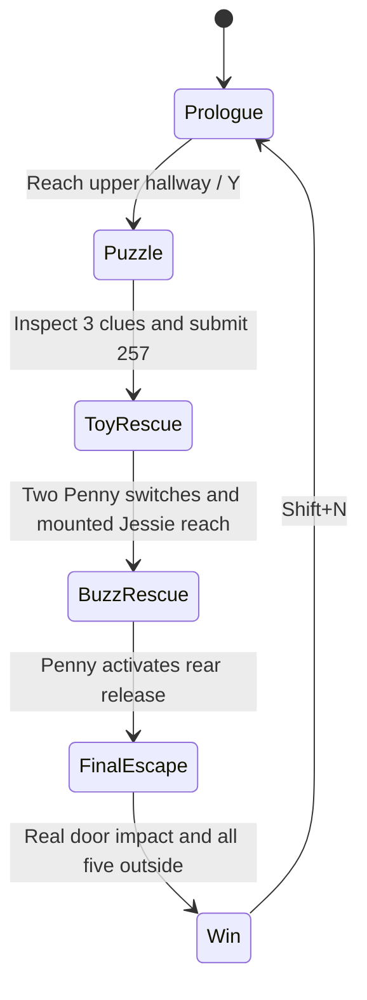

# 20 - Connected escape: objects, control and rendering

The escape extends the existing scene and renderer. `StoryDirector` owns progression,
`HallwayPuzzle` owns the combination, `PennyArrival` owns the night prologue, and
`PhysicsWorld` supplies movement and laser contacts. Manual mode retains all graphics controls.



## Construction and visual evidence


| Object | Mesh construction | Surface and purpose |
| --- | --- | --- |
| Toy train | Cube chassis/cab; cylinder boiler, chimney and wheels; two separate cars | Shared wood/brass/iron materials; raised seven-segment 2 |
| Clock clue | Circular cylinder case and thin cylinder face | Provided `clock.bmp`; cap UVs and negative v repeat correct orientation; raised 5 |
| Block clue | Seven individually tinted cubes arranged as 7 | Existing star/border map with different material tints |
| Combination keypad | Cube housing, plate, buttons and seven-segment strips; cylinder Enter button | Real raised geometry; HUD shows the current three digits |
| Rescue gate | Nine cylinders and a thin cube rail under one joint | Reflective dark iron; low-switch completion raises the joint; third switch hides it |
| Three switches | Cube case and cylinder lever | Lever roll changes from 20 to -45 degrees; low switches belong to Penny |
| High platform | Solid cube scaled to `(2.0,1.3,1.6)` | Existing mounting transition lands Jessie on its top, y=1.3 |
| Buzz holding area | Two cube partitions and a thin cyan cube barrier | Opacity 0.45, emission `(0.03,0.20,0.35)`; reuses existing rear floor |
| Buzz release | Red cube at `(2.8,0.8,-3)` | Penny's nearby Enter action hides the barrier and removes its solid flag |
| Entrance lock | Cube body, two cylinder uprights and a rotated cylinder crown | Reflective iron, attached to the actual front-door hinge |
| Door fragments | Six preallocated cubes | Existing wood map; independent linear/angular velocities after impact |
| Entrance note | Thin paper-coloured cube | Arrival objective and captions explain that the toys need help |

All these shapes use the original five primitive buffers and the original materials interface.
A cube contains 24 vertices and 36 indices, giving 12 triangles; a full cylinder contains
134 vertices and 384 indices, giving 128 triangles. Cube faces split four-corner polygons
into `(a,b,c)` and `(c,d,a)`. Cylinder caps use separate normals and triangle fans. Seven-segment
digits add scaled cube instances rather than a new font renderer. See [primitive derivations](03-primitives.md).

The [845-node export](showcase/inventory/objects.csv) records every joint and shape, including
hidden debris and contact shadows. Each row supplies vertex/triangle counts, primitive,
material, local/world coordinates, UV repeat, visibility and collision state. The comprehensive
notes reproduce all individual construction rows and the complete material inventory.


## Input guards and the complete sequence

1. Inspect the train, clock and seven blocks with Enter. Each clue is recorded once.
2. Approach the keypad and press Enter. Digits 0-9 enter, Backspace deletes, Esc cancels.
   Submit `257` with Enter. Even the correct digits cannot bypass missing clues.
   An incorrect submission displays **Incorrect Code**, clears only the digits and permits retry.
3. Penny activates the low switches at `(7.1,0.75,2)` and `(7.1,0.75,5.8)` within 1.7 horizontal units.
   The gate raises. Jessie mounts Bullseye within 2.2 units using R.
4. Ride within 2 units of the high switch at `(2.5,3.25,4.5)`. R dismounts Jessie onto the
   platform. Enter activates it only when she is unmounted, above y=1, within 1.5 horizontal
   units and her transition has finished. The director records the actual mounted approach.
5. Ctrl+0 selects Penny. At the rear red switch, Enter within 1.8 horizontal units releases Buzz.
6. The ghost follows Penny. Return through the hallway, down the stairs, around the lower
   landing and along the ground-floor corridor. Enter within 2.6 horizontal units of the
   entrance, below the upper slab, starts Buzz's flight.
7. Buzz rises to `Ground+2.6`, approaches `(12,Ground+2.6,7)` and aims at the real door.
   The laser path must remain clear. The entrance breaks only after confirmed hits.
8. Walk Penny outside. Woody, Jessie, Bullseye and Buzz follow staggered routes through the
   same stairs and entrance. WIN requires the broken door and all five actual positions
   with `z>13` and `y<Slab=-0.3`. A virtual route cursor cannot fake this condition.

The terminal state keeps the application open. A wide camera shows the house and idle cast;
camera input permits inspection. Shift+N restores doors, switches, barriers, debris and lamp state.

## Stair support and floor selection

Ground is y=-4.5 and the upper toy-room floor is y=0. The flight covers x=13.5 to 16.5 and
z=-7 to 1. Eighteen rendered treads each rise 0.25 over a run of 8/18 units. For a foot position
inside this flight:

\[
n(z)=\operatorname{clamp}\left(\left\lfloor18(z+7)/8\right\rfloor+1,1,18\right),\qquad
y_{\mathrm{support}}=-4.5+0.25n(z).
\]

`FloorHeight` returns this height; grounded actor correction includes proxy offset and skin.
Outside the flight, the lower landing, exterior and a foot below the upper slab select the
ground floor. Movement uses both previous and requested height when choosing the lower
corridor bounds, preventing overlap recovery from moving a character through the upper slab.
A conservative rotated proxy that briefly exceeds the stair width is centred on the flight,
so turning a long actor cannot pass reversed bounds to the clamp. Buzz's grounded flag is disabled while airborne, so the stair support does not flatten his flight.
Stair-step bounds are inset from the wall to avoid coincident faces and flickering.

## Actual laser impact and wood fragments

The visible beam is an emissive cylinder attached to Buzz's wrist. The emitter's world position
and direction launch `P(t)=o+t*d`. `FireLaser` intersects real primitive geometry, compares
positive distances and reports the nearest blocking node. Actors and furniture can intercept it.
The beam length uses this returned distance; a point source at its tip adds the red glow.

`StoryDirector` accumulates time only while the laser is on and `LastLaserHit()==doorLeaf`.
Any miss resets this time. More than 0.65 seconds of actual door contact triggers `BreakDoor`.
This guard also accepts a manually aimed Buzz laser. Merely pressing Enter or waiting cannot
destroy the door. The director does not toggle off a user-owned Buzz's laser.

The door hinge and padlock become hidden, the leaf ceases to be solid, and exterior access opens.
Six existing bodies receive impulses `(-4-i%3,1,4.5)` and angular velocity `(75,15,65)`.
Gravity uses 9.81 units/s squared, a 1/120-second step and at most six substeps per frame.
Fragment ground bounds extend into the garden so pieces can scatter clear of the exit.
This is preconstructed breakage with box contacts, rather than runtime mesh fracture.

## Independent control while simulation continues

Number selection or picking assigns one character to input. `StoryDirector::Controls` excludes
that actor, and any deliberately mounted passenger, from scripted pose/movement writes. A
separate route cursor progresses without modifying the controlled actor. On release, the route
chooses a waypoint on the actor's current floor and resumes from the actual position.

Escape NPC movement does not use other actors as route obstacles. Staggered starts and
separate final positions keep the cast arranged while ownership changes cannot alter another
actor's route through contact. The owned actor retains scenery contacts. Camera and laser
visibility still test actors. N switches the entire simulation to manual control; selecting one
actor alone leaves progression and the other actors active. The final-position guard remains real.

`check_showcase_live.py` compares two seconds of fixed-step positions against the same baseline
for ownership of Woody, Jessie, Bullseye, Buzz and the car. Each owned pose responds to input;
all other toy positions remain within 0.08 units of baseline. Real Windows key-callback checks
also exercise movement, release, flight, laser, manual mode and mounted control.

## Lighting, surface colour, transparency and fog

The new objects use the same ambient/diffuse/specular calculation:

\[
C_{\rm local}=C_{\rm tint}\odot C_{\rm texture}
\left(k_aI_a+\sum_i v_i a_i I_i k_d\max(N\cdot L_i,0)\right)
+\sum_i v_i a_i I_i k_s\max(R_i\cdot V,0)^n+E.
\]

Directional moonlight, lamp point light, lamp spotlight and Buzz's laser tip use the existing
light slots. Lamp/headlight directions inherit their joint transforms. The iron lock has mirror
reflectivity 0.10; wood has an image pattern rather than displacement. Gouraud evaluates
lighting at vertices; Phong evaluates it from renormalised interpolated normals per fragment.
The fog pass applies to both paths after their surface lighting.

The ray tracer uses exact object-space primitive equations and a world-space BVH, rather than
triangle intersections. Default two continuations allow at most three colour-bearing hits;
9 cycles zero to four continuations. Mirror colour uses reflectivity-weighted throughput.
The cyan barrier uses opacity-weighted local colour followed by straight transmission;
it does not bend rays. The finite final hit contributes local lighting. See
[ray equations and numeric colour examples](12-ray-tracing.md).

There are 22 mapped surfaces plus a white fallback in the shared 512-by-512-layer texture
array. The clock adds one mapped layer, not an extra GLSL sampler. Raster preserves native
source dimensions; the array resamples sources bilinearly. UV repeats, material tint, filtering
and alpha coverage use the existing material fields. See [texture construction](10-textures.md).

For the depth cue:

\[
T=\exp(-\rho d),\qquad C_{\rm fogged}=T C_{\rm rendered}+(1-T)C_{\rm fog}.
\]

Fog colour is `(0.055,0.065,0.095)`. Density is 0.008 during pursuit and 0.010 outdoors at
night, otherwise zero. Raster d is eye-to-surface distance; tracing d is the primary-hit distance
after accumulation. At d=20 and density 0.010, T is about 0.819, retaining 81.9% of surface
RGB and adding 18.1% fog RGB. This is exponential depth fog, not volumetric light transport.
The ghost uses opacity 0.40 during pursuit, moves toward Penny at 1.6 units/s and stops
1.2 units away. Lamp flicker and moving highlights reuse the original environment animation.

## Reproduction and scope

```powershell
.\tools\check-physics.ps1
python tools/check_showcase_interaction.py
python tools/check_showcase_live.py
.\bin\Release\HauntedToyRoom.exe --no-intro --story --gameplay-demo --no-raytrace
```

The rehearsal uses normal waypoint movement, mounting, dismounting, switch input, keypad
logic and collision. It does not teleport actors or bypass transition guards. `--rehearsal-stop`
hands the player back control after a reproducible `--seek`. It is optional; ordinary launch is
interactive. The cast, room, controls, shared geometry, shaders, textures and BVH remain the
existing implementation. There is no separate renderer, general combat system or inventory.
