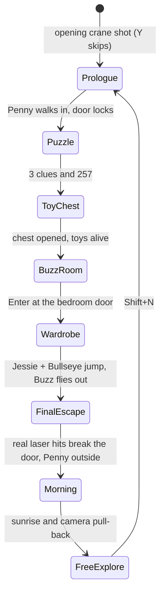

# 20 - The eight-stage story: objects, control and rendering

The story extends the existing scene and renderers. `StoryDirector` owns progression and the story
layer, `StoryProps` builds the chest, Buzz's bedroom and the wardrobe, `HallwayPuzzle` owns the
combination, `PennyArrival` owns the opening crane shot, and `PhysicsWorld` supplies movement, floor
support and laser contacts. Manual mode keeps every graphics control.



## 1. Night outside the house

`PennyArrival` is now a seven-second establishing shot: the camera cranes from high above the street
to a chase position behind Penny, who sits on the pavement looking at the house
(`camera = mix(street, behindPenny, smoothstep(t/6.5))`). Then the player controls her.

* The physics bounds include the lawn, path, pavement and street (x -22..30, z up to 34).
* The front walls, fence panels, gate posts, porch column bases, railings, shrubs and tree trunks are
  solid while the exterior is drawn; the fence gate is the way through.
* `FloorHeight` gives the porch deck (`Ground+0.45`) and its three steps (0.15 lower each).
* The main door (now 2.2 wide and 3.6 high, so a mounted Jessie fits) stands open at 80 degrees.
  Once Penny's feet are in the corridor (y < -0.3, z < 8) it eases shut, the padlock appears on its
  inside face and exterior access closes.
* Fog density is `0.011 (1 - daylight)` whenever the garden is drawn.

## 2. Upstairs hallway: the 257 puzzle


| Object | Mesh construction | Surface and purpose |
| --- | --- | --- |
| Toy train | Cube chassis/cab; cylinder boiler, chimney and wheels; two cars | Wood/brass/iron materials; raised seven-segment 2 |
| Clock clue | 0.8-unit circular cylinder case at eye height and a thin cylinder face | Provided `clock.bmp` on the cap UVs; a brass plate below with a raised 5 |
| Block clue | Seven tinted cubes arranged as 7 | Star/border map with different material tints |
| Combination keypad | Cube housing, plate, buttons, seven-segment strips; cylinder Enter button | Raised geometry; the HUD shows the three digits |

Enter at a clue records it once. At the keypad digits 0-9 enter, Backspace deletes, Esc cancels and
Enter submits. Even the right digits cannot bypass a missing clue; a wrong code shows
**Incorrect Code** and clears only the digits. The correct code swings the Toy Room's double doors open.

## 3. The toy chest


| Part | Construction |
| --- | --- |
| Body | Hollow: floor board and four solid wall cubes (3.4 x 1.05 x 1.9), so the toys can rise out of it |
| Painted front | A thin cube whose +Z face carries the procedural `chest-paint` texture: worn red planks, stars, clouds and a rocket |
| Ironwork | Corner brackets, rim and base bands, brass rivets, lock plate, keyhole, side handles |
| Lid | Hinge joint on the back top edge. A deep frame box plus a cylinder dome: the dome's lower half lies inside the frame, so the lid looks curved open or closed. Four iron straps and a brass hasp ride with it |
| Red wind-up button | Steel ring, red cylinder and flattened sphere with pulsing emission; a red story light follows it |
| Wind-up key | Brass stem and wings on the right end; spins while the lid opens |

Enter within 3.2 units presses the button: it scales down, the key spins and the lid swings to -105
degrees (`-105 smoothstep(t)`). Woody, Jessie and Bullseye wait hidden inside (not drawn, not physical).
Each in turn climbs to the rim and hops down in front of the chest using the eased root transition
(smoothstep position plus a `0.4 sin(pi t)` hop arc). Woody and Jessie cheer (both arms waving
overhead) and Bullseye jumps. The objective reads **The toys are alive!**

## 4. Downstairs to Buzz's room

Buzz's bedroom lies under the Toy Room beside the ground-floor corridor (x 1.5..10.5, z -9.05..-1.5).
It is deliberately ordinary: star wallpaper, a wood floor, a bed with ball-topped posts and a patchwork
star quilt, a bookcase (books, globe, toy rocket, teddy bear), a nightstand with a lamp, the
"To infinity" poster, a window with plaid curtains, a star rug, a football and storage boxes.

The corridor's left wall is a solid divider with a 2.2-wide doorway at z -6.9..-4.7. Its door is an
ordinary hinged leaf with panels and a knob; Enter beside it opens it into the room. The ground floor's
physics bounds are a union of boxes: corridor, stair landing, bedroom and doorway. A point outside all
of them moves to the nearest box, and the divider and the door leaf decide where a character can pass.

The area light follows the camera: the upstairs hall night light, the corridor lamp, the nightstand lamp
in the bedroom or the porch lantern outside. This keeps every lit space within the eight light slots.

## 5. The cupboard rescue

The wardrobe stands against the back wall: a hollow carcass on a plinth, an arched crown (a flattened
cylinder whose lower half is hidden in the top board) with ball finials, and two doors hinged at their
outer edges. Each door has an arched raised panel (a box plus a slightly thinner flattened cylinder, so
the faces never z-fight), a gold star decal (alpha cut-out `star-decal` texture) and a star knob
**2.65 units above the floor**. While Buzz is inside, a green glow leaks from the gap, a green story
light pulses and the doors rattle every 4.5 seconds.

* Penny's Enter at the wardrobe: "too high for Penny", and the rescue starts.
* Story layer (Jessie and Bullseye not controlled): Jessie walks to Bullseye and mounts (the normal
  re-parenting under the saddle), Bullseye walks to the spot beside the doors and turns to face +Z,
  jumps, Jessie raises her right arm (reach pose) and the doors swing open; Bullseye steps aside.
* Player: select Jessie (2), R to mount, ride beside the wardrobe, L (Bullseye's jump) or Enter.

Bullseye's jump moves his **body joint**, not his root: `lift = 0.75 sin(pi t / 0.9)`, front legs fold
(-55 degrees x arc), back legs push (+40). The saddle and a mounted Jessie are descendants of that joint
and rise with it; the root stays on the floor for physical contact. The wardrobe opens when a mounted
Bullseye is within 1.4 units of the spot and the lift exceeds 0.45.

The rescue starts only when someone tries the doors: **Enter within 1.6 units of the point 1.05 in front
of them**. (It used to start by itself 2.5 s after Penny entered the room, from anywhere in it.) Elsewhere
in the room Enter answers *Walk right up to the wardrobe doors*. Bullseye rides up head first; his solid
muzzle touches the doors before his centre reaches the spot, so arriving within 1.0 is enough. While he
comes, the story moves an uncontrolled Penny out of his way; a player-driven Penny is asked to step back.

Buzz then lifts off inside the wardrobe and flies out on four waypoints (up, out over the rug, down) with
wings open, before landing and cheering. Flying is now measured against the floor beneath him
(`FloorHeight`), so his flight pose also works downstairs and on the stairs.

## 6. Following Penny

Freed toys accompany Penny. Each toy owns a fixed formation slot behind her
(`Penny + back (1.7 + 1.3 floor(i/2)) +/- 0.9 side`), so taking one toy over never reshuffles the others.
When a toy is in another zone it navigates a graph of thirteen doorway nodes: Toy Room door, upper hall,
stair opening, stair top and foot, landing, corridor end, Buzz's door (both sides), the bedroom, the
entrance, the porch and the garden path. Floyd-Warshall precomputes the first step of the shortest route
between every pair of nodes. The porch is a zone of its own, left only by its steps, so nobody heads for
the garden straight through a railing.

Characters are solid to each other. While followers walk, hard actor contacts are off (so a doorway never
jams), and a separation pass resolves overlaps by **priority**: the character the player drives, then
characters on a story task (`StoryDirector::Busy`), then Penny, then the followers. The lower body yields;
pinned beside a doorway, it steps back instead of sideways. Story walkers also steer around bodies ahead
of them (`StoryDirector::Steer`).

Bullseye and Penny use collision **spines**, chains of square boxes from rump to muzzle (Bullseye 0.55 at
-0.35, 0.45, 1.15; Penny 0.34 at -0.46, 0.10, 0.64): compact at any heading, so the horse still turns in
the 3-unit corridor, but his head no longer passes through walls. See
[21](21-outdoor-sky-and-solid-characters.md).

## 7. The locked main door and Buzz's laser

Leading everyone to the entrance and pressing Enter (or standing at the door for one second) tries it: it
shakes but is locked. The toys wait beside the corridor walls **behind** Buzz's firing position (z ≤ 1.0):
in flight he fills most of the corridor's width, and anyone in front would block the beam. Wait spots are
assigned by position when the door is found locked (front-most character to front-most spot), so nobody
has to squeeze past anyone. Buzz (when not
controlled) flies to `(12, Ground+1.2, 4.4)` and aims at `(12, Ground+2.0, 9.2)`, high enough to pass over
Penny. The objective then asks the player to press **L**.

The visible beam is an emissive cylinder on Buzz's wrist; `FireLaser` intersects real primitive geometry
and reports the nearest blocking node. `StoryDirector` accumulates time only while the laser is on and
`LastLaserHit()==doorLeaf`; any miss resets it. More than 0.65 seconds of real door contact breaks the
door. A manually flown and aimed Buzz breaks it the same way.

The door and padlock are hidden, the leaf stops being solid and exterior access opens. Six board fragments
receive outward impulses and spin; gravity (9.81), a 1/120 s step and at most six substeps per frame move
them. They come to rest on the porch deck (their floor uses `FloorHeight`) and characters kick them aside
instead of being blocked.

## 8. Morning and free exploration

When Penny steps outside, MORNING begins. The story drives the clock from 23:36 to 07:00 over sixteen
seconds:

\[
h(t)=\big(h_0+(31-h_0)\,\mathrm{smoothstep}(t/16)\big)\bmod 24 .
\]

The same hour raises the sun in the east of the sky dome, blends the sky, ambient and directional light
colours and scales the fog away. Everyone walks out through the broken door to their own place on the
lawn (a formation behind Penny would point back at the house and park the toys on the porch steps). Once
everyone is outside the camera pulls back to show the house and the street. Then FREE_EXPLORE gives the camera back: the toys gather on the lawn
and stay outside, Buzz can fly (Q/E), Jessie can ride Bullseye (R) and every selection and rendering
control still works.

## Stair support and floor selection

Ground is y=-4.5 and the upper floor is y=0. The flight covers x=13.5..16.5 and z=-7..1 with eighteen
treads each rising 0.25 over 8/18 units:

\[
n(z)=\operatorname{clamp}\left(\left\lfloor18(z+7)/8\right\rfloor+1,1,18\right),\qquad
y_{\mathrm{support}}=-4.5+0.25n(z).
\]

## Reproduction and checks

```powershell
.\tools\check-physics.ps1                 # 67 checks, including the bedroom doorway and porch
python tools/check_showcase_interaction.py
python tools/check_showcase_live.py      # driving one toy leaves the others unchanged
python tools/check_escape_rendering.py   # whole story in Flat/Gouraud/Phong/Blinn, ray tracing and Debug
.\bin\Release\HauntedToyRoom.exe --no-intro --story --gameplay-demo --no-raytrace
```

The rehearsal (`--gameplay-demo`) drives only Penny, with normal movement, Enter interactions, the keypad
and the L action; the story layer moves everyone else. It never teleports actors or skips a transition
guard and reaches free exploration in about 75 seconds. `--rehearsal-stop` hands control back after a
reproducible `--seek`.
