# 21 — Outdoor sky, smooth camera and solid characters

This chapter documents five changes that work together:

1. a **sky dome** with sun, moon, stars and clouds, shared by the rasteriser and the ray tracer;
2. **outdoor sun/moon lighting** that comes from the visible sun or moon, with raster shadows from a sun
   shadow map and ray-traced shadows from shadow rays;
3. a **follow camera** that no longer jolts on the stairs;
4. **solid characters**: long bodies use a chain of collision boxes, crowds resolve by priority, and the
   story's walkers steer around each other;
5. **Penny control** from the corner panel at any time, and a **wardrobe** that only answers when Penny
   stands at its doors.

| | |
|---|---|
| 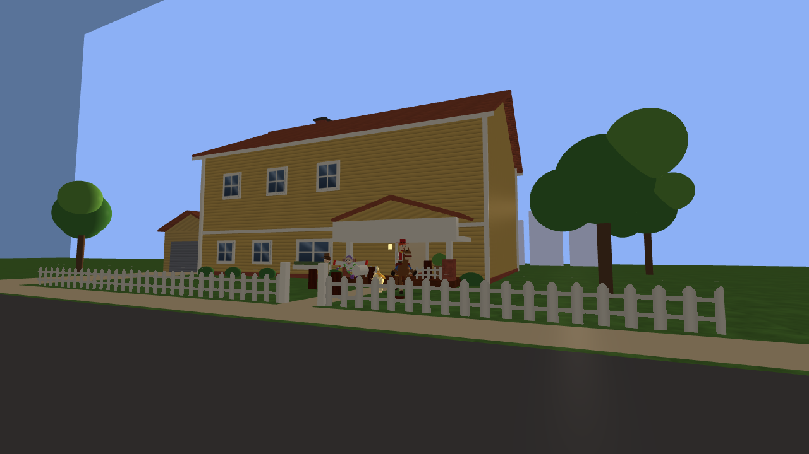 | 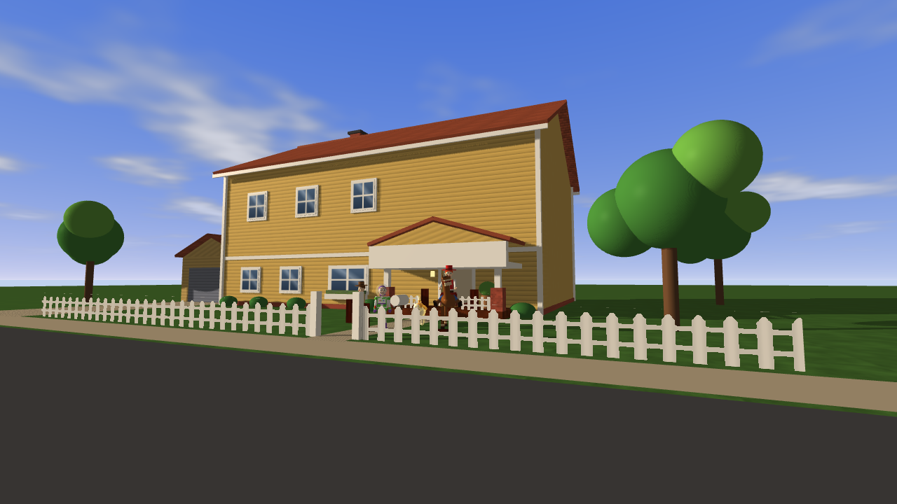 |
| Before: one flat backdrop plane north of the house; its edge is visible top left | After: gradient sky, clouds, sunlit front, tree shadows on the lawn |
| 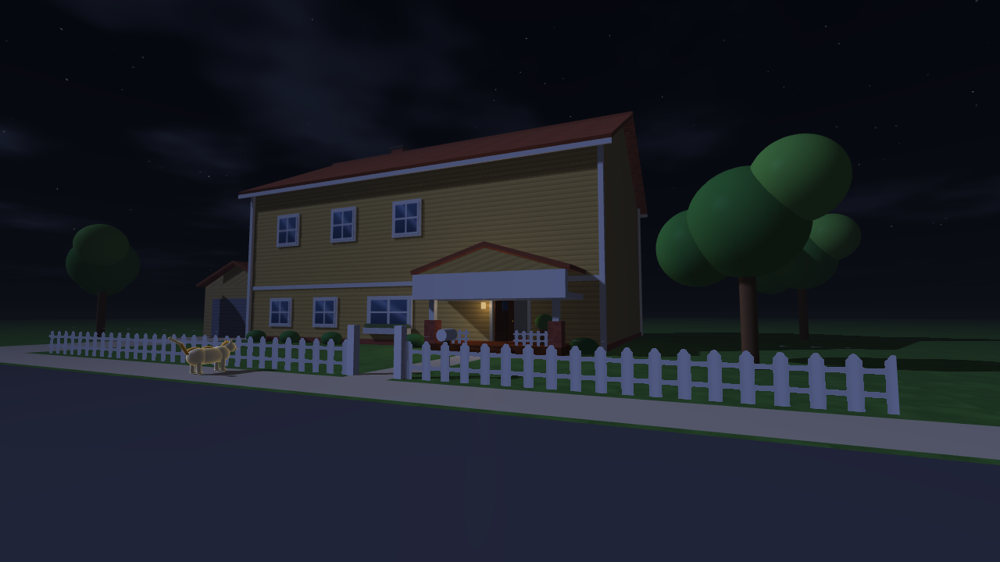 | 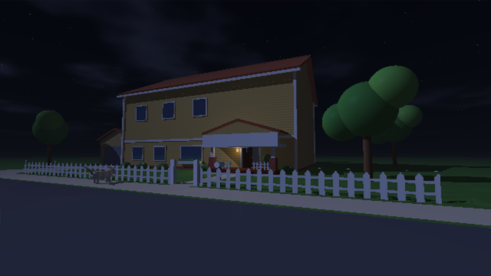 |
| Night (raster): stars, moonlit clouds, horizon-coloured fog | Night (ray traced): the same sky on every missed ray, moon shadows by shadow rays |
| 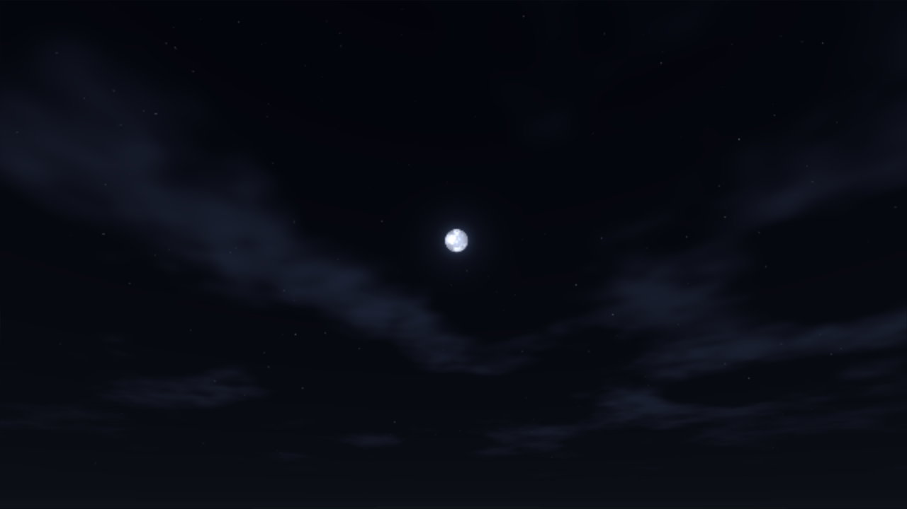 | 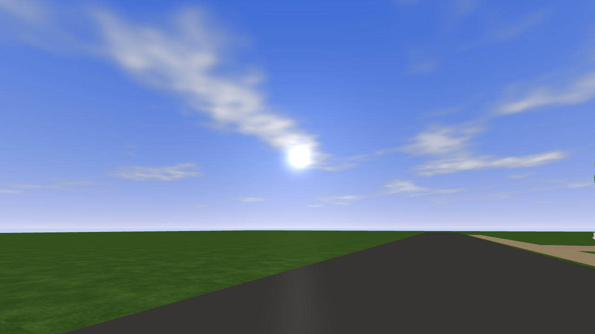 |
| Moon disc with maria and a halo | Sun disc and glow; its highlight on the road |

---

## 1. The sky dome (`shaders/sky.glsl`)

The sky is a function of **direction only**: it is infinitely far away, so moving the camera never changes
it. `skyRadiance(d)` builds it in layers:

| Layer | Rule |
|---|---|
| Gradient | `C = mix(horizon, zenith, pow(d.y, 0.45))`; below the horizon a darkened haze, so the edge of the lawn melts into the sky |
| Sunset band | `+ (0.85,0.35,0.10) * glow * (1-d.y)^6`, stronger toward the sun's azimuth |
| Stars | the unit sphere is split into a 3D grid of cells (`d * 220`); a cell holds a star when its hash exceeds 0.9965; brightness twinkles with `sin(time * (2+3h))` and fades near the horizon and at dawn |
| Moon | a 1.7° disc around `moonDir`: fractal value noise gives darker maria, `sqrt(1-r²)` limb darkening, two `pow(cos, n)` halos |
| Clouds | 4-octave value noise on a plane above the camera (`d.xz / (d.y + 0.08)`), drifting with time; lit white/orange by day, faint blue by moonlight |
| Sun | a sharp disc (`smoothstep` on `dot(d, sunDir)`) plus two glows `pow(s,900)` and `pow(s,24)` |

The colours come from `Environment::Sky()` every frame: zenith and horizon colours blend between night,
twilight and day by the daylight factor; the sunset glow is `exp(-6|sin a|)`; the stars fade between sun
heights -0.2 and 0.08.

**One function, two renderers.**

* *Raster:* `Renderer::RenderSky` draws a full-screen triangle exactly **on the far plane** (`gl_Position.z = w`)
  after the opaque pass, with `glDepthFunc(GL_LEQUAL)`. Only pixels that nothing covered still have depth 1.0,
  so the sky shader runs only where the sky is visible (no cost behind walls). The view direction of a
  pixel is rebuilt with the inverse of `projection × view-without-translation`. Glass and the ghost are
  drawn after it, so they blend over the sky.
* *Ray tracer:* a ray that hits nothing returns `skyRadiance(rd)` (previously a flat colour). This holds for
  primary rays **and** for reflection/transmission continuations, so mirrors and windows show the real sky.

**Fog.** The fog colour is now the sky's horizon colour (`Environment::HorizonColor`), so distant geometry
fades into the sky instead of into a fixed blue. At night it equals the colour the fog always had.

## 2. Sun and moon outdoors

The clock angle `a = (hour - 6) π / 12` (06:00 → 0, 18:00 → π) drives two skies:

```text
window sun/moon (indoors):  small spheres orbiting a point behind the bedroom window
true sky (outdoors):        sunDir  = normalize(-60 cos a,  55 sin a, 30)
                            moonDir = normalize( 60 cos a, -55 sin a, 30)
```

The sun rises in the east (-X), crosses the **southern** sky in front of the house (+Z) and sets in the west;
the moon follows the opposite half of the arc. Because the arc is in front of the house, the facade is lit
by the sun by day and by the moon at night (with the old arc behind the house the front was backlit in both
the opening and the ending shot).

The directional light (light 0) is blended between the two:

```text
light.direction = normalize(mix(windowDirection, -skyDirection, outdoor))
outdoor        += ((outside ? 1 : 0) - outdoor) (1 - e^(-8 Δt))      // 0.3 s through the front door
outdoor         = outside ? 1 : 0                                   // when the camera jumps > 2 units
```

`ToyRoomApp::CameraOutdoors` is true when the exterior is shown and the eye is beyond the house walls or above
the roof. Indoors nothing changes (the window light keeps its old direction, so the rooms look exactly as
before). The snap on a camera jump matters: without it, a launch, restart or selection change briefly lit
the garden from the window direction, and the house threw a long shadow over the street.

Outdoors the window's backdrop plane, its small sun/moon spheres and the flat roof silhouettes (window
dressing that looked like floating boxes from the garden) are hidden; the old garden sun sphere is
replaced by the sky's sun disc, which always lies exactly along the light direction.

## 3. Sun and moon shadows

* **Ray tracer:** light 0 already casts shadow rays (`castsShadows`); they now come from the visible sun or
  moon, so the house, trees, fence pickets and characters shadow the garden correctly.
* **Raster:** `Renderer::RenderSunShadow` renders a 2048 × 2048 depth map with an **orthographic** projection
  (`t3d::orthographic`, added to `Transform3D`): parallel rays need no perspective divide. The box is 60 × 60
  units, centred a little ahead of the camera, and its centre is snapped to whole shadow-map texels in the
  light's frame so shadow edges do not crawl when the camera moves. The lawn, street and pavement only
  receive (as casters they add acne, not shade); unlit, transparent and cut-out materials are skipped.
  `lighting.glsl::sunVisibility` uses a slope-scaled bias and 3 × 3 PCF, and is faded in by the outdoor
  factor (`uSunShadowStrength`), so indoor raster lighting is unchanged.

## 4. The follow camera on the stairs

The stairs are 18 discrete treads of 0.25: Penny's height changes in steps. The old follow camera aimed at
her raw position every frame and set its position with `mix(p, desired, 4Δt)` (frame-rate dependent), and
the wall clamp in the stairwell moved it in and out on alternate frames. The result was a visible jolt on
every tread. The new camera:

```text
focus.xz += (target.xz - focus.xz) (1 - e^(-14 Δt))     // follows quickly across the floor
focus.y  += (target.y  - focus.y ) (1 - e^(-5 Δt))      // eases over tread steps
camera   += (desired   - camera  ) (1 - e^(-4 Δt))      // frame-rate independent
reach     = allowed < reach ? allowed : reach + (allowed - reach)(1 - e^(-2.5 Δt))
```

A wall pulls the camera in **at once** (it must never see through a wall) but lets it back out gradually,
so a railing that blocks and clears the view on alternate frames no longer makes it pump. In the hallway
the camera only changes sides when the other side is at least 0.6 units roomier (it used to flip between
±35° whenever both clearances were similar). A jump of more than 2.5 units (new selection, restart) snaps.

Measured on the scripted story (same run, before and after, only frames with Penny on stairs or porch steps,
second difference = acceleration per frame):

| | Before | After |
|---|---|---|
| Pitch acceleration, RMS | 2.42 °/frame² | 0.14 °/frame² |
| Pitch jolts above 0.5 °/frame² | 82 | 1 |
| Height acceleration, RMS | 0.047 | 0.022 |

## 5. Solid characters

### Spines for long bodies

A box collision proxy is axis aligned. Penny reaches from her tail at -0.8 to her nose at +1.0 and Bullseye
from his rump at -0.9 to his muzzle at +1.7, but their old boxes were ±0.42 and -0.68…+0.92: heads went
through walls. One long box would cover them but swells by up to 41 % when the animal turns 45°, so it could
not turn in the corridor. Both now use a **spine** (`PhysicsWorld::Actor::spine`): square boxes at local
offsets along the body (Penny 0.34 at -0.46, 0.10, 0.64; Bullseye 0.55 at -0.35, 0.45, 1.15). Each stays
compact at any heading. `SlideActor` sweeps every segment with the same rotation and keeps the most
restrictive result (two passes), so the whole body stops when its nose touches a wall, and turning toward
a wall pushes the body back.

The corridor and the stair flight were separated by two zero-thickness planes, and both sides are places to
stand. A thin solid **StairDivider** between the planes (`House.cpp`) makes it a real wall.

| | |
|---|---|
| 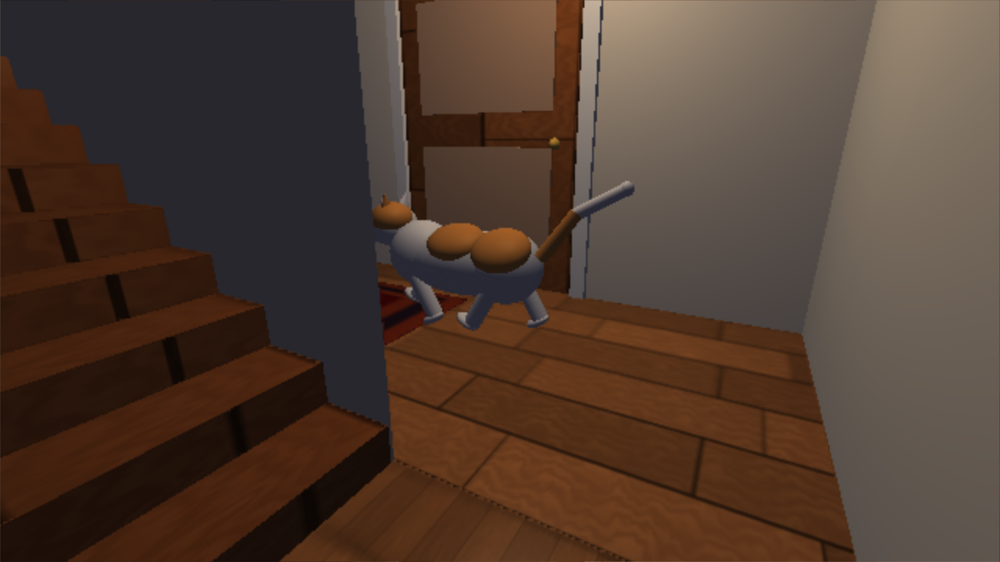 | 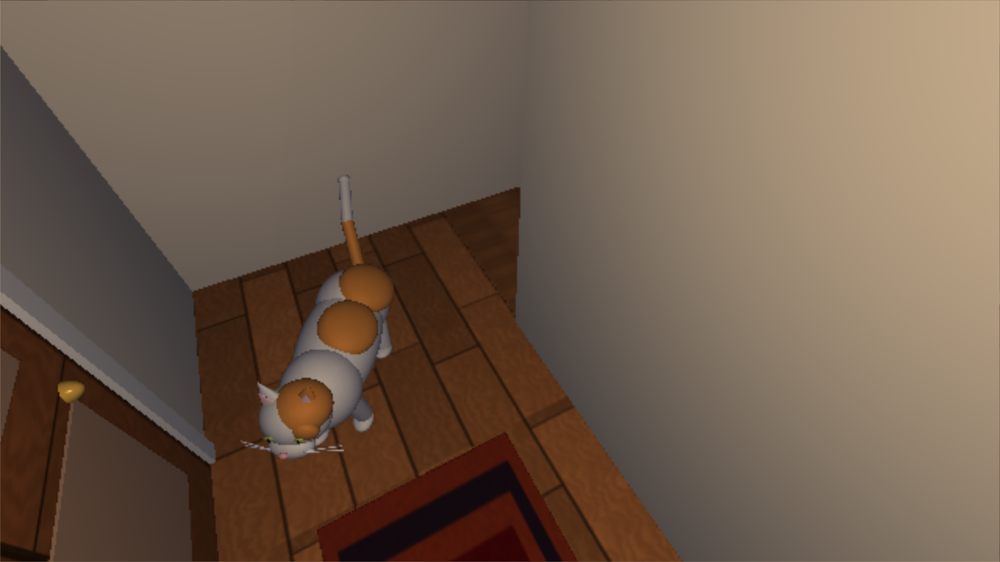 |
| Before: Penny's front half inside the wall at the bottom of the stairs | After: the same moment from above; she stands clear |

### Contact between characters: priority, not equal shares

While the story's followers walk, hard actor contacts are off so a doorway never jams. Instead,
`PhysicsWorld::SeparateActors` runs after the moves. For every overlapping pair it computes the overlap of
the deepest segment pair on x and on z. The body **lower in priority yields the whole push**, sliding
against the house like a step of walking; if a wall pins it on the shorter axis, it steps aside along the
other axis instead; whatever it still cannot give, the higher body gives back. The player's character never
moves. Priority (highest first): the character the player drives → characters on a story task
(`StoryDirector::Busy`: Jessie and Bullseye during the rescue, Buzz flying to and holding his firing spot)
→ Penny → the followers in a fixed order. Strict priorities mean a pair always has a winner; equal pushes
cancel in a doorway and jam.

### Walking around each other

`StoryDirector::Steer` is local avoidance: every body within 2.6 units ahead whose centre is closer to the
walking line than the two radii adds a sideways pull away from it (left when dead ahead), fading with
distance. It is applied to every story move (`MoveTo` and each `Navigate` waypoint).

### Story changes that solid bodies required

* **Waiting at the locked door:** the four wait spots are now behind Buzz's firing position (z ≤ 1.0): in
  flight his arms span x 11.1–12.9 at z 3.4–5.4, so nobody fits beside him, and anyone in front would stand
  in his line of fire. Spots are assigned by position when the door is found locked (front-most character →
  front-most spot), so nobody has to squeeze past anyone.
* **Morning:** everyone walks to their own place on the lawn (`Gather`); a formation behind Penny pointed
  back at the house and parked toys on the porch steps.
* **Porch:** a zone of its own, left only by its steps (navigation node 12), so nobody heads for the garden
  straight through a railing.
* **Doorway nodes:** Bullseye counts a node as passed within 0.9 (others 0.4): his centre is 1.7 behind his
  muzzle, and an open door leaf can stop it short of 0.4.
* **Wardrobe:** Bullseye rides within 1.0 of the spot in front of the doors (his muzzle now touches them).

| | |
|---|---|
| 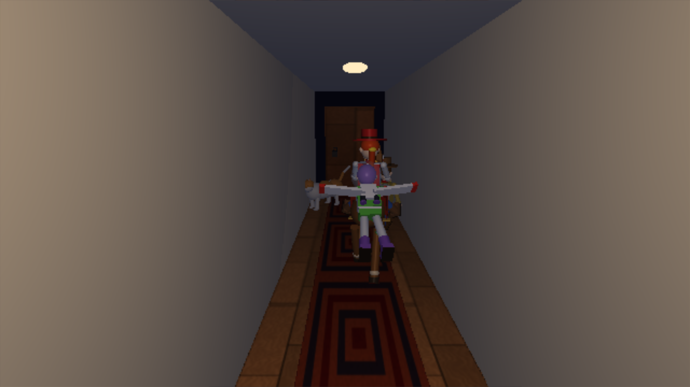 | 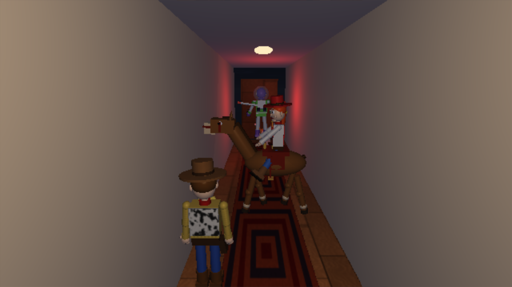 |
| Before: Buzz flies through Bullseye and Jessie | After: Buzz holds his firing spot; Bullseye with Jessie and Woody wait behind him |

The whole scripted story (`--story --gameplay-demo`) reaches free exploration with everyone on the lawn,
70 s into the run (74.6 s before; the story no longer needs its 35-second fallback in the morning).

## 6. Penny control and the wardrobe

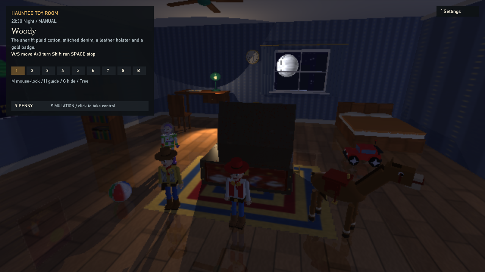

The corner panel has a **PENNY** row under the selection buttons. It shows who drives her (*YOU CONTROL
HER* or *SIMULATION*) and toggles on a click; **9** does the same (ray-tracing bounces moved to **Ctrl+9**).
Taking her over also puts the follow camera behind her, wherever she is (another floor, outside the view).
Before, a released Penny could only be taken back with an undocumented Ctrl+0 or by clicking her body,
impossible once she was off screen. The **B** button no longer lights up when Penny or a piece of
furniture is selected.

**Wardrobe.** The rescue used to start by itself 2.5 s after Penny entered Buzz's room, from anywhere in it.
Now only **Enter within 1.6 units of the point in front of the doors** starts it; further away in the room
the status line says *Walk right up to the wardrobe doors, then press Enter*. While Jessie and Bullseye
come over, the story moves an uncontrolled Penny out of the horse's way; a player-driven Penny is asked to
step back.

## 7. Files

| File | Change |
|---|---|
| `shaders/sky.glsl`, `sky.vert`, `sky.frag` | sky function and raster sky pass |
| `shaders/lighting.glsl` | `sunVisibility` (sun/moon shadow map, PCF, outdoor fade) |
| `shaders/raytrace.frag` | missed rays return `skyRadiance` |
| `src/render/Renderer.*`, `SkyInfo.h`, `RayTracer.cpp` | sky pass, sun shadow pass, sky and fog uniforms |
| `src/math/Transform3D.*` | `orthographic` projection |
| `src/world/Environment.*`, `Room.*` | sun/moon directions, sky colours, outdoor visibility |
| `src/world/PhysicsWorld.*` | spines, `SlideActor`, `SeparateActors` |
| `src/world/StoryDirector.*` | `Busy`, `Steer`, wait-spot assignment, porch zone, wardrobe reach, garden gather |
| `src/world/House.cpp` | solid stair divider |
| `src/render/Hud.*`, `src/app/ToyRoomApp.*` | Penny control row, camera smoothing, outdoor blend, separation pass |
| `tests/PhysicsChecks.cpp` | 7 new checks (spines, divider, priorities, sidestep, orthographic projection) |
