# Abstract

Haunted Toy Room: The Midnight Mission is an interactive three-dimensional graphics project told as an eight-stage story. At night Penny, a white cat with ginger patches, explores the garden of an abandoned house and walks in; the main door locks behind her. Upstairs she reads three clues and enters 257 to open the Toy Room, where a glowing red button on an old painted toy chest brings Woody, Jessie and Bullseye to life. Together they go down to an ordinary bedroom: the wardrobe knob is too high, so Jessie rides Bullseye, he jumps, she opens it and Buzz flies out. Buzz's laser breaks the locked main door, everyone escapes, the night turns into morning and the world stays open for free exploration. The player controls any one character; the story layer drives the others.

The implementation uses C++ and an OpenGL 3.3 core pipeline. Five indexed primitive families form the complete environment and articulated models. Hand-authored homogeneous transformations support a scene hierarchy, multiple camera modes and an object inspector. A shared illumination model supplies ambient, diffuse and specular terms for directional, point and spot lights. Flat, Gouraud, Phong and Blinn-Phong shading can be compared in the raster path. Procedural surface maps and a custom BMP loader provide texture detail. The optional GPU ray tracer intersects transformed analytic primitives through a median-split bounding volume hierarchy, then evaluates shadow rays, mirror reflection and straight-through transparency. The project combines cinematic playback, live character takeover and full manual control so each graphics concept can be demonstrated independently.

# CHAPTER I — Introduction

## 1.1 Project background and motivation

A room of articulated toys provides a practical setting for explaining geometry, local coordinate systems, surface appearance and motion together. The visual narrative gives a purpose to each operation: a wheel rotates because a car moves, a rider follows because her root belongs to the saddle, and a spotlight follows a moving lamp head because its anchor belongs to that head. The haunted atmosphere is expressed through night colours, lamp flicker, a translucent ghost and self-moving props.

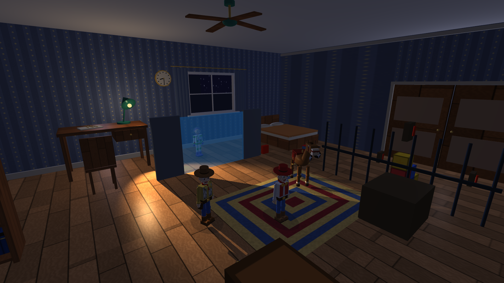

## 1.2 Objectives and scope

The objectives are to construct a complete scene from reusable indexed geometry; implement and demonstrate three-dimensional transformations; compare Gouraud and Phong shading; explain three light types through one illumination equation; animate articulated and rolling objects with elapsed time; provide keyboard and mouse interaction; and extend the renderer with analytic ray tracing. Modelling, shader logic, procedural textures, BMP parsing, story choreography and the interface are implemented within the project. GLFW provides window/input services, GLAD loads OpenGL entry points, and GLM supplies vector and matrix storage and algebra.

## 1.3 Proposed features and final implementation

The recorded concept specifies a child's toy room that comes alive at night, primitive-built controllable characters, Jessie riding Bullseye through a parent-child hierarchy, and a morning return. The final implementation realises these features inside a connected two-storey house with a garden, a second furnished bedroom and an eight-stage story with a morning ending. Table 1 maps the proposed functionality to the corresponding final modules.

Proposal-to-implementation coverage

| Proposed functionality | Final implementation | Principal code |
| --- | --- | --- |
| A haunted house story at night that ends in the morning | Eight stages: garden, 257 puzzle, toy chest, Buzz's room, wardrobe rescue, laser escape, morning, free exploration | StoryDirector / StoryProps / PennyArrival / Environment |
| Recognisable primitive-built toys | Woody, Jessie, Bullseye, Buzz and RC car; Penny and a ghost | Humanoid / Bullseye / RCCar / Cat |
| At least four independently controlled objects | Five driveable toys, controllable ball and lamp; click-based inspection | Select / HandleObjectControl |
| Jessie mounts and follows Bullseye | Saddle reparenting, a smooth seat transition and world-space dismount | Mount / Dismount / SceneNode |
| Translation, rotation, scale and hierarchy | TRS, shear, reflection, normal correction and parent-child motion | Transform3D / Transform / SceneNode |
| Lighting and shading | Directional, point and spot lights; Flat, Gouraud, Phong and Blinn-Phong | lighting.glsl / Renderer |
| Moving environment | Lamp swivel/flicker, rolling ball, ghost motion, ceiling fan and clock hands | Environment / StepScene |
| Texturing and bonus ray tracing | 27 mapped surfaces, own BMP loader, analytic GPU tracing with BVH, shadows and reflection | Assets / ProceduralTextures / RayTracer |

## 1.4 Project workflow and organisation

Geometry and material resources are created once. Scene builders assemble the room, house and characters from those resources. Each frame reads input, advances the story and motion, resolves physical contacts, propagates world transforms, refreshes lights and renders the selected graphics path. This report first establishes the theory, then explains the methodology and individual models, and finally presents visual comparisons, verification and the complete object inventory.

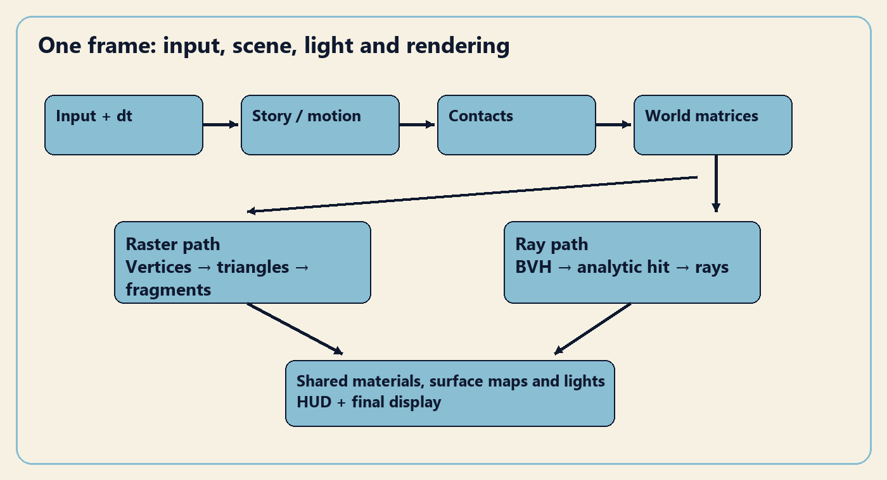

# CHAPTER II — Graphics Foundations

## 2.1 Indexed geometry and curved surfaces

A vertex stores three position coordinates, three normal coordinates and two texture coordinates. An index buffer groups vertices into triangles. A plane has four vertices and two triangles. A cube has 24 vertices rather than eight because a corner needs independent face normals and UV coordinates on each adjacent face. Shared primitive buffers reduce duplicated geometry while model matrices give each instance its dimensions and placement. The graphics pipeline and programmable stages are defined by the OpenGL specification [1].

Vertex = (px, py, pz, nx, ny, nz, u, v); stride = 8 × 4 = 32 bytes
Triangle k = indices[3k], indices[3k+1], indices[3k+2]

Full-detail primitive meshes

| Primitive | Definition | Vertices | Triangles |
| --- | --- | --- | --- |
| Plane | 1 × 1 in XZ, normal +Y | 4 | 2 |
| Cube | [-0.5,0.5] on all axes | 24 | 12 |
| Sphere | radius 0.5; 24 stacks × 36 sectors | 925 | 1656 |
| Cylinder | radius 0.5, height 1, 32 sectors; two caps | 134 | 128 |
| Cone | base radius 0.5, height 1, 32 sectors; one cap | 99 | 64 |

For the sphere, latitude phi ranges from -pi/2 to pi/2 and longitude theta from 0 to 2pi. A rectangular grid of (stacks+1)(sectors+1) vertices includes duplicated seam positions at u=0 and u=1. Adjacent cells create two triangles, except at the poles where a degenerate half is omitted. Analytic curved surfaces remain exact in the ray tracer; in raster mode their appearance also depends on tessellation and level of detail.

Sphere: p = 0.5(cos(phi) sin(theta), sin(phi), cos(phi) cos(theta))
n = 2p; u = theta/(2pi); v = phi/pi + 0.5
Sphere triangles = 2 × sectors × (stacks - 1)

Cylinder sides use circular rings with outward radial normals; cap rings have independent +Y or -Y normals. Cone sides use a radial slope normal and a duplicated apex normal for each sector. Splitting these vertices keeps the cap edge sharp while allowing smooth curved side shading. Counter-clockwise triangles define the outside; mirrored instances reverse the front-face convention during raster drawing.

Cylinder side: p = (0.5 sin(theta), y, 0.5 cos(theta)); n = (sin(theta),0,cos(theta))
Cone side: n = normalize(sin(theta), 0.5, cos(theta))
Cylinder vertices = 4n + 6; triangles = 4n
Cone vertices = 3n + 3; triangles = 2n

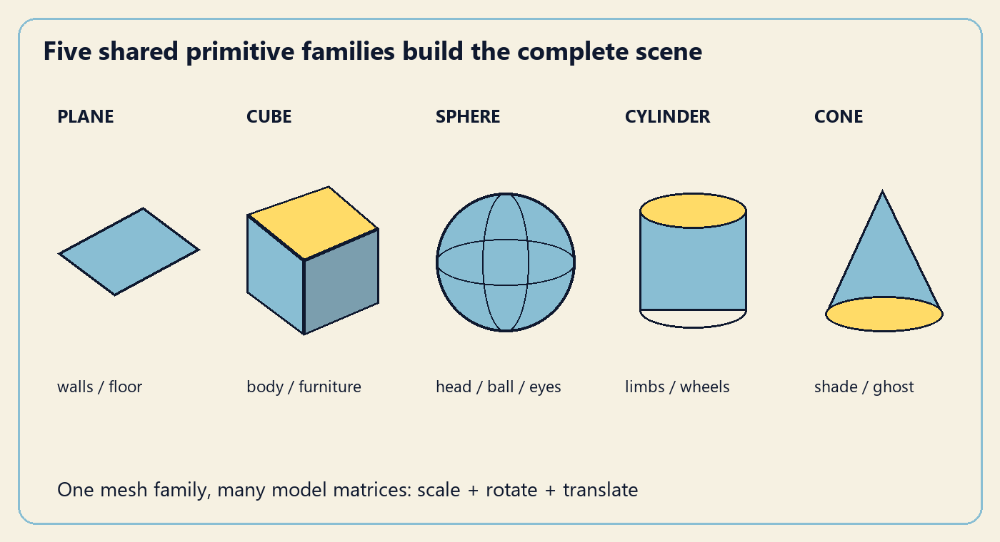

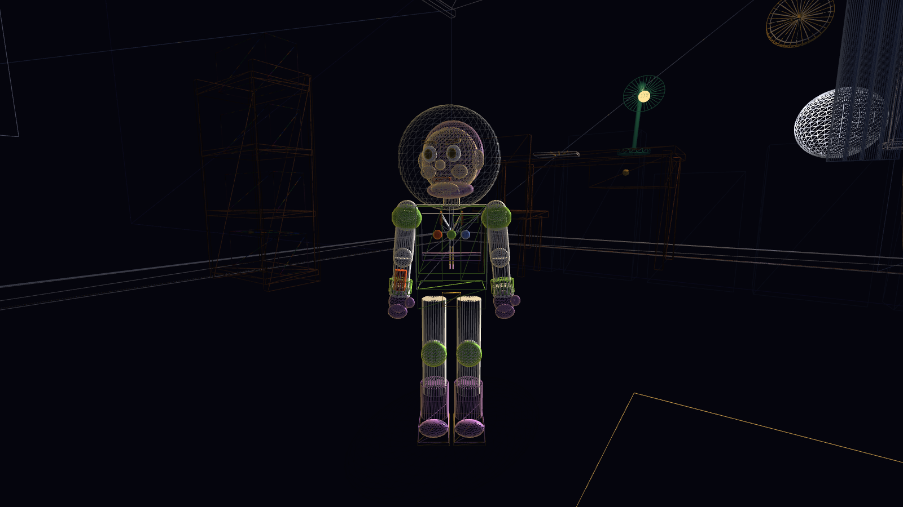

A polygon is a closed face; the renderer submits triangles rather than general polygons. addQuad triangulates a counter-clockwise four-corner face into (a,b,c) and (c,d,a). For the plane, v0=(-0.5,0,0.5), v1=(0.5,0,0.5), v2=(0.5,0,-0.5), v3=(-0.5,0,-0.5); all normals are +Y and the UVs are (0,0),(1,0),(1,1),(0,1). Its six indices are 0,1,2,2,3,0. The cube repeats this construction with a different normal for each face: 24 vertices, 36 indices and 12 triangles. Cross(edge1,edge2) defines a face normal; counter-clockwise winding selects the front face.

For a sphere ring i and sector j, k1=i(sectors+1)+j and k2=k1+sectors+1. The cell emits (k1,k2,k1+1), except at the top pole, and (k1+1,k2,k2+1), except at the bottom pole. With 24 stacks and 36 sectors this gives 925 vertices and 1656 triangles (4968 indices). A cylinder uses two side rings, duplicated cap rings and two centres; side quads become two triangles and each cap is a triangle fan. A cone uses a base side ring, sector-specific apex normals, a separate cap ring and a centre; each sector supplies one side triangle and one cap triangle. Seam duplication preserves both u=0 and u=1. The full vertex/index listings are in docs/03-primitives.md and can be printed with Shift+V.

## 2.2 Homogeneous transformations

Points are column vectors (x,y,z,1); directions use w=0, so translation changes points without changing directions. Products act from right to left. A node's local matrix first scales its primitive, applies an optional basis matrix for accumulated rolling, shear or reflection, applies roll, pitch and yaw, and then translates it. Transform::Matrix evaluates the rotation entries directly to avoid repeated general matrix products.

Mlocal = T(position) Ry(yaw) Rx(pitch) Rz(roll) B S(scale)
T = [1 0 0 tx; 0 1 0 ty; 0 0 1 tz; 0 0 0 1]
S = diag(sx,sy,sz,1)
Ry = [cos(a) 0 sin(a) 0; 0 1 0 0; -sin(a) 0 cos(a) 0; 0 0 0 1]

Rotation about an arbitrary unit axis follows Rodrigues' construction. A pivot rotation moves the pivot to the origin, rotates, then restores it. A shear changes one coordinate in proportion to another; a reflection reverses the component along a plane normal. These are linear operations stored in B. They are visible in the inspector, while translation and Euler rotation remain individually editable.

R(axis,a) = cos(a)I + (1-cos(a)) axis axis^T + sin(a)[axis]cross
Mpivot = T(pivot) R T(-pivot)
Shear example: x' = x + k y
Reflection about a plane through the origin: F = I - 2 n n^T

## 2.3 Hierarchy and transformed normals

An empty scene node is a joint; a mesh-bearing node is a visible part. Descendants inherit their parent's world transform, so moving a shoulder rotates its complete arm. Non-uniform shape scale is normally placed on leaf nodes to preserve the proportions of sibling parts. Normals require the inverse transpose of the world linear matrix: transforming them as ordinary directions would break perpendicularity under non-uniform scale or shear.

Mworld(child) = Mworld(parent) Mlocal(child)
Nworld = normalize((A^-1)^T Nobject), where A = mat3(Mworld)
(A^-T n) · (A t) = n · t = 0 for a tangent t

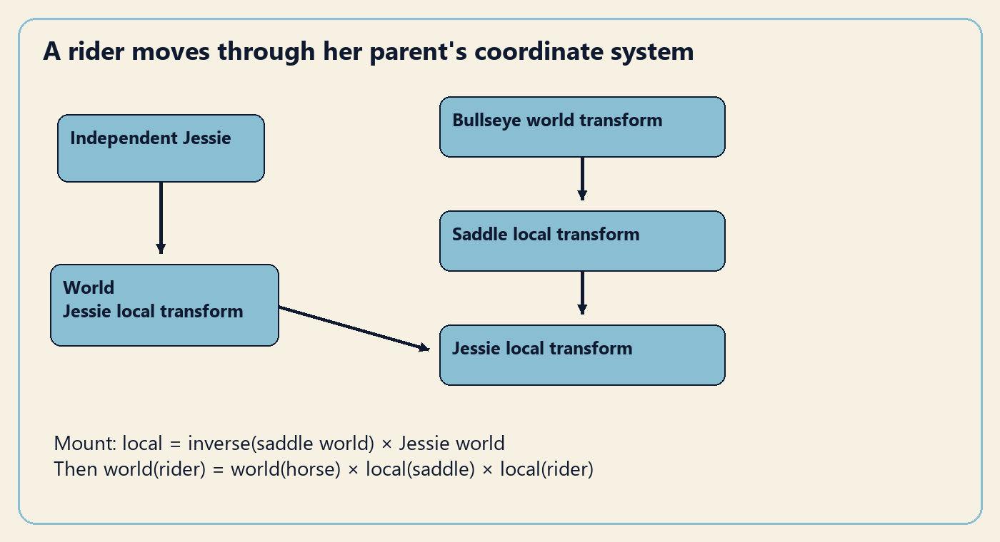

## 2.4 Camera, projection and picking

The camera constructs a forward vector from yaw and pitch, a right vector from forward cross global up, and an orthogonal up vector. The view matrix expresses world points in that frame. Perspective projection divides by depth to make distant objects smaller. Free, Orbit and Follow modes use the same view/projection equations; orbit changes eye position around a target, while field-of-view zoom changes the lens angle.

f = normalize(target - eye); r = normalize(f × worldUp); u = r × f
View rows = (r,-r·eye), (u,-u·eye), (-f,f·eye), (0,0,0,1)
clip = P V M p; NDC = clip.xyz/clip.w
P00 = 1/(aspect tan(fov/2)); P11 = 1/tan(fov/2)
P22 = -(far+near)/(far-near); P23 = -2 far near/(far-near); P32 = -1

For picking, a screen point is converted to normalised device coordinates and a camera ray. Each candidate's inverse model matrix maps that ray to object space. The nearest positive primitive intersection chooses the object's owner. Collision-aware camera movement and orbit sightline tests prevent the view from passing through furniture; the open doorway permits inspection in the connected hallway. GLFW supplies the event callbacks and input states [2].

d = normalize(f + xNDC tan(fov/2) aspect r + yNDC tan(fov/2) u)
oObject = M^-1(oWorld,1); dObject = M^-1(dWorld,0)

## 2.5 Illumination: ambient, diffuse and specular

The project uses the Phong reflection model [3] as a local surface model. At a visible surface point, N is the unit normal, L points toward the light and V toward the eye. The RGB albedo C is material colour multiplied by a texture sample. Ambient light supplies a constant scene term; diffuse light depends on the surface orientation; specular light depends on the viewing direction and shininess. Emissive E is added independently for a glowing bulb, laser or sky. Emission alone does not illuminate nearby surfaces, so a separate light is attached where that effect is required.

I = C [ka Ia + Σ visibility_i attenuation_i cone_i Il_i kd max(N·L_i,0)]
  + Σ visibility_i attenuation_i cone_i Il_i ks max(R_i·V,0)^n + E
R = 2(N·L)N - L; C = materialRGB × textureRGB

Directional lights use parallel rays and unit attenuation. Point lights radiate from a position and diminish with distance. Spotlights add a cone factor between inner and outer half-angles. smoothstep gives a gradual cone edge; its arguments are cosine values, so the outer-angle cosine is the smaller bound. F5, F6 and F7 independently disable the ambient, diffuse and specular terms.

Directional: L = normalize(-lightDirection), attenuation = 1
Point: L = (lightPosition-P)/d; attenuation = 1/(kc + kl d + kq d²)
Spot: theta = (-L)·axis; cone = smoothstep(cos(outer),cos(inner),theta)
smoothstep = q²(3-2q), q = clamp((theta-cos(outer))/(cos(inner)-cos(outer)),0,1)

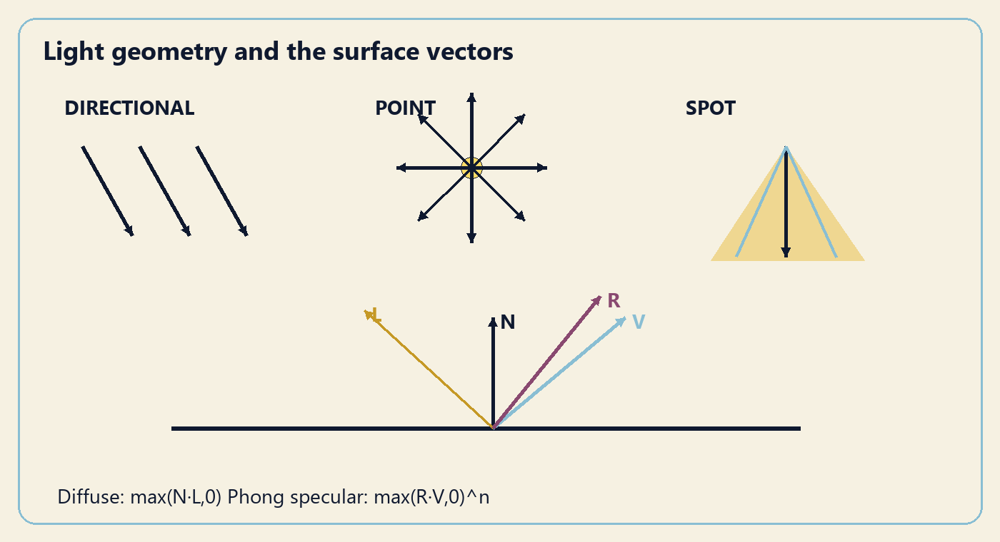

After sampling an RGB texel, albedo C is the componentwise product of that texel and the material tint. The shader adds C times ambient-plus-diffuse, then the untinted specular light colour and emission. For C=(0.4,0.6,0.8), ambient factor 0.06, diffuse factor 0.1791 and white specular factor 0.0277, RGB is (0.12334,0.17116,0.21898) before framebuffer storage. Texture alpha is used for cutout coverage; material opacity controls blending/transmission. These are componentwise shader values, not a physically calibrated spectral or tone-mapped pipeline.

As a numerical example, with ka=0.2, Ia=0.3, kd=0.8, N·L=0.6, ks=0.4, R·V=0.9, n=16, d=4 and (kc,kl,kq)=(1,0.14,0.07), attenuation is 1/2.68 = 0.3731. For unit light intensity and full cone visibility, the scalar ambient, diffuse and specular factors are 0.06, 0.1791 and 0.0277. The coloured terms multiply C; the specular term remains in the light's colour. The implementation suppresses specular response when N dot L is nonpositive, so a light behind a surface cannot create a front-facing highlight. Increasing n narrows the highlight, while increasing kq reduces distant illumination.

## 2.6 Shading techniques and interpolation

Illumination is the rule for light at one point; shading determines where that rule is evaluated across the surface. Gouraud evaluates lighting at vertices and interpolates it [4]. Phong interpolates normals and evaluates lighting per fragment [3]. The project's Flat mode uses a triangle face normal computed from derivatives of world position; its lighting can still vary within that face because point-light distance and the view vector vary. Blinn-Phong replaces the reflection-vector dot product with a half-vector term [5].

Shading evaluation in the raster pipeline

| Mode | Normal / evaluation | Characteristic |
| --- | --- | --- |
| Flat | Nface = normalize(dFdx(P) × dFdy(P)); lighting per fragment | Planar facets remain visible |
| Gouraud | Lighting per vertex; ambient/diffuse and specular interpolated separately | Narrow highlights between vertices can disappear |
| Phong | Interpolated N normalised per fragment; max(R·V,0)^n | Smoother moving highlights on curved geometry |
| Blinn-Phong | H=normalize(L+V); max(N·H,0)^(4n) | Half-vector highlights; 4n approximates similar width |

Perspective-correct attribute = [Σ lambda_i attribute_i / w_i] / [Σ lambda_i / w_i]
Gouraud colour = C × interpolated(ambient+diffuse) + interpolated(specular) + E
Phong normal = normalize(interpolated(vertexNormal))

F2 cycles the raster modes and automatically selects raster rendering. The ray tracer shades analytic surface hits per pixel; it can use the Phong or Blinn specular equation, but it does not perform Gouraud triangle interpolation or display polygon facets. This distinction is necessary when explaining the comparison.

## 2.7 Texture mapping and procedural detail

Each primitive stores UV coordinates. A material's uvScale repeats its pattern over the model. Cube faces have separate rectangular charts, sphere UVs follow longitude and latitude, and cylinder/cone sides wrap their angular coordinate while caps use planar coordinates. Multiplying texture RGB by material RGB allows the same wood or greyscale siding pattern to take several colours. The raster textures preserve their native dimensions; all 27 ray-traced maps are bilinearly resampled into 512 × 512 layers of one texture array.

uvSample = uv × uvScale; repeated coordinate = fract(uvSample)
Bilinear sample = (1-a)(1-b) C00 + a(1-b) C10 + (1-a)b C01 + ab C11
Trilinear filtering blends bilinear samples from two adjacent mip levels

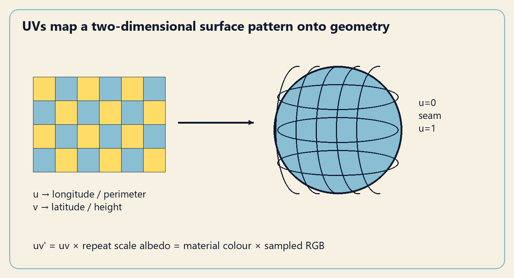

Most maps are generated in CPU memory with deterministic arithmetic. Hash values select per-cell variations. Smooth value noise bilinearly interpolates four hashed grid samples after applying q²(3-2q) to each fractional coordinate. Layered noise supplies grain, woven variation and grass. These are colour patterns; they do not displace vertices or implement normal mapping. The poster is loaded from a 24-bit BMP file generated by tools/make_poster.py. The custom loader handles headers, padded rows, orientation and BGR-to-RGB conversion.

BMP row stride = 4 ceil((width × bitsPerPixel)/32)
Positive BMP height: bottom-up rows; negative height: top-down rows
Loaded (B,G,R) is stored as (R,G,B,A=255)

## 2.8 Visibility, shadows and ray tracing

The raster path creates a 2048 × 2048 depth map from the lamp spotlight. Each visible surface is projected into the lamp's clip space and compared with that depth. A nine-sample 3 × 3 percentage-closer filter softens the edge. A small normal-dependent bias limits self-shadow acne. This is a depth comparison technique, distinct from the ray tracer's visibility rays. Other raster lights have no general shadow maps; flattened translucent contact shapes supplement the toys' contact with the floor. Their height follows the current support surface, including stairs and the lower floor, with a 0.012-unit depth offset. They are hidden when the feet are more than 0.06 units from that support, preventing floating cues during flight or mounting. The five shapes are reused without per-frame allocation.

shadowCoordinate = (LightVP × vec4(P,1)).xyz / w × 0.5 + 0.5
bias = max(0.0009(1-max(N·L,0)),0.00012)
visibility = (1/9) Σ [receiverDepth-bias ≤ storedDepth]

The optional tracer follows the primary/visibility/reflection structure associated with Whitted-style ray tracing [6]. A full-screen triangle launches one primary ray for each traced pixel. The shader finds the nearest analytic surface, shades it, tests selected shadow rays and continues along a reflected ray or a straight transmission ray. Bounces are bounded and throughput below 0.02 terminates the path. At the last permitted hit the tracer uses local illumination to close the finite path.

Ray: P(t) = o + t d, t > epsilon
Sphere: (d·d)t² + 2(o·d)t + (o·o - 0.25) = 0
Cylinder side: (dx²+dz²)t² + 2(ox dx+oz dz)t + ox²+oz²-0.25 = 0
Cone: x²+z² = 0.25(0.5-y)², with -0.5 ≤ y ≤ 0.5
Plane: t = -oy/dy, bounded by |x|,|z| ≤ 0.5
Cube slabs: tEnter = max(min(t0,t1)); tExit = min(max(t0,t1))

Object-space ray directions are deliberately not normalised after applying the inverse model matrix. Therefore the parameter t is identical in world and object space, allowing comparisons among differently scaled instances. Sphere, cylinder and cone sides reduce to quadratic equations; cylinder/cone caps use disk tests. When a cone coefficient a is approximately zero, its equation becomes linear. A ray beginning inside a cube uses the exit slab intersection. One-sided planes respect the authored wall direction.

Reflection: dNext = d - 2(d·N)N; originNext = P + 0.002 N
Caccum += throughput × (1-rho) × Clocal; throughput *= rho
Transmission: Caccum += throughput × opacity × Clocal
throughput *= (1-opacity); originNext = P + 0.002 d

Transparency follows the existing ray direction; it does not bend according to an index of refraction. In this single continuation implementation, transparent surfaces use transmission before the opaque reflection branch; the ghost and helmet therefore demonstrate transparency, while the polished floor and ball demonstrate mirror reflection. The image is not a path-traced global-illumination solution: there are no diffuse secondary bounces, caustics or physically simulated area lights.

The default ray budget is two continuations: the primary hit plus at most two further hits (three surface evaluations). Key 9 cycles 0 through 4, allowing at most five hit evaluations. The loop includes bounce zero and ends after uMaxBounces. A miss adds throughput times the background. At an opaque reflecting surface it adds throughput times (1-rho) times the local lit colour, then multiplies throughput by rho. A transparent hit instead adds throughput times alpha times local colour and continues straight with throughput times (1-alpha). The last permitted hit contributes its full local colour; the path also stops if its largest throughput component falls below 0.02. Visibility rays are extra occlusion queries, not additional colour bounces.

Example: rho0=0.2, rho1=0.5; local colours C0=(0.6,0.3,0.1), C1=(0.2,0.4,0.8), C2=(0.1,0.1,0.2)
Two-continuation result = 0.8 C0 + 0.2(0.5 C1) + 0.1 C2 = (0.51,0.29,0.18)

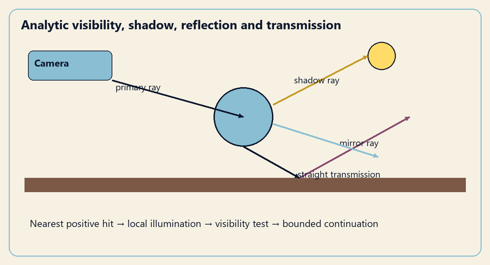

## 2.9 Bounding volume hierarchy and conservative bounds

A bounding volume hierarchy encloses groups of primitives with boxes, rejecting whole groups when a ray misses the box [7]. This project rebuilds a median-split tree over the visible scene each frame because its toys and doors move. The longest spread of box centres chooses the split axis; leaves contain at most two instances unless their centres coincide. Closest-hit traversal visits the nearer child first and prunes nodes farther than the current hit. Shadow traversal stops at the first qualifying opaque occluder.

World AABB centre c = M[3].xyz
Half-size h = 0.5(|M[0].xyz| + |M[1].xyz| + |M[2].xyz|)
Node bounds = union(child bounds)
Conservative sphere radius = 0.5 max over sy,sz in {-1,+1} |a0 + sy a1 + sz a2|

The sphere-bound expression measures the four distinct lengths among the eight transformed cube corners and remains valid under shear. The earlier orthogonal-column expression is insufficient when axes cease to be perpendicular. Scene nodes that are not visible are omitted from drawing and tracing, but the ray scene is not camera-frustum culled: off-screen geometry can still be visible in a reflection or block a shadow ray.

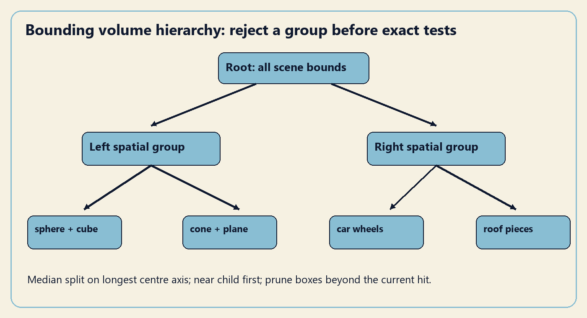

# CHAPTER III — Methodology and Object Construction

## 3.1 Resource ownership and rendering architecture

Assets owns five full-detail primitive meshes, lower-detail curved meshes, textures and materials. SceneNode stores pointers to these resources and owns its children. GPU wrappers manage buffers, arrays, shaders and textures for their lifetimes. Renderer collects visible shapes into DrawItems with model and normal matrices. The raster path uses indexed draws; RayTracer packs inverse transforms, material coefficients and BVH nodes into an RGBA32F texture buffer. The same light equations are included by both shader paths through lighting.glsl.

Module responsibilities

| Module | Responsibility | Entry point |
| --- | --- | --- |
| core | Window, frame loop, elapsed time, input edges, asset paths | Application::Run / Input |
| geometry / math | Primitive vertices and indices; matrices; CPU intersections | Primitives / Transform3D / RayIntersect |
| scene | Local transforms, hierarchy, materials, camera and lights | SceneNode::UpdateWorld |
| characters | Model assembly, drive state, gait, wheels, flight and cat poses | Character::Drive / Animate |
| world | Room/house builders, story choreography, arrival, physical contacts | BuildRoom / BuildHouse / StoryDirector |
| render | Raster shaders, shadow map, ray tracer, textures, debug geometry, HUD | Renderer::Render / RayTracer::Render |
| app | Scene wiring, selection, input dispatch, mount/dismount and evidence export | ToyRoomApp::StepScene / OnRender |

## 3.2 Woody and Jessie: one humanoid construction

HumanoidStyle configures a reusable builder. A pelvis joint owns the torso, head, shoulders and hips; each shoulder owns the upper arm, elbow/forearm and hand, while each hip owns the thigh, knee/shin and boot. Ellipsoids model the head, hands and rounded details; cylinders model limbs; cubes provide the torso, garment panels and boots. Woody is identified by his brown hat, yellow plaid shirt, cow-print vest and denim trousers. Jessie changes the same structure to a red hat, white/red shirt, red hair braid and tan boots. Sharing materials and geometry keeps the construction consistent.

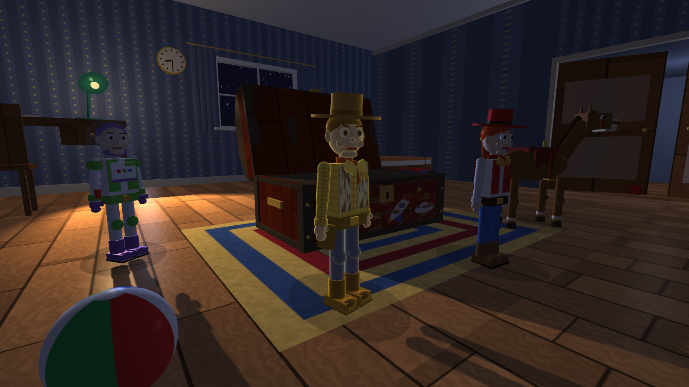

Woody's silhouette comes from separately scaled hat brim, crown, torso and boots, rather than a single imported mesh. The plaid, cow-print and denim maps are selected per shape, so one shared primitive mesh can represent different garment surfaces. Shoulder and hip pivots rotate their descendants without changing the body root. His root position and heading are the quantities transferred to user control during live takeover.

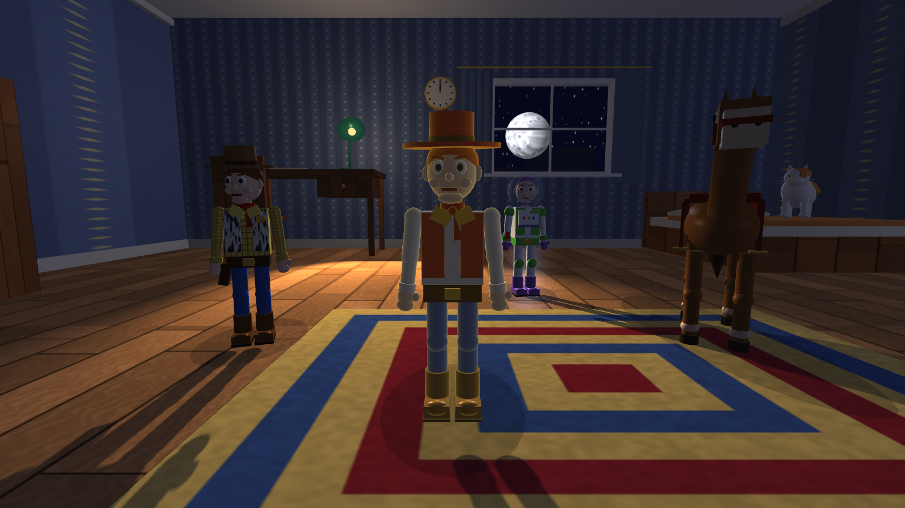

Jessie retains the same joint layout but changes the visible hat, hair, garment colours and boot proportions. The braid is assembled from rounded primitive sections under the head, so it follows head orientation. The saddle attachment changes the root parent while preserving the world transform; a seated pose then bends the existing legs. Dismounting restores an independent character root instead of duplicating the model.

Drive computes the forward vector from heading, accelerates toward the requested speed and changes yaw with turn input. Animate advances the walk phase with travelled distance, not only wall-clock time. Opposite hips swing out of phase and shoulders swing against the legs. Motion blend approaches zero when the toy stops. Mounted Jessie blends to a seated pose and stops independent driving; selecting a mounted actor detaches Jessie for independent control. Voluntary remounting drives the connected pair.

forward = (sin(heading),0,cos(heading))
v += clamp(vTarget-v,-acceleration dt,+acceleration dt)
heading += turnInput × turnRate × dt; position += forward × v × dt
phase += v dt × 4; legSwing = sin(phase) × 35 degrees × moveBlend

## 3.3 Bullseye and dynamic mounting

Bullseye uses an elongated sphere for the barrel, a separate neck/head hierarchy, muzzle, ears and eyes, four leg joints, hooves, mane, tail and a saddle. Differently scaled spheres preserve the horse's rounded toy silhouette. The saddle owns pad, flaps, straps, stirrups and an attachment joint. Gait animates the four leg joints and adds a small body bob; the saddle inherits that movement.

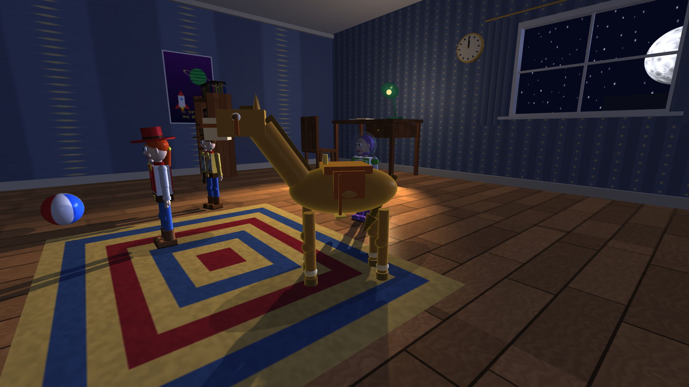

Mounting is accepted when Jessie's horizontal distance to Bullseye is no greater than 2.2 units and no transition is already running. The app remembers her world transform, reparents her root to the saddle and converts the placement into the saddle's coordinates. A 0.7-second interpolation takes her to the seat. Dismount converts back to a world-space position beside the horse and restores her independent collision body and controls. The placement conversion uses position and yaw; it is designed for the ordinary character rig rather than arbitrary affine reparenting of an externally sheared character.

MlocalNew = inverse(MworldSaddle) MworldJessie
MworldJessie = MworldBullseye MlocalSaddle MlocalJessie
smooth transition weight = q²(3-2q), q=clamp(elapsed/duration,0,1)

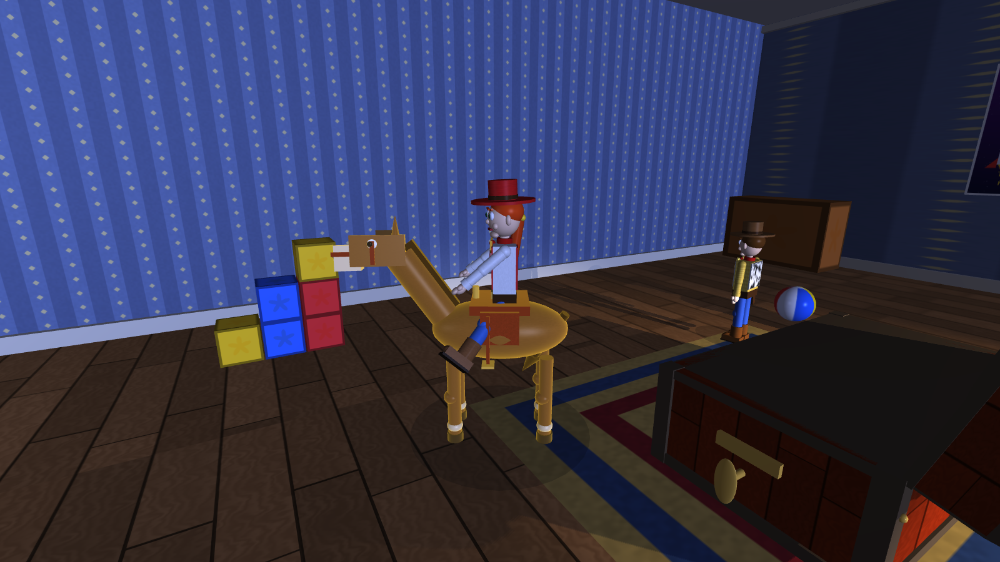

## 3.4 Buzz: flight, helmet and laser

Buzz extends the humanoid with a purple hood, clear spherical helmet, green/white armour, chest indicators, back pack, thrusters, wings and a wrist laser. The flight pose suppresses the walking gait, trails the legs, pitches the body according to cruise motion and banks while turning. A wings joint changes width between folded and extended poses. The helmet uses opacity 0.22; raster rendering blends it after opaque parts and ray tracing continues through its surface.

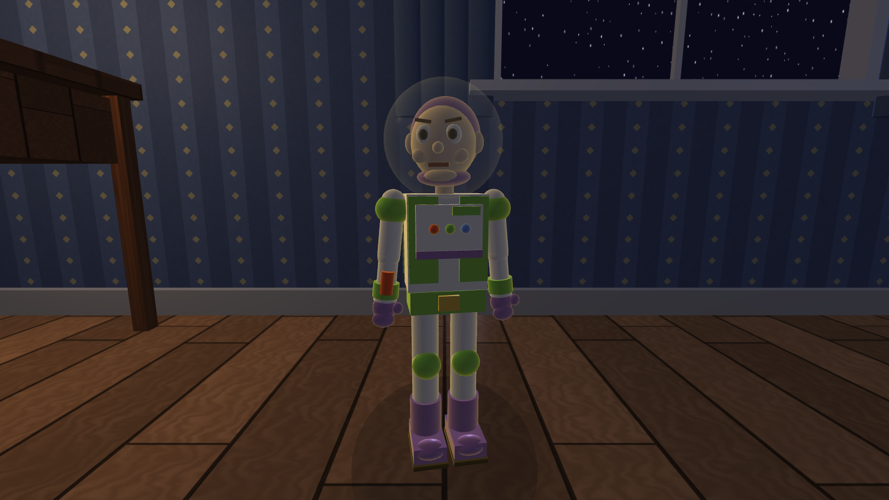

L toggles the laser; Z/X changes its aim and Alt+click aims at a visible surface. The beam is a thin emissive cylinder whose transform follows the right-arm rig. A red point light at its tip supplies local glow. PhysicsWorld::FireLaser finds the nearest blocking hit and applies an impulse only if it is a dynamic wooden block. Furniture can intercept the beam before a hidden block. The beam length is shortened to the hit distance, linking the visible effect to the intersection result.

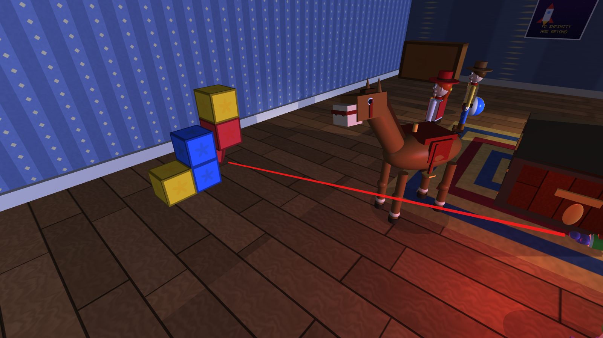

## 3.5 RC car: wheels, headlights and route

The car combines box chassis/body pieces, cabin, bumpers and grille with four cylinder wheels, hubs, axle details and an antenna. Wheel joints align cylinders with the axle and accumulate an angle equal to travelled distance divided by tyre radius. Two headlight anchors follow the car's world transform and emit forward/downward spotlights. L toggles manual headlights. The car remains an independently driveable prop with moving headlights and distance-driven wheels.

wheelAngle += travelledDistance / wheelRadius
headlightPosition = MworldAnchor[3].xyz
headlightDirection = normalize(anchor +Z axis + downward tilt)

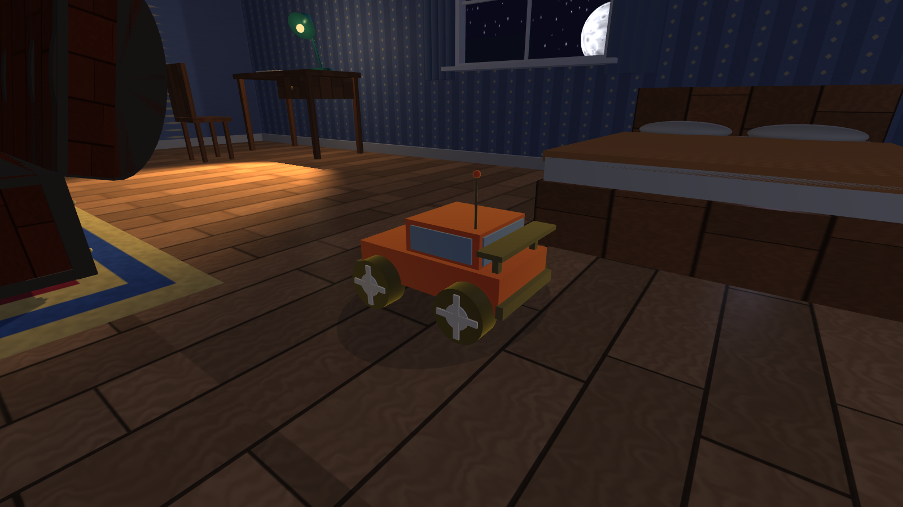

## 3.6 Penny: curved anatomy and the arrival

Penny is built from ellipsoids for the body, head, muzzle, cheeks and paws; pointed ears combine curved/triangular primitive forms, and the tail uses a separate curved arrangement of primitive sections. White material and ginger patch shapes identify the coat. Eye, nose, mouth and whisker details belong to the head hierarchy. Walking alternates the legs; sitting and sleeping reconfigure the existing rig. Head orientation follows the active toy during the mission.

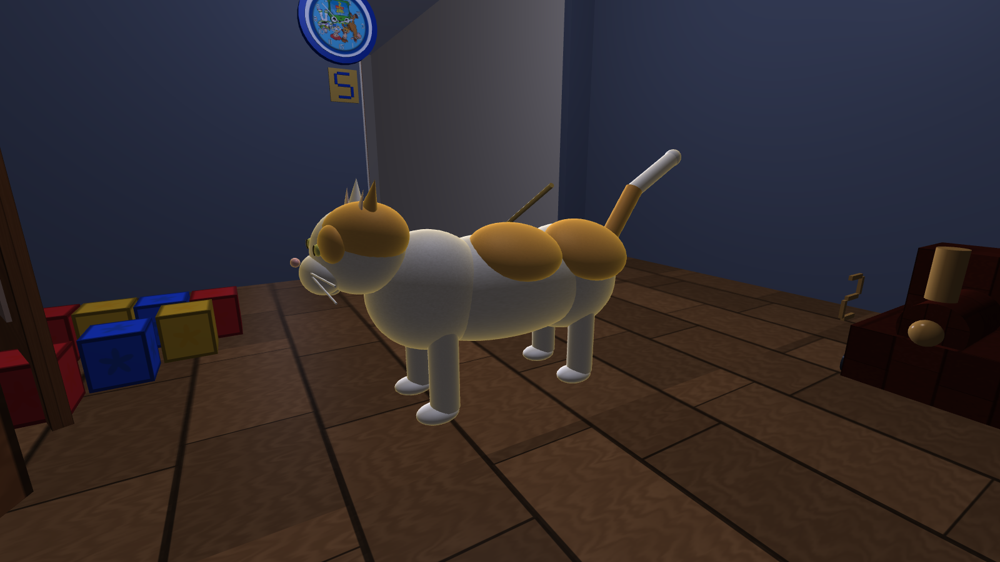

The story opens with PennyArrival: a seven-second crane shot from high above the street to a chase position behind Penny, who sits on the pavement looking at the house. The player then controls her in the garden. The physics bounds include the lawn, path, pavement and street; the front walls, fence, gate posts, column bases, railings, shrubs and tree trunks are solid. The porch deck and its three steps have their own support heights. The front door stands open; once Penny is inside the corridor it eases shut and a padlock appears. The stair flight has a 4.5-unit rise over an 8-unit run.

stairAngle = atan2(4.5,8) = 29.36 degrees
stairSupport = -4.5 + 0.25 clamp(floor(18(z+7)/8)+1,1,18)
camera = mix(street, behindPenny, smoothstep(t/6.5)); porch support = -4.05

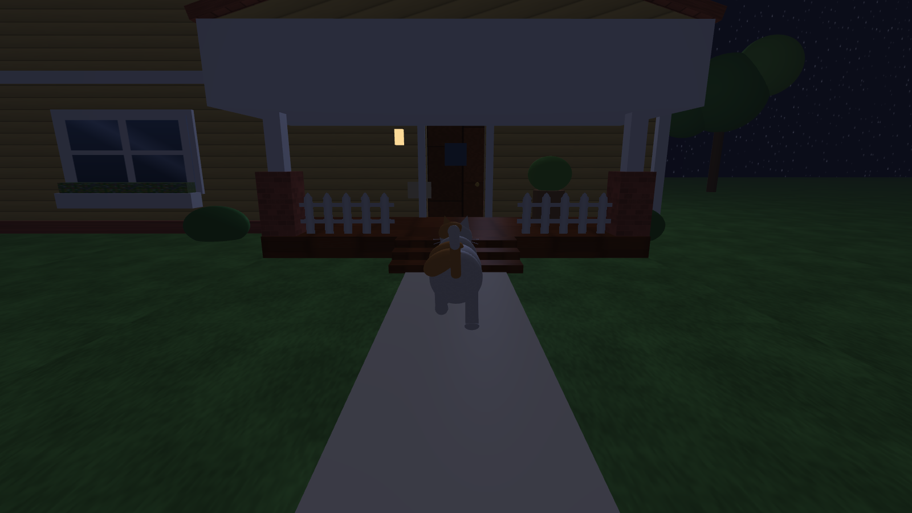

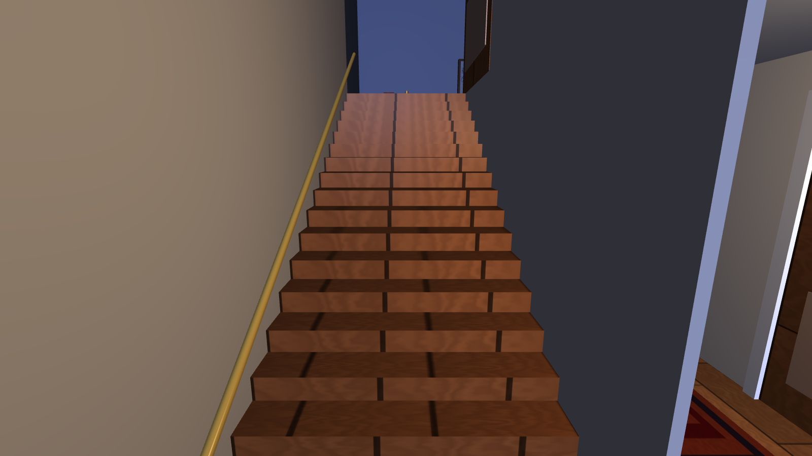

## 3.7 Room shell, window and sky

The play room is 20 units wide, 18 deep and 7.5 high. Inward-facing wall planes are split around an actual back-wall window opening and right-wall doorway. Four window-frame strips, two mullions and a sill reveal an external sky plane, sun/moon spheres and distant house silhouettes. Side skirting and crown trim supply architectural edges. The window is an architectural opening; the implemented user-controlled opening is the door/lamp/character interaction system rather than a manually hinged window sash.

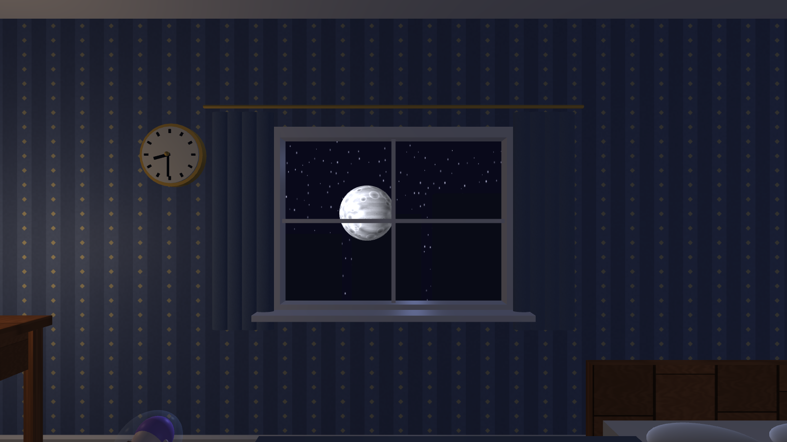

Environment::UpdateSky maps the 24-hour clock onto opposite sun and moon arcs. A smooth daylight factor blends ambient light, sky emission and directional-light colour. The emissive sun and moon are visible representations; a separate directional light represents illumination. The large sky plane is unlit and its star brightness fades during daytime.

a = (hour-6) pi/12; sunHeight = sin(a)
sunPosition = skyCentre + (-3.2 cos(a),3.1 sin(a),0)
moonPosition = orbit(a+pi); daylight = smoothstep(-0.1,0.25,sunHeight)

## 3.8 Furnishings and texture-efficient detail

The desk uses a box top, four legs, drawer and a spherical brass knob. A sketchbook and three pencil cylinders sit on the top. The articulated lamp belongs to a separate root above the desk. The chair adds a seat, back and four legs. The bed uses frame, mattress, plaid blanket, headboard and two flattened-sphere pillows. The bookcase has uprights, back and four shelves; a single textured box on each shelf represents a row of book spines. Solid furniture contributes to collision bounds, while thin visual trim stays decorative.

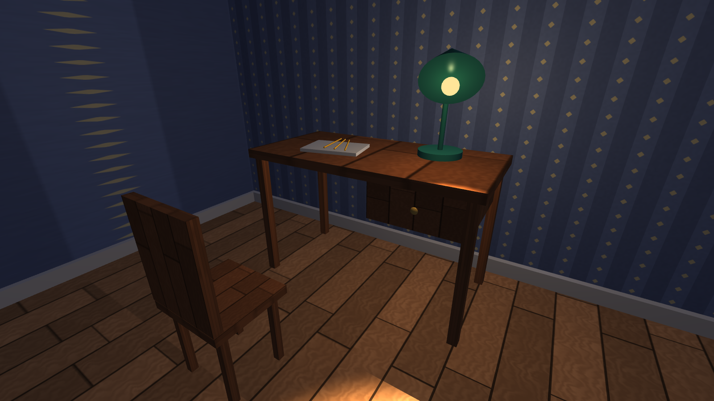

Desk and chair: box faces provide flat normals at the tabletop, drawer and leg edges; the brass knob uses a sphere with a stronger specular response. The three pencil cylinders and thin sketchbook remain decorative parts. Chair seat, back and four legs share the same wood material. Repeated wood UVs add grain without additional triangles, while solid furniture bounds keep driven characters outside the structure.

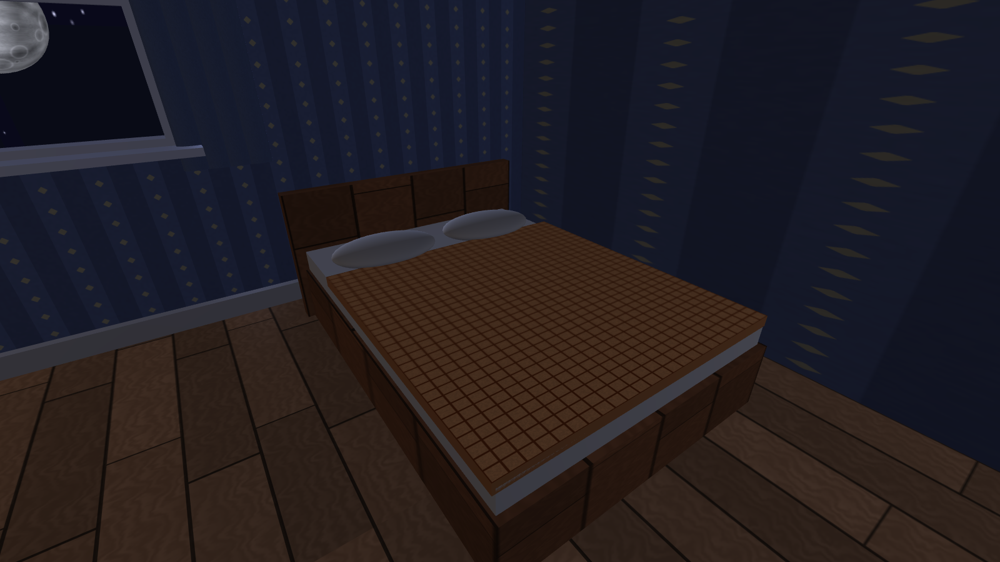

Bed: the frame and headboard establish the solid silhouette, while separate mattress and blanket boxes permit different surface materials. Two flattened spheres form soft pillows. The fabric pattern uses the existing face UVs and repeat scale, so the checked blanket is coloured surface detail. Penny's sitting, walking and sleeping poses all belong to her own rig.

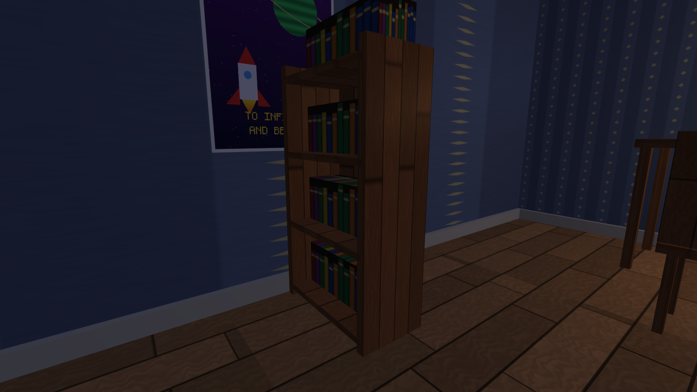

Bookcase: uprights, backing and shelves are independent scaled boxes. Each shelf contains one textured book-row box; coloured spine bands suggest many books with fewer draw calls than individual book meshes. This is a deliberate surface-detail approximation. The frame retains geometric depth and cast-shadow structure, while the texture provides fine repetition that would otherwise require many small objects.

A repeated fabric pattern covers eight curtain-fold cylinders. A wall poster is an independently UV-mapped plane. The rug uses concentric square colour bands on a plane just above the floor. Toy blocks are six cubes arranged as a tower; a larger crate stands against the left wall as a collision demonstration. Their star/bevel texture adds surface identity without adding bevel geometry. All leaf transforms and material assignments are recorded in objects.csv and the comprehensive construction notes; Appendix A indexes the complete scene groups.

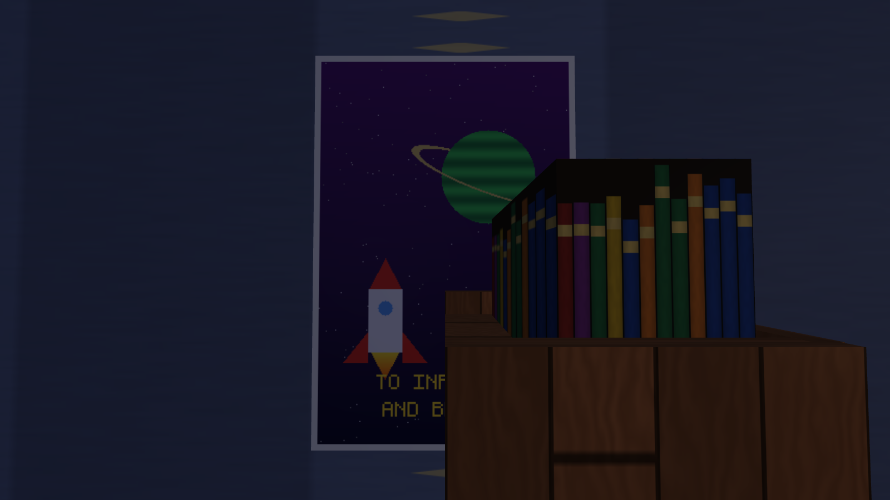

Poster, curtains and rug: the poster is a plane with a single BMP image, giving a clear demonstration of file loading rather than procedural generation. Curtain folds use eight cylinders to produce an actual curved silhouette and changing normals. The rug is a slightly elevated plane with concentric colour bands. Small offsets prevent coincident surfaces from competing in the depth buffer.

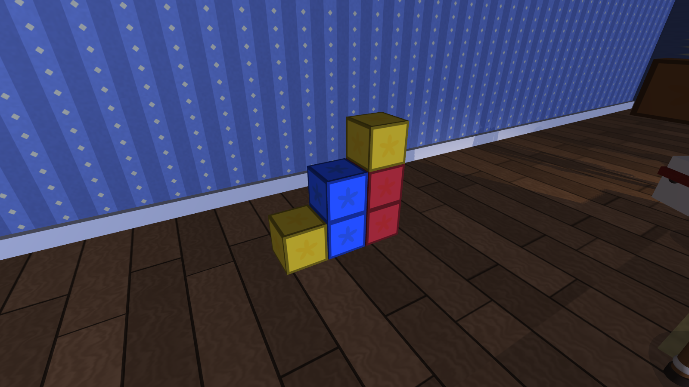

Blocks and doorway crate: each rigid box has its own translation and orientation, allowing gravity, separation and laser impulses to act independently. The star-and-border map identifies the faces, but its apparent bevel is a colour pattern rather than extra edge polygons. The crate is a movable demonstration prop; the small tower provides a visible test of falling and tumbling objects after an impulse.

## 3.9 Fan, clock and haunted props

The ceiling fan has a fixed mount and shaft, a spherical motor and four thin box blades. Each blade is placed below a rotor joint. The rotor turns at 110 degrees per second while world playback is active. The wall clock has a cylindrical rim and face, twelve box hour marks, two hand pivots and a central pin. Rotating each pivot moves the complete hand, and the two angles are derived from the scene hour rather than independent animation clocks.

fanYaw = (fanYaw + 110 dt) mod 360
hourHandAngle = -30 (hour mod 12) degrees
minuteHandAngle = -360 fract(hour) degrees

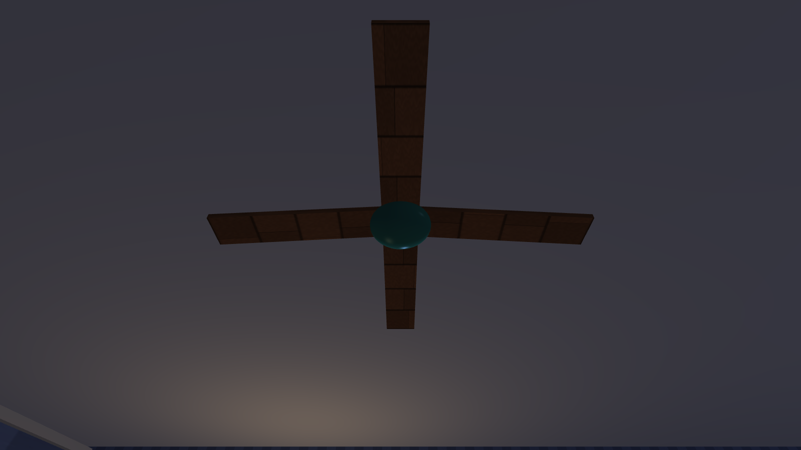

The beach ball is one sphere below a position root, with six coloured UV gores and white polar regions. Rolling accumulates a Rodrigues rotation in its shape basis. The ghost combines a spherical head, conical sheet and dark face parts under a body joint. Its opacity fades toward night visibility; sinusoidal position, bobbing and body roll create floating motion. O toggles the haunted ambience outside edit mode, enabling autonomous ball motion, ghost appearance and lamp swivel/flicker without changing the coordinated story's default choreography.

rollingAxis = normalize(up × displacement); rollingAngle = |displacement|/radius
ballBasisNext = R(rollingAxis,rollingAngle) ballBasis
ghostPosition = (4.5 sin(0.25t),4.2+0.35 sin(1.3t),3 cos(0.25t)-0.5)

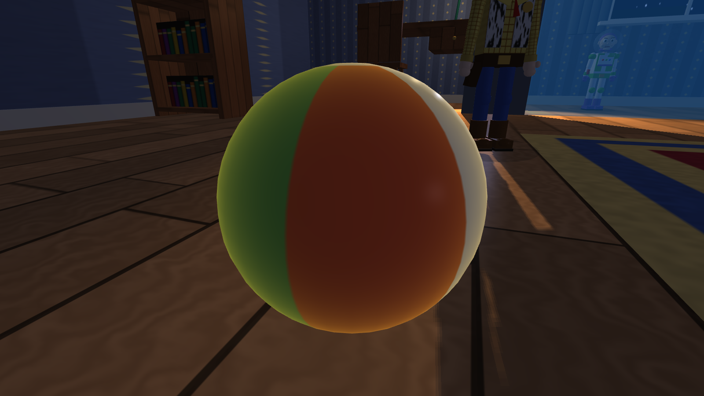

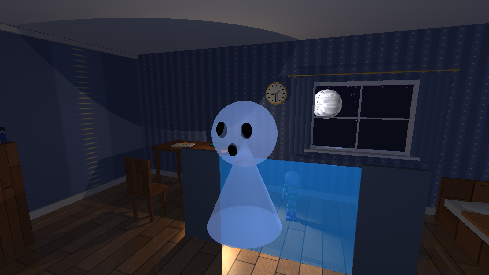

## 3.10 Lamp hierarchy and moving illumination

The lamp has a cylinder base, arm pivot, cylinder arm, elbow sphere, head pivot, cone shade, emissive bulb sphere and a light anchor beyond the shade. A/D changes base yaw, W/S changes head tilt, R toggles power and comma/period adjust brightness. Both the point light and spotlight position follow the light anchor, while the spotlight direction is the head's transformed local -Y axis. Thus editing the lamp changes the light itself, not just the decorative mesh. In ambience mode, layered value noise modulates brightness and occasionally produces a short dropout.

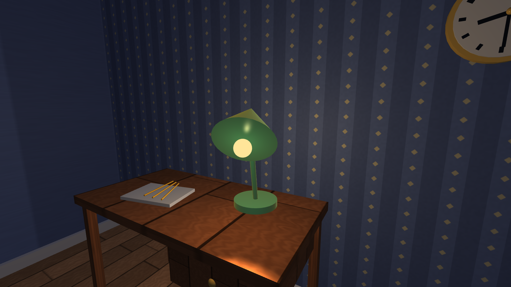

## 3.11 House, doors and garden

BuildHouse constructs a two-storey facade, pitched roof, gables, trim, porch, garage and ground-floor corridor around the upper play room. A rotated, stretched cube supplies each gable silhouette; box sections form roof slopes. Siding, shingles and brick detail are tinted procedural maps. The porch has supports, railings and steps; transparent cutout picket maps replace repeated fence and railing geometry. The garden includes lawn, path, street, pavement, driveway, shrubs, five trees, flower details, mailbox and gate posts. The visible external sun contains an emissive core and translucent halo.

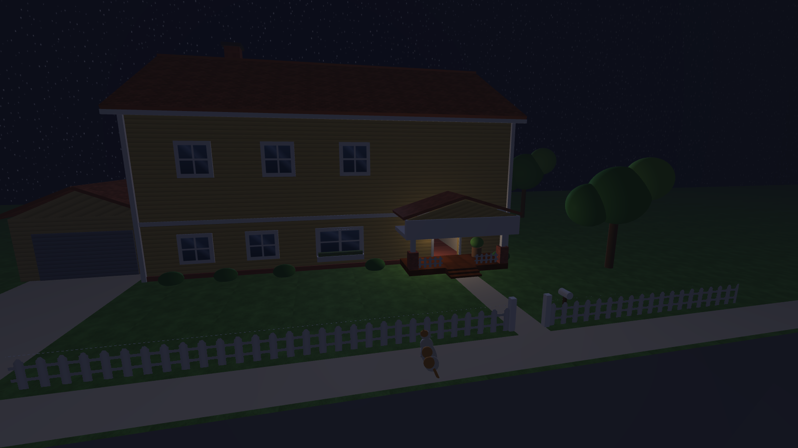

Exterior groups: scaled boxes form the house walls, porch, garage and pavement, with roof and trim elements preserving the architectural outline. Fence pickets use alpha coverage to cut holes in a textured surface; their silhouette is not a separate mesh for every opening. Grass, siding, shingles and brick have distinct UV repeats. Trees and garden elements give depth to the opening shot and the morning view and remain selectable or inspectable through their scene-node records.

The front door, double toy-room door, stair door, Buzz's bedroom door, the chest lid and both wardrobe doors use hinge roots: one rotation turns the leaf and every attached part together. Each angle eases exponentially toward its story target. The exterior is drawn outdoors and again after the main door breaks. The ground floor is a union of boxes: corridor, stair landing, Buzz's bedroom and its doorway, so the solid divider and the door leaf decide where a character can pass.

## 3.12 Story objects: puzzle, toy chest, Buzz's room and wardrobe

The wooden train uses box chassis and cab pieces, a horizontal cylindrical boiler, chimney and cylinder wheels. Two separate cars and a raised seven-segment 2 identify its clue. Seven coloured cubes form the block clue's 7. The hallway clock is wall-sized: a 0.8-unit circular cylinder case hung at eye height and a thin cylinder face. The provided BMP uses planar cap UVs; a negative v repeat corrects printed orientation after rotation. A small brass plate below the face carries a raised 5. The combination keypad has a solid wood housing, steel plate, ten raised buttons, box-strip digit glyphs and a cylinder confirmation button. Its editable three-digit display is also exposed in the HUD.

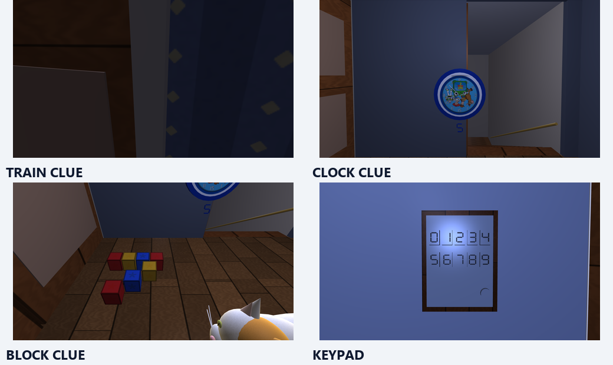

The toy chest is hollow (floor board and four solid walls) with iron brackets and bands, brass rivets, a keyhole plate and a front panel carrying a procedural painted texture: worn red planks, stars, clouds and a rocket. Its lid is a hinge joint holding a deep frame box and a cylinder dome whose lower half lies inside the frame, so the lid stays curved when open. The red wind-up button pulses and a red story light follows it. Pressing it swings the lid to -105 degrees; Woody, Jessie and Bullseye climb to the rim and hop out with the eased transition (a 0.4 sin(pi t) arc), then cheer. Buzz's bedroom under the Toy Room is ordinary: star wallpaper, a patchwork star quilt, a bookcase with a globe, rocket and teddy bear, a nightstand lamp (the room's light), a star rug and a football. The wardrobe has a hollow carcass, an arched crown with finials and two hinged doors with arched panels, cut-out gold stars and knobs 2.65 units up, too high for Penny; a green glow leaks from the gap while Buzz is inside.

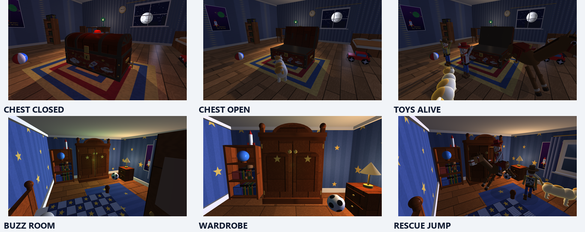

Bullseye's jump lifts his body joint, and so the saddle and a mounted Jessie, by 0.75 sin(pi t) over 0.9 s while his root stays on the floor; Jessie's reach pose raises her right arm. Buzz then flies out on four waypoints. At the entrance the padlock rides on the door hinge; the laser hides the door and releases six wood boards that the fixed-step solver drops onto the porch deck.

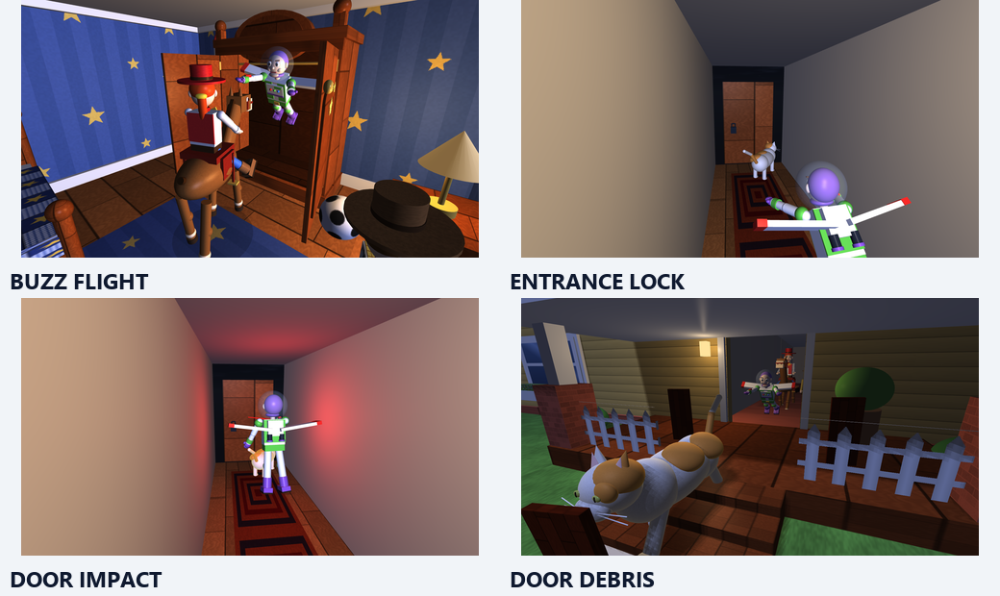

Fog: T = exp(-density*d); Cfogged = T Crendered + (1-T)(0.055,0.065,0.095); density = 0.011 (1 - daylight) outdoors

# CHAPTER IV — Implementation, Results and Discussion

## 4.1 Light sources and material response

Scene light configuration

| Source | Type / control | Attenuation (kc,kl,kq) | Cone / visibility |
| --- | --- | --- | --- |
| Sun / moon | Directional; clock and F8 | (1,0,0) effective | No cone; ray shadows |
| Lamp bulb | Point; lamp anchor, R power | (1,0.14,0.07) | All directions; ray shadows |
| Lamp shade | Spot; head -Y axis | (1,0.05,0.01) | 22° / 34°; raster map + ray shadows |
| Hall night light | Point; fixed position | (1,0.10,0.03) | No general shadow test |
| Left / right headlight | Two spots; moving car, L | (1,0.10,0.05) | 12° / 22°; no general shadow test |
| Laser glow | Point; Buzz laser tip, L | (1,0.35,0.40) | No general shadow test |
| Ghost glow | Point; ghost world position | (1,0.30,0.15) | Fades with ghost; no general shadow test |

Eight light slots share one shader interface. Light intensity is refreshed each frame, so switching a lamp, activating the car or moving a glow source changes the actual illumination. Textures are multiplied into ambient/diffuse reflectance while highlights stay in light colour. Cloth uses low specular strength; brass and lamp metal use stronger, sharper highlights. The floor uses ks=0.35, shininess=48 and reflectivity=0.18; the ball uses ks=0.6, shininess=64 and reflectivity=0.12. Appendix B gives representative coefficients; materials.csv and the comprehensive notes give every material's actual coefficients.

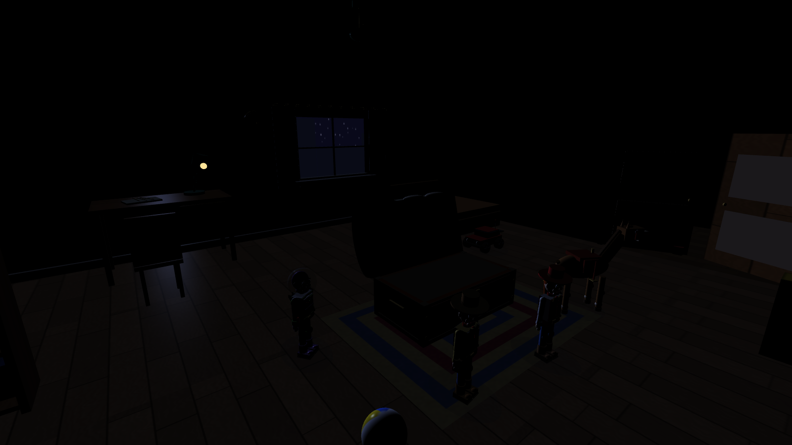

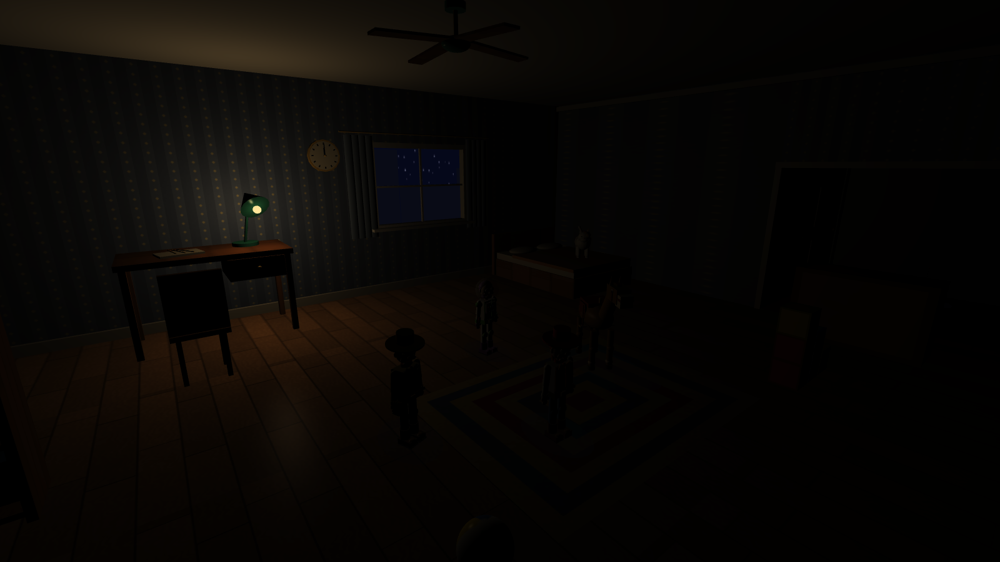

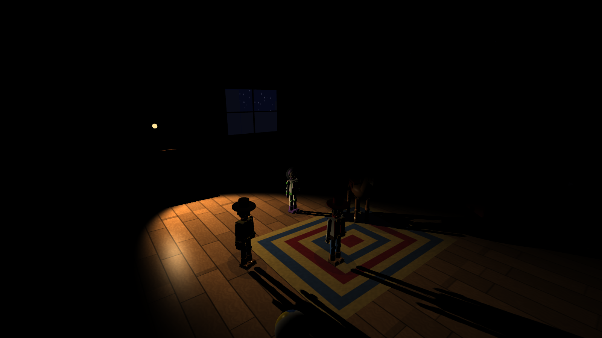

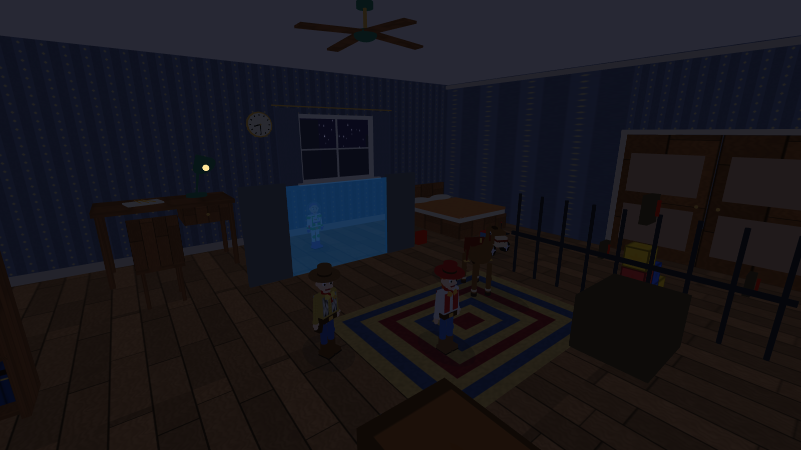

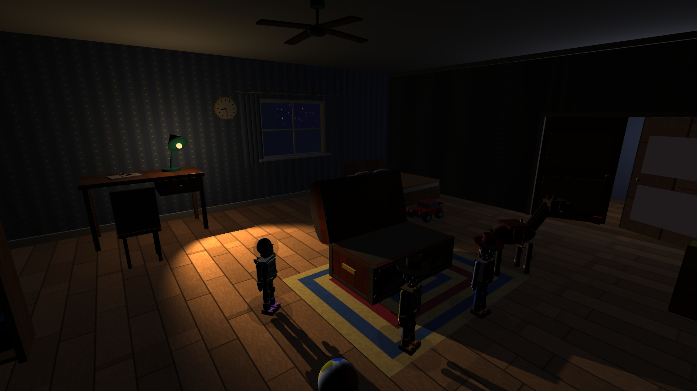

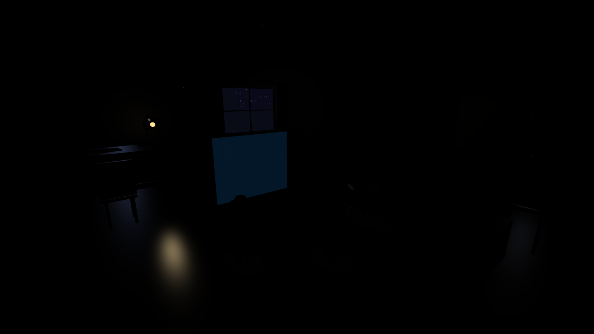

## 4.2 Matched shading comparison

The following images use the same camera, materials, time and light state. Only the raster shading mode changes. Wireframe and normal views identify the geometry behind the comparison. Gouraud's interpolated vertex light is usually less accurate around a small highlight; Phong computes the normal-based response per fragment. Flat makes individual planar facets easier to identify, while Blinn uses a half-vector term with four times the stored exponent.

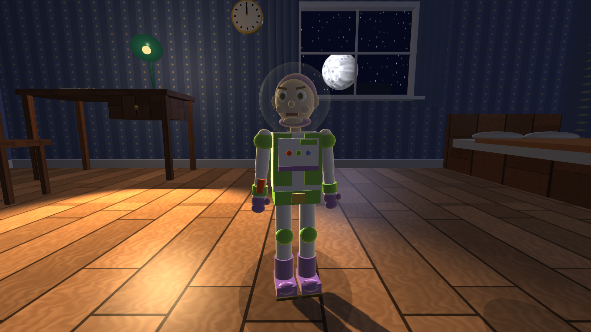

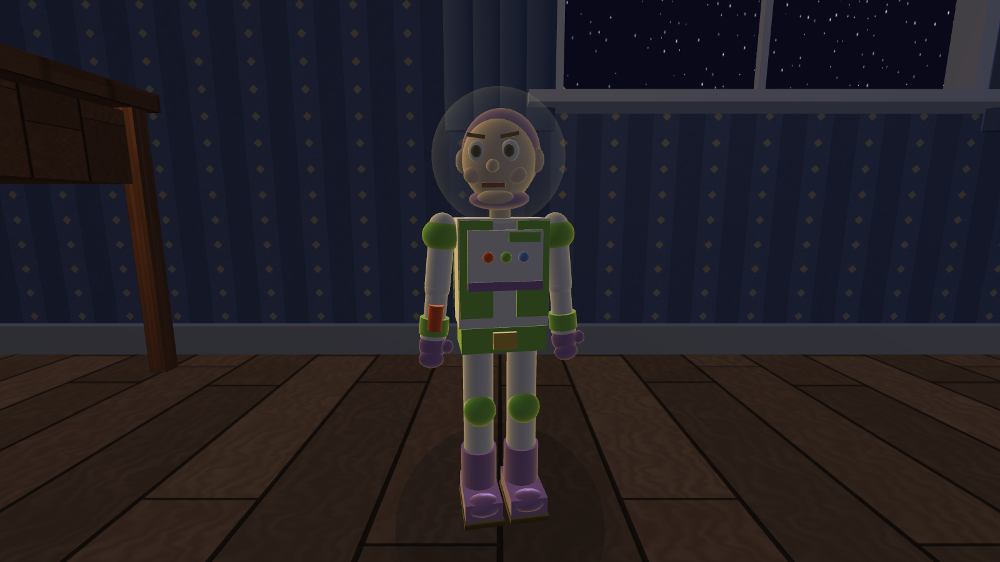

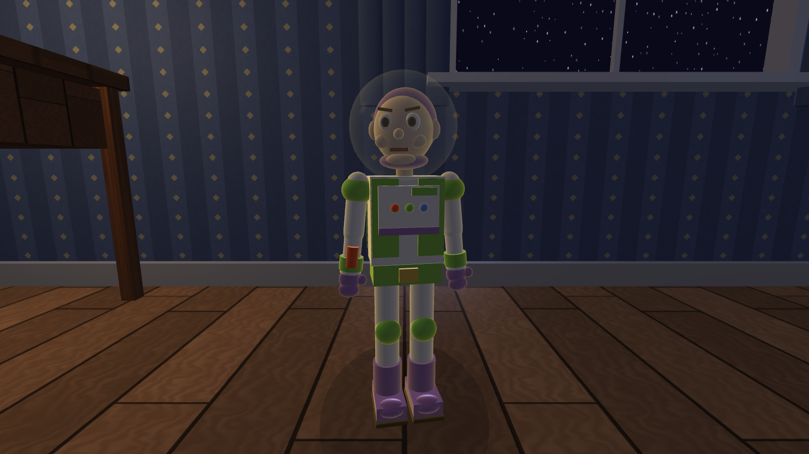

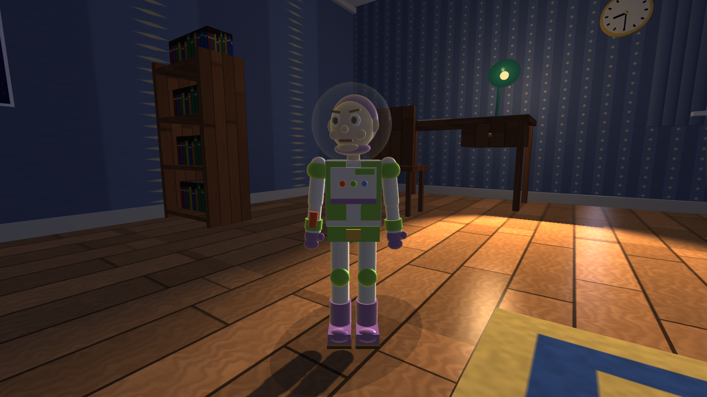

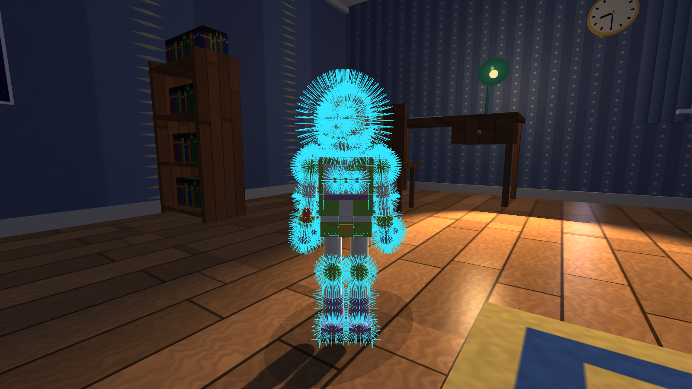

## 4.3 Complete surface-map catalogue

The texture catalogue includes every sampled scene map and the white utility fallback. Native size, array layer, scene use and generation rule are listed alongside faithful exported images. The alpha fence map is also shown over a checker background to reveal holes; alpha is shape coverage and remains effective even when colour texturing is disabled. Texture rows in the exported inventory preserve the source dimensions.

### Surface map: white

Native size: 1 × 1 texels. Ray layer: -1. Use: Untextured material fallback. Construction: One white texel leaves the material's colour unchanged; no traced layer is required.

### Surface map: wood-floor

Native size: 512 × 512 texels. Ray layer: 0. Use: Floor, desk, chair, bed and fan blades. Construction: Eight plank columns and staggered joints; per-plank hash tint, sinusoidal/noise grain and dark gaps.

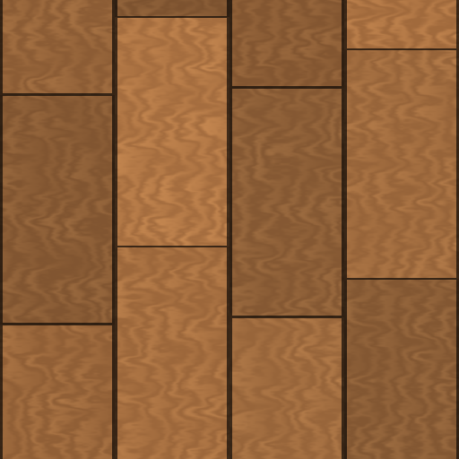

### Surface map: wallpaper

Native size: 256 × 256 texels. Ray layer: 1. Use: Room wall sections. Construction: Two-tone vertical stripes and regularly placed diamond motifs in normalised UV space.

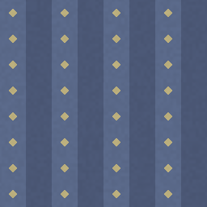

### Surface map: rug

Native size: 256 × 256 texels. Ray layer: 2. Use: Floor rug. Construction: Square radius d=max(|u-0.5|,|v-0.5|); band=floor(16d) mod 4 with fine value-noise variation.

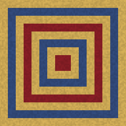

### Surface map: beach-ball

Native size: 256 × 128 texels. Ray layer: 3. Use: Rolling ball. Construction: Longitude selects six colour gores; latitude creates white polar caps.

### Surface map: toy-block

Native size: 128 × 128 texels. Ray layer: 4. Use: Tower blocks and doorway crate. Construction: Face-border shading and a star motif imitate bevel/detail without extra triangles.

### Surface map: poster

Native size: 256 × 384 texels. Ray layer: 5. Use: Wall poster. Construction: 24-bit BMP from the local poster generator; decoded by the project's BMP parser.

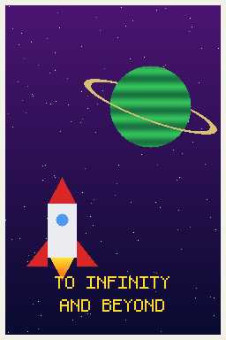

### Surface map: night-sky

Native size: 1024 × 512 texels. Ray layer: 6. Use: External sky backdrop. Construction: Deterministic star locations on black; sky emission supplies the background and daylight fades stars.

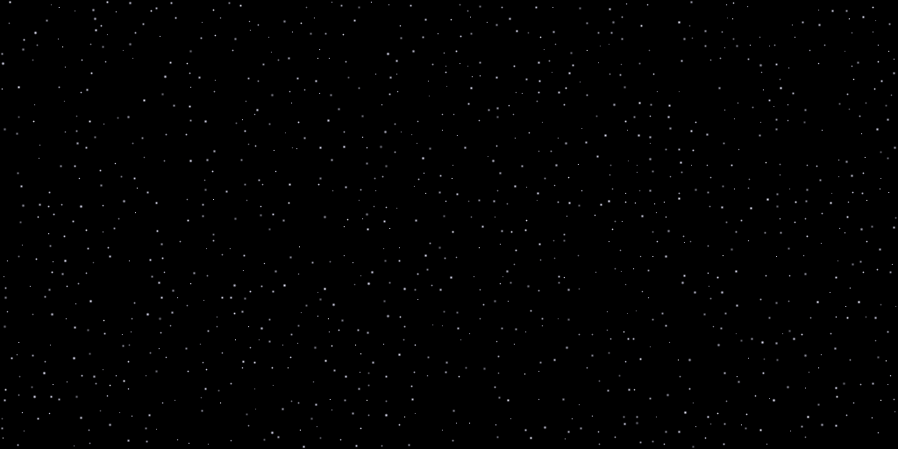

### Surface map: lunar-surface

Native size: 1024 × 512 texels. Ray layer: 7. Use: Moon. Construction: Procedural spherical crater/maria colour pattern with deterministic noise; no displacement mapping.

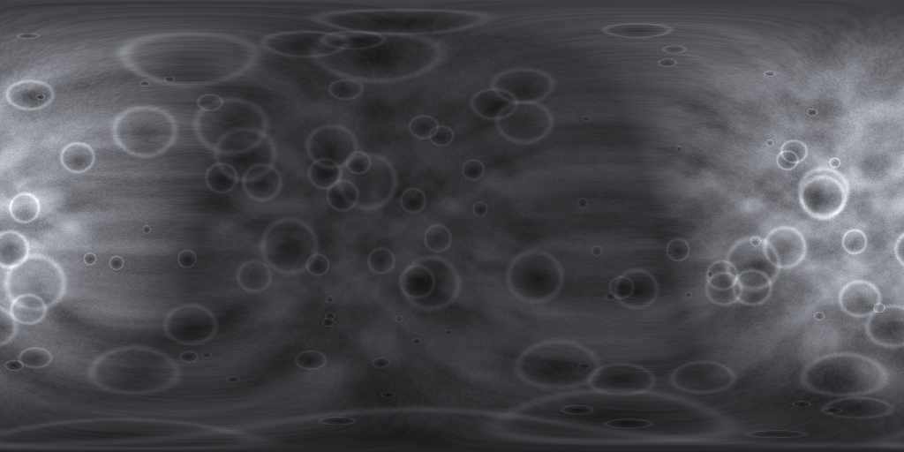

### Surface map: woven-cotton

Native size: 256 × 256 texels. Ray layer: 8. Use: Shirts, curtains, horse mane/body. Construction: Crossing fine periodic threads combined with low-amplitude noise.

### Surface map: denim

Native size: 256 × 256 texels. Ray layer: 9. Use: Trousers and tyre detail. Construction: Diagonal woven/twill modulation over the material's tint.

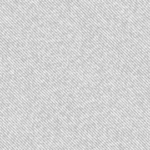

### Surface map: worn-leather

Native size: 256 × 256 texels. Ray layer: 10. Use: Hats, boots and saddle. Construction: Fine grain and uneven mottling from layered value noise.

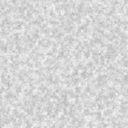

### Surface map: shirt-plaid

Native size: 256 × 256 texels. Ray layer: 11. Use: Shirts and orange blanket. Construction: Two sets of periodic crossing stripe masks form checks; fabric noise adds small variation.

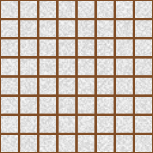

### Surface map: cow-print

Native size: 256 × 256 texels. Ray layer: 12. Use: Woody's vest. Construction: Thresholded smooth noise defines irregular dark patches on a light base.

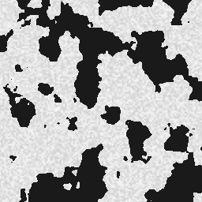

### Surface map: book-spines

Native size: 256 × 256 texels. Ray layer: 13. Use: Four bookcase rows. Construction: Twelve UV cells, six-colour palette, hashed height, gap and gold title band.

### Surface map: pickets

Native size: 256 × 256 texels. Ray layer: 14. Use: Fence and porch/stair rails. Construction: Eight narrow pickets per repeat, triangular tips and two rails; alpha=0 in every hole.

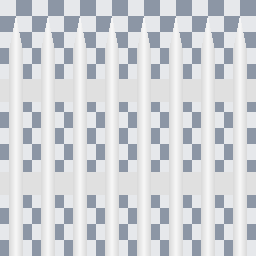

### Surface map: siding

Native size: 256 × 256 texels. Ray layer: 15. Use: House facade. Construction: Eight board rows: fractional row height controls edge shading, with stretched wood noise.

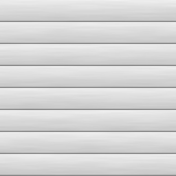

### Surface map: shingles

Native size: 256 × 256 texels. Ray layer: 16. Use: Roof slopes. Construction: Eight staggered rows and six tabs per row; hashed tab brightness and dark gap masks.

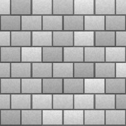

### Surface map: brick

Native size: 256 × 256 texels. Ray layer: 17. Use: House/porch masonry. Construction: Eight running-bond courses, four bricks per row, half-brick row offsets and pale mortar masks.

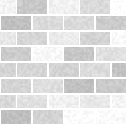

### Surface map: grass

Native size: 256 × 256 texels. Ray layer: 18. Use: Garden lawn. Construction: Two noise scales: coarse clumps and fine elongated blade variation, tinted green.

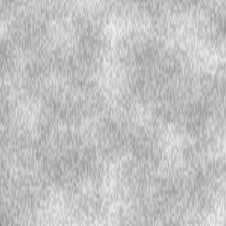

### Surface map: window-pane

Native size: 128 × 128 texels. Ray layer: 19. Use: Exterior windows. Construction: Border/cross masks and a vertical glass gradient with a diagonal sheen; opaque colour map.

### Surface map: flower-bed

Native size: 256 × 256 texels. Ray layer: 20. Use: Garden flower details. Construction: Ten-by-ten hashed cells place blossom centres and choose among four colours over leaf noise.

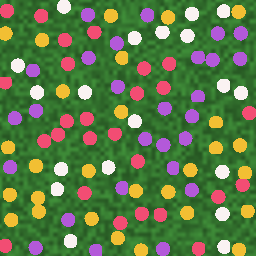

### Surface map: toy-story-clock

Native size: 447 × 447 texels. Ray layer: 21. Use: Hallway clock face. Construction: Provided BMP, custom row/RGB loader and planar cylinder-cap UVs; shared array layer for both renderers.

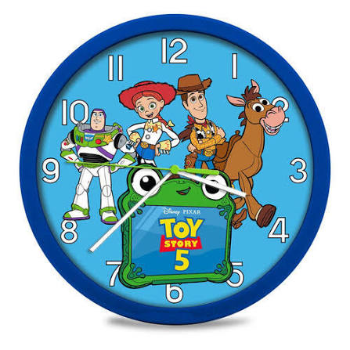

### Surface map: chest-paint

Native size: 512 × 256 texels. Ray layer: 22. Use: Toy chest front. Construction: Worn red planks, chipped paint, folded five-point stars, circle clouds, ellipse rocket.

### Surface map: star-wallpaper

Native size: 256 × 256 texels. Ray layer: 23. Use: Bedroom walls and rug. Construction: Blue stripes; two folded five-point stars per tile.

### Surface map: star-quilt

Native size: 256 × 256 texels. Ray layer: 24. Use: Patchwork quilt. Construction: 4 x 4 patches: navy with a gold star or blue/white plaid; dark seams.

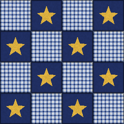

### Surface map: star-decal

Native size: 128 × 128 texels. Ray layer: 25. Use: Wardrobe stars. Construction: Gold star; alpha = 0 outside it (cut-out).

### Surface map: football

Native size: 256 × 128 texels. Ray layer: 26. Use: Football. Construction: Black within 17 degrees of the 12 icosahedron vertices.

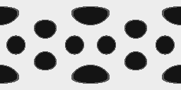

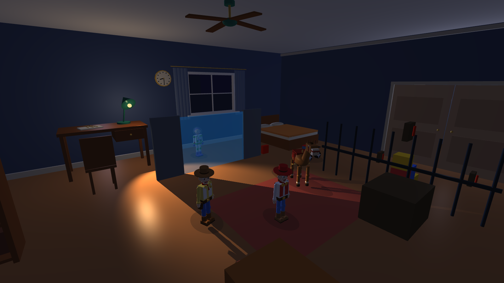

## 4.4 Raster and ray-traced results

The scene and camera remain the same in the following comparisons. Raster mode approximates curved geometry with triangles and uses the lamp shadow map; the ray tracer intersects exact primitive equations and can reveal off-screen geometry in the polished floor. Primary rays, shadow rays, mirror paths and opacity continuation are all implemented in the shader. Ray resolution defaults to half the display dimensions, giving one quarter of its pixels; minus/equal adjusts resolution from 0.2 to 1.0 and 9 cycles the bounce limit from zero to four.

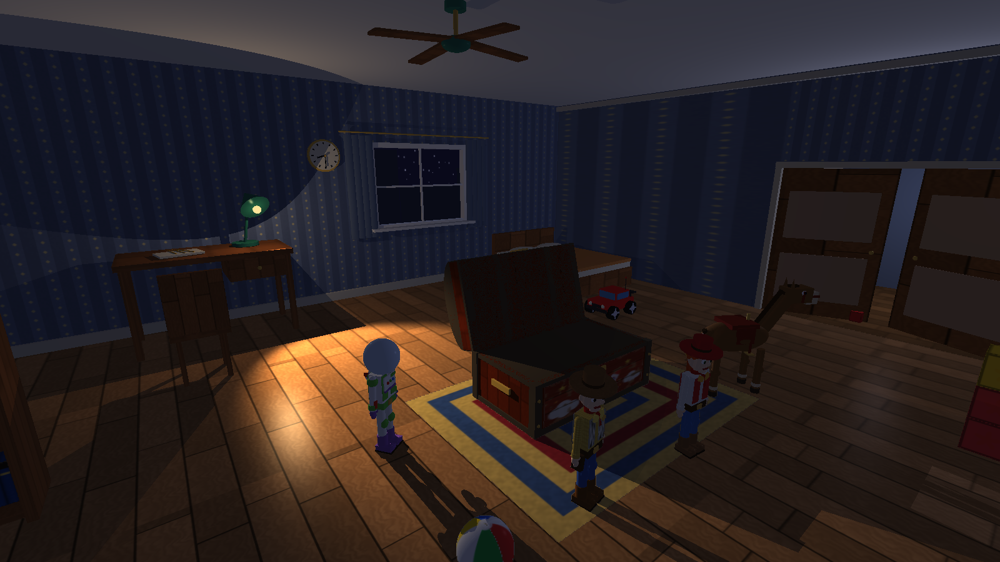

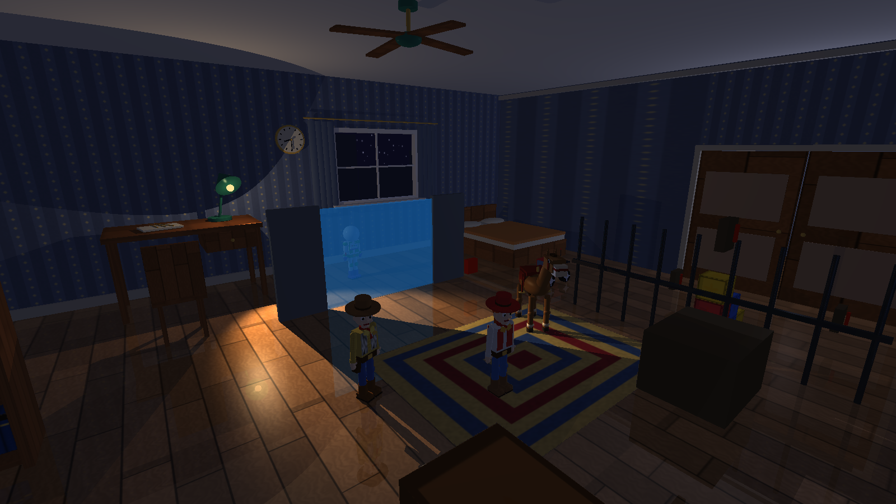

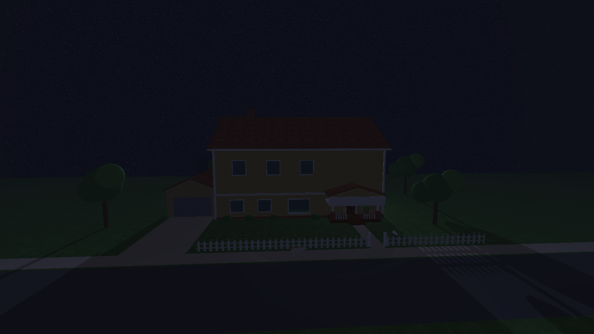

The shader uses quality thresholds to bound shadow work. Very weak light contributions are skipped; lights tagged for tracing cast an occlusion ray only when attenuation × intensity × max(N·L,0) exceeds 0.02. Transparent and unlit instances are excluded from general shadow occlusion. These choices improve interactive cost but mean visibility is deliberately approximate for weak lights and translucent objects. The tracer does not provide physical refraction or indirect diffuse illumination.

## 4.5 Coordinated animation and interaction

Story states and visible graphics operations

| Stage | Action | Graphics concept |
| --- | --- | --- |
| 0 Night outside | Penny explores the garden and walks in; the main door locks behind her | Crane shot, player control, porch support heights, hinge easing, fog |
| 1 257 puzzle | Train 2, clock 5, blocks 7; the keypad opens the Toy Room | Proximity input, digit geometry, cylinder-cap UVs, door yaw |
| 2 Toy chest | Red wind-up button; Woody, Jessie and Bullseye climb out alive | Hinged lid, eased transitions with a hop arc, gestures |
| 3 Buzz's room | The toys follow Penny downstairs; she opens the door on the left | Doorway-node navigation, stair support, hinge rotation |
| 4 Cupboard rescue | Jessie rides Bullseye, he jumps, she opens the wardrobe; Buzz flies out | Re-parenting, body-joint jump arc, reach pose, flight |
| 5 Locked main door | Penny tries the door; Buzz aims and the player fires L | Nearest-hit laser, rigid-body debris, collision removal |
| 6 Morning escape | Everyone leaves; night turns into morning; the camera pulls back | Clock-driven sky, sun, fog density and a cinematic camera |
| 7 Free exploration | The rescued toys stay outside; every control remains available | Independent ownership, flight, mounting in daylight |

Every stage advances only on its real condition. Penny must actually walk through the open front door before it locks. The keypad requires all three inspected clues and 257; a wrong code shows Incorrect Code and clears only the digits. The chest opens when Enter is pressed within 3.2 units of it. Buzz's door opens with Enter beside it on the ground floor. The wardrobe opens only when a mounted Bullseye is within 1.4 units of the spot beside it and his jump lift exceeds 0.45: Penny's Enter there asks Jessie and Bullseye for help, or the player can mount (R), ride and jump (L) themselves. The main door must be tried (Enter, or standing at it for one second). It breaks only after Buzz's nearest laser hit has been the real door leaf for more than 0.65 seconds. Morning starts when Penny steps outside; free exploration follows once the sixteen-second sunrise has finished and the camera has pulled back over the house.

Two layers run the game. The player controls one character (Penny or any freed toy); the story layer moves the rest. Freed toys accompany Penny in fixed formation slots, so taking one over never moves another; between floors they route through thirteen doorway nodes using Floyd-Warshall first steps. Followers do not block each other, but walls, doors, furniture and blocks still stop everyone. Selecting a mounted rider or horse detaches the pair. 0 releases control, N selects full manual mode, Enter interacts, L fires Buzz's laser once he is in position, Y skips the opening shot and Shift+N replays the story.

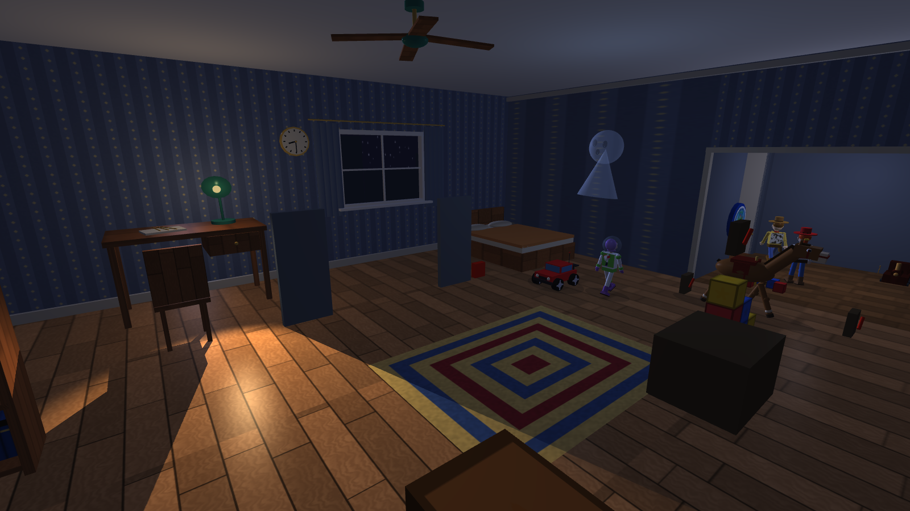

slot i target = Penny + back (1.7 + 1.3 floor(i/2)) ± 0.9 side
next node = firstStep[current][goal] (Floyd-Warshall)
jump lift = 0.75 sin(pi t/0.9); hour = h0 + (31 - h0) smoothstep(t/16) mod 24

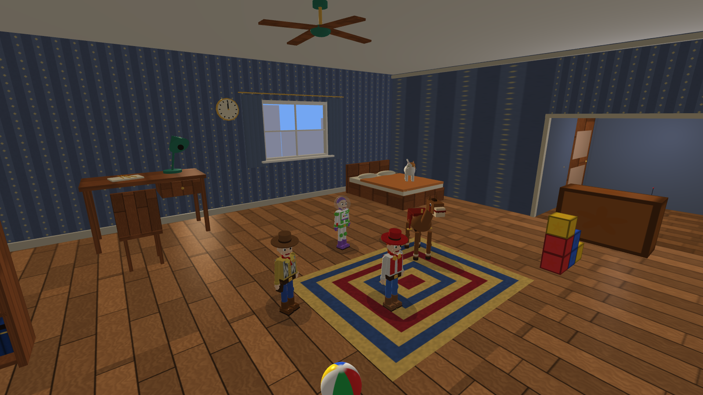

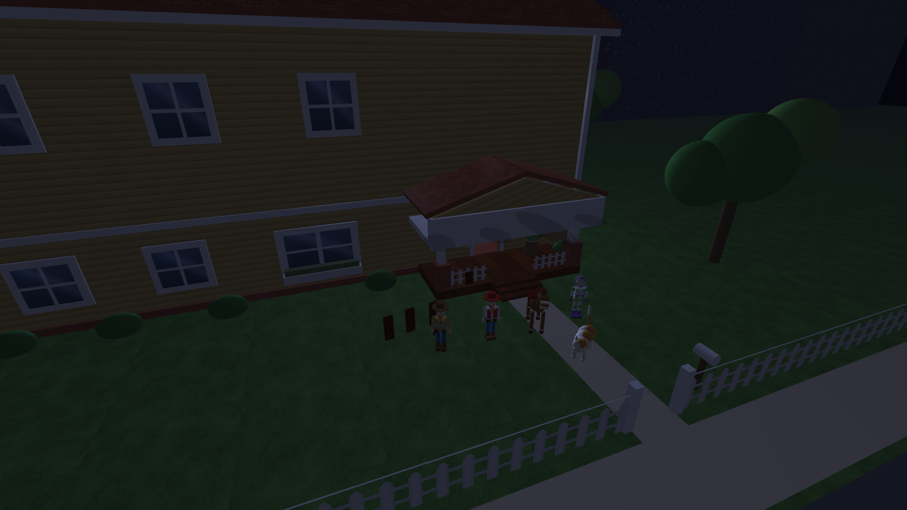

## 4.6 Collision and frame-time control

Moving actors and the camera use swept bounding boxes. Expanding an obstacle by the mover's half-size converts box movement into a segment/slab test. At contact the remaining motion loses its component into the contact normal, allowing sliding along furniture. Dynamic blocks use a fixed 1/120-second step with at most six steps per displayed frame. Gravity updates vertical speed, contact separation resolves overlaps and an impact transfers linear/angular velocity. This is a compact box approximation, not a full rigid-body constraint solver.

vYNext = vY - 9.81 step; pNext = p + v step
Expanded obstacle = [boxMin - moverHalf, boxMax + moverHalf]
slideDelta = delta - n min(0,delta·n)
Maximum physics work = 6 substeps × 1/120 s per frame

## 4.7 Optimisation decisions

Geometry buffers and materials are shared. Sphere detail levels contain 1656, 396 or 100 triangles; cylinder and cone levels use 32, 16 or 8 sectors. Projected-size estimates choose detail levels. Raster frustum planes cull only shapes whose conservative bounds are outside the view. Opaque draws are grouped within depth slices by material and mesh; transparent shapes are sorted far-to-near and disable depth writes. Uniform locations are cached. The shadow pass skips inactive lamps and tiny/out-of-cone shapes. The ray tracer reuses CPU vectors and avoids per-item general 4 × 4 inversion by deriving inverse rows from the normal matrix. A single texture array prevents per-map sampler growth.

LOD ratio = boundingRadius / distanceToEye
ratio < 0.012: low; ratio < 0.06: medium; otherwise full
Inverse affine row i = (normalMatrix column i, -dot(column i,translation))

Cinematic visibility removes the exterior during indoor play and restores it when the entrance breaks. The area light follows the camera: the upstairs hall light, the corridor lamp, the nightstand lamp in Buzz's room or the porch lantern. Surface patterns replace book-spine, fence and star geometry where a colour/coverage map is sufficient. Fixed physics work prevents stalls from scheduling unbounded catch-up work. Deterministic media capture uses a fixed simulation step and raw RGB frame recording; the media generator validates frame count before encoding. Benchmark timings are execution observations, not a guarantee for every environment.

Observed rendering timings

| Mode | Frames | ms/frame | FPS | Draws/frame | Geometry |
| --- | --- | --- | --- | --- | --- |
| Raster Blinn-Phong | 200 | 1.04 | 962.61 | 792 | 77172 |
| Ray tracing (0.5 scale, 2 bounces) | 200 | 7.99 | 125.09 | 2 fullscreen passes | Analytic primitives |

These observations use the final Release executable at 1600 × 900 with 60 warm-up frames followed by 200 timed frames, v-sync disabled, and a fixed manual room view. The two rendering paths use their normal settings. Ray statistics refer to full-screen passes, not the raster triangle counters. Timing is influenced by scene progression and concurrent system work; it is not an isolated before/after experiment.

## 4.8 Verification and achieved objectives

The final project is compiled in both Release and Debug configurations. The automated checks cover analytic intersections, normal perpendicularity, transform equivalence, shear-safe bounds, contact stability, laser impulse/occlusion, camera sliding, hallway access, the connected stairs, the porch and the Buzz bedroom doorway. A fixed-step rehearsal plays the whole story with real movement, mounting, jumps, interactions and contacts; it logs the real door hit and reaches free exploration only with all five characters outside, in all four raster shading modes, the ray tracer and the Debug build. Live-control runs confirm that driving one toy leaves the others unchanged. Captures exercise all three light types, term isolation, colour-texture toggling, analytic tracing, geometry debug views and object close-ups. The two-minute video is decoded after encoding to check media integrity.

Verification evidence

| Area | Method | Result |
| --- | --- | --- |
| Geometry / transforms / contacts | tests/PhysicsChecks.cpp | 63 checks passed |
| Manual + mounted + live input | Actual Windows key messages into GLFW callbacks | All three scenarios passed |
| Story completion | Fixed-step connected escape rehearsal | WIN; real door hit; all five actors outside |
| Rendering | 55 deterministic PNG captures; capture checks GL errors | All paths completed |
| Live takeover | Five ownership comparisons plus real key ownership/release checks | Owned transform retained; other route actions continue |
| Video | 2880 frames, 1280 × 720, 24 fps; complete decode | 120 seconds; passed |

# Conclusions

The project implements the recorded toy-room concept as a complete interactive scene and coordinated animation. Its geometry, transforms, hierarchy, lighting, shading, texture generation and analytic ray tracing are exposed through controls and supported by actual rendered examples. A shared scene/material model connects the raster and ray-traced views, while resource reuse, level of detail, visibility culling, bounded simulation work and BVH traversal keep the implementation practical for demonstration. The complete node and material inventories make individual object construction traceable.

The remaining design limits are specific: raster general shadows come from the lamp spotlight; ray shadows use selected sources and intensity thresholds; transparent rays continue straight; finite bounces close with local lighting; object interaction uses approximate boxes; and arbitrary affine edits are not a general-purpose rigging or reparenting system. Extensions could add refractive paths, broader shadow coverage or static/dynamic BVH separation, but these are separate enhancements to the implemented graphics scope.

# References

[1] M. Segal and K. Akeley, The OpenGL Graphics System: A Specification, Version 3.3 Core Profile, Khronos Group, 2010. https://registry.khronos.org/OpenGL/specs/gl/glspec33.core.pdf

[2] GLFW Project, GLFW 3.3 Documentation. https://www.glfw.org/docs/3.3/ (accessed Oct. 7, 2026).

[3] B. T. Phong, “Illumination for computer generated pictures,” Communications of the ACM, vol. 18, no. 6, pp. 311–317, 1975, doi: 10.1145/360825.360839.

[4] H. Gouraud, “Continuous shading of curved surfaces,” IEEE Transactions on Computers, vol. C-20, no. 6, pp. 623–629, 1971, doi: 10.1109/T-C.1971.223313.

[5] J. F. Blinn, “Models of light reflection for computer synthesized pictures,” Proceedings of SIGGRAPH, pp. 192–198, 1977, doi: 10.1145/563858.563893.

[6] T. Whitted, “An improved illumination model for shaded display,” Communications of the ACM, vol. 23, no. 6, pp. 343–349, 1980, doi: 10.1145/358876.358882.

[7] M. Pharr, W. Jakob and G. Humphreys, Physically Based Rendering: From Theory to Implementation, 4th ed., “Bounding Volume Hierarchies,” 2023. https://www.pbr-book.org/4ed/Primitives_and_Intersection_Acceleration/Bounding_Volume_Hierarchies

[8] G-Truc Creation, OpenGL Mathematics (GLM), source and documentation. https://github.com/g-truc/glm (accessed Oct. 7, 2026).

[9] D. Herberth, GLAD OpenGL loader generator, source. https://github.com/Dav1dde/glad (accessed Oct. 7, 2026).

[10] Pixar Animation Studios, Toy Story, 1995, and Toy Story 2, 1999. Visual character inspiration for the primitive-built toy cast. https://www.pixar.com/toy-story

The project uses the graphics concepts and public library interfaces cited above. Character names and recognisable colour/silhouette cues are inspired by Toy Story; the meshes are constructed locally from primitive builders rather than imported film assets. Scene screenshots are captured from the application, and explanatory diagrams are authored for this report. The poster is a locally generated image. The renderers, scene construction, procedural surface generators, BMP reader, object inspector and animation logic are project source implementations.

# Appendix A — Complete scene-node inventory

The exported scene contains 991 nodes, including 872 mesh-bearing shapes. The following tables include hidden scenery and non-rendered joints as well as visible objects. Shape counts include contact shadows, sky elements and duplicate decorative instances. Each local position, rotation and scale is relative to the parent identified by the path. Rotation uses (pitch,yaw,roll) in degrees. Bracketed indices distinguish sibling nodes with repeated names. Joint rows carry no material; their transform affects their descendants. The accompanying objects.csv also records world positions, collision/visibility flags, vertex/triangle counts, UV repeats and material coefficients.

## World

Construction records for World

| Relative node path | Shape / material | Position | Rotation° | Scale |
| --- | --- | --- | --- | --- |
| World | Joint | 0,0,0 | 0,0,0 | 1,1,1 |

## Room[0]

Construction records for Room[0]

| Relative node path | Shape / material | Position | Rotation° | Scale |
| --- | --- | --- | --- | --- |
| Room | Joint | 0,0,0 | 0,0,0 | 1,1,1 |
| Floor[0] | Plane / floor | 0,0,0 | 0,0,0 | 20,1,18 |
| Ceiling[1] | Plane / ceiling | 0,7.5,0 | 180,0,0 | 20,1,18 |
| LeftWall[2] | Plane / wall-side | -10,3.75,0 | 90,90,0 | 18,1,7.5 |
| RightWallPiece[3] | Plane / wall-side | 10,3.75,-4 | 90,-90,0 | 10,1,7.5 |
| RightWallPiece[4] | Plane / wall-side | 10,3.75,8 | 90,-90,0 | 2,1,7.5 |
| DoorLintel[5] | Plane / door-lintel | 10,6.15,4 | 90,-90,0 | 6,1,2.7 |
| HallFloor[6] | Plane / hall-floor | 13.5,0,4 | 0,0,0 | 7,1,6 |
| HallSide[7] | Cube / hall-wall | 13.5,2.4,7 | 0,0,0 | 7,4.8,0.16 |
| HallSide[8] | Cube / hall-wall | 11.8,2.4,1 | 0,0,0 | 3.5,4.8,0.16 |
| HallSide[9] | Cube / hall-wall | 16.8,2.4,1 | 0,0,0 | 0.5,4.8,0.16 |
| HallEnd[10] | Cube / hall-wall | 17,2.4,4 | 0,0,0 | 0.16,4.8,6 |
| HallCeiling[11] | Cube / hall-wall | 13.5,4.8,4 | 0,0,0 | 7,0.15,6 |
| DoorJamb[12] | Cube / door-frame | 10,2.4,1 | 0,0,0 | 0.22,4.8,0.18 |
| DoorJamb[13] | Cube / door-frame | 10,2.4,7 | 0,0,0 | 0.22,4.8,0.18 |
| DoorHeader[14] | Cube / door-frame | 10,4.8,4 | 0,0,0 | 0.22,0.18,6.2 |
| FrontWall[15] | Plane / wall-front | 0,3.75,9 | 90,180,0 | 20,1,7.5 |
| BackWallLeft[16] | Plane / wall-back-left | -4.75,3.75,-9 | 90,0,0 | 10.5,1,7.5 |
| BackWallRight[17] | Plane / wall-back-right | 7.25,3.75,-9 | 90,0,0 | 5.5,1,7.5 |
| BackWallBottom[18] | Plane / wall-back-bottom | 2.5,1.25,-9 | 90,0,0 | 4,1,2.5 |
| BackWallTop[19] | Plane / wall-back-top | 2.5,6.5,-9 | 90,0,0 | 4,1,2 |
| Window[20] | Joint | 0,0,0 | 0,0,0 | 1,1,1 |
| Window[20]/FrameTop[0] | Cube / window-frame | 2.5,5.5,-9 | 0,0,0 | 4.18,0.18,0.3 |
| Window[20]/FrameBottom[1] | Cube / window-frame | 2.5,2.5,-9 | 0,0,0 | 4.18,0.18,0.3 |
| Window[20]/FrameLeft[2] | Cube / window-frame | 0.5,4,-9 | 0,0,0 | 0.18,3,0.3 |
| Window[20]/FrameRight[3] | Cube / window-frame | 4.5,4,-9 | 0,0,0 | 0.18,3,0.3 |
| Window[20]/MullionV[4] | Cube / window-frame | 2.5,4,-9 | 0,0,0 | 0.07,3,0.08 |
| Window[20]/MullionH[5] | Cube / window-frame | 2.5,4,-9 | 0,0,0 | 4,0.07,0.08 |
| Window[20]/Sill[6] | Cube / window-frame | 2.5,2.45,-8.75 | 0,0,0 | 4.5,0.1,0.5 |
| Sky[21] | Plane / sky | 2.5,38.5,-40 | 90,0,0 | 300,1,90 |
| Sun[22] | Sphere / sun | 6.29,0.613,-20 | 0,0,0 | 2.4,2.4,2.4 |
| Moon[23] | Sphere / moon | 1.21,4.39,-20 | 0,-35,0 | 2.7,2.7,2.7 |
| Rug[24] | Plane / rug | 0.5,0.01,1.5 | 0,0,0 | 6,1,4.5 |
| Poster[25] | Plane / poster | -9.98,3.8,2.2 | 90,90,0 | 2,1,3 |
| ToyBlocks[26] | Joint | 0,0,0 | 0,0,0 | 1,1,1 |
| ToyBlocks[26]/DoorwayObstacle[0] | Cube / mission-crate | -9,1,6.9 | 0,0,0 | 1.2,2,3 |
| ToyBlocks[26]/Block0[1] | Cube / block-0 | 4.8,0.3,6.9 | 0,0,0 | 0.6,0.6,0.6 |
| ToyBlocks[26]/Block1[2] | Cube / block-1 | 5.42,0.3,6.9 | 0,0,0 | 0.6,0.6,0.6 |
| ToyBlocks[26]/Block2[3] | Cube / block-2 | 6.04,0.3,6.9 | 0,0,0 | 0.6,0.6,0.6 |
| ToyBlocks[26]/Block3[4] | Cube / block-3 | 4.8,0.899,6.9 | 0,0,0 | 0.6,0.6,0.6 |
| ToyBlocks[26]/Block4[5] | Cube / block-4 | 5.42,0.9,6.9 | 0,0,0 | 0.6,0.6,0.6 |
| ToyBlocks[26]/Block5[6] | Cube / block-5 | 4.8,1.5,6.9 | 0,0,0 | 0.6,0.6,0.6 |
| Desk[27] | Joint | -5,0,-7.6 | 0,0,0 | 1,1,1 |
| Desk[27]/Top[0] | Cube / desk-wood | 0,2.4,0 | 0,0,0 | 4,0.15,2 |
| Desk[27]/Leg0[1] | Cube / desk-wood | -1.85,1.2,-0.85 | 0,0,0 | 0.15,2.4,0.15 |
| Desk[27]/Leg1[2] | Cube / desk-wood | 1.85,1.2,-0.85 | 0,0,0 | 0.15,2.4,0.15 |
| Desk[27]/Leg2[3] | Cube / desk-wood | -1.85,1.2,0.85 | 0,0,0 | 0.15,2.4,0.15 |
| Desk[27]/Leg3[4] | Cube / desk-wood | 1.85,1.2,0.85 | 0,0,0 | 0.15,2.4,0.15 |
| Desk[27]/Drawer[5] | Cube / desk-wood | 1.1,2,0.05 | 0,0,0 | 1.5,0.6,1.7 |
| Desk[27]/Knob[6] | Sphere / brass | 1.1,2,0.88 | 0,0,0 | 0.12,0.12,0.12 |
| Desk[27]/Sketchbook[7] | Cube / paper | -0.65,2.52,0.25 | 0,12,0 | 1,0.055,0.7 |
| Desk[27]/Pencil0[8] | Cylinder / pencil | -0.8,2.56,0.12 | 90,12,0 | 0.025,0.75,0.025 |
| Desk[27]/Pencil1[9] | Cylinder / pencil | -0.65,2.56,0.12 | 90,20,0 | 0.025,0.75,0.025 |
| Desk[27]/Pencil2[10] | Cylinder / pencil | -0.5,2.56,0.12 | 90,28,0 | 0.025,0.75,0.025 |
| SkirtingSide[28] | Cube / room-trim | -9.94,0.15,0 | 0,0,0 | 0.12,0.3,18 |
| SkirtingEnd[29] | Cube / room-trim | 0,0.15,-8.94 | 0,0,0 | 20,0.3,0.12 |
| CrownSide[30] | Cube / room-trim | -9.92,7.35,0 | 0,0,0 | 0.16,0.2,18 |
| SkirtingEnd[31] | Cube / room-trim | 0,0.15,8.94 | 0,0,0 | 20,0.3,0.12 |
| CrownSide[32] | Cube / room-trim | 9.92,7.35,0 | 0,0,0 | 0.16,0.2,18 |
| CurtainFold[33] | Cylinder / curtain | -0.36,4,-8.78 | 0,0,0 | 0.3,3.6,0.15 |
| CurtainFold[34] | Cylinder / curtain | -0.12,4,-8.78 | 0,0,0 | 0.3,3.6,0.15 |
| CurtainFold[35] | Cylinder / curtain | 0.12,4,-8.78 | 0,0,0 | 0.3,3.6,0.15 |
| CurtainFold[36] | Cylinder / curtain | 0.36,4,-8.78 | 0,0,0 | 0.3,3.6,0.15 |
| CurtainFold[37] | Cylinder / curtain | 4.64,4,-8.78 | 0,0,0 | 0.3,3.6,0.15 |
| CurtainFold[38] | Cylinder / curtain | 4.88,4,-8.78 | 0,0,0 | 0.3,3.6,0.15 |
| CurtainFold[39] | Cylinder / curtain | 5.12,4,-8.78 | 0,0,0 | 0.3,3.6,0.15 |
| CurtainFold[40] | Cylinder / curtain | 5.36,4,-8.78 | 0,0,0 | 0.3,3.6,0.15 |
| CurtainRod[41] | Cylinder / brass | 2.5,5.9,-8.77 | 0,0,90 | 0.055,6.3,0.055 |
| Bed[42] | Joint | 7.2,0,-5.8 | 0,0,0 | 1,1,1 |
| Bed[42]/BedFrame[0] | Cube / desk-wood | 0,0.45,0 | 0,0,0 | 3.4,0.75,4.7 |
| Bed[42]/Mattress[1] | Cube / paper | 0,0.94,0 | 0,0,0 | 3.3,0.3,4.55 |
| Bed[42]/Blanket[2] | Cube / quilt | 0,1.1,0.55 | 0,0,0 | 3.36,0.12,3.45 |
| Bed[42]/Headboard[3] | Cube / desk-wood | 0,1,-2.35 | 0,0,0 | 3.6,1.8,0.18 |
| Bed[42]/Pillow[4] | Sphere / paper | -0.8,1.2,-1.5 | 0,0,0 | 1.4,0.3,0.9 |
| Bed[42]/Pillow[5] | Sphere / paper | 0.8,1.2,-1.5 | 0,0,0 | 1.4,0.3,0.9 |
| Bookcase[43] | Joint | -8.9,0,-1.5 | 0,0,0 | 1,1,1 |
| Bookcase[43]/Upright[0] | Cube / desk-wood | -0.9,1.75,0 | 0,0,0 | 0.12,3.5,1 |
| Bookcase[43]/Upright[1] | Cube / desk-wood | 0.9,1.75,0 | 0,0,0 | 0.12,3.5,1 |
| Bookcase[43]/Back[2] | Cube / desk-wood | 0,1.75,-0.47 | 0,0,0 | 1.8,3.5,0.08 |
| Bookcase[43]/Shelf[3] | Cube / desk-wood | 0,0.15,0 | 0,0,0 | 1.8,0.09,1 |
| Bookcase[43]/Books[4] | Cube / book-spines | 0,0.52,-0.1 | 0,0,0 | 1.56,0.66,0.56 |
| Bookcase[43]/Shelf[5] | Cube / desk-wood | 0,1.2,0 | 0,0,0 | 1.8,0.09,1 |
| Bookcase[43]/Books[6] | Cube / book-spines | 0,1.57,-0.1 | 0,0,0 | 1.56,0.66,0.56 |
| Bookcase[43]/Shelf[7] | Cube / desk-wood | 0,2.25,0 | 0,0,0 | 1.8,0.09,1 |
| Bookcase[43]/Books[8] | Cube / book-spines | 0,2.62,-0.1 | 0,0,0 | 1.56,0.66,0.56 |
| Bookcase[43]/Shelf[9] | Cube / desk-wood | 0,3.3,0 | 0,0,0 | 1.8,0.09,1 |
| Bookcase[43]/Books[10] | Cube / book-spines | 0,3.67,-0.1 | 0,0,0 | 1.56,0.66,0.56 |
| DistantHouse[44] | Cube / distant-roofs | -22,-0.75,-29 | 0,0,0 | 5,7.5,2 |
| DistantHouse[45] | Cube / distant-roofs | -16,0,-29 | 0,0,0 | 5,9,2 |
| DistantHouse[46] | Cube / distant-roofs | -10,0.75,-29 | 0,0,0 | 5,10.5,2 |
| DistantHouse[47] | Cube / distant-roofs | -4,-0.75,-29 | 0,0,0 | 5,7.5,2 |
| DistantHouse[48] | Cube / distant-roofs | 2,0,-29 | 0,0,0 | 5,9,2 |
| DistantHouse[49] | Cube / distant-roofs | 8,0.75,-29 | 0,0,0 | 5,10.5,2 |
| DistantHouse[50] | Cube / distant-roofs | 14,-0.75,-29 | 0,0,0 | 5,7.5,2 |
| DistantHouse[51] | Cube / distant-roofs | 20,0,-29 | 0,0,0 | 5,9,2 |
| DistantHouse[52] | Cube / distant-roofs | 26,0.75,-29 | 0,0,0 | 5,10.5,2 |
| CeilingFan[53] | Joint | -1.5,7.42,0 | 0,0,0 | 1,1,1 |
| CeilingFan[53]/Mount[0] | Cylinder / lamp-metal | 0,-0.06,0 | 0,0,0 | 0.36,0.12,0.36 |
| CeilingFan[53]/Shaft[1] | Cylinder / brass | 0,-0.35,0 | 0,0,0 | 0.08,0.55,0.08 |
| CeilingFan[53]/Rotor[2] | Joint | 0,-0.63,0 | 0,0,0 | 1,1,1 |
| CeilingFan[53]/Rotor[2]/Motor[0] | Sphere / lamp-metal | 0,0,0 | 0,0,0 | 0.5,0.25,0.5 |
| CeilingFan[53]/Rotor[2]/BladePivot0[1] | Joint | 0,0,0 | 0,0,0 | 1,1,1 |
| CeilingFan[53]/Rotor[2]/BladePivot0[1]/Blade[0] | Cube / desk-wood | 0.83,0,0 | 0,0,-4 | 1.35,0.045,0.3 |
| CeilingFan[53]/Rotor[2]/BladePivot1[2] | Joint | 0,0,0 | 0,90,0 | 1,1,1 |
| CeilingFan[53]/Rotor[2]/BladePivot1[2]/Blade[0] | Cube / desk-wood | 0.83,0,0 | 0,0,-4 | 1.35,0.045,0.3 |
| CeilingFan[53]/Rotor[2]/BladePivot2[3] | Joint | 0,0,0 | 0,180,0 | 1,1,1 |
| CeilingFan[53]/Rotor[2]/BladePivot2[3]/Blade[0] | Cube / desk-wood | 0.83,0,0 | 0,0,-4 | 1.35,0.045,0.3 |
| CeilingFan[53]/Rotor[2]/BladePivot3[4] | Joint | 0,0,0 | 0,270,0 | 1,1,1 |
| CeilingFan[53]/Rotor[2]/BladePivot3[4]/Blade[0] | Cube / desk-wood | 0.83,0,0 | 0,0,-4 | 1.35,0.045,0.3 |
| DeskChair[54] | Joint | -5.6,0,-4.8 | 0,0,0 | 1,1,1 |
| DeskChair[54]/Seat[0] | Cube / desk-wood | 0,1.15,0 | 0,0,0 | 1.15,0.12,1.05 |
| DeskChair[54]/Back[1] | Cube / desk-wood | 0,1.9,0.47 | 0,0,0 | 1.15,1.35,0.12 |
| DeskChair[54]/Leg[2] | Cube / desk-wood | -0.43,0.55,-0.38 | 0,0,0 | 0.1,1.1,0.1 |
| DeskChair[54]/Leg[3] | Cube / desk-wood | -0.43,0.55,0.38 | 0,0,0 | 0.1,1.1,0.1 |
| DeskChair[54]/Leg[4] | Cube / desk-wood | 0.43,0.55,-0.38 | 0,0,0 | 0.1,1.1,0.1 |
| DeskChair[54]/Leg[5] | Cube / desk-wood | 0.43,0.55,0.38 | 0,0,0 | 0.1,1.1,0.1 |
| WallClock[55] | Joint | -1.2,5.1,-8.84 | 0,0,0 | 1,1,1 |
| WallClock[55]/Rim[0] | Cylinder / brass | 0,0,0 | 90,0,0 | 1.05,0.12,1.05 |
| WallClock[55]/Face[1] | Cylinder / paper | 0,0,0.07 | 90,0,0 | 0.94,0.03,0.94 |
| WallClock[55]/HourMark[2] | Cube / clock-ink | 0,0.39,0.095 | 0,0,0 | 0.035,0.065,0.015 |
| WallClock[55]/HourMark[3] | Cube / clock-ink | 0.195,0.338,0.095 | 0,0,-30 | 0.035,0.065,0.015 |
| WallClock[55]/HourMark[4] | Cube / clock-ink | 0.338,0.195,0.095 | 0,0,-60 | 0.035,0.065,0.015 |
| WallClock[55]/HourMark[5] | Cube / clock-ink | 0.39,-1.7e-08,0.095 | 0,0,-90 | 0.035,0.065,0.015 |
| WallClock[55]/HourMark[6] | Cube / clock-ink | 0.338,-0.195,0.095 | 0,0,-120 | 0.035,0.065,0.015 |
| WallClock[55]/HourMark[7] | Cube / clock-ink | 0.195,-0.338,0.095 | 0,0,-150 | 0.035,0.065,0.015 |
| WallClock[55]/HourMark[8] | Cube / clock-ink | -3.41e-08,-0.39,0.095 | 0,0,-180 | 0.035,0.065,0.015 |
| WallClock[55]/HourMark[9] | Cube / clock-ink | -0.195,-0.338,0.095 | 0,0,-210 | 0.035,0.065,0.015 |
| WallClock[55]/HourMark[10] | Cube / clock-ink | -0.338,-0.195,0.095 | 0,0,-240 | 0.035,0.065,0.015 |
| WallClock[55]/HourMark[11] | Cube / clock-ink | -0.39,4.65e-09,0.095 | 0,0,-270 | 0.035,0.065,0.015 |
| WallClock[55]/HourMark[12] | Cube / clock-ink | -0.338,0.195,0.095 | 0,0,-300 | 0.035,0.065,0.015 |
| WallClock[55]/HourMark[13] | Cube / clock-ink | -0.195,0.338,0.095 | 0,0,-330 | 0.035,0.065,0.015 |
| WallClock[55]/HourHandPivot[14] | Joint | 0,0,0 | 0,0,-255 | 1,1,1 |
| WallClock[55]/HourHandPivot[14]/HourHand[0] | Cube / clock-ink | 0,0.12,0.115 | 0,0,0 | 0.045,0.27,0.02 |
| WallClock[55]/MinuteHandPivot[15] | Joint | 0,0,0 | 0,0,-180 | 1,1,1 |
| WallClock[55]/MinuteHandPivot[15]/MinuteHand[0] | Cube / clock-ink | 0,0.18,0.14 | 0,0,0 | 0.026,0.38,0.02 |
| WallClock[55]/Pin[16] | Sphere / brass | 0,0,0.17 | 0,0,0 | 0.075,0.075,0.075 |

## Lamp[1]

Construction records for Lamp[1]

| Relative node path | Shape / material | Position | Rotation° | Scale |
| --- | --- | --- | --- | --- |
| Lamp | Joint | -4,2.49,-7.9 | 0,20,0 | 1,1,1 |
| Base[0] | Cylinder / lamp-metal | 0,0.05,0 | 0,0,0 | 0.7,0.1,0.7 |
| ArmJoint[1] | Joint | 0,0.1,0 | 20,0,0 | 1,1,1 |
| ArmJoint[1]/Arm[0] | Cylinder / lamp-metal | 0,0.7,0 | 0,0,0 | 0.08,1.4,0.08 |
| ArmJoint[1]/Elbow[1] | Sphere / lamp-metal | 0,1.4,0 | 0,0,0 | 0.16,0.16,0.16 |
| ArmJoint[1]/HeadJoint[2] | Joint | 0,1.4,0 | -70,0,0 | 1,1,1 |
| ArmJoint[1]/HeadJoint[2]/Shade[0] | Cone / lamp-metal | 0,-0.1,0 | 0,0,0 | 0.8,0.6,0.8 |
| ArmJoint[1]/HeadJoint[2]/Bulb[1] | Sphere / bulb | 0,-0.5,0 | 0,0,0 | 0.22,0.22,0.22 |
| ArmJoint[1]/HeadJoint[2]/LightAnchor[2] | Joint | 0,-0.62,0 | 0,0,0 | 1,1,1 |

## Ball[2]

Construction records for Ball[2]

| Relative node path | Shape / material | Position | Rotation° | Scale |
| --- | --- | --- | --- | --- |
| Ball | Joint | -3.5,0.362,3.5 | 0,0,0 | 1,1,1 |
| BallShape[0] | Sphere / beach-ball | 0,0,0 | 0,0,0 | 0.7,0.7,0.7 |

## Ghost[3]

Construction records for Ghost[3]

| Relative node path | Shape / material | Position | Rotation° | Scale |
| --- | --- | --- | --- | --- |
| Ghost | Joint | 0.0187,4.21,2.5 | 0,90.2,0 | 1,1,1 |
| Body[0] | Joint | 0,0,0 | 0,0,0.147 | 1,1,1 |
| Body[0]/Head[0] | Sphere / ghost | 0,0.35,0 | 0,0,0 | 0.9,0.9,0.9 |
| Body[0]/Sheet[1] | Cone / ghost | 0,-0.35,0 | 0,0,0 | 1.1,1.3,1.1 |
| Body[0]/EyeL[2] | Sphere / ghost-eyes | -0.16,0.45,0.38 | 0,0,0 | 0.14,0.2,0.1 |
| Body[0]/EyeR[3] | Sphere / ghost-eyes | 0.16,0.45,0.38 | 0,0,0 | 0.14,0.2,0.1 |
| Body[0]/Mouth[4] | Sphere / ghost-eyes | 0,0.22,0.42 | 0,0,0 | 0.12,0.16,0.08 |

## Woody[4]

Construction records for Woody[4]

| Relative node path | Shape / material | Position | Rotation° | Scale |
| --- | --- | --- | --- | --- |
| Woody | Joint | -1.6,0.012,3.4 | 0,10,0 | 1,1,1 |
| Pelvis[0] | Joint | 0,0.85,0 | 0,0,0 | 1,1,1 |
| Pelvis[0]/Belt[0] | Cube / Woody-belt | 0,0.03,0 | 0,0,0 | 0.4,0.12,0.25 |
| Pelvis[0]/Buckle[1] | Cube / brass | 0,0.03,0.13 | 0,0,0 | 0.11,0.08,0.03 |
| Pelvis[0]/LeftHip[2] | Joint | 0.11,0,0 | 0,0,0 | 1,1,1 |
| Pelvis[0]/LeftHip[2]/Leg[0] | Cylinder / Woody-pants | 0,-0.31,0 | 0,0,0 | 0.15,0.62,0.15 |
| Pelvis[0]/LeftHip[2]/BootShaft[1] | Cylinder / Woody-boots | 0,-0.67,0 | 0,0,0 | 0.18,0.22,0.18 |
| Pelvis[0]/LeftHip[2]/Foot[2] | Cube / Woody-boots | 0,-0.8,0.05 | 0,0,0 | 0.18,0.1,0.3 |
| Pelvis[0]/LeftHip[2]/Knee[3] | Sphere / Woody-pants | 0,-0.34,0.035 | 0,0,0 | 0.155,0.16,0.13 |
| Pelvis[0]/LeftHip[2]/Sole[4] | Cube / boot-sole | 0,-0.848,0.055 | 0,0,0 | 0.19,0.025,0.32 |
| Pelvis[0]/LeftHip[2]/RoundedToe[5] | Sphere / Woody-boots | 0,-0.78,0.16 | 0,0,0 | 0.18,0.09,0.13 |
| Pelvis[0]/RightHip[3] | Joint | -0.11,0,0 | -0,0,0 | 1,1,1 |
| Pelvis[0]/RightHip[3]/Leg[0] | Cylinder / Woody-pants | 0,-0.31,0 | 0,0,0 | 0.15,0.62,0.15 |
| Pelvis[0]/RightHip[3]/BootShaft[1] | Cylinder / Woody-boots | 0,-0.67,0 | 0,0,0 | 0.18,0.22,0.18 |
| Pelvis[0]/RightHip[3]/Foot[2] | Cube / Woody-boots | 0,-0.8,0.05 | 0,0,0 | 0.18,0.1,0.3 |
| Pelvis[0]/RightHip[3]/Knee[3] | Sphere / Woody-pants | 0,-0.34,0.035 | 0,0,0 | 0.155,0.16,0.13 |
| Pelvis[0]/RightHip[3]/Sole[4] | Cube / boot-sole | 0,-0.848,0.055 | 0,0,0 | 0.19,0.025,0.32 |
| Pelvis[0]/RightHip[3]/RoundedToe[5] | Sphere / Woody-boots | 0,-0.78,0.16 | 0,0,0 | 0.18,0.09,0.13 |
| Pelvis[0]/Torso[4] | Joint | 0,0.09,0 | 0,0,0 | 1,1,1 |
| Pelvis[0]/Torso[4]/Chest[0] | Cube / Woody-shirt | 0,0.25,0 | 0,0,0 | 0.42,0.5,0.24 |
| Pelvis[0]/Torso[4]/VestLeft[1] | Cube / Woody-vest | 0.13,0.27,0.125 | 0,0,0 | 0.15,0.44,0.02 |
| Pelvis[0]/Torso[4]/VestRight[2] | Cube / Woody-vest | -0.13,0.27,0.125 | 0,0,0 | 0.15,0.44,0.02 |
| Pelvis[0]/Torso[4]/VestBack[3] | Cube / Woody-vest | 0,0.27,-0.125 | 0,0,0 | 0.43,0.44,0.02 |
| Pelvis[0]/Torso[4]/Neck[4] | Cylinder / Woody-skin | 0,0.54,0 | 0,0,0 | 0.1,0.1,0.1 |
| Pelvis[0]/Torso[4]/Collar[5] | Cube / Woody-collar | -0.075,0.47,0.14 | 0,0,-24 | 0.13,0.1,0.025 |
| Pelvis[0]/Torso[4]/Collar[6] | Cube / Woody-collar | 0.075,0.47,0.14 | 0,0,24 | 0.13,0.1,0.025 |
| Pelvis[0]/Torso[4]/Neckerchief[7] | Cylinder / Woody-scarf | 0,0.53,0 | 0,0,0 | 0.17,0.055,0.17 |
| Pelvis[0]/Torso[4]/ScarfKnot[8] | Sphere / Woody-scarf | 0,0.5,0.13 | 0,0,0 | 0.065,0.065,0.065 |
| Pelvis[0]/Torso[4]/ScarfTail[9] | Cone / Woody-scarf | 0.025,0.4,0.155 | 0,0,12 | 0.065,0.18,0.015 |
| Pelvis[0]/Torso[4]/SheriffBadge[10] | Cylinder / brass | 0.14,0.39,0.145 | 90,0,0 | 0.09,0.015,0.09 |
| Pelvis[0]/Torso[4]/LeftShoulder[11] | Joint | 0.27,0.46,0 | -0,0,6 | 1,1,1 |
| Pelvis[0]/Torso[4]/LeftShoulder[11]/UpperArm[0] | Cylinder / Woody-shirt | 0,-0.14,0 | 0,0,0 | 0.12,0.28,0.12 |
| Pelvis[0]/Torso[4]/LeftShoulder[11]/ShoulderBall[1] | Sphere / Woody-shirt | 0,0,0 | 0,0,0 | 0.13,0.13,0.13 |
| Pelvis[0]/Torso[4]/LeftShoulder[11]/Elbow[2] | Sphere / Woody-shirt | 0,-0.29,0 | 0,0,0 | 0.12,0.12,0.12 |
| Pelvis[0]/Torso[4]/LeftShoulder[11]/Forearm[3] | Cylinder / Woody-shirt | 0,-0.41,0 | 0,0,0 | 0.105,0.23,0.105 |
| Pelvis[0]/Torso[4]/LeftShoulder[11]/Cuff[4] | Cylinder / Woody-shirt | 0,-0.5,0 | 0,0,0 | 0.125,0.06,0.125 |
| Pelvis[0]/Torso[4]/LeftShoulder[11]/Hand[5] | Sphere / Woody-hands | 0,-0.57,0 | 0,0,0 | 0.13,0.14,0.09 |
| Pelvis[0]/Torso[4]/LeftShoulder[11]/Fingers[6] | Sphere / Woody-hands | -0.002,-0.63,0.022 | 0,0,0 | 0.12,0.09,0.06 |
| Pelvis[0]/Torso[4]/LeftShoulder[11]/Thumb[7] | Sphere / Woody-hands | 0.068,-0.565,0.025 | 0,0,0 | 0.06,0.065,0.05 |
| Pelvis[0]/Torso[4]/RightShoulder[12] | Joint | -0.27,0.46,0 | 0,0,-6 | 1,1,1 |
| Pelvis[0]/Torso[4]/RightShoulder[12]/UpperArm[0] | Cylinder / Woody-shirt | 0,-0.14,0 | 0,0,0 | 0.12,0.28,0.12 |
| Pelvis[0]/Torso[4]/RightShoulder[12]/ShoulderBall[1] | Sphere / Woody-shirt | 0,0,0 | 0,0,0 | 0.13,0.13,0.13 |
| Pelvis[0]/Torso[4]/RightShoulder[12]/Elbow[2] | Sphere / Woody-shirt | 0,-0.29,0 | 0,0,0 | 0.12,0.12,0.12 |
| Pelvis[0]/Torso[4]/RightShoulder[12]/Forearm[3] | Cylinder / Woody-shirt | 0,-0.41,0 | 0,0,0 | 0.105,0.23,0.105 |
| Pelvis[0]/Torso[4]/RightShoulder[12]/Cuff[4] | Cylinder / Woody-shirt | 0,-0.5,0 | 0,0,0 | 0.125,0.06,0.125 |
| Pelvis[0]/Torso[4]/RightShoulder[12]/Hand[5] | Sphere / Woody-hands | 0,-0.57,0 | 0,0,0 | 0.13,0.14,0.09 |
| Pelvis[0]/Torso[4]/RightShoulder[12]/Fingers[6] | Sphere / Woody-hands | -0.002,-0.63,0.022 | 0,0,0 | 0.12,0.09,0.06 |
| Pelvis[0]/Torso[4]/RightShoulder[12]/Thumb[7] | Sphere / Woody-hands | 0.068,-0.565,0.025 | 0,0,0 | 0.06,0.065,0.05 |
| Pelvis[0]/Torso[4]/Head[13] | Joint | 0,0.56,0 | 5.8,-23.9,0 | 1,1,1 |
| Pelvis[0]/Torso[4]/Head[13]/Skull[0] | Sphere / Woody-skin | 0,0.2,0 | 0,0,0 | 0.34,0.38,0.34 |
| Pelvis[0]/Torso[4]/Head[13]/EyeRight[1] | Sphere / eye-white | -0.07,0.24,0.145 | 0,0,0 | 0.08,0.09,0.05 |
| Pelvis[0]/Torso[4]/Head[13]/PupilRight[2] | Sphere / eye-pupil | -0.07,0.24,0.165 | 0,0,0 | 0.04,0.05,0.03 |
| Pelvis[0]/Torso[4]/Head[13]/EyeLeft[3] | Sphere / eye-white | 0.07,0.24,0.145 | 0,0,0 | 0.08,0.09,0.05 |
| Pelvis[0]/Torso[4]/Head[13]/PupilLeft[4] | Sphere / eye-pupil | 0.07,0.24,0.165 | 0,0,0 | 0.04,0.05,0.03 |
| Pelvis[0]/Torso[4]/Head[13]/Nose[5] | Sphere / Woody-skin | 0,0.18,0.17 | 0,0,0 | 0.055,0.055,0.055 |
| Pelvis[0]/Torso[4]/Head[13]/Mouth[6] | Cube / mouth | 0,0.1,0.15 | 0,0,0 | 0.1,0.02,0.03 |
| Pelvis[0]/Torso[4]/Head[13]/Ear[7] | Sphere / Woody-skin | -0.17,0.2,0 | 0,0,0 | 0.07,0.11,0.055 |
| Pelvis[0]/Torso[4]/Head[13]/Iris[8] | Sphere / Woody-iris | -0.07,0.24,0.168 | 0,0,0 | 0.046,0.052,0.014 |
| Pelvis[0]/Torso[4]/Head[13]/Eyebrow[9] | Cube / Woody-hair | -0.072,0.303,0.146 | 0,0,-9 | 0.079,0.016,0.019 |
| Pelvis[0]/Torso[4]/Head[13]/Cheek[10] | Sphere / Woody-skin | -0.095,0.14,0.12 | 0,0,0 | 0.09,0.075,0.06 |
| Pelvis[0]/Torso[4]/Head[13]/Ear[11] | Sphere / Woody-skin | 0.17,0.2,0 | 0,0,0 | 0.07,0.11,0.055 |
| Pelvis[0]/Torso[4]/Head[13]/Iris[12] | Sphere / Woody-iris | 0.07,0.24,0.168 | 0,0,0 | 0.046,0.052,0.014 |
| Pelvis[0]/Torso[4]/Head[13]/Eyebrow[13] | Cube / Woody-hair | 0.072,0.303,0.146 | 0,0,9 | 0.079,0.016,0.019 |
| Pelvis[0]/Torso[4]/Head[13]/Cheek[14] | Sphere / Woody-skin | 0.095,0.14,0.12 | 0,0,0 | 0.09,0.075,0.06 |
| Pelvis[0]/Torso[4]/Head[13]/ChinDetail[15] | Sphere / Woody-skin | 0,0.04,0.11 | 0,0,0 | 0.17,0.075,0.09 |
| Pelvis[0]/Torso[4]/Head[13]/Hair[16] | Sphere / Woody-hair | 0,0.27,-0.035 | 0,0,0 | 0.36,0.32,0.35 |
| Pelvis[0]/Torso[4]/Head[13]/HatBrim[17] | Cylinder / Woody-hat | 0,0.38,0 | 0,0,0 | 0.66,0.03,0.66 |
| Pelvis[0]/Torso[4]/Head[13]/HatCrown[18] | Cylinder / Woody-hat | 0,0.49,0 | 0,0,0 | 0.3,0.2,0.3 |
| Pelvis[0]/Torso[4]/Head[13]/HatBand[19] | Cylinder / Woody-belt | 0,0.42,0 | 0,0,0 | 0.31,0.04,0.31 |
| Pelvis[0]/Holster[5] | Cube / Woody-belt | -0.24,-0.1,0 | 0,0,-12 | 0.09,0.23,0.15 |

## Jessie[5]

Construction records for Jessie[5]

| Relative node path | Shape / material | Position | Rotation° | Scale |
| --- | --- | --- | --- | --- |
| Jessie | Joint | 0.7,0.012,3.7 | 0,-5,0 | 1,1,1 |
| Pelvis[0] | Joint | 0,0.85,0 | 0,0,0 | 1,1,1 |
| Pelvis[0]/Belt[0] | Cube / Jessie-belt | 0,0.03,0 | 0,0,0 | 0.4,0.12,0.25 |
| Pelvis[0]/Buckle[1] | Cube / brass | 0,0.03,0.13 | 0,0,0 | 0.11,0.08,0.03 |
| Pelvis[0]/LeftHip[2] | Joint | 0.11,0,0 | 0,0,0 | 1,1,1 |
| Pelvis[0]/LeftHip[2]/Leg[0] | Cylinder / Jessie-pants | 0,-0.31,0 | 0,0,0 | 0.15,0.62,0.15 |
| Pelvis[0]/LeftHip[2]/BootShaft[1] | Cylinder / Jessie-boots | 0,-0.67,0 | 0,0,0 | 0.18,0.22,0.18 |
| Pelvis[0]/LeftHip[2]/Foot[2] | Cube / Jessie-boots | 0,-0.8,0.05 | 0,0,0 | 0.18,0.1,0.3 |
| Pelvis[0]/LeftHip[2]/Knee[3] | Sphere / Jessie-pants | 0,-0.34,0.035 | 0,0,0 | 0.155,0.16,0.13 |
| Pelvis[0]/LeftHip[2]/Sole[4] | Cube / boot-sole | 0,-0.848,0.055 | 0,0,0 | 0.19,0.025,0.32 |
| Pelvis[0]/LeftHip[2]/RoundedToe[5] | Sphere / Jessie-boots | 0,-0.78,0.16 | 0,0,0 | 0.18,0.09,0.13 |
| Pelvis[0]/RightHip[3] | Joint | -0.11,0,0 | -0,0,0 | 1,1,1 |
| Pelvis[0]/RightHip[3]/Leg[0] | Cylinder / Jessie-pants | 0,-0.31,0 | 0,0,0 | 0.15,0.62,0.15 |
| Pelvis[0]/RightHip[3]/BootShaft[1] | Cylinder / Jessie-boots | 0,-0.67,0 | 0,0,0 | 0.18,0.22,0.18 |
| Pelvis[0]/RightHip[3]/Foot[2] | Cube / Jessie-boots | 0,-0.8,0.05 | 0,0,0 | 0.18,0.1,0.3 |
| Pelvis[0]/RightHip[3]/Knee[3] | Sphere / Jessie-pants | 0,-0.34,0.035 | 0,0,0 | 0.155,0.16,0.13 |
| Pelvis[0]/RightHip[3]/Sole[4] | Cube / boot-sole | 0,-0.848,0.055 | 0,0,0 | 0.19,0.025,0.32 |
| Pelvis[0]/RightHip[3]/RoundedToe[5] | Sphere / Jessie-boots | 0,-0.78,0.16 | 0,0,0 | 0.18,0.09,0.13 |
| Pelvis[0]/Torso[4] | Joint | 0,0.09,0 | 0,0,0 | 1,1,1 |
| Pelvis[0]/Torso[4]/Chest[0] | Cube / Jessie-shirt | 0,0.25,0 | 0,0,0 | 0.42,0.5,0.24 |
| Pelvis[0]/Torso[4]/VestLeft[1] | Cube / Jessie-vest | 0.13,0.27,0.125 | 0,0,0 | 0.15,0.44,0.02 |
| Pelvis[0]/Torso[4]/VestRight[2] | Cube / Jessie-vest | -0.13,0.27,0.125 | 0,0,0 | 0.15,0.44,0.02 |
| Pelvis[0]/Torso[4]/VestBack[3] | Cube / Jessie-vest | 0,0.27,-0.125 | 0,0,0 | 0.43,0.44,0.02 |
| Pelvis[0]/Torso[4]/Neck[4] | Cylinder / Jessie-skin | 0,0.54,0 | 0,0,0 | 0.1,0.1,0.1 |
| Pelvis[0]/Torso[4]/Collar[5] | Cube / Jessie-collar | -0.075,0.47,0.14 | 0,0,-24 | 0.13,0.1,0.025 |
| Pelvis[0]/Torso[4]/Collar[6] | Cube / Jessie-collar | 0.075,0.47,0.14 | 0,0,24 | 0.13,0.1,0.025 |
| Pelvis[0]/Torso[4]/Neckerchief[7] | Cylinder / Jessie-scarf | 0,0.53,0 | 0,0,0 | 0.17,0.055,0.17 |
| Pelvis[0]/Torso[4]/ScarfKnot[8] | Sphere / Jessie-scarf | 0,0.5,0.13 | 0,0,0 | 0.065,0.065,0.065 |
| Pelvis[0]/Torso[4]/ScarfTail[9] | Cone / Jessie-scarf | 0.025,0.4,0.155 | 0,0,12 | 0.065,0.18,0.015 |
| Pelvis[0]/Torso[4]/LeftShoulder[10] | Joint | 0.27,0.46,0 | -0,0,6 | 1,1,1 |
| Pelvis[0]/Torso[4]/LeftShoulder[10]/UpperArm[0] | Cylinder / Jessie-shirt | 0,-0.14,0 | 0,0,0 | 0.12,0.28,0.12 |
| Pelvis[0]/Torso[4]/LeftShoulder[10]/ShoulderBall[1] | Sphere / Jessie-shirt | 0,0,0 | 0,0,0 | 0.13,0.13,0.13 |
| Pelvis[0]/Torso[4]/LeftShoulder[10]/Elbow[2] | Sphere / Jessie-shirt | 0,-0.29,0 | 0,0,0 | 0.12,0.12,0.12 |
| Pelvis[0]/Torso[4]/LeftShoulder[10]/Forearm[3] | Cylinder / Jessie-shirt | 0,-0.41,0 | 0,0,0 | 0.105,0.23,0.105 |
| Pelvis[0]/Torso[4]/LeftShoulder[10]/Cuff[4] | Cylinder / Jessie-shirt | 0,-0.5,0 | 0,0,0 | 0.125,0.06,0.125 |
| Pelvis[0]/Torso[4]/LeftShoulder[10]/Hand[5] | Sphere / Jessie-hands | 0,-0.57,0 | 0,0,0 | 0.13,0.14,0.09 |
| Pelvis[0]/Torso[4]/LeftShoulder[10]/Fingers[6] | Sphere / Jessie-hands | -0.002,-0.63,0.022 | 0,0,0 | 0.12,0.09,0.06 |
| Pelvis[0]/Torso[4]/LeftShoulder[10]/Thumb[7] | Sphere / Jessie-hands | 0.068,-0.565,0.025 | 0,0,0 | 0.06,0.065,0.05 |
| Pelvis[0]/Torso[4]/RightShoulder[11] | Joint | -0.27,0.46,0 | 0,0,-6 | 1,1,1 |
| Pelvis[0]/Torso[4]/RightShoulder[11]/UpperArm[0] | Cylinder / Jessie-shirt | 0,-0.14,0 | 0,0,0 | 0.12,0.28,0.12 |
| Pelvis[0]/Torso[4]/RightShoulder[11]/ShoulderBall[1] | Sphere / Jessie-shirt | 0,0,0 | 0,0,0 | 0.13,0.13,0.13 |
| Pelvis[0]/Torso[4]/RightShoulder[11]/Elbow[2] | Sphere / Jessie-shirt | 0,-0.29,0 | 0,0,0 | 0.12,0.12,0.12 |
| Pelvis[0]/Torso[4]/RightShoulder[11]/Forearm[3] | Cylinder / Jessie-shirt | 0,-0.41,0 | 0,0,0 | 0.105,0.23,0.105 |
| Pelvis[0]/Torso[4]/RightShoulder[11]/Cuff[4] | Cylinder / Jessie-shirt | 0,-0.5,0 | 0,0,0 | 0.125,0.06,0.125 |
| Pelvis[0]/Torso[4]/RightShoulder[11]/Hand[5] | Sphere / Jessie-hands | 0,-0.57,0 | 0,0,0 | 0.13,0.14,0.09 |
| Pelvis[0]/Torso[4]/RightShoulder[11]/Fingers[6] | Sphere / Jessie-hands | -0.002,-0.63,0.022 | 0,0,0 | 0.12,0.09,0.06 |
| Pelvis[0]/Torso[4]/RightShoulder[11]/Thumb[7] | Sphere / Jessie-hands | 0.068,-0.565,0.025 | 0,0,0 | 0.06,0.065,0.05 |
| Pelvis[0]/Torso[4]/Head[12] | Joint | 0,0.56,0 | 5.8,-6.74,0 | 1,1,1 |
| Pelvis[0]/Torso[4]/Head[12]/Skull[0] | Sphere / Jessie-skin | 0,0.2,0 | 0,0,0 | 0.34,0.38,0.34 |
| Pelvis[0]/Torso[4]/Head[12]/EyeRight[1] | Sphere / eye-white | -0.07,0.24,0.145 | 0,0,0 | 0.08,0.09,0.05 |
| Pelvis[0]/Torso[4]/Head[12]/PupilRight[2] | Sphere / eye-pupil | -0.07,0.24,0.165 | 0,0,0 | 0.04,0.05,0.03 |
| Pelvis[0]/Torso[4]/Head[12]/EyeLeft[3] | Sphere / eye-white | 0.07,0.24,0.145 | 0,0,0 | 0.08,0.09,0.05 |
| Pelvis[0]/Torso[4]/Head[12]/PupilLeft[4] | Sphere / eye-pupil | 0.07,0.24,0.165 | 0,0,0 | 0.04,0.05,0.03 |
| Pelvis[0]/Torso[4]/Head[12]/Nose[5] | Sphere / Jessie-skin | 0,0.18,0.17 | 0,0,0 | 0.055,0.055,0.055 |
| Pelvis[0]/Torso[4]/Head[12]/Mouth[6] | Cube / mouth | 0,0.1,0.15 | 0,0,0 | 0.1,0.02,0.03 |
| Pelvis[0]/Torso[4]/Head[12]/Ear[7] | Sphere / Jessie-skin | -0.17,0.2,0 | 0,0,0 | 0.07,0.11,0.055 |
| Pelvis[0]/Torso[4]/Head[12]/Iris[8] | Sphere / Jessie-iris | -0.07,0.24,0.168 | 0,0,0 | 0.046,0.052,0.014 |
| Pelvis[0]/Torso[4]/Head[12]/Eyebrow[9] | Cube / Jessie-hair | -0.072,0.303,0.146 | 0,0,-9 | 0.079,0.016,0.019 |
| Pelvis[0]/Torso[4]/Head[12]/Cheek[10] | Sphere / Jessie-skin | -0.095,0.14,0.12 | 0,0,0 | 0.09,0.075,0.06 |
| Pelvis[0]/Torso[4]/Head[12]/Ear[11] | Sphere / Jessie-skin | 0.17,0.2,0 | 0,0,0 | 0.07,0.11,0.055 |
| Pelvis[0]/Torso[4]/Head[12]/Iris[12] | Sphere / Jessie-iris | 0.07,0.24,0.168 | 0,0,0 | 0.046,0.052,0.014 |
| Pelvis[0]/Torso[4]/Head[12]/Eyebrow[13] | Cube / Jessie-hair | 0.072,0.303,0.146 | 0,0,9 | 0.079,0.016,0.019 |
| Pelvis[0]/Torso[4]/Head[12]/Cheek[14] | Sphere / Jessie-skin | 0.095,0.14,0.12 | 0,0,0 | 0.09,0.075,0.06 |
| Pelvis[0]/Torso[4]/Head[12]/ChinDetail[15] | Sphere / Jessie-skin | 0,0.04,0.11 | 0,0,0 | 0.17,0.075,0.09 |
| Pelvis[0]/Torso[4]/Head[12]/Hair[16] | Sphere / Jessie-hair | 0,0.27,-0.035 | 0,0,0 | 0.36,0.32,0.35 |
| Pelvis[0]/Torso[4]/Head[12]/Braid[17] | Joint | 0,0.22,-0.17 | -12,0,0 | 1,1,1 |
| Pelvis[0]/Torso[4]/Head[12]/Braid[17]/Plait[0] | Cylinder / Jessie-plait | 0,-0.28,0 | 0,0,0 | 0.12,0.56,0.12 |
| Pelvis[0]/Torso[4]/Head[12]/Braid[17]/Bow[1] | Sphere / hair-bow | 0,-0.02,-0.02 | 0,0,0 | 0.16,0.09,0.09 |
| Pelvis[0]/Torso[4]/Head[12]/Braid[17]/Tip[2] | Sphere / Jessie-hair | 0,-0.58,0 | 0,0,0 | 0.12,0.12,0.12 |
| Pelvis[0]/Torso[4]/Head[12]/HatBrim[18] | Cylinder / Jessie-hat | 0,0.38,0 | 0,0,0 | 0.66,0.03,0.66 |
| Pelvis[0]/Torso[4]/Head[12]/HatCrown[19] | Cylinder / Jessie-hat | 0,0.49,0 | 0,0,0 | 0.3,0.2,0.3 |
| Pelvis[0]/Torso[4]/Head[12]/HatBand[20] | Cylinder / Jessie-belt | 0,0.42,0 | 0,0,0 | 0.31,0.04,0.31 |

## Bullseye[6]

Construction records for Bullseye[6]

| Relative node path | Shape / material | Position | Rotation° | Scale |
| --- | --- | --- | --- | --- |
| Bullseye | Joint | 3.4,0.012,3.1 | 0,60,0 | 1,1,1 |
| Body[0] | Joint | 0,0,0 | 0,0,0 | 1,1,1 |
| Body[0]/Barrel[0] | Sphere / horse-coat | 0,1.25,0 | 0,0,0 | 0.72,0.66,1.5 |
| Body[0]/Belly[1] | Sphere / horse-muzzle | 0,1.08,0 | 0,0,0 | 0.5,0.3,1 |
| Body[0]/Saddle[2] | Joint | 0,1.55,0 | 0,0,0 | 1,1,1 |
| Body[0]/Saddle[2]/SaddlePad[0] | Cube / saddle | 0,0,0 | 0,0,0 | 0.62,0.1,0.62 |
| Body[0]/Saddle[2]/SaddleFlapL[1] | Cube / saddle | 0.33,-0.18,0 | 0,0,0 | 0.05,0.35,0.4 |
| Body[0]/Saddle[2]/SaddleFlapR[2] | Cube / saddle | -0.33,-0.18,0 | 0,0,0 | 0.05,0.35,0.4 |
| Body[0]/Saddle[2]/Horn[3] | Cylinder / brass | 0,0.1,0.26 | 0,0,0 | 0.07,0.16,0.07 |
| Body[0]/Saddle[2]/StirrupStrap[4] | Cube / saddle | -0.36,-0.3,0.12 | 0,0,0 | 0.035,0.52,0.035 |
| Body[0]/Saddle[2]/StirrupBase[5] | Cube / brass | -0.36,-0.57,0.12 | 0,0,0 | 0.16,0.025,0.13 |
| Body[0]/Saddle[2]/StirrupStrap[6] | Cube / saddle | 0.36,-0.3,0.12 | 0,0,0 | 0.035,0.52,0.035 |
| Body[0]/Saddle[2]/StirrupBase[7] | Cube / brass | 0.36,-0.57,0.12 | 0,0,0 | 0.16,0.025,0.13 |
| Body[0]/Saddle[2]/Seat[8] | Joint | 0,0.06,-0.05 | 0,0,0 | 1,1,1 |
| Body[0]/Neck[3] | Joint | 0,1.42,0.62 | 35,0,0 | 1,1,1 |
| Body[0]/Neck[3]/NeckShape[0] | Cylinder / horse-coat | 0,0.38,0 | 0,0,0 | 0.3,0.8,0.34 |
| Body[0]/Neck[3]/Mane[1] | Cube / horse-mane | 0,0.42,-0.16 | 0,0,0 | 0.07,0.85,0.12 |
| Body[0]/Neck[3]/Head[2] | Joint | 0,0.8,0 | -35,0.167,0 | 1,1,1 |
| Body[0]/Neck[3]/Head[2]/Skull[0] | Cube / horse-coat | 0,0.05,0.2 | 0,0,0 | 0.32,0.32,0.55 |
| Body[0]/Neck[3]/Head[2]/Muzzle[1] | Cube / horse-muzzle | 0,-0.02,0.5 | 0,0,0 | 0.28,0.26,0.26 |
| Body[0]/Neck[3]/Head[2]/NostrilL[2] | Sphere / horse-hoof | 0.07,0,0.63 | 0,0,0 | 0.05,0.05,0.05 |
| Body[0]/Neck[3]/Head[2]/NostrilR[3] | Sphere / horse-hoof | -0.07,0,0.63 | 0,0,0 | 0.05,0.05,0.05 |
| Body[0]/Neck[3]/Head[2]/EyeR[4] | Sphere / eye-white | -0.165,0.12,0.25 | 0,0,0 | 0.04,0.1,0.1 |
| Body[0]/Neck[3]/Head[2]/PupilR[5] | Sphere / eye-pupil | -0.18,0.12,0.27 | 0,0,0 | 0.03,0.06,0.06 |
| Body[0]/Neck[3]/Head[2]/EarR[6] | Cone / horse-coat | -0.1,0.3,0.02 | 0,0,0 | 0.1,0.22,0.08 |
| Body[0]/Neck[3]/Head[2]/EyeL[7] | Sphere / eye-white | 0.165,0.12,0.25 | 0,0,0 | 0.04,0.1,0.1 |
| Body[0]/Neck[3]/Head[2]/PupilL[8] | Sphere / eye-pupil | 0.18,0.12,0.27 | 0,0,0 | 0.03,0.06,0.06 |
| Body[0]/Neck[3]/Head[2]/EarL[9] | Cone / horse-coat | 0.1,0.3,0.02 | 0,0,0 | 0.1,0.22,0.08 |
| Body[0]/Neck[3]/Head[2]/Forelock[10] | Cube / horse-mane | 0,0.23,0.12 | 0,0,0 | 0.1,0.06,0.2 |
| Body[0]/Neck[3]/Head[2]/BridleNose[11] | Cube / saddle | 0,0.02,0.52 | 0,0,0 | 0.3,0.045,0.27 |
| Body[0]/Neck[3]/Head[2]/CheekStrap[12] | Cube / saddle | -0.172,0.03,0.25 | 0,0,0 | 0.025,0.24,0.045 |
| Body[0]/Neck[3]/Head[2]/CheekStrap[13] | Cube / saddle | 0.172,0.03,0.25 | 0,0,0 | 0.025,0.24,0.045 |
| Body[0]/Tail[4] | Joint | 0,1.42,-0.72 | -30,0,0.833 | 1,1,1 |
| Body[0]/Tail[4]/TailShape[0] | Cylinder / horse-mane | 0,-0.35,0 | 0,0,0 | 0.1,0.7,0.1 |
| Body[0]/Tail[4]/TailTip[1] | Cone / horse-mane | 0,-0.8,0 | 180,0,0 | 0.18,0.3,0.18 |
| Body[0]/FrontLeftHip[5] | Joint | 0.22,1,0.5 | 0,0,0 | 1,1,1 |
| Body[0]/FrontLeftHip[5]/Leg[0] | Cylinder / horse-coat | 0,-0.45,0 | 0,0,0 | 0.15,0.9,0.15 |
| Body[0]/FrontLeftHip[5]/Hoof[1] | Cylinder / horse-hoof | 0,-0.95,0 | 0,0,0 | 0.18,0.1,0.18 |
| Body[0]/FrontLeftHip[5]/Fetlock[2] | Sphere / horse-muzzle | 0,-0.82,0 | 0,0,0 | 0.18,0.14,0.18 |
| Body[0]/FrontLeftHip[5]/Knee[3] | Sphere / horse-coat | 0,-0.47,0.025 | 0,0,0 | 0.18,0.16,0.18 |
| Body[0]/FrontRightHip[6] | Joint | -0.22,1,0.5 | -0,0,0 | 1,1,1 |
| Body[0]/FrontRightHip[6]/Leg[0] | Cylinder / horse-coat | 0,-0.45,0 | 0,0,0 | 0.15,0.9,0.15 |
| Body[0]/FrontRightHip[6]/Hoof[1] | Cylinder / horse-hoof | 0,-0.95,0 | 0,0,0 | 0.18,0.1,0.18 |
| Body[0]/FrontRightHip[6]/Fetlock[2] | Sphere / horse-muzzle | 0,-0.82,0 | 0,0,0 | 0.18,0.14,0.18 |
| Body[0]/FrontRightHip[6]/Knee[3] | Sphere / horse-coat | 0,-0.47,0.025 | 0,0,0 | 0.18,0.16,0.18 |
| Body[0]/BackLeftHip[7] | Joint | 0.22,1,-0.5 | -0,0,0 | 1,1,1 |
| Body[0]/BackLeftHip[7]/Leg[0] | Cylinder / horse-coat | 0,-0.45,0 | 0,0,0 | 0.15,0.9,0.15 |
| Body[0]/BackLeftHip[7]/Hoof[1] | Cylinder / horse-hoof | 0,-0.95,0 | 0,0,0 | 0.18,0.1,0.18 |
| Body[0]/BackLeftHip[7]/Fetlock[2] | Sphere / horse-muzzle | 0,-0.82,0 | 0,0,0 | 0.18,0.14,0.18 |
| Body[0]/BackLeftHip[7]/Knee[3] | Sphere / horse-coat | 0,-0.47,0.025 | 0,0,0 | 0.18,0.16,0.18 |
| Body[0]/BackRightHip[8] | Joint | -0.22,1,-0.5 | 0,0,0 | 1,1,1 |
| Body[0]/BackRightHip[8]/Leg[0] | Cylinder / horse-coat | 0,-0.45,0 | 0,0,0 | 0.15,0.9,0.15 |
| Body[0]/BackRightHip[8]/Hoof[1] | Cylinder / horse-hoof | 0,-0.95,0 | 0,0,0 | 0.18,0.1,0.18 |
| Body[0]/BackRightHip[8]/Fetlock[2] | Sphere / horse-muzzle | 0,-0.82,0 | 0,0,0 | 0.18,0.14,0.18 |
| Body[0]/BackRightHip[8]/Knee[3] | Sphere / horse-coat | 0,-0.47,0.025 | 0,0,0 | 0.18,0.16,0.18 |

## Buzz[7]

Construction records for Buzz[7]

| Relative node path | Shape / material | Position | Rotation° | Scale |
| --- | --- | --- | --- | --- |
| Buzz | Joint | -3.4,0.012,0.4 | 0,35,0 | 1,1,1 |
| Pelvis[0] | Joint | 0,0.85,0 | 0,0,0 | 1,1,1 |
| Pelvis[0]/Belt[0] | Cube / Buzz-belt | 0,0.03,0 | 0,0,0 | 0.4,0.12,0.25 |
| Pelvis[0]/Buckle[1] | Cube / brass | 0,0.03,0.13 | 0,0,0 | 0.11,0.08,0.03 |
| Pelvis[0]/LeftHip[2] | Joint | 0.11,0,0 | 0,0,0 | 1,1,1 |
| Pelvis[0]/LeftHip[2]/Leg[0] | Cylinder / Buzz-pants | 0,-0.31,0 | 0,0,0 | 0.15,0.62,0.15 |
| Pelvis[0]/LeftHip[2]/BootShaft[1] | Cylinder / Buzz-boots | 0,-0.67,0 | 0,0,0 | 0.18,0.22,0.18 |
| Pelvis[0]/LeftHip[2]/Foot[2] | Cube / Buzz-boots | 0,-0.8,0.05 | 0,0,0 | 0.18,0.1,0.3 |
| Pelvis[0]/LeftHip[2]/Knee[3] | Sphere / Buzz-pants | 0,-0.34,0.035 | 0,0,0 | 0.155,0.16,0.13 |
| Pelvis[0]/LeftHip[2]/Sole[4] | Cube / boot-sole | 0,-0.848,0.055 | 0,0,0 | 0.19,0.025,0.32 |
| Pelvis[0]/LeftHip[2]/RoundedToe[5] | Sphere / Buzz-boots | 0,-0.78,0.16 | 0,0,0 | 0.18,0.09,0.13 |
| Pelvis[0]/LeftHip[2]/KneeArmor[6] | Sphere / Buzz-vest | 0,-0.34,0.06 | 0,0,0 | 0.16,0.16,0.12 |
| Pelvis[0]/RightHip[3] | Joint | -0.11,0,0 | 0,0,0 | 1,1,1 |
| Pelvis[0]/RightHip[3]/Leg[0] | Cylinder / Buzz-pants | 0,-0.31,0 | 0,0,0 | 0.15,0.62,0.15 |
| Pelvis[0]/RightHip[3]/BootShaft[1] | Cylinder / Buzz-boots | 0,-0.67,0 | 0,0,0 | 0.18,0.22,0.18 |
| Pelvis[0]/RightHip[3]/Foot[2] | Cube / Buzz-boots | 0,-0.8,0.05 | 0,0,0 | 0.18,0.1,0.3 |
| Pelvis[0]/RightHip[3]/Knee[3] | Sphere / Buzz-pants | 0,-0.34,0.035 | 0,0,0 | 0.155,0.16,0.13 |
| Pelvis[0]/RightHip[3]/Sole[4] | Cube / boot-sole | 0,-0.848,0.055 | 0,0,0 | 0.19,0.025,0.32 |
| Pelvis[0]/RightHip[3]/RoundedToe[5] | Sphere / Buzz-boots | 0,-0.78,0.16 | 0,0,0 | 0.18,0.09,0.13 |
| Pelvis[0]/RightHip[3]/KneeArmor[6] | Sphere / Buzz-vest | 0,-0.34,0.06 | 0,0,0 | 0.16,0.16,0.12 |
| Pelvis[0]/Torso[4] | Joint | 0,0.09,0 | 0,0,0 | 1,1,1 |
| Pelvis[0]/Torso[4]/Chest[0] | Cube / Buzz-shirt | 0,0.25,0 | 0,0,0 | 0.42,0.5,0.24 |
| Pelvis[0]/Torso[4]/VestLeft[1] | Cube / Buzz-vest | 0.13,0.27,0.125 | 0,0,0 | 0.15,0.44,0.02 |
| Pelvis[0]/Torso[4]/VestRight[2] | Cube / Buzz-vest | -0.13,0.27,0.125 | 0,0,0 | 0.15,0.44,0.02 |
| Pelvis[0]/Torso[4]/VestBack[3] | Cube / Buzz-vest | 0,0.27,-0.125 | 0,0,0 | 0.43,0.44,0.02 |
| Pelvis[0]/Torso[4]/Neck[4] | Cylinder / Buzz-skin | 0,0.54,0 | 0,0,0 | 0.1,0.1,0.1 |
| Pelvis[0]/Torso[4]/LeftShoulder[5] | Joint | 0.27,0.46,0 | -0,0,6 | 1,1,1 |
| Pelvis[0]/Torso[4]/LeftShoulder[5]/UpperArm[0] | Cylinder / Buzz-shirt | 0,-0.14,0 | 0,0,0 | 0.12,0.28,0.12 |
| Pelvis[0]/Torso[4]/LeftShoulder[5]/ShoulderBall[1] | Sphere / Buzz-shirt | 0,0,0 | 0,0,0 | 0.13,0.13,0.13 |
| Pelvis[0]/Torso[4]/LeftShoulder[5]/Elbow[2] | Sphere / Buzz-shirt | 0,-0.29,0 | 0,0,0 | 0.12,0.12,0.12 |
| Pelvis[0]/Torso[4]/LeftShoulder[5]/Forearm[3] | Cylinder / Buzz-shirt | 0,-0.41,0 | 0,0,0 | 0.105,0.23,0.105 |
| Pelvis[0]/Torso[4]/LeftShoulder[5]/Cuff[4] | Cylinder / Buzz-shirt | 0,-0.5,0 | 0,0,0 | 0.125,0.06,0.125 |
| Pelvis[0]/Torso[4]/LeftShoulder[5]/Hand[5] | Sphere / Buzz-hands | 0,-0.57,0 | 0,0,0 | 0.13,0.14,0.09 |
| Pelvis[0]/Torso[4]/LeftShoulder[5]/Fingers[6] | Sphere / Buzz-hands | -0.002,-0.63,0.022 | 0,0,0 | 0.12,0.09,0.06 |
| Pelvis[0]/Torso[4]/LeftShoulder[5]/Thumb[7] | Sphere / Buzz-hands | 0.068,-0.565,0.025 | 0,0,0 | 0.06,0.065,0.05 |
| Pelvis[0]/Torso[4]/LeftShoulder[5]/ShoulderArmor[8] | Sphere / Buzz-vest | 0,-0.04,0 | 0,0,0 | 0.18,0.16,0.18 |
| Pelvis[0]/Torso[4]/LeftShoulder[5]/WristBand[9] | Cylinder / Buzz-vest | 0,-0.47,0 | 0,0,0 | 0.14,0.08,0.14 |
| Pelvis[0]/Torso[4]/RightShoulder[6] | Joint | -0.27,0.46,0 | 0,0,0 | 1,1,1 |
| Pelvis[0]/Torso[4]/RightShoulder[6]/UpperArm[0] | Cylinder / Buzz-shirt | 0,-0.14,0 | 0,0,0 | 0.12,0.28,0.12 |
| Pelvis[0]/Torso[4]/RightShoulder[6]/ShoulderBall[1] | Sphere / Buzz-shirt | 0,0,0 | 0,0,0 | 0.13,0.13,0.13 |
| Pelvis[0]/Torso[4]/RightShoulder[6]/Elbow[2] | Sphere / Buzz-shirt | 0,-0.29,0 | 0,0,0 | 0.12,0.12,0.12 |
| Pelvis[0]/Torso[4]/RightShoulder[6]/Forearm[3] | Cylinder / Buzz-shirt | 0,-0.41,0 | 0,0,0 | 0.105,0.23,0.105 |
| Pelvis[0]/Torso[4]/RightShoulder[6]/Cuff[4] | Cylinder / Buzz-shirt | 0,-0.5,0 | 0,0,0 | 0.125,0.06,0.125 |
| Pelvis[0]/Torso[4]/RightShoulder[6]/Hand[5] | Sphere / Buzz-hands | 0,-0.57,0 | 0,0,0 | 0.13,0.14,0.09 |
| Pelvis[0]/Torso[4]/RightShoulder[6]/Fingers[6] | Sphere / Buzz-hands | -0.002,-0.63,0.022 | 0,0,0 | 0.12,0.09,0.06 |
| Pelvis[0]/Torso[4]/RightShoulder[6]/Thumb[7] | Sphere / Buzz-hands | 0.068,-0.565,0.025 | 0,0,0 | 0.06,0.065,0.05 |
| Pelvis[0]/Torso[4]/RightShoulder[6]/ShoulderArmor[8] | Sphere / Buzz-vest | 0,-0.04,0 | 0,0,0 | 0.18,0.16,0.18 |
| Pelvis[0]/Torso[4]/RightShoulder[6]/WristBand[9] | Cylinder / Buzz-vest | 0,-0.47,0 | 0,0,0 | 0.14,0.08,0.14 |
| Pelvis[0]/Torso[4]/RightShoulder[6]/LaserEmitter[10] | Cylinder / Buzz-red | 0,-0.42,0.05 | 0,0,0 | 0.07,0.12,0.07 |
| Pelvis[0]/Torso[4]/RightShoulder[6]/LaserBeam[11] | Cylinder / laser-beam | 0,-3.6,0 | 0,0,0 | 0.035,6,0.035 |
| Pelvis[0]/Torso[4]/RightShoulder[6]/LaserTip[12] | Joint | 0,-0.7,0 | 0,0,0 | 1,1,1 |
| Pelvis[0]/Torso[4]/Head[7] | Joint | 0,0.56,0 | 5.8,-19.1,0 | 1,1,1 |
| Pelvis[0]/Torso[4]/Head[7]/Skull[0] | Sphere / Buzz-skin | 0,0.2,0 | 0,0,0 | 0.34,0.38,0.34 |
| Pelvis[0]/Torso[4]/Head[7]/EyeRight[1] | Sphere / eye-white | -0.07,0.24,0.145 | 0,0,0 | 0.08,0.09,0.05 |
| Pelvis[0]/Torso[4]/Head[7]/PupilRight[2] | Sphere / eye-pupil | -0.07,0.24,0.165 | 0,0,0 | 0.04,0.05,0.03 |
| Pelvis[0]/Torso[4]/Head[7]/EyeLeft[3] | Sphere / eye-white | 0.07,0.24,0.145 | 0,0,0 | 0.08,0.09,0.05 |
| Pelvis[0]/Torso[4]/Head[7]/PupilLeft[4] | Sphere / eye-pupil | 0.07,0.24,0.165 | 0,0,0 | 0.04,0.05,0.03 |
| Pelvis[0]/Torso[4]/Head[7]/Nose[5] | Sphere / Buzz-skin | 0,0.18,0.17 | 0,0,0 | 0.055,0.055,0.055 |
| Pelvis[0]/Torso[4]/Head[7]/Mouth[6] | Cube / mouth | 0,0.1,0.15 | 0,0,0 | 0.1,0.02,0.03 |
| Pelvis[0]/Torso[4]/Head[7]/Ear[7] | Sphere / Buzz-skin | -0.17,0.2,0 | 0,0,0 | 0.07,0.11,0.055 |
| Pelvis[0]/Torso[4]/Head[7]/Iris[8] | Sphere / Buzz-iris | -0.07,0.24,0.168 | 0,0,0 | 0.046,0.052,0.014 |
| Pelvis[0]/Torso[4]/Head[7]/Eyebrow[9] | Cube / Buzz-hair | -0.072,0.303,0.146 | 0,0,-9 | 0.079,0.016,0.019 |
| Pelvis[0]/Torso[4]/Head[7]/Cheek[10] | Sphere / Buzz-skin | -0.095,0.14,0.12 | 0,0,0 | 0.09,0.075,0.06 |
| Pelvis[0]/Torso[4]/Head[7]/Ear[11] | Sphere / Buzz-skin | 0.17,0.2,0 | 0,0,0 | 0.07,0.11,0.055 |
| Pelvis[0]/Torso[4]/Head[7]/Iris[12] | Sphere / Buzz-iris | 0.07,0.24,0.168 | 0,0,0 | 0.046,0.052,0.014 |
| Pelvis[0]/Torso[4]/Head[7]/Eyebrow[13] | Cube / Buzz-hair | 0.072,0.303,0.146 | 0,0,9 | 0.079,0.016,0.019 |
| Pelvis[0]/Torso[4]/Head[7]/Cheek[14] | Sphere / Buzz-skin | 0.095,0.14,0.12 | 0,0,0 | 0.09,0.075,0.06 |
| Pelvis[0]/Torso[4]/Head[7]/ChinDetail[15] | Sphere / Buzz-skin | 0,0.04,0.11 | 0,0,0 | 0.17,0.075,0.09 |
| Pelvis[0]/Torso[4]/Head[7]/Hood[16] | Sphere / Buzz-hood | 0,0.23,-0.05 | 0,0,0 | 0.37,0.4,0.33 |
| Pelvis[0]/Torso[4]/Head[7]/Chin[17] | Sphere / Buzz-hood | 0,0.03,0.02 | 0,0,0 | 0.28,0.1,0.26 |
| Pelvis[0]/Torso[4]/Head[7]/Helmet[18] | Sphere / Buzz-helmet | 0,0.21,0.02 | 0,0,0 | 0.6,0.6,0.6 |
| Pelvis[0]/Torso[4]/ChestPlate[8] | Cube / Buzz-shirt | 0,0.33,0.13 | 0,0,0 | 0.34,0.24,0.05 |
| Pelvis[0]/Torso[4]/ChestStripe[9] | Cube / Buzz-hood | 0,0.2,0.135 | 0,0,0 | 0.34,0.04,0.05 |
| Pelvis[0]/Torso[4]/ButtonRed[10] | Sphere / Buzz-red | -0.08,0.33,0.16 | 0,0,0 | 0.05,0.05,0.05 |
| Pelvis[0]/Torso[4]/ButtonGreen[11] | Sphere / Buzz-vest | 0,0.33,0.16 | 0,0,0 | 0.05,0.05,0.05 |
| Pelvis[0]/Torso[4]/ButtonBlue[12] | Sphere / Buzz-blue | 0.08,0.33,0.16 | 0,0,0 | 0.05,0.05,0.05 |
| Pelvis[0]/Torso[4]/RangerBadge[13] | Cube / Buzz-vest | 0.08,0.42,0.17 | 0,0,0 | 0.14,0.043,0.015 |
| Pelvis[0]/Torso[4]/Wings[14] | Joint | 0,0.33,-0.16 | 0,0,0 | 0.08,1,1 |
| Pelvis[0]/Torso[4]/Wings[14]/Pack[0] | Cube / Buzz-shirt | 0,0,0 | 0,0,0 | 0.3,0.3,0.1 |
| Pelvis[0]/Torso[4]/Wings[14]/Thruster[1] | Cylinder / Buzz-joints | -0.12,-0.18,-0.03 | 0,0,0 | 0.1,0.13,0.1 |
| Pelvis[0]/Torso[4]/Wings[14]/ThrusterRim[2] | Cylinder / Buzz-hood | -0.12,-0.24,-0.03 | 0,0,0 | 0.12,0.03,0.12 |
| Pelvis[0]/Torso[4]/Wings[14]/Thruster[3] | Cylinder / Buzz-joints | 0.12,-0.18,-0.03 | 0,0,0 | 0.1,0.13,0.1 |
| Pelvis[0]/Torso[4]/Wings[14]/ThrusterRim[4] | Cylinder / Buzz-hood | 0.12,-0.24,-0.03 | 0,0,0 | 0.12,0.03,0.12 |
| Pelvis[0]/Torso[4]/Wings[14]/WingRight[5] | Cube / Buzz-shirt | -0.45,0.02,-0.02 | 0,0,-8 | 0.75,0.06,0.22 |
| Pelvis[0]/Torso[4]/Wings[14]/WingTipRight[6] | Cube / Buzz-red | -0.85,0.08,-0.02 | 0,0,-8 | 0.1,0.07,0.23 |
| Pelvis[0]/Torso[4]/Wings[14]/WingLeft[7] | Cube / Buzz-shirt | 0.45,0.02,-0.02 | 0,0,8 | 0.75,0.06,0.22 |
| Pelvis[0]/Torso[4]/Wings[14]/WingTipLeft[8] | Cube / Buzz-red | 0.85,0.08,-0.02 | 0,0,8 | 0.1,0.07,0.23 |

## RCCar[8]

Construction records for RCCar[8]

| Relative node path | Shape / material | Position | Rotation° | Scale |
| --- | --- | --- | --- | --- |
| RCCar | Joint | 5.5,0.012,-1.8 | 0,-90,0 | 1,1,1 |
| Chassis[0] | Joint | 0,0,0 | 0,0,0 | 1,1,1 |
| Chassis[0]/Body[0] | Cube / car-paint | 0,0.38,0 | 0,0,0 | 0.8,0.3,1.4 |
| Chassis[0]/Cabin[1] | Cube / car-paint | 0,0.66,-0.15 | 0,0,0 | 0.7,0.28,0.7 |
| Chassis[0]/Windshield[2] | Cube / car-glass | 0,0.66,0.205 | 0,0,0 | 0.62,0.22,0.02 |
| Chassis[0]/RearWindow[3] | Cube / car-glass | 0,0.66,-0.505 | 0,0,0 | 0.62,0.22,0.02 |
| Chassis[0]/SideWindowL[4] | Cube / car-glass | 0.355,0.66,-0.15 | 0,0,0 | 0.02,0.2,0.58 |
| Chassis[0]/SideWindowR[5] | Cube / car-glass | -0.355,0.66,-0.15 | 0,0,0 | 0.02,0.2,0.58 |
| Chassis[0]/BumperF[6] | Cube / car-trim | 0,0.28,0.72 | 0,0,0 | 0.84,0.1,0.06 |
| Chassis[0]/BumperB[7] | Cube / car-trim | 0,0.28,-0.72 | 0,0,0 | 0.84,0.1,0.06 |
| Chassis[0]/SpoilerPostL[8] | Cube / car-trim | 0.3,0.6,-0.62 | 0,0,0 | 0.05,0.18,0.05 |
| Chassis[0]/SpoilerPostR[9] | Cube / car-trim | -0.3,0.6,-0.62 | 0,0,0 | 0.05,0.18,0.05 |
| Chassis[0]/Spoiler[10] | Cube / car-trim | 0,0.7,-0.64 | 0,0,0 | 0.9,0.04,0.2 |
| Chassis[0]/Antenna[11] | Cylinder / car-trim | 0.25,0.95,-0.4 | 0,0,0 | 0.02,0.5,0.02 |
| Chassis[0]/AntennaTip[12] | Sphere / car-paint | 0.25,1.2,-0.4 | 0,0,0 | 0.055,0.055,0.055 |
| Chassis[0]/Grille[13] | Cube / car-trim | 0,0.39,0.706 | 0,0,0 | 0.38,0.1,0.016 |
| Chassis[0]/HeadlightBulbL[14] | Sphere / car-headlight | 0.25,0.42,0.7 | 0,0,0 | 0.12,0.12,0.12 |
| Chassis[0]/HeadlightL[15] | Joint | 0.25,0.42,0.78 | 0,0,0 | 1,1,1 |
| Chassis[0]/HeadlightBulbR[16] | Sphere / car-headlight | -0.25,0.42,0.7 | 0,0,0 | 0.12,0.12,0.12 |
| Chassis[0]/HeadlightR[17] | Joint | -0.25,0.42,0.78 | 0,0,0 | 1,1,1 |
| WheelFL[1] | Joint | 0.45,0.22,0.45 | 0,0,0 | 1,1,1 |
| WheelFL[1]/Spin[0] | Joint | 0,0,0 | 0,0,0 | 1,1,1 |
| WheelFL[1]/Spin[0]/Tyre[0] | Cylinder / tyre | 0,0,0 | 0,0,90 | 0.44,0.2,0.44 |
| WheelFL[1]/Spin[0]/Hub[1] | Cylinder / hub | 0,0,0 | 0,0,90 | 0.2,0.22,0.2 |
| WheelFL[1]/Spin[0]/Spoke[2] | Cube / hub | 0,0,0 | 0,0,0 | 0.23,0.05,0.36 |
| WheelFL[1]/Spin[0]/RadialSpoke[3] | Cube / hub | 0,0,0 | 90,0,0 | 0.23,0.05,0.36 |
| WheelFR[2] | Joint | -0.45,0.22,0.45 | 0,0,0 | 1,1,1 |
| WheelFR[2]/Spin[0] | Joint | 0,0,0 | 0,0,0 | 1,1,1 |
| WheelFR[2]/Spin[0]/Tyre[0] | Cylinder / tyre | 0,0,0 | 0,0,90 | 0.44,0.2,0.44 |
| WheelFR[2]/Spin[0]/Hub[1] | Cylinder / hub | 0,0,0 | 0,0,90 | 0.2,0.22,0.2 |
| WheelFR[2]/Spin[0]/Spoke[2] | Cube / hub | 0,0,0 | 0,0,0 | 0.23,0.05,0.36 |
| WheelFR[2]/Spin[0]/RadialSpoke[3] | Cube / hub | 0,0,0 | 90,0,0 | 0.23,0.05,0.36 |
| WheelBL[3] | Joint | 0.45,0.22,-0.45 | 0,0,0 | 1,1,1 |
| WheelBL[3]/Spin[0] | Joint | 0,0,0 | 0,0,0 | 1,1,1 |
| WheelBL[3]/Spin[0]/Tyre[0] | Cylinder / tyre | 0,0,0 | 0,0,90 | 0.44,0.2,0.44 |
| WheelBL[3]/Spin[0]/Hub[1] | Cylinder / hub | 0,0,0 | 0,0,90 | 0.2,0.22,0.2 |
| WheelBL[3]/Spin[0]/Spoke[2] | Cube / hub | 0,0,0 | 0,0,0 | 0.23,0.05,0.36 |
| WheelBL[3]/Spin[0]/RadialSpoke[3] | Cube / hub | 0,0,0 | 90,0,0 | 0.23,0.05,0.36 |
| WheelBR[4] | Joint | -0.45,0.22,-0.45 | 0,0,0 | 1,1,1 |
| WheelBR[4]/Spin[0] | Joint | 0,0,0 | 0,0,0 | 1,1,1 |
| WheelBR[4]/Spin[0]/Tyre[0] | Cylinder / tyre | 0,0,0 | 0,0,90 | 0.44,0.2,0.44 |
| WheelBR[4]/Spin[0]/Hub[1] | Cylinder / hub | 0,0,0 | 0,0,90 | 0.2,0.22,0.2 |
| WheelBR[4]/Spin[0]/Spoke[2] | Cube / hub | 0,0,0 | 0,0,0 | 0.23,0.05,0.36 |
| WheelBR[4]/Spin[0]/RadialSpoke[3] | Cube / hub | 0,0,0 | 90,0,0 | 0.23,0.05,0.36 |

## HouseInterior[9]

Construction records for HouseInterior[9]

| Relative node path | Shape / material | Position | Rotation° | Scale |
| --- | --- | --- | --- | --- |
| HouseInterior | Joint | 0,0,0 | 0,0,0 | 1,1,1 |
| CorridorFloor[0] | Plane / ground-floor-wood | 12,-4.48,0 | 0,0,0 | 3,1,18.1 |
| LandingFloor[1] | Plane / ground-floor-wood | 15,-4.48,-8.03 | 0,0,0 | 3,1,2.05 |
| CorridorCeiling[2] | Plane / ceiling | 12,-0.3,0 | 180,0,0 | 3,1,18.1 |
| CorridorRunner[3] | Plane / corridor-runner | 12,-4.47,1 | 0,0,0 | 1.6,1,14 |
| CorridorLeftWall[4] | Plane / ground-floor-wall | 10.5,-2.4,3.77 | 90,90,0 | 10.6,1,4.2 |
| BuzzRoomDivider[5] | Cube / ground-floor-wall | 10.5,-2.4,-7.97 | 0,0,0 | 0.08,4.2,2.15 |
| BuzzRoomDivider[6] | Cube / ground-floor-wall | 10.5,-2.4,-3.1 | 0,0,0 | 0.08,4.2,3.2 |
| BuzzRoomLintel[7] | Cube / ground-floor-wall | 10.5,-0.6,-5.8 | 0,0,0 | 0.08,0.6,2.2 |
| BuzzDoorCasing[8] | Cube / buzz-door-casing | 10.5,-2.7,-6.98 | 0,0,0 | 0.08,3.6,0.16 |
| BuzzDoorCasing[9] | Cube / buzz-door-casing | 10.5,-2.7,-4.62 | 0,0,0 | 0.08,3.6,0.16 |
| BuzzDoorCasing[10] | Cube / buzz-door-casing | 10.5,-0.82,-5.8 | 0,0,0 | 0.08,0.16,2.52 |
| CorridorRightWall[11] | Plane / ground-floor-wall | 13.5,-2.4,1.02 | 90,-90,0 | 16.1,1,4.2 |
| StairwellEnd[12] | Plane / ground-floor-wall | 13.5,0.15,-9.05 | 90,0,0 | 6,1,9.3 |
| StairwellLeft[13] | Plane / ground-floor-wall | 13.5,0.15,-3 | 90,90,0 | 8,1,9.3 |
| StairwellLeftUpper[14] | Plane / ground-floor-wall | 13.5,2.25,-8.03 | 90,90,0 | 2.05,1,5.1 |
| StairwellRight[15] | Plane / ground-floor-wall | 16.5,0.15,-4.03 | 90,-90,0 | 10.1,1,9.3 |
| StairwellCeiling[16] | Plane / ceiling | 15,4.8,-4.03 | 180,0,0 | 3,1,10.1 |
| Step[17] | Cube / stair-wood | 15,-4.38,-6.78 | 0,0,0 | 2.96,0.25,0.444 |
| Step[18] | Cube / stair-wood | 15,-4.25,-6.33 | 0,0,0 | 2.96,0.5,0.444 |
| Step[19] | Cube / stair-wood | 15,-4.12,-5.89 | 0,0,0 | 2.96,0.75,0.444 |
| Step[20] | Cube / stair-wood | 15,-4,-5.44 | 0,0,0 | 2.96,1,0.444 |
| Step[21] | Cube / stair-wood | 15,-3.88,-5 | 0,0,0 | 2.96,1.25,0.444 |
| Step[22] | Cube / stair-wood | 15,-3.75,-4.56 | 0,0,0 | 2.96,1.5,0.444 |
| Step[23] | Cube / stair-wood | 15,-3.62,-4.11 | 0,0,0 | 2.96,1.75,0.444 |
| Step[24] | Cube / stair-wood | 15,-3.5,-3.67 | 0,0,0 | 2.96,2,0.444 |
| Step[25] | Cube / stair-wood | 15,-3.38,-3.22 | 0,0,0 | 2.96,2.25,0.444 |
| Step[26] | Cube / stair-wood | 15,-3.25,-2.78 | 0,0,0 | 2.96,2.5,0.444 |
| Step[27] | Cube / stair-wood | 15,-3.12,-2.33 | 0,0,0 | 2.96,2.75,0.444 |
| Step[28] | Cube / stair-wood | 15,-3,-1.89 | 0,0,0 | 2.96,3,0.444 |
| Step[29] | Cube / stair-wood | 15,-2.88,-1.44 | 0,0,0 | 2.96,3.25,0.444 |
| Step[30] | Cube / stair-wood | 15,-2.75,-1 | 0,0,0 | 2.96,3.5,0.444 |
| Step[31] | Cube / stair-wood | 15,-2.62,-0.556 | 0,0,0 | 2.96,3.75,0.444 |
| Step[32] | Cube / stair-wood | 15,-2.5,-0.111 | 0,0,0 | 2.96,4,0.444 |
| Step[33] | Cube / stair-wood | 15,-2.38,0.333 | 0,0,0 | 2.96,4.25,0.444 |
| Step[34] | Cube / stair-wood | 15,-2.25,0.778 | 0,0,0 | 2.96,4.5,0.444 |
| Handrail[35] | Cylinder / brass | 16.3,-1.25,-3 | 60.6,0,0 | 0.08,9.18,0.08 |
| CorridorLamp[36] | Sphere / hall-ceiling-lamp | 12,-0.42,2 | 0,0,0 | 0.5,0.2,0.5 |

## RoomDoorLeft[10]

Construction records for RoomDoorLeft[10]

| Relative node path | Shape / material | Position | Rotation° | Scale |
| --- | --- | --- | --- | --- |
| RoomDoorLeft | Joint | 10.1,0,1 | 0,8.56,0 | 1,1,1 |
| DoorLeaf[0] | Cube / door-wood | 0,2.35,1.5 | 0,0,0 | 0.08,4.7,2.96 |
| DoorPanel[1] | Cube / door-panel | 0,1.25,1.5 | 0,0,0 | 0.12,1.5,2.3 |
| DoorPanel[2] | Cube / door-panel | 0,3.25,1.5 | 0,0,0 | 0.12,1.5,2.3 |
| DoorKnob[3] | Sphere / brass | 0,2.2,2.7 | 0,0,0 | 0.2,0.14,0.14 |

## RoomDoorRight[11]

Construction records for RoomDoorRight[11]

| Relative node path | Shape / material | Position | Rotation° | Scale |
| --- | --- | --- | --- | --- |
| RoomDoorRight | Joint | 10.1,0,7 | 0,-8.56,0 | 1,1,1 |
| DoorLeaf[0] | Cube / door-wood | 0,2.35,-1.5 | 0,0,0 | 0.08,4.7,2.96 |
| DoorPanel[1] | Cube / door-panel | 0,1.25,-1.5 | 0,0,0 | 0.12,1.5,2.3 |
| DoorPanel[2] | Cube / door-panel | 0,3.25,-1.5 | 0,0,0 | 0.12,1.5,2.3 |
| DoorKnob[3] | Sphere / brass | 0,2.2,-2.7 | 0,0,0 | 0.2,0.14,0.14 |

## StairDoor[12]

Construction records for StairDoor[12]

| Relative node path | Shape / material | Position | Rotation° | Scale |
| --- | --- | --- | --- | --- |
| StairDoor | Joint | 13.5,0,1 | 0,90,0 | 1,1,1 |
| DoorLeaf[0] | Cube / door-wood | 1.5,2.35,0 | 0,0,0 | 2.96,4.7,0.1 |
| DoorPanel[1] | Cube / door-panel | 1.5,1.25,0 | 0,0,0 | 2.3,1.5,0.14 |
| DoorPanel[2] | Cube / door-panel | 1.5,3.25,0 | 0,0,0 | 2.3,1.5,0.14 |
| DoorKnob[3] | Sphere / brass | 2.7,2.2,0 | 0,0,0 | 0.14,0.14,0.24 |

## HouseExterior[13]

Construction records for HouseExterior[13]

| Relative node path | Shape / material | Position | Rotation° | Scale |
| --- | --- | --- | --- | --- |
| HouseExterior | Joint | 0,0,0 | 0,0,0 | 1,1,1 |
| front-left[0] | Cube / siding-front-left | 0.225,1.5,9.2 | 0,0,0 | 21.4,12,0.3 |
| front-right[1] | Cube / siding-front-right | 15.3,1.5,9.2 | 0,0,0 | 4.35,12,0.3 |
| front-over-door[2] | Cube / siding-front-over-door | 12,3.3,9.2 | 0,0,0 | 2.2,8.4,0.3 |
| back-left[3] | Cube / siding-back-left | -4.97,1.5,-9.2 | 0,0,0 | 10.9,12,0.3 |
| back-right[4] | Cube / siding-back-right | 11,1.5,-9.2 | 0,0,0 | 12.9,12,0.3 |
| back-under-window[5] | Cube / siding-back-under-window | 2.5,-1,-9.2 | 0,0,0 | 4,7,0.3 |
| back-over-window[6] | Cube / siding-back-over-window | 2.5,6.5,-9.2 | 0,0,0 | 4,2,0.3 |
| left[7] | Cube / siding-left | -10.2,1.5,0 | 0,0,0 | 0.4,12,18.1 |
| right[8] | Cube / siding-right | 17.3,1.5,0 | 0,0,0 | 0.35,12,18.1 |
| CornerBoard[9] | Cube / house-trim | -10.5,1.5,-9.4 | 0,0,0 | 0.3,12,0.3 |
| CornerBoard[10] | Cube / house-trim | -10.5,1.5,9.4 | 0,0,0 | 0.3,12,0.3 |
| CornerBoard[11] | Cube / house-trim | 17.5,1.5,-9.4 | 0,0,0 | 0.3,12,0.3 |
| CornerBoard[12] | Cube / house-trim | 17.5,1.5,9.4 | 0,0,0 | 0.3,12,0.3 |
| FloorBand[13] | Cube / house-trim | 3.5,-0.4,9.39 | 0,0,0 | 27.9,0.3,0.08 |
| Foundation[14] | Cube / house-brick | 3.5,-4.35,0 | 0,0,0 | 28.1,0.4,18.9 |
| RoofSlab[15] | Cube / roof-shingles | 3.5,9.92,5.08 | 28,0,0 | 29.5,0.25,11.5 |
| RoofSlab[16] | Cube / roof-shingles | 3.5,9.92,-5.08 | -28,0,0 | 29.5,0.25,11.5 |
| Ridge[17] | Cube / roof-shingles | 3.5,12.7,0 | 0,0,0 | 29.5,0.25,0.5 |
| GableLeft[18] | Joint | -10.2,7.5,0 | 0,0,0 | 1,5,9.35 |
| GableLeft[18]/GableLeft[0] | Cube / siding-gable | 0,0,0 | 45,0,0 | 0.36,1.41,1.41 |
| GableRight[19] | Joint | 17.3,7.5,0 | 0,0,0 | 1,5,9.35 |
| GableRight[19]/GableRight[0] | Cube / siding-gable | 0,0,0 | 45,0,0 | 0.3,1.41,1.41 |
| Fascia[20] | Cube / house-trim | 3.5,6.95,10.2 | 0,0,0 | 29.5,0.3,0.12 |
| Fascia[21] | Cube / house-trim | 3.5,6.95,-10.2 | 0,0,0 | 29.5,0.3,0.12 |
| Chimney[22] | Cube / house-brick | -5.9,11.1,-3.9 | 0,0,0 | 1.4,7.2,1.4 |
| ChimneyCap[23] | Cube / chimney-cap | -5.9,14.8,-3.9 | 0,0,0 | 1.8,0.3,1.8 |
| WindowFrame[24] | Cube / house-trim | -1,4,9.41 | 0,0,0 | 2.3,2.5,0.1 |
| WindowPane[25] | Cube / house-window-pane | -1,4,9.47 | 0,0,0 | 2,2.2,0.04 |
| WindowFrame[26] | Cube / house-trim | -6.5,4,9.41 | 0,0,0 | 2.3,2.5,0.1 |
| WindowPane[27] | Cube / house-window-pane | -6.5,4,9.47 | 0,0,0 | 2,2.2,0.04 |
| WindowFrame[28] | Cube / house-trim | 4.5,4,9.41 | 0,0,0 | 2.3,2.5,0.1 |
| WindowPane[29] | Cube / house-window-pane | 4.5,4,9.47 | 0,0,0 | 2,2.2,0.04 |
| WindowFrame[30] | Cube / house-trim | -7,-2.3,9.41 | 0,0,0 | 2.3,2.2,0.1 |
| WindowPane[31] | Cube / house-window-pane | -7,-2.3,9.47 | 0,0,0 | 2,1.9,0.04 |
| WindowFrame[32] | Cube / house-trim | -2.5,-2.3,9.41 | 0,0,0 | 2.3,2.2,0.1 |
| WindowPane[33] | Cube / house-window-pane | -2.5,-2.3,9.47 | 0,0,0 | 2,1.9,0.04 |
| WindowFrame[34] | Cube / house-trim | 3.2,-2.3,9.41 | 0,0,0 | 3.7,2.2,0.1 |
| WindowPane[35] | Cube / house-window-pane | 3.2,-2.3,9.47 | 0,0,0 | 3.4,1.9,0.04 |
| FlowerBox[36] | Cube / flower-box | 3.2,-3.55,9.68 | 0,0,0 | 3.6,0.4,0.45 |
| FlowerBed[37] | Cube / flower-bed | 3.2,-3.21,9.68 | 0,0,0 | 3.4,0.27,0.35 |
| DoorCasing[38] | Cube / house-trim | 10.8,-2.7,9.39 | 0,0,0 | 0.2,3.6,0.12 |
| DoorCasing[39] | Cube / house-trim | 13.2,-2.7,9.39 | 0,0,0 | 0.2,3.6,0.12 |
| DoorCasing[40] | Cube / house-trim | 12,-0.8,9.39 | 0,0,0 | 2.64,0.2,0.12 |
| PorchDeck[41] | Cube / porch-deck | 12,-4.28,10.9 | 0,0,0 | 8,0.45,3.15 |
| PorchStep[42] | Cube / porch-deck | 12,-4.28,12.7 | 0,0,0 | 2.4,0.45,0.4 |
| PorchStep[43] | Cube / porch-deck | 12,-4.35,13.1 | 0,0,0 | 2.4,0.3,0.4 |
| PorchStep[44] | Cube / porch-deck | 12,-4.42,13.5 | 0,0,0 | 2.4,0.15,0.4 |
| ColumnBase[45] | Cube / house-brick | 8.35,-3.4,12.1 | 0,0,0 | 0.7,1.3,0.7 |
| Column[46] | Cube / house-trim | 8.35,-2.17,12.1 | 0,0,0 | 0.34,1.15,0.34 |
| ColumnBase[47] | Cube / house-brick | 15.7,-3.4,12.1 | 0,0,0 | 0.7,1.3,0.7 |
| Column[48] | Cube / house-trim | 15.7,-2.17,12.1 | 0,0,0 | 0.34,1.15,0.34 |
| railing-left[49] | Cube / cutout-railing-left | 9.7,-3.58,12.1 | 0,0,0 | 2,0.95,0.06 |
| railing-right[50] | Cube / cutout-railing-right | 14.3,-3.58,12.1 | 0,0,0 | 2,0.95,0.06 |
| PorchRoof[51] | Cube / porch-shingles | 9.7,0.62,11.2 | 0,0,16.9 | 4.81,0.22,3.65 |
| PorchRoof[52] | Cube / porch-shingles | 14.3,0.62,11.2 | 0,0,-16.9 | 4.81,0.22,3.65 |
| PorchGable[53] | Joint | 12,-0.2,12.8 | 0,0,0 | 4.3,1.3,1 |
| PorchGable[53]/PorchGable[0] | Cube / siding-porch-gable | 0,0,0 | 0,0,45 | 1.41,1.41,0.2 |
| PorchFrieze[54] | Cube / house-trim | 12,-0.9,12.8 | 0,0,0 | 8.8,1.4,0.5 |
| PorchBeam[55] | Cube / house-trim | 12,-1.45,11 | 0,0,0 | 8.8,0.3,3.25 |
| Planter[56] | Cylinder / planter-barrel | 14.4,-3.65,10.2 | 0,0,0 | 0.8,0.8,0.8 |
| PorchPlant[57] | Sphere / tree-leaves-light | 14.4,-2.85,10.2 | 0,0,0 | 1.1,0.9,1.1 |
| PorchLantern[58] | Cube / porch-lantern | 10.3,-1.9,9.5 | 0,0,0 | 0.22,0.4,0.22 |
| garage-front[59] | Cube / siding-garage-front | -14.7,-2.25,7.35 | 0,0,0 | 8.55,4.5,0.3 |
| garage-side[60] | Cube / siding-garage-side | -18.9,-2.25,1.25 | 0,0,0 | 0.3,4.5,12.5 |
| garage-back[61] | Cube / siding-garage-back | -14.7,-2.25,-4.85 | 0,0,0 | 8.55,4.5,0.3 |
| GarageDoor[62] | Cube / garage-door | -14.7,-2.8,7.54 | 0,0,0 | 6.15,3.4,0.08 |
| GarageRoof[63] | Cube / garage-shingles | -17.1,1.1,1.25 | 0,0,22.7 | 5.18,0.22,13.5 |
| GarageRoof[64] | Cube / garage-shingles | -12.3,1.1,1.25 | 0,0,-22.7 | 5.18,0.22,13.5 |
| GarageGable[65] | Joint | -14.7,0,7.35 | 0,0,0 | 4.28,1.9,1 |
| GarageGable[65]/GarageGable[0] | Cube / siding-garage-gable | 0,0,0 | 0,0,45 | 1.41,1.41,0.26 |
| Lawn[66] | Plane / lawn | 0,-4.5,0 | 0,0,0 | 320,1,320 |
| Path[67] | Plane / paving | 12,-4.48,18 | 0,0,0 | 1.8,1,9 |
| Pavement[68] | Plane / paving | 0,-4.48,23.4 | 0,0,0 | 120,1,2.6 |
| Street[69] | Plane / street | 0,-4.49,30 | 0,0,0 | 200,1,10 |
| Driveway[70] | Plane / paving | -14.7,-4.48,15 | 0,0,0 | 7.55,1,15 |
| fence-left[71] | Cube / cutout-fence-left | 0.525,-3.8,21.5 | 0,0,0 | 20.9,1.4,0.08 |
| fence-right[72] | Cube / cutout-fence-right | 19.5,-3.8,21.5 | 0,0,0 | 13,1.4,0.08 |
| GatePost[73] | Cube / picket-white | 11,-3.62,21.5 | 0,0,0 | 0.3,1.75,0.3 |
| GatePost[74] | Cube / picket-white | 13,-3.62,21.5 | 0,0,0 | 0.3,1.75,0.3 |
| MailboxPost[75] | Cube / tree-bark | 14.5,-3.85,21 | 0,0,0 | 0.15,1.3,0.15 |
| Mailbox[76] | Cylinder / house-trim | 14.5,-3.05,21 | 90,0,0 | 0.4,0.7,0.4 |
| Shrub[77] | Sphere / shrub | -8.5,-4.15,10.2 | 0,0,0 | 1.6,1,1.2 |
| Shrub[78] | Sphere / shrub | -5,-4.15,10.2 | 0,0,0 | 1.6,1,1.2 |
| Shrub[79] | Sphere / shrub | -1,-4.15,10.2 | 0,0,0 | 1.6,1,1.2 |
| Shrub[80] | Sphere / shrub | 5.8,-4.15,10.2 | 0,0,0 | 1.6,1,1.2 |
| Shrub[81] | Sphere / shrub | 16.6,-4.15,10.2 | 0,0,0 | 1.6,1,1.2 |
| Tree[82] | Joint | -26,-4.5,12 | 0,0,0 | 1,1,1 |
| Tree[82]/Trunk[0] | Cylinder / tree-bark | 0,2.7,0 | 0,0,0 | 0.6,5.4,0.6 |
| Tree[82]/Foliage[1] | Sphere / tree-leaves | 0,6.48,0 | 0,0,0 | 4.95,4.95,4.95 |
| Tree[82]/Foliage[2] | Sphere / tree-leaves-light | 1.8,7.92,1.08 | 0,0,0 | 3.6,3.6,3.6 |
| Tree[82]/Foliage[3] | Sphere / tree-leaves | -1.98,5.58,-0.9 | 0,0,0 | 3.78,3.78,3.78 |
| Tree[83] | Joint | 24,-4.5,14 | 0,0,0 | 1,1,1 |
| Tree[83]/Trunk[0] | Cylinder / tree-bark | 0,2.4,0 | 0,0,0 | 0.6,4.8,0.6 |
| Tree[83]/Foliage[1] | Sphere / tree-leaves | 0,5.76,0 | 0,0,0 | 4.4,4.4,4.4 |
| Tree[83]/Foliage[2] | Sphere / tree-leaves-light | 1.6,7.04,0.96 | 0,0,0 | 3.2,3.2,3.2 |
| Tree[83]/Foliage[3] | Sphere / tree-leaves | -1.76,4.96,-0.8 | 0,0,0 | 3.36,3.36,3.36 |
| Tree[84] | Joint | -14,-4.5,-15 | 0,0,0 | 1,1,1 |
| Tree[84]/Trunk[0] | Cylinder / tree-bark | 0,3,0 | 0,0,0 | 0.6,6,0.6 |
| Tree[84]/Foliage[1] | Sphere / tree-leaves | 0,7.2,0 | 0,0,0 | 5.5,5.5,5.5 |
| Tree[84]/Foliage[2] | Sphere / tree-leaves-light | 2,8.8,1.2 | 0,0,0 | 4,4,4 |
| Tree[84]/Foliage[3] | Sphere / tree-leaves | -2.2,6.2,-1 | 0,0,0 | 4.2,4.2,4.2 |
| Tree[85] | Joint | 8,-4.5,-17 | 0,0,0 | 1,1,1 |
| Tree[85]/Trunk[0] | Cylinder / tree-bark | 0,3.3,0 | 0,0,0 | 0.6,6.6,0.6 |
| Tree[85]/Foliage[1] | Sphere / tree-leaves | 0,7.92,0 | 0,0,0 | 6.05,6.05,6.05 |
| Tree[85]/Foliage[2] | Sphere / tree-leaves-light | 2.2,9.68,1.32 | 0,0,0 | 4.4,4.4,4.4 |
| Tree[85]/Foliage[3] | Sphere / tree-leaves | -2.42,6.82,-1.1 | 0,0,0 | 4.62,4.62,4.62 |
| Tree[86] | Joint | 30,-4.5,-8 | 0,0,0 | 1,1,1 |
| Tree[86]/Trunk[0] | Cylinder / tree-bark | 0,2.7,0 | 0,0,0 | 0.6,5.4,0.6 |
| Tree[86]/Foliage[1] | Sphere / tree-leaves | 0,6.48,0 | 0,0,0 | 4.95,4.95,4.95 |
| Tree[86]/Foliage[2] | Sphere / tree-leaves-light | 1.8,7.92,1.08 | 0,0,0 | 3.6,3.6,3.6 |
| Tree[86]/Foliage[3] | Sphere / tree-leaves | -1.98,5.58,-0.9 | 0,0,0 | 3.78,3.78,3.78 |
| OutdoorSun[87] | Joint | 47.6,-29.5,-37 | 0,0,0 | 1,1,1 |
| OutdoorSun[87]/SunDisc[0] | Sphere / outdoor-sun | 0,0,0 | 0,0,0 | 7,7,7 |
| OutdoorSun[87]/SunHalo[1] | Sphere / outdoor-sun-halo | 0,0,0 | 0,0,0 | 13,13,13 |

## FrontDoor[14]

Construction records for FrontDoor[14]

| Relative node path | Shape / material | Position | Rotation° | Scale |
| --- | --- | --- | --- | --- |
| FrontDoor | Joint | 10.9,-4.5,9.2 | 0,0,0 | 1,1,1 |
| FrontDoorLeaf[0] | Cube / front-door | 1.1,1.8,0 | 0,0,0 | 2.16,3.56,0.1 |
| FrontDoorWindow[1] | Cube / house-window-glass | 1.1,2.59,0.04 | 0,0,0 | 0.6,0.6,0.06 |
| FrontDoorKnob[2] | Sphere / brass | 2,1.62,0.08 | 0,0,0 | 0.12,0.12,0.12 |
| EntrancePadlock[3] | Joint | 1.75,1.55,-0.11 | 0,0,0 | 1,1,1 |
| EntrancePadlock[3]/LockBody[0] | Cube / rescue-iron | 0,0,0 | 0,0,0 | 0.24,0.28,0.12 |
| EntrancePadlock[3]/ShackleUpright[1] | Cylinder / rescue-iron | -0.075,0.2,0 | 0,0,0 | 0.045,0.16,0.045 |
| EntrancePadlock[3]/ShackleUpright[2] | Cylinder / rescue-iron | 0.075,0.2,0 | 0,0,0 | 0.045,0.16,0.045 |
| EntrancePadlock[3]/ShackleCrown[3] | Cylinder / rescue-iron | 0,0.28,0 | 0,0,90 | 0.045,0.15,0.045 |

## ToyChest[15]

Construction records for ToyChest[15]

| Relative node path | Shape / material | Position | Rotation° | Scale |
| --- | --- | --- | --- | --- |
| ToyChest | Joint | 0.5,0,0.9 | 0,0,0 | 1,1,1 |
| ChestFloor[0] | Cube / chest-lining | 0,0.06,0 | 0,0,0 | 3.2,0.12,1.7 |
| ChestFront[1] | Cube / chest-wood | 0,0.525,0.89 | 0,0,0 | 3.4,1.05,0.12 |
| ChestBack[2] | Cube / chest-wood | 0,0.525,-0.89 | 0,0,0 | 3.4,1.05,0.12 |
| ChestEnd[3] | Cube / chest-wood | -1.64,0.525,0 | 0,0,0 | 0.12,1.05,1.66 |
| ChestEnd[4] | Cube / chest-wood | 1.64,0.525,0 | 0,0,0 | 0.12,1.05,1.66 |
| ChestInnerLining[5] | Cube / chest-lining | 0,0.525,0 | 0,0,0 | 3.14,0.91,1.64 |
| PaintedFront[6] | Cube / chest-painted-front | 0,0.545,0.956 | 0,0,0 | 2.98,0.83,0.02 |
| BaseBand[7] | Cube / chest-iron | 0,0.06,0 | 0,0,0 | 3.45,0.12,1.95 |
| RimBand[8] | Cube / chest-iron | 0,1.01,0 | 0,0,0 | 3.44,0.08,1.94 |
| CornerBracket[9] | Cube / chest-iron | -1.65,0.525,-0.9 | 0,0,0 | 0.17,1.07,0.17 |
| Rivet[10] | Sphere / brass | -1.65,0.25,-0.99 | 0,0,0 | 0.06,0.06,0.06 |
| Rivet[11] | Sphere / brass | -1.65,0.75,-0.99 | 0,0,0 | 0.06,0.06,0.06 |
| CornerBracket[12] | Cube / chest-iron | -1.65,0.525,0.9 | 0,0,0 | 0.17,1.07,0.17 |
| Rivet[13] | Sphere / brass | -1.65,0.25,0.99 | 0,0,0 | 0.06,0.06,0.06 |
| Rivet[14] | Sphere / brass | -1.65,0.75,0.99 | 0,0,0 | 0.06,0.06,0.06 |
| CornerBracket[15] | Cube / chest-iron | 1.65,0.525,-0.9 | 0,0,0 | 0.17,1.07,0.17 |
| Rivet[16] | Sphere / brass | 1.65,0.25,-0.99 | 0,0,0 | 0.06,0.06,0.06 |
| Rivet[17] | Sphere / brass | 1.65,0.75,-0.99 | 0,0,0 | 0.06,0.06,0.06 |
| CornerBracket[18] | Cube / chest-iron | 1.65,0.525,0.9 | 0,0,0 | 0.17,1.07,0.17 |
| Rivet[19] | Sphere / brass | 1.65,0.25,0.99 | 0,0,0 | 0.06,0.06,0.06 |
| Rivet[20] | Sphere / brass | 1.65,0.75,0.99 | 0,0,0 | 0.06,0.06,0.06 |
| LockPlate[21] | Cube / brass | 0,0.77,0.98 | 0,0,0 | 0.32,0.3,0.04 |
| Keyhole[22] | Cube / keyhole | 0,0.75,1 | 0,0,0 | 0.05,0.12,0.01 |
| SideHandle[23] | Cube / brass | -1.74,0.651,0 | 0,0,0 | 0.05,0.12,0.55 |
| SideHandle[24] | Cube / brass | 1.74,0.651,0 | 0,0,0 | 0.05,0.12,0.55 |
| WindUpKey[25] | Joint | 1.8,0.472,0 | 0,0,0 | 1,1,1 |
| WindUpKey[25]/KeyStem[0] | Cylinder / brass | 0.08,0,0 | 0,0,90 | 0.07,0.2,0.07 |
| WindUpKey[25]/KeyWings[1] | Sphere / brass | 0.2,0,0 | 0,0,0 | 0.05,0.42,0.2 |
| ChestLid[26] | Joint | 0,1.05,-0.95 | -105,0,0 | 1,1,1 |
| ChestLid[26]/LidFrame[0] | Cube / chest-wood | 0,0.21,0.95 | 0,0,0 | 3.4,0.42,1.9 |
| ChestLid[26]/LidDome[1] | Cylinder / chest-wood | 0,0.42,0.95 | 0,0,90 | 0.84,3.38,1.88 |
| ChestLid[26]/LidBand[2] | Cube / chest-iron | 0,0.035,0.95 | 0,0,0 | 3.44,0.07,1.94 |
| ChestLid[26]/DomeStrap[3] | Cylinder / chest-iron | -1.61,0.42,0.95 | 0,0,90 | 0.89,0.16,1.95 |
| ChestLid[26]/FrameStrap[4] | Cube / chest-iron | -1.61,0.21,0.95 | 0,0,0 | 0.16,0.42,1.95 |
| ChestLid[26]/DomeStrap[5] | Cylinder / chest-iron | -0.748,0.42,0.95 | 0,0,90 | 0.89,0.16,1.95 |
| ChestLid[26]/FrameStrap[6] | Cube / chest-iron | -0.748,0.21,0.95 | 0,0,0 | 0.16,0.42,1.95 |
| ChestLid[26]/DomeStrap[7] | Cylinder / chest-iron | 0.748,0.42,0.95 | 0,0,90 | 0.89,0.16,1.95 |
| ChestLid[26]/FrameStrap[8] | Cube / chest-iron | 0.748,0.21,0.95 | 0,0,0 | 0.16,0.42,1.95 |
| ChestLid[26]/DomeStrap[9] | Cylinder / chest-iron | 1.61,0.42,0.95 | 0,0,90 | 0.89,0.16,1.95 |
| ChestLid[26]/FrameStrap[10] | Cube / chest-iron | 1.61,0.21,0.95 | 0,0,0 | 0.16,0.42,1.95 |
| ChestLid[26]/Hasp[11] | Cube / brass | 0,0.1,1.94 | 0,0,0 | 0.26,0.34,0.04 |
| ChestLid[26]/ButtonRing[12] | Cylinder / chest-button-ring | 0,0.82,0.95 | 0,0,0 | 0.56,0.08,0.56 |
| ChestLid[26]/ChestButton[13] | Joint | 0,0.86,0.95 | 0,0,0 | 1,1,1 |
| ChestLid[26]/ChestButton[13]/ButtonBody[0] | Cylinder / chest-red-button | 0,0.03,0 | 0,0,0 | 0.38,0.1,0.38 |
| ChestLid[26]/ChestButton[13]/ButtonCap[1] | Sphere / chest-red-button | 0,0.08,0 | 0,0,0 | 0.38,0.16,0.38 |

## BuzzRoom[16]

Construction records for BuzzRoom[16]

| Relative node path | Shape / material | Position | Rotation° | Scale |
| --- | --- | --- | --- | --- |
| BuzzRoom | Joint | 0,0,0 | 0,0,0 | 1,1,1 |
| BuzzRoomFloor[0] | Plane / buzz-room-floor | 6,-4.48,-5.28 | 0,0,0 | 9,1,7.55 |
| BuzzRoomCeiling[1] | Plane / ceiling | 6,-0.3,-5.28 | 180,0,0 | 9,1,7.55 |
| BackWall[2] | Plane / buzz-wall-BackWall | 1.5,-2.4,-5.28 | 90,90,0 | 7.55,1,4.2 |
| WindowWall[3] | Plane / buzz-wall-WindowWall | 6,-2.4,-9.05 | 90,0,0 | 9,1,4.2 |
| FrontWall[4] | Plane / buzz-wall-FrontWall | 6,-2.4,-1.5 | 90,180,0 | 9,1,4.2 |
| DoorWallBack[5] | Plane / buzz-wall-DoorWallBack | 10.4,-2.4,-7.97 | 90,-90,0 | 2.15,1,4.2 |
| DoorWallFront[6] | Plane / buzz-wall-DoorWallFront | 10.4,-2.4,-3.1 | 90,-90,0 | 3.2,1,4.2 |
| DoorWallLintel[7] | Plane / buzz-wall-DoorWallLintel | 10.4,-0.6,-5.8 | 90,-90,0 | 2.2,1,0.6 |
| Skirting[8] | Cube / buzz-room-trim | 1.55,-4.35,-5.28 | 0,0,0 | 0.1,0.3,7.55 |
| Skirting[9] | Cube / buzz-room-trim | 6,-4.35,-9 | 0,0,0 | 9,0.3,0.1 |
| Skirting[10] | Cube / buzz-room-trim | 6,-4.35,-1.55 | 0,0,0 | 9,0.3,0.1 |
| CrownMoulding[11] | Cube / buzz-room-trim | 6,-0.38,-9 | 0,0,0 | 9,0.16,0.12 |
| CrownMoulding[12] | Cube / buzz-room-trim | 6,-0.38,-1.56 | 0,0,0 | 9,0.16,0.12 |
| CrownMoulding[13] | Cube / buzz-room-trim | 1.56,-0.38,-5.28 | 0,0,0 | 0.12,0.16,7.55 |
| Wardrobe[14] | Joint | 2.17,-4.48,-5.3 | 0,0,0 | 1,1,1 |
| Wardrobe[14]/Plinth[0] | Cube / wardrobe-wood | 0.01,0.15,0 | 0,0,0 | 1.35,0.3,3.08 |
| Wardrobe[14]/InnerFloor[1] | Cube / wardrobe-inside | -0.025,0.33,0 | 0,0,0 | 1.2,0.06,2.84 |
| Wardrobe[14]/BackPanel[2] | Cube / wardrobe-inside | -0.585,1.88,0 | 0,0,0 | 0.08,3.15,3 |
| Wardrobe[14]/SidePanel[3] | Cube / wardrobe-wood | 0,1.88,-1.46 | 0,0,0 | 1.25,3.15,0.09 |
| Wardrobe[14]/SidePanel[4] | Cube / wardrobe-wood | 0,1.88,1.46 | 0,0,0 | 1.25,3.15,0.09 |
| Wardrobe[14]/Top[5] | Cube / wardrobe-wood | 0.015,3.42,0 | 0,0,0 | 1.38,0.18,3.12 |
| Wardrobe[14]/Cornice[6] | Cube / wardrobe-panel | 0.645,3.24,0 | 0,0,0 | 0.08,0.18,3.04 |
| Wardrobe[14]/HangingRail[7] | Cylinder / brass | -0.1,2.95,0 | 90,0,0 | 0.06,2.8,0.06 |
| Wardrobe[14]/CrownArch[8] | Cylinder / wardrobe-wood | 0.525,3.45,0 | 0,0,90 | 1,0.16,1.9 |
| Wardrobe[14]/CrownArchTrim[9] | Cylinder / wardrobe-panel | 0.565,3.45,0 | 0,0,90 | 0.82,0.12,1.55 |
| Wardrobe[14]/FinialPost[10] | Cube / wardrobe-wood | 0.575,3.61,-1.4 | 0,0,0 | 0.18,0.22,0.18 |
| Wardrobe[14]/FinialBall[11] | Sphere / wardrobe-wood | 0.575,3.81,-1.4 | 0,0,0 | 0.28,0.28,0.28 |
| Wardrobe[14]/FinialPost[12] | Cube / wardrobe-wood | 0.575,3.61,1.4 | 0,0,0 | 0.18,0.22,0.18 |
| Wardrobe[14]/FinialBall[13] | Sphere / wardrobe-wood | 0.575,3.81,1.4 | 0,0,0 | 0.28,0.28,0.28 |
| Wardrobe[14]/WardrobeDoorLeft[14] | Joint | 0.655,0.36,1.42 | 0,-100,0 | 1,1,1 |
| Wardrobe[14]/WardrobeDoorLeft[14]/WardrobeDoor[0] | Cube / wardrobe-wood | 0,1.4,-0.71 | 0,0,0 | 0.07,2.79,1.4 |
| Wardrobe[14]/WardrobeDoorLeft[14]/DoorPanel[1] | Cube / wardrobe-panel | 0.04,1.2,-0.71 | 0,0,0 | 0.06,1.73,1.06 |
| Wardrobe[14]/WardrobeDoorLeft[14]/DoorPanelArch[2] | Cylinder / wardrobe-panel | 0.04,2.06,-0.71 | 0,0,90 | 0.5,0.055,1.06 |
| Wardrobe[14]/WardrobeDoorLeft[14]/StarDecal[3] | Cube / gold-star-decal | 0.078,1.95,-0.71 | 0,0,0 | 0.012,0.4,0.4 |
| Wardrobe[14]/WardrobeDoorLeft[14]/StarKnob[4] | Sphere / brass | 0.09,2.29,-1.29 | 0,0,0 | 0.12,0.17,0.17 |
| Wardrobe[14]/WardrobeDoorLeft[14]/KnobStar[5] | Cube / gold-star-decal | 0.155,2.29,-1.29 | 0,0,0 | 0.01,0.22,0.22 |
| Wardrobe[14]/WardrobeDoorLeft[14]/Hinge[6] | Cube / brass | 0,0.25,0 | 0,0,0 | 0.09,0.2,0.05 |
| Wardrobe[14]/WardrobeDoorLeft[14]/Hinge[7] | Cube / brass | 0,2.54,0 | 0,0,0 | 0.09,0.2,0.05 |
| Wardrobe[14]/WardrobeDoorRight[15] | Joint | 0.655,0.36,-1.42 | 0,100,0 | 1,1,1 |
| Wardrobe[14]/WardrobeDoorRight[15]/WardrobeDoor[0] | Cube / wardrobe-wood | 0,1.4,0.71 | 0,0,0 | 0.07,2.79,1.4 |
| Wardrobe[14]/WardrobeDoorRight[15]/DoorPanel[1] | Cube / wardrobe-panel | 0.04,1.2,0.71 | 0,0,0 | 0.06,1.73,1.06 |
| Wardrobe[14]/WardrobeDoorRight[15]/DoorPanelArch[2] | Cylinder / wardrobe-panel | 0.04,2.06,0.71 | 0,0,90 | 0.5,0.055,1.06 |
| Wardrobe[14]/WardrobeDoorRight[15]/StarDecal[3] | Cube / gold-star-decal | 0.078,1.95,0.71 | 0,0,0 | 0.012,0.4,0.4 |
| Wardrobe[14]/WardrobeDoorRight[15]/StarKnob[4] | Sphere / brass | 0.09,2.29,1.29 | 0,0,0 | 0.12,0.17,0.17 |
| Wardrobe[14]/WardrobeDoorRight[15]/KnobStar[5] | Cube / gold-star-decal | 0.155,2.29,1.29 | 0,0,0 | 0.01,0.22,0.22 |
| Wardrobe[14]/WardrobeDoorRight[15]/Hinge[6] | Cube / brass | 0,0.25,0 | 0,0,0 | 0.09,0.2,0.05 |
| Wardrobe[14]/WardrobeDoorRight[15]/Hinge[7] | Cube / brass | 0,2.54,0 | 0,0,0 | 0.09,0.2,0.05 |
| Wardrobe[14]/DoorGapGlow[16] | Cube / wardrobe-buzz-glow | 0.635,1.75,0 | 0,0,0 | 0.03,2.49,0.05 |
| WindowFrame[15] | Cube / buzz-room-trim | 7.3,-2.05,-9 | 0,0,0 | 2.3,2.1,0.08 |
| WindowPane[16] | Cube / buzz-window-pane | 7.3,-2.05,-8.95 | 0,0,0 | 2,1.8,0.04 |
| WindowSill[17] | Cube / buzz-room-trim | 7.3,-3.1,-8.85 | 0,0,0 | 2.5,0.08,0.32 |
| CurtainFold[18] | Cylinder / buzz-curtain | 6.05,-2.25,-8.82 | 0,0,0 | 0.24,2.9,0.12 |
| CurtainFold[19] | Cylinder / buzz-curtain | 5.85,-2.25,-8.82 | 0,0,0 | 0.24,2.9,0.12 |
| CurtainFold[20] | Cylinder / buzz-curtain | 5.65,-2.25,-8.82 | 0,0,0 | 0.24,2.9,0.12 |
| CurtainFold[21] | Cylinder / buzz-curtain | 8.55,-2.25,-8.82 | 0,0,0 | 0.24,2.9,0.12 |
| CurtainFold[22] | Cylinder / buzz-curtain | 8.75,-2.25,-8.82 | 0,0,0 | 0.24,2.9,0.12 |
| CurtainFold[23] | Cylinder / buzz-curtain | 8.95,-2.25,-8.82 | 0,0,0 | 0.24,2.9,0.12 |
| CurtainRod[24] | Cylinder / brass | 7.3,-0.75,-8.8 | 0,0,90 | 0.05,3.3,0.05 |
| BuzzRoomBed[25] | Joint | 7.6,-4.48,-3.2 | 0,0,0 | 1,1,1 |
| BuzzRoomBed[25]/BedFrame[0] | Cube / buzz-bed-wood | 0,0.38,0 | 0,0,0 | 2.5,0.55,3.2 |
| BuzzRoomBed[25]/Mattress[1] | Cube / buzz-linen | 0,0.78,0 | 0,0,0 | 2.4,0.28,3.1 |
| BuzzRoomBed[25]/Quilt[2] | Cube / buzz-star-quilt | 0,0.9,-0.25 | 0,0,0 | 2.56,0.12,2.65 |
| BuzzRoomBed[25]/QuiltDrop[3] | Cube / buzz-star-quilt | 0,0.62,-1.56 | 0,0,0 | 2.56,0.6,0.06 |
| BuzzRoomBed[25]/Pillow[4] | Sphere / buzz-linen | 0,1.02,1.05 | 0,0,0 | 1.5,0.3,0.7 |
| BuzzRoomBed[25]/Headboard[5] | Cube / buzz-bed-wood | 0,1,1.55 | 0,0,0 | 2.5,1.6,0.14 |
| BuzzRoomBed[25]/BedPost[6] | Cylinder / buzz-bed-wood | -1.2,0.575,-1.55 | 0,0,0 | 0.18,1.15,0.18 |
| BuzzRoomBed[25]/PostBall[7] | Sphere / buzz-bed-wood | -1.2,1.23,-1.55 | 0,0,0 | 0.26,0.26,0.26 |
| BuzzRoomBed[25]/BedPost[8] | Cylinder / buzz-bed-wood | -1.2,0.95,1.55 | 0,0,0 | 0.18,1.9,0.18 |
| BuzzRoomBed[25]/PostBall[9] | Sphere / buzz-bed-wood | -1.2,1.98,1.55 | 0,0,0 | 0.26,0.26,0.26 |
| BuzzRoomBed[25]/BedPost[10] | Cylinder / buzz-bed-wood | 1.2,0.575,-1.55 | 0,0,0 | 0.18,1.15,0.18 |
| BuzzRoomBed[25]/PostBall[11] | Sphere / buzz-bed-wood | 1.2,1.23,-1.55 | 0,0,0 | 0.26,0.26,0.26 |
| BuzzRoomBed[25]/BedPost[12] | Cylinder / buzz-bed-wood | 1.2,0.95,1.55 | 0,0,0 | 0.18,1.9,0.18 |
| BuzzRoomBed[25]/PostBall[13] | Sphere / buzz-bed-wood | 1.2,1.98,1.55 | 0,0,0 | 0.26,0.26,0.26 |
| BuzzRoomBookcase[26] | Joint | 2,-4.48,-2.55 | 0,0,0 | 1,1,1 |
| BuzzRoomBookcase[26]/Upright[0] | Cube / buzz-bed-wood | 0,1.5,-0.78 | 0,0,0 | 0.9,3,0.1 |
| BuzzRoomBookcase[26]/Upright[1] | Cube / buzz-bed-wood | 0,1.5,0.78 | 0,0,0 | 0.9,3,0.1 |
| BuzzRoomBookcase[26]/Back[2] | Cube / buzz-bed-wood | -0.42,1.5,0 | 0,0,0 | 0.06,3,1.6 |
| BuzzRoomBookcase[26]/Shelf[3] | Cube / buzz-bed-wood | 0,0.12,0 | 0,0,0 | 0.9,0.08,1.5 |
| BuzzRoomBookcase[26]/Books[4] | Cube / buzz-book-spines | -0.05,0.48,-0.2 | 0,90,0 | 1,0.64,0.55 |
| BuzzRoomBookcase[26]/Shelf[5] | Cube / buzz-bed-wood | 0,1.07,0 | 0,0,0 | 0.9,0.08,1.5 |
| BuzzRoomBookcase[26]/Books[6] | Cube / buzz-book-spines | -0.05,1.43,-0.2 | 0,90,0 | 1,0.64,0.55 |
| BuzzRoomBookcase[26]/Shelf[7] | Cube / buzz-bed-wood | 0,2.02,0 | 0,0,0 | 0.9,0.08,1.5 |
| BuzzRoomBookcase[26]/Shelf[8] | Cube / buzz-bed-wood | 0,2.97,0 | 0,0,0 | 0.9,0.08,1.5 |
| BuzzRoomBookcase[26]/StarBox[9] | Cube / buzz-star-box | 0,0.41,0.45 | 0,0,0 | 0.5,0.5,0.5 |
| BuzzRoomBookcase[26]/StarBox[10] | Cube / buzz-star-box-red | 0,1.33,0.48 | 0,0,0 | 0.44,0.44,0.44 |
| BuzzRoomBookcase[26]/GlobeStand[11] | Cylinder / buzz-bed-wood | 0,2.08,0.1 | 0,0,0 | 0.3,0.12,0.3 |
| BuzzRoomBookcase[26]/Globe[12] | Sphere / buzz-globe | 0,2.44,0.1 | 0,0,0 | 0.62,0.62,0.62 |
| BuzzRoomBookcase[26]/ToyRocket[13] | Cylinder / buzz-toy-white | 0,3.33,-0.4 | 0,0,0 | 0.2,0.6,0.2 |
| BuzzRoomBookcase[26]/ToyRocketNose[14] | Cone / buzz-toy-red | 0,3.75,-0.4 | 0,0,0 | 0.2,0.26,0.2 |
| BuzzRoomBookcase[26]/ToyRocketFins[15] | Cube / buzz-toy-red | 0,3.09,-0.4 | 0,0,0 | 0.04,0.2,0.42 |
| BuzzRoomBookcase[26]/TeddyBear[16] | Joint | 0.05,1.11,-0.25 | 0,90,0 | 1,1,1 |
| BuzzRoomBookcase[26]/TeddyBear[16]/Body[0] | Sphere / teddy-fur | 0,0.3,0 | 0,0,0 | 0.48,0.55,0.4 |
| BuzzRoomBookcase[26]/TeddyBear[16]/Head[1] | Sphere / teddy-fur | 0,0.72,0.02 | 0,0,0 | 0.38,0.38,0.38 |
| BuzzRoomBookcase[26]/TeddyBear[16]/Ear[2] | Sphere / teddy-fur | -0.15,0.88,0 | 0,0,0 | 0.14,0.14,0.14 |
| BuzzRoomBookcase[26]/TeddyBear[16]/Paw[3] | Sphere / teddy-fur | -0.18,0.1,0.14 | 0,0,0 | 0.18,0.18,0.18 |
| BuzzRoomBookcase[26]/TeddyBear[16]/Ear[4] | Sphere / teddy-fur | 0.15,0.88,0 | 0,0,0 | 0.14,0.14,0.14 |
| BuzzRoomBookcase[26]/TeddyBear[16]/Paw[5] | Sphere / teddy-fur | 0.18,0.1,0.14 | 0,0,0 | 0.18,0.18,0.18 |
| BuzzRoomBookcase[26]/TeddyBear[16]/Bow[6] | Cube / buzz-toy-red | 0,0.53,0.17 | 0,0,0 | 0.24,0.08,0.04 |
| Nightstand[27] | Joint | 3.55,-4.48,-8.35 | 0,0,0 | 1,1,1 |
| Nightstand[27]/Cabinet[0] | Cube / buzz-bed-wood | 0,0.6,0 | 0,0,0 | 1.1,1.2,1 |
| Nightstand[27]/Drawer[1] | Cube / wardrobe-panel | 0,0.35,0.51 | 0,0,0 | 0.9,0.38,0.03 |
| Nightstand[27]/DrawerKnob[2] | Sphere / brass | 0,0.35,0.55 | 0,0,0 | 0.08,0.08,0.08 |
| Nightstand[27]/Drawer[3] | Cube / wardrobe-panel | 0,0.85,0.51 | 0,0,0 | 0.9,0.38,0.03 |
| Nightstand[27]/DrawerKnob[4] | Sphere / brass | 0,0.85,0.55 | 0,0,0 | 0.08,0.08,0.08 |
| Nightstand[27]/LampBase[5] | Cylinder / brass | 0,1.25,0 | 0,0,0 | 0.3,0.1,0.3 |
| Nightstand[27]/LampStem[6] | Cylinder / brass | 0,1.55,0 | 0,0,0 | 0.06,0.6,0.06 |
| Nightstand[27]/LampBulb[7] | Sphere / buzz-lamp-bulb | 0,1.82,0 | 0,0,0 | 0.16,0.16,0.16 |
| Nightstand[27]/LampShade[8] | Cone / buzz-lamp-shade | 0,2,0 | 0,0,0 | 0.62,0.45,0.62 |
| BuzzPoster[28] | Plane / buzz-room-poster | 5.6,-2.15,-9.03 | 90,0,0 | 1.4,1,2.1 |
| StarRug[29] | Plane / buzz-star-rug | 6.2,-4.47,-5.6 | 0,0,0 | 4.2,1,3.2 |
| Football[30] | Sphere / football | 3.3,-4.12,-7.25 | 0,0,0 | 0.72,0.72,0.72 |
| StorageBox[31] | Cube / buzz-star-box | 9.4,-4.13,-8.4 | 0,0,0 | 0.9,0.7,0.9 |
| StorageBox[32] | Cube / buzz-star-box-red | 9.4,-3.5,-8.45 | 0,18,0 | 0.6,0.56,0.6 |

## BuzzRoomDoor[17]

Construction records for BuzzRoomDoor[17]

| Relative node path | Shape / material | Position | Rotation° | Scale |
| --- | --- | --- | --- | --- |
| BuzzRoomDoor | Joint | 10.5,-4.48,-4.7 | 0,95,0 | 1,1,1 |
| DoorLeaf[0] | Cube / door-wood | 0,1.78,-1.1 | 0,0,0 | 0.09,3.52,2.16 |
| DoorPanel[1] | Cube / door-panel | 0,0.997,-1.1 | 0,0,0 | 0.12,1.14,1.65 |
| DoorPanel[2] | Cube / door-panel | 0,2.49,-1.1 | 0,0,0 | 0.12,1.14,1.65 |
| DoorKnob[3] | Sphere / brass | 0,1.6,-1.95 | 0,0,0 | 0.24,0.13,0.13 |

## Penny[18]

Construction records for Penny[18]

| Relative node path | Shape / material | Position | Rotation° | Scale |
| --- | --- | --- | --- | --- |
| Penny | Joint | 13.3,0.012,4.5 | 0,-90,0 | 1,1,1 |
| Body[0] | Joint | 0,0.62,-0 | -0,0,0 | 1,1,1 |
| Body[0]/Torso[0] | Sphere / penny-fur | 0,0,-0.02 | 0,0,0 | 0.64,0.58,1.3 |
| Body[0]/Chest[1] | Sphere / penny-fur | 0,0.03,0.42 | 0,0,0 | 0.58,0.6,0.62 |
| Body[0]/Haunch[2] | Sphere / penny-fur | 0,0,-0.42 | 0,0,0 | 0.62,0.62,0.66 |
| Body[0]/BackPatch[3] | Sphere / penny-ginger | 0.12,0.2,-0.02 | 0,0,-22 | 0.46,0.24,0.52 |
| Body[0]/HipPatch[4] | Sphere / penny-ginger | 0.15,0.18,-0.46 | 0,0,-26 | 0.48,0.26,0.5 |
| Body[0]/Head[5] | Joint | 0,0.26,0.74 | 0,0,-0 | 1,1,1 |
| Body[0]/Head[5]/Skull[0] | Sphere / penny-fur | 0,0,0 | 0,0,0 | 0.46,0.4,0.42 |
| Body[0]/Head[5]/Muzzle[1] | Sphere / penny-fur | 0,-0.09,0.17 | 0,0,0 | 0.3,0.18,0.18 |
| Body[0]/Head[5]/Chin[2] | Sphere / penny-fur | 0,-0.15,0.14 | 0,0,0 | 0.14,0.08,0.1 |
| Body[0]/Head[5]/GingerCap[3] | Sphere / penny-ginger | 0.05,0.07,-0.02 | 0,0,0 | 0.4,0.3,0.38 |
| Body[0]/Head[5]/GingerEyePatch[4] | Sphere / penny-ginger | 0.11,0.05,0.13 | 0,0,0 | 0.2,0.17,0.12 |
| Body[0]/Head[5]/Ear[5] | Cone / penny-ginger | 0.13,0.21,-0.03 | -10,0,-16 | 0.2,0.22,0.11 |
| Body[0]/Head[5]/InnerEar[6] | Cone / penny-ear-pink | 0.13,0.2,0.012 | -10,0,-16 | 0.13,0.16,0.03 |
| Body[0]/Head[5]/Eye[7] | Sphere / penny-eyes | 0.095,0.03,0.19 | 0,0,0 | 0.075,0.05,0.03 |
| Body[0]/Head[5]/Pupil[8] | Sphere / eye-pupil | 0.095,0.03,0.203 | 0,0,0 | 0.014,0.045,0.012 |
| Body[0]/Head[5]/ClosedEye[9] | Cube / penny-closed-eye | 0.095,0.025,0.2 | 0,0,8 | 0.07,0.008,0.012 |
| Body[0]/Head[5]/Whisker[10] | Cylinder / penny-whisker | 0.17,-0.092,0.21 | 0,12,74 | 0.008,0.34,0.008 |
| Body[0]/Head[5]/Whisker[11] | Cylinder / penny-whisker | 0.17,-0.064,0.21 | 0,12,88 | 0.008,0.34,0.008 |
| Body[0]/Head[5]/Ear[12] | Cone / penny-fur | -0.13,0.21,-0.03 | -10,0,16 | 0.2,0.22,0.11 |
| Body[0]/Head[5]/InnerEar[13] | Cone / penny-ear-pink | -0.13,0.2,0.012 | -10,0,16 | 0.13,0.16,0.03 |
| Body[0]/Head[5]/Eye[14] | Sphere / penny-eyes | -0.095,0.03,0.19 | 0,0,0 | 0.075,0.05,0.03 |
| Body[0]/Head[5]/Pupil[15] | Sphere / eye-pupil | -0.095,0.03,0.203 | 0,0,0 | 0.014,0.045,0.012 |
| Body[0]/Head[5]/ClosedEye[16] | Cube / penny-closed-eye | -0.095,0.025,0.2 | 0,0,-8 | 0.07,0.008,0.012 |
| Body[0]/Head[5]/Whisker[17] | Cylinder / penny-whisker | -0.17,-0.092,0.21 | 0,-12,-74 | 0.008,0.34,0.008 |
| Body[0]/Head[5]/Whisker[18] | Cylinder / penny-whisker | -0.17,-0.064,0.21 | 0,-12,-88 | 0.008,0.34,0.008 |
| Body[0]/Head[5]/Nose[19] | Sphere / penny-pink | 0,-0.03,0.27 | 0,0,0 | 0.06,0.04,0.04 |
| Body[0]/Tail[6] | Joint | 0,0.12,-0.74 | -35,0,0.44 | 1,1,1 |
| Body[0]/Tail[6]/TailBase[0] | Cylinder / penny-ginger | 0,0.22,0 | 0,0,0 | 0.11,0.46,0.11 |
| Body[0]/Tail[6]/TailTip[1] | Joint | 0,0.44,0 | -25,0,0 | 1,1,1 |
| Body[0]/Tail[6]/TailTip[1]/TailEnd[0] | Cylinder / penny-fur | 0,0.2,0 | 0,0,0 | 0.1,0.42,0.1 |
| Body[0]/Tail[6]/TailTip[1]/TailTipFur[1] | Sphere / penny-fur | 0,0.41,0 | 0,0,0 | 0.11,0.11,0.11 |
| Body[0]/FrontLeg[7] | Joint | 0.17,-0.08,0.42 | 0,0,0 | 1,1,1 |
| Body[0]/FrontLeg[7]/Leg[0] | Cylinder / penny-fur | 0,-0.23,0 | 0,0,0 | 0.15,0.46,0.15 |
| Body[0]/FrontLeg[7]/Paw[1] | Sphere / penny-fur | 0,-0.48,0.04 | 0,0,0 | 0.17,0.09,0.22 |
| Body[0]/FrontLeg[8] | Joint | -0.17,-0.08,0.42 | 0,0,0 | 1,1,1 |
| Body[0]/FrontLeg[8]/Leg[0] | Cylinder / penny-fur | 0,-0.23,0 | 0,0,0 | 0.15,0.46,0.15 |
| Body[0]/FrontLeg[8]/Paw[1] | Sphere / penny-fur | 0,-0.48,0.04 | 0,0,0 | 0.17,0.09,0.22 |
| Body[0]/BackLeg[9] | Joint | 0.18,-0.06,-0.44 | 0,0,0 | 1,1,1 |
| Body[0]/BackLeg[9]/Leg[0] | Cylinder / penny-fur | 0,-0.24,0 | 0,0,0 | 0.15,0.48,0.15 |
| Body[0]/BackLeg[9]/Paw[1] | Sphere / penny-fur | 0,-0.5,0.04 | 0,0,0 | 0.17,0.09,0.22 |
| Body[0]/BackLeg[10] | Joint | -0.18,-0.06,-0.44 | 0,0,0 | 1,1,1 |
| Body[0]/BackLeg[10]/Leg[0] | Cylinder / penny-fur | 0,-0.24,0 | 0,0,0 | 0.15,0.48,0.15 |
| Body[0]/BackLeg[10]/Paw[1] | Sphere / penny-fur | 0,-0.5,0.04 | 0,0,0 | 0.17,0.09,0.22 |

## ClueToyTrain[19]

Construction records for ClueToyTrain[19]

| Relative node path | Shape / material | Position | Rotation° | Scale |
| --- | --- | --- | --- | --- |
| ClueToyTrain | Joint | 15.7,0,5.85 | 0,90,0 | 1,1,1 |
| LocomotiveChassis[0] | Cube / haunted-train-wood | 0,0.27,-0.38 | 0,0,0 | 0.62,0.3,0.82 |
| Boiler[1] | Cylinder / haunted-train-wood | 0,0.48,-0.48 | 90,0,0 | 0.27,0.55,0.27 |
| Cab[2] | Cube / haunted-train-wood | 0,0.59,-0.05 | 0,0,0 | 0.52,0.43,0.38 |
| CabWindow[3] | Cube / haunted-train-brass | 0,0.65,0.15 | 0,0,0 | 0.32,0.17,0.025 |
| Chimney[4] | Cylinder / haunted-train-brass | 0,0.76,-0.73 | 0,0,0 | 0.12,0.25,0.12 |
| Headlamp[5] | Sphere / haunted-train-brass | 0,0.48,-0.82 | 0,0,0 | 0.13,0.13,0.1 |
| TrainWheel[6] | Cylinder / haunted-train-iron | -0.3,0.145,-0.62 | 0,0,90 | 0.12,0.12,0.12 |
| TrainWheel[7] | Cylinder / haunted-train-iron | 0.3,0.145,-0.62 | 0,0,90 | 0.12,0.12,0.12 |
| TrainWheel[8] | Cylinder / haunted-train-iron | -0.3,0.145,-0.15 | 0,0,90 | 0.12,0.12,0.12 |
| TrainWheel[9] | Cylinder / haunted-train-iron | 0.3,0.145,-0.15 | 0,0,90 | 0.12,0.12,0.12 |
| FirstTrainCar[10] | Cube / haunted-train-wood | 0,0.2,0.36 | 0,0,0 | 0.58,0.22,0.52 |
| CarLoad[11] | Cube / haunted-train-brass | 0,0.4,0.36 | 0,0,0 | 0.39,0.2,0.34 |
| TrainWheel[12] | Cylinder / haunted-train-iron | -0.3,0.145,0.19 | 0,0,90 | 0.12,0.12,0.12 |
| TrainWheel[13] | Cylinder / haunted-train-iron | 0.3,0.145,0.19 | 0,0,90 | 0.12,0.12,0.12 |
| TrainWheel[14] | Cylinder / haunted-train-iron | -0.3,0.145,0.53 | 0,0,90 | 0.12,0.12,0.12 |
| TrainWheel[15] | Cylinder / haunted-train-iron | 0.3,0.145,0.53 | 0,0,90 | 0.12,0.12,0.12 |
| SecondTrainCar[16] | Cube / haunted-train-wood | 0,0.2,1.01 | 0,0,0 | 0.58,0.22,0.52 |
| CarLoad[17] | Cube / haunted-train-brass | 0,0.4,1.01 | 0,0,0 | 0.39,0.2,0.34 |
| TrainWheel[18] | Cylinder / haunted-train-iron | -0.3,0.145,0.84 | 0,0,90 | 0.12,0.12,0.12 |
| TrainWheel[19] | Cylinder / haunted-train-iron | 0.3,0.145,0.84 | 0,0,90 | 0.12,0.12,0.12 |
| TrainWheel[20] | Cylinder / haunted-train-iron | -0.3,0.145,1.18 | 0,0,90 | 0.12,0.12,0.12 |
| TrainWheel[21] | Cylinder / haunted-train-iron | 0.3,0.145,1.18 | 0,0,90 | 0.12,0.12,0.12 |

## TrainClueDigit[20]

Construction records for TrainClueDigit[20]

| Relative node path | Shape / material | Position | Rotation° | Scale |
| --- | --- | --- | --- | --- |
| TrainClueDigit | Joint | 15.3,0.48,5.35 | 0,0,0 | 1,1,1 |
| RaisedDigitSegment[0] | Cube / haunted-train-brass | 0,0.128,0.03 | 0,0,0 | 0.136,0.028,0.02 |
| RaisedDigitSegment[1] | Cube / haunted-train-brass | 0.088,0.064,0.03 | 0,0,0 | 0.028,0.112,0.02 |
| RaisedDigitSegment[2] | Cube / haunted-train-brass | 0,-0.128,0.03 | 0,0,0 | 0.136,0.028,0.02 |
| RaisedDigitSegment[3] | Cube / haunted-train-brass | -0.088,-0.064,0.03 | 0,0,0 | 0.028,0.112,0.02 |
| RaisedDigitSegment[4] | Cube / haunted-train-brass | 0,0,0.03 | 0,0,0 | 0.136,0.028,0.02 |

## ClueColoredToyBlocks[21]

Construction records for ClueColoredToyBlocks[21]

| Relative node path | Shape / material | Position | Rotation° | Scale |
| --- | --- | --- | --- | --- |
| ClueColoredToyBlocks | Joint | 11.4,0,3 | 0,0,0 | 1,1,1 |
| NumberSevenBlock[0] | Cube / clue-block-color-0 | -0.48,0.16,-0.42 | 0,0,0 | 0.3,0.32,0.3 |
| NumberSevenBlock[1] | Cube / clue-block-color-1 | -0.16,0.16,-0.42 | 0,0,0 | 0.3,0.32,0.3 |
| NumberSevenBlock[2] | Cube / clue-block-color-2 | 0.16,0.16,-0.42 | 0,0,0 | 0.3,0.32,0.3 |
| NumberSevenBlock[3] | Cube / clue-block-color-0 | 0.48,0.16,-0.42 | 0,0,0 | 0.3,0.32,0.3 |
| NumberSevenBlock[4] | Cube / clue-block-color-1 | 0.32,0.16,-0.08 | 0,0,0 | 0.3,0.32,0.3 |
| NumberSevenBlock[5] | Cube / clue-block-color-2 | 0,0.16,0.2 | 0,0,0 | 0.3,0.32,0.3 |
| NumberSevenBlock[6] | Cube / clue-block-color-0 | -0.32,0.16,0.48 | 0,0,0 | 0.3,0.32,0.3 |

## ClueOldWallClock[22]

Construction records for ClueOldWallClock[22]

| Relative node path | Shape / material | Position | Rotation° | Scale |
| --- | --- | --- | --- | --- |
| ClueOldWallClock | Joint | 13.3,2.75,1.12 | 90,0,0 | 1,1,1 |
| ClockBlueCircularCase[0] | Cylinder / old-clock-blue-rim | 0,0,0 | 0,0,0 | 0.8,0.12,0.8 |

## ClueClockPrint[23]

Construction records for ClueClockPrint[23]

| Relative node path | Shape / material | Position | Rotation° | Scale |
| --- | --- | --- | --- | --- |
| ClueClockPrint | Joint | 13.3,2.75,1.19 | 0,0,0 | 1,1,1 |
| ClockToyStoryPrintedFace[0] | Cylinder / toy-story-clock-face | 0,0,0 | 90,0,0 | 0.68,0.012,0.68 |
| ClueDigitPlate[1] | Cube / clock-clue-plate | 0,-0.62,-0.05 | 0,0,0 | 0.3,0.34,0.02 |
| RaisedDigitSegment[2] | Cube / old-clock-blue-rim | 0,-0.5,-0.03 | 0,0,0 | 0.128,0.0262,0.0187 |
| RaisedDigitSegment[3] | Cube / old-clock-blue-rim | 0.0825,-0.68,-0.03 | 0,0,0 | 0.0262,0.105,0.0187 |
| RaisedDigitSegment[4] | Cube / old-clock-blue-rim | 0,-0.74,-0.03 | 0,0,0 | 0.128,0.0262,0.0187 |
| RaisedDigitSegment[5] | Cube / old-clock-blue-rim | -0.0825,-0.56,-0.03 | 0,0,0 | 0.0262,0.105,0.0187 |
| RaisedDigitSegment[6] | Cube / old-clock-blue-rim | 0,-0.62,-0.03 | 0,0,0 | 0.128,0.0262,0.0187 |

## ToyRoomCombinationKeypad[24]

Construction records for ToyRoomCombinationKeypad[24]

| Relative node path | Shape / material | Position | Rotation° | Scale |
| --- | --- | --- | --- | --- |
| ToyRoomCombinationKeypad | Joint | 12.3,1.45,6.82 | 0,180,0 | 1,1,1 |
| KeypadSolidHousing[0] | Cube / combination-keypad-case | 0,0,0 | 0,0,0 | 1.18,1.58,0.18 |
| KeypadSteelPlate[1] | Cube / combination-keypad-metal | 0,0,0.105 | 0,0,0 | 1.02,1.4,0.045 |
| KeypadButton[2] | Cube / combination-keypad-metal | -0.38,0.36,0.15 | 0,0,0 | 0.155,0.22,0.055 |
| RaisedDigitSegment[3] | Cube / combination-keypad-digit | -0.38,0.427,0.184 | 0,0,0 | 0.0714,0.0147,0.0105 |
| RaisedDigitSegment[4] | Cube / combination-keypad-digit | -0.334,0.394,0.184 | 0,0,0 | 0.0147,0.0588,0.0105 |
| RaisedDigitSegment[5] | Cube / combination-keypad-digit | -0.334,0.326,0.184 | 0,0,0 | 0.0147,0.0588,0.0105 |
| RaisedDigitSegment[6] | Cube / combination-keypad-digit | -0.38,0.293,0.184 | 0,0,0 | 0.0714,0.0147,0.0105 |
| RaisedDigitSegment[7] | Cube / combination-keypad-digit | -0.426,0.326,0.184 | 0,0,0 | 0.0147,0.0588,0.0105 |
| RaisedDigitSegment[8] | Cube / combination-keypad-digit | -0.426,0.394,0.184 | 0,0,0 | 0.0147,0.0588,0.0105 |
| KeypadButton[9] | Cube / combination-keypad-metal | -0.19,0.36,0.15 | 0,0,0 | 0.155,0.22,0.055 |
| RaisedDigitSegment[10] | Cube / combination-keypad-digit | -0.144,0.394,0.184 | 0,0,0 | 0.0147,0.0588,0.0105 |
| RaisedDigitSegment[11] | Cube / combination-keypad-digit | -0.144,0.326,0.184 | 0,0,0 | 0.0147,0.0588,0.0105 |
| KeypadButton[12] | Cube / combination-keypad-metal | 0,0.36,0.15 | 0,0,0 | 0.155,0.22,0.055 |
| RaisedDigitSegment[13] | Cube / combination-keypad-digit | 0,0.427,0.184 | 0,0,0 | 0.0714,0.0147,0.0105 |
| RaisedDigitSegment[14] | Cube / combination-keypad-digit | 0.0462,0.394,0.184 | 0,0,0 | 0.0147,0.0588,0.0105 |
| RaisedDigitSegment[15] | Cube / combination-keypad-digit | 0,0.293,0.184 | 0,0,0 | 0.0714,0.0147,0.0105 |
| RaisedDigitSegment[16] | Cube / combination-keypad-digit | -0.0462,0.326,0.184 | 0,0,0 | 0.0147,0.0588,0.0105 |
| RaisedDigitSegment[17] | Cube / combination-keypad-digit | 0,0.36,0.184 | 0,0,0 | 0.0714,0.0147,0.0105 |
| KeypadButton[18] | Cube / combination-keypad-metal | 0.19,0.36,0.15 | 0,0,0 | 0.155,0.22,0.055 |
| RaisedDigitSegment[19] | Cube / combination-keypad-digit | 0.19,0.427,0.184 | 0,0,0 | 0.0714,0.0147,0.0105 |
| RaisedDigitSegment[20] | Cube / combination-keypad-digit | 0.236,0.394,0.184 | 0,0,0 | 0.0147,0.0588,0.0105 |
| RaisedDigitSegment[21] | Cube / combination-keypad-digit | 0.236,0.326,0.184 | 0,0,0 | 0.0147,0.0588,0.0105 |
| RaisedDigitSegment[22] | Cube / combination-keypad-digit | 0.19,0.293,0.184 | 0,0,0 | 0.0714,0.0147,0.0105 |
| RaisedDigitSegment[23] | Cube / combination-keypad-digit | 0.19,0.36,0.184 | 0,0,0 | 0.0714,0.0147,0.0105 |
| KeypadButton[24] | Cube / combination-keypad-metal | 0.38,0.36,0.15 | 0,0,0 | 0.155,0.22,0.055 |
| RaisedDigitSegment[25] | Cube / combination-keypad-digit | 0.426,0.394,0.184 | 0,0,0 | 0.0147,0.0588,0.0105 |
| RaisedDigitSegment[26] | Cube / combination-keypad-digit | 0.426,0.326,0.184 | 0,0,0 | 0.0147,0.0588,0.0105 |
| RaisedDigitSegment[27] | Cube / combination-keypad-digit | 0.334,0.394,0.184 | 0,0,0 | 0.0147,0.0588,0.0105 |
| RaisedDigitSegment[28] | Cube / combination-keypad-digit | 0.38,0.36,0.184 | 0,0,0 | 0.0714,0.0147,0.0105 |
| KeypadButton[29] | Cube / combination-keypad-metal | -0.38,0.03,0.15 | 0,0,0 | 0.155,0.22,0.055 |
| RaisedDigitSegment[30] | Cube / combination-keypad-digit | -0.38,0.0972,0.184 | 0,0,0 | 0.0714,0.0147,0.0105 |
| RaisedDigitSegment[31] | Cube / combination-keypad-digit | -0.334,-0.0036,0.184 | 0,0,0 | 0.0147,0.0588,0.0105 |
| RaisedDigitSegment[32] | Cube / combination-keypad-digit | -0.38,-0.0372,0.184 | 0,0,0 | 0.0714,0.0147,0.0105 |
| RaisedDigitSegment[33] | Cube / combination-keypad-digit | -0.426,0.0636,0.184 | 0,0,0 | 0.0147,0.0588,0.0105 |
| RaisedDigitSegment[34] | Cube / combination-keypad-digit | -0.38,0.03,0.184 | 0,0,0 | 0.0714,0.0147,0.0105 |
| KeypadButton[35] | Cube / combination-keypad-metal | -0.19,0.03,0.15 | 0,0,0 | 0.155,0.22,0.055 |
| RaisedDigitSegment[36] | Cube / combination-keypad-digit | -0.19,0.0972,0.184 | 0,0,0 | 0.0714,0.0147,0.0105 |
| RaisedDigitSegment[37] | Cube / combination-keypad-digit | -0.144,-0.0036,0.184 | 0,0,0 | 0.0147,0.0588,0.0105 |
| RaisedDigitSegment[38] | Cube / combination-keypad-digit | -0.19,-0.0372,0.184 | 0,0,0 | 0.0714,0.0147,0.0105 |
| RaisedDigitSegment[39] | Cube / combination-keypad-digit | -0.236,-0.0036,0.184 | 0,0,0 | 0.0147,0.0588,0.0105 |
| RaisedDigitSegment[40] | Cube / combination-keypad-digit | -0.236,0.0636,0.184 | 0,0,0 | 0.0147,0.0588,0.0105 |
| RaisedDigitSegment[41] | Cube / combination-keypad-digit | -0.19,0.03,0.184 | 0,0,0 | 0.0714,0.0147,0.0105 |
| KeypadButton[42] | Cube / combination-keypad-metal | 0,0.03,0.15 | 0,0,0 | 0.155,0.22,0.055 |
| RaisedDigitSegment[43] | Cube / combination-keypad-digit | 0,0.0972,0.184 | 0,0,0 | 0.0714,0.0147,0.0105 |
| RaisedDigitSegment[44] | Cube / combination-keypad-digit | 0.0462,0.0636,0.184 | 0,0,0 | 0.0147,0.0588,0.0105 |
| RaisedDigitSegment[45] | Cube / combination-keypad-digit | 0.0462,-0.0036,0.184 | 0,0,0 | 0.0147,0.0588,0.0105 |
| KeypadButton[46] | Cube / combination-keypad-metal | 0.19,0.03,0.15 | 0,0,0 | 0.155,0.22,0.055 |
| RaisedDigitSegment[47] | Cube / combination-keypad-digit | 0.19,0.0972,0.184 | 0,0,0 | 0.0714,0.0147,0.0105 |
| RaisedDigitSegment[48] | Cube / combination-keypad-digit | 0.236,0.0636,0.184 | 0,0,0 | 0.0147,0.0588,0.0105 |
| RaisedDigitSegment[49] | Cube / combination-keypad-digit | 0.236,-0.0036,0.184 | 0,0,0 | 0.0147,0.0588,0.0105 |
| RaisedDigitSegment[50] | Cube / combination-keypad-digit | 0.19,-0.0372,0.184 | 0,0,0 | 0.0714,0.0147,0.0105 |
| RaisedDigitSegment[51] | Cube / combination-keypad-digit | 0.144,-0.0036,0.184 | 0,0,0 | 0.0147,0.0588,0.0105 |
| RaisedDigitSegment[52] | Cube / combination-keypad-digit | 0.144,0.0636,0.184 | 0,0,0 | 0.0147,0.0588,0.0105 |
| RaisedDigitSegment[53] | Cube / combination-keypad-digit | 0.19,0.03,0.184 | 0,0,0 | 0.0714,0.0147,0.0105 |
| KeypadButton[54] | Cube / combination-keypad-metal | 0.38,0.03,0.15 | 0,0,0 | 0.155,0.22,0.055 |
| RaisedDigitSegment[55] | Cube / combination-keypad-digit | 0.38,0.0972,0.184 | 0,0,0 | 0.0714,0.0147,0.0105 |
| RaisedDigitSegment[56] | Cube / combination-keypad-digit | 0.426,0.0636,0.184 | 0,0,0 | 0.0147,0.0588,0.0105 |
| RaisedDigitSegment[57] | Cube / combination-keypad-digit | 0.426,-0.0036,0.184 | 0,0,0 | 0.0147,0.0588,0.0105 |
| RaisedDigitSegment[58] | Cube / combination-keypad-digit | 0.38,-0.0372,0.184 | 0,0,0 | 0.0714,0.0147,0.0105 |
| RaisedDigitSegment[59] | Cube / combination-keypad-digit | 0.334,0.0636,0.184 | 0,0,0 | 0.0147,0.0588,0.0105 |
| RaisedDigitSegment[60] | Cube / combination-keypad-digit | 0.38,0.03,0.184 | 0,0,0 | 0.0714,0.0147,0.0105 |
| KeypadEnterButton[61] | Cylinder / combination-keypad-metal | 0.39,-0.48,0.15 | 90,0,0 | 0.15,0.055,0.15 |

## DoorDebris0[25]

Construction records for DoorDebris0[25]

| Relative node path | Shape / material | Position | Rotation° | Scale |
| --- | --- | --- | --- | --- |
| DoorDebris0 | Cube / broken-door-wood | 11.2,-3.6,9.3 | 0,0,0 | 0.5,1.2,0.07 |

## DoorDebris1[26]

Construction records for DoorDebris1[26]

| Relative node path | Shape / material | Position | Rotation° | Scale |
| --- | --- | --- | --- | --- |
| DoorDebris1 | Cube / broken-door-wood | 12,-3.6,9.3 | 0,0,0 | 0.5,1.2,0.07 |

## DoorDebris2[27]

Construction records for DoorDebris2[27]

| Relative node path | Shape / material | Position | Rotation° | Scale |
| --- | --- | --- | --- | --- |
| DoorDebris2 | Cube / broken-door-wood | 12.8,-3.6,9.3 | 0,0,0 | 0.5,1.2,0.07 |

## DoorDebris3[28]

Construction records for DoorDebris3[28]

| Relative node path | Shape / material | Position | Rotation° | Scale |
| --- | --- | --- | --- | --- |
| DoorDebris3 | Cube / broken-door-wood | 11.2,-1.9,9.3 | 0,0,0 | 0.5,1.2,0.07 |

## DoorDebris4[29]

Construction records for DoorDebris4[29]

| Relative node path | Shape / material | Position | Rotation° | Scale |
| --- | --- | --- | --- | --- |
| DoorDebris4 | Cube / broken-door-wood | 12,-1.9,9.3 | 0,0,0 | 0.5,1.2,0.07 |

## DoorDebris5[30]

Construction records for DoorDebris5[30]

| Relative node path | Shape / material | Position | Rotation° | Scale |
| --- | --- | --- | --- | --- |
| DoorDebris5 | Cube / broken-door-wood | 12.8,-1.9,9.3 | 0,0,0 | 0.5,1.2,0.07 |

## ContactShadow[31]

Construction records for ContactShadow[31]

| Relative node path | Shape / material | Position | Rotation° | Scale |
| --- | --- | --- | --- | --- |
| ContactShadow | Sphere / contact-shadow | -1.6,0.012,3.4 | 0,0,0 | 1.04,0.012,1.56 |

## ContactShadow[32]

Construction records for ContactShadow[32]

| Relative node path | Shape / material | Position | Rotation° | Scale |
| --- | --- | --- | --- | --- |
| ContactShadow | Sphere / contact-shadow | 0.7,0.012,3.7 | 0,0,0 | 1.04,0.012,1.56 |

## ContactShadow[33]

Construction records for ContactShadow[33]

| Relative node path | Shape / material | Position | Rotation° | Scale |
| --- | --- | --- | --- | --- |
| ContactShadow | Sphere / contact-shadow | 3.4,0.012,3.1 | 0,0,0 | 2.08,0.012,2.08 |

## ContactShadow[34]

Construction records for ContactShadow[34]

| Relative node path | Shape / material | Position | Rotation° | Scale |
| --- | --- | --- | --- | --- |
| ContactShadow | Sphere / contact-shadow | -3.4,0.012,0.4 | 0,0,0 | 1.04,0.012,1.56 |

## ContactShadow[35]

Construction records for ContactShadow[35]

| Relative node path | Shape / material | Position | Rotation° | Scale |
| --- | --- | --- | --- | --- |
| ContactShadow | Sphere / contact-shadow | 5.5,0.012,-1.8 | 0,0,0 | 1.66,0.012,2.21 |

# Appendix B — Complete material inventory

RGB values are multiplicative colour tints; ka, kd and ks are the ambient, diffuse and specular coefficients. n is shininess, alpha is opacity and rho is mirror reflectivity. A layer of -1 denotes no mapped surface. Emissive, unlit and cutout state and UV repeats are supplied in materials.csv. The same named material may be used by many nodes.

Material coefficients

| Material | RGB | ka/kd/ks | n | alpha/rho | Layer |
| --- | --- | --- | --- | --- | --- |
| Buzz-belt | 0.35,0.75,0.25 | 1/1/0.4 | 32 | 1/0 | -1 |
| Buzz-blue | 0.2,0.45,0.95 | 1/1/0.6 | 64 | 1/0 | -1 |
| Buzz-boots | 0.5,0.3,0.7 | 1/1/0.6 | 48 | 1/0 | -1 |
| Buzz-hair | 0.35,0.2,0.1 | 1/1/0.3 | 24 | 1/0 | -1 |
| Buzz-hands | 0.5,0.3,0.7 | 1/1/0.2 | 16 | 1/0 | -1 |
| Buzz-helmet | 0.8,0.9,1 | 1/1/1 | 128 | 0.22/0.25 | -1 |
| Buzz-hood | 0.5,0.3,0.7 | 1/1/0.3 | 24 | 1/0 | -1 |
| Buzz-iris | 0.32,0.23,0.1 | 1/1/0.65 | 72 | 1/0 | -1 |
| Buzz-joints | 0.12,0.14,0.18 | 1/1/0.4 | 40 | 1/0 | -1 |
| Buzz-pants | 0.92,0.92,0.92 | 1/1/0.1 | 8 | 1/0 | -1 |
| Buzz-red | 0.9,0.15,0.12 | 1/1/0.6 | 64 | 1/0 | -1 |
| Buzz-shirt | 0.95,0.95,0.95 | 1/1/0.15 | 12 | 1/0 | -1 |
| Buzz-skin | 0.96,0.8,0.66 | 1/1/0.2 | 16 | 1/0 | -1 |
| Buzz-vest | 0.35,0.75,0.25 | 1/1/0.15 | 12 | 1/0 | -1 |
| Jessie-belt | 0.25,0.15,0.08 | 1/1/0.4 | 32 | 1/0 | 10 |
| Jessie-boots | 0.55,0.35,0.2 | 1/1/0.6 | 48 | 1/0 | 10 |
| Jessie-collar | 0.95,0.69,0.22 | 1/1/0.06 | 24 | 1/0 | -1 |
| Jessie-hair | 0.85,0.25,0.08 | 1/1/0.3 | 24 | 1/0 | -1 |
| Jessie-hands | 0.96,0.8,0.66 | 1/1/0.2 | 16 | 1/0 | -1 |
| Jessie-hat | 0.85,0.12,0.12 | 1/1/0.2 | 16 | 1/0 | 10 |
| Jessie-iris | 0.18,0.45,0.23 | 1/1/0.65 | 72 | 1/0 | -1 |
| Jessie-pants | 0.25,0.45,0.85 | 1/1/0.1 | 8 | 1/0 | 9 |
| Jessie-plait | 0.85,0.25,0.08 | 1/1/0.3 | 24 | 1/0 | 8 |
| Jessie-scarf | 0.67,0.09,0.075 | 1/1/0.04 | 24 | 1/0 | -1 |
| Jessie-shirt | 0.97,0.97,0.95 | 1/1/0.15 | 12 | 1/0 | 8 |
| Jessie-skin | 0.96,0.8,0.66 | 1/1/0.2 | 16 | 1/0 | -1 |
| Jessie-vest | 0.85,0.15,0.15 | 1/1/0.15 | 12 | 1/0 | 8 |
| Woody-belt | 0.25,0.15,0.08 | 1/1/0.4 | 32 | 1/0 | 10 |
| Woody-boots | 0.45,0.25,0.1 | 1/1/0.6 | 48 | 1/0 | 10 |
| Woody-collar | 0.95,0.85,0.35 | 1/1/0.06 | 24 | 1/0 | -1 |
| Woody-hair | 0.35,0.2,0.08 | 1/1/0.3 | 24 | 1/0 | -1 |
| Woody-hands | 0.96,0.8,0.66 | 1/1/0.2 | 16 | 1/0 | -1 |
| Woody-hat | 0.55,0.35,0.18 | 1/1/0.2 | 16 | 1/0 | 10 |
| Woody-iris | 0.32,0.23,0.1 | 1/1/0.65 | 72 | 1/0 | -1 |
| Woody-pants | 0.2,0.35,0.75 | 1/1/0.1 | 8 | 1/0 | 9 |
| Woody-scarf | 0.67,0.09,0.075 | 1/1/0.04 | 24 | 1/0 | -1 |
| Woody-shirt | 0.95,0.85,0.35 | 1/1/0.15 | 12 | 1/0 | 11 |
| Woody-skin | 0.96,0.8,0.66 | 1/1/0.2 | 16 | 1/0 | -1 |
| Woody-vest | 0.95,0.95,0.9 | 1/1/0.15 | 12 | 1/0 | 12 |
| beach-ball | 1,1,1 | 1/1/0.6 | 64 | 1/0.12 | 3 |
| block-0 | 0.9,0.2,0.2 | 1/1/0.25 | 32 | 1/0 | 4 |
| block-1 | 0.2,0.4,0.95 | 1/1/0.25 | 32 | 1/0 | 4 |
| block-2 | 1,0.8,0.15 | 1/1/0.25 | 32 | 1/0 | 4 |
| block-3 | 0.9,0.2,0.2 | 1/1/0.25 | 32 | 1/0 | 4 |
| block-4 | 0.2,0.4,0.95 | 1/1/0.25 | 32 | 1/0 | 4 |
| block-5 | 1,0.8,0.15 | 1/1/0.25 | 32 | 1/0 | 4 |
| book-spines | 1,1,1 | 1/1/0.08 | 16 | 1/0 | 13 |
| boot-sole | 0.12,0.08,0.055 | 1/1/0.2 | 12 | 1/0 | -1 |
| brass | 0.85,0.65,0.25 | 1/1/0.8 | 64 | 1/0 | -1 |
| broken-door-wood | 0.48,0.2,0.12 | 1/1/0.25 | 24 | 1/0 | 0 |
| bulb | 0,0,0 | 1/1/0 | 24 | 1/0 | -1 |
| buzz-bed-wood | 0.8,0.5,0.3 | 1/1/0.3 | 32 | 1/0 | 0 |
| buzz-book-spines | 1,1,1 | 1/1/0.08 | 16 | 1/0 | 13 |
| buzz-curtain | 0.55,0.65,0.95 | 1/1/0 | 8 | 1/0 | 11 |
| buzz-door-casing | 0.93,0.9,0.82 | 1/1/0.25 | 24 | 1/0 | -1 |
| buzz-globe | 0.25,0.5,0.85 | 1/1/0.6 | 64 | 1/0 | -1 |
| buzz-lamp-bulb | 0,0,0 | 1/1/0 | 24 | 1/0 | -1 |
| buzz-lamp-shade | 0.95,0.82,0.55 | 1/1/0.1 | 8 | 1/0 | -1 |
| buzz-linen | 0.92,0.9,0.84 | 1/1/0.05 | 8 | 1/0 | -1 |
| buzz-room-floor | 0.95,0.78,0.62 | 1/1/0.3 | 40 | 1/0.12 | 0 |
| buzz-room-poster | 1,1,1 | 1/1/0.2 | 32 | 1/0 | 5 |
| buzz-room-trim | 0.93,0.9,0.82 | 1/1/0.25 | 24 | 1/0 | -1 |
| buzz-star-box | 0.3,0.45,0.85 | 1/1/0.2 | 24 | 1/0 | 4 |
| buzz-star-box-red | 0.85,0.3,0.25 | 1/1/0.2 | 24 | 1/0 | 4 |
| buzz-star-quilt | 1,1,1 | 1/1/0.02 | 8 | 1/0 | 24 |
| buzz-star-rug | 0.8,0.85,1.05 | 1/1/0 | 4 | 1/0 | 23 |
| buzz-toy-red | 0.85,0.15,0.12 | 1/1/0.5 | 48 | 1/0 | -1 |
| buzz-toy-white | 0.92,0.92,0.9 | 1/1/0.5 | 48 | 1/0 | -1 |
| buzz-wall-BackWall | 1,1,1 | 1/1/0.05 | 8 | 1/0 | 23 |
| buzz-wall-DoorWallBack | 1,1,1 | 1/1/0.05 | 8 | 1/0 | 23 |
| buzz-wall-DoorWallFront | 1,1,1 | 1/1/0.05 | 8 | 1/0 | 23 |
| buzz-wall-DoorWallLintel | 1,1,1 | 1/1/0.05 | 8 | 1/0 | 23 |
| buzz-wall-FrontWall | 1,1,1 | 1/1/0.05 | 8 | 1/0 | 23 |
| buzz-wall-WindowWall | 1,1,1 | 1/1/0.05 | 8 | 1/0 | 23 |
| buzz-window-pane | 1,1,1 | 1/1/0.9 | 96 | 1/0.2 | 19 |
| car-glass | 0.25,0.45,0.7 | 1/1/1 | 128 | 1/0.3 | -1 |
| car-headlight | 1,1,0.85 | 1/1/0.5 | 32 | 1/0 | -1 |
| car-paint | 0.85,0.1,0.1 | 1/1/0.9 | 96 | 1/0.15 | -1 |
| car-trim | 0.12,0.12,0.14 | 1/1/0.4 | 32 | 1/0 | -1 |
| ceiling | 0.85,0.83,0.78 | 1/1/0 | 24 | 1/0 | -1 |
| chest-button-ring | 0.62,0.62,0.64 | 1/1/0.9 | 96 | 1/0 | -1 |
| chest-iron | 0.27,0.22,0.16 | 1/1/0.55 | 48 | 1/0.05 | -1 |
| chest-lining | 0.3,0.14,0.08 | 1/1/0.05 | 8 | 1/0 | 0 |
| chest-painted-front | 1,1,1 | 1/1/0.18 | 18 | 1/0 | 22 |
| chest-red-button | 0.9,0.1,0.06 | 1/1/0.8 | 96 | 1/0 | -1 |
| chest-wood | 0.66,0.27,0.16 | 1/1/0.2 | 24 | 1/0 | 0 |
| chimney-cap | 0.25,0.24,0.24 | 1/1/0.1 | 24 | 1/0 | -1 |
| clock-clue-plate | 0.72,0.56,0.24 | 1/1/0.6 | 48 | 1/0 | -1 |
| clock-ink | 0.05,0.06,0.09 | 1/1/0 | 24 | 1/0 | -1 |
| clue-block-color-0 | 0.78,0.12,0.12 | 1/1/0.22 | 22 | 1/0 | 4 |
| clue-block-color-1 | 0.92,0.67,0.14 | 1/1/0.22 | 22 | 1/0 | 4 |
| clue-block-color-2 | 0.12,0.28,0.78 | 1/1/0.22 | 22 | 1/0 | 4 |
| combination-keypad-case | 0.24,0.17,0.12 | 1/1/0.28 | 28 | 1/0 | 0 |
| combination-keypad-digit | 0.08,0.09,0.1 | 1/1/0.25 | 25 | 1/0 | -1 |
| combination-keypad-metal | 0.34,0.37,0.4 | 1/1/0.78 | 88 | 1/0 | -1 |
| contact-shadow | 0.012,0.018,0.03 | 1/1/0 | 24 | 0.2/0 | -1 |
| corridor-runner | 0.55,0.2,0.18 | 1/1/0 | 24 | 1/0 | 2 |
| curtain | 0.38,0.45,0.57 | 1/1/0 | 16 | 1/0 | 8 |
| cutout-fence-left | 0.97,0.97,0.95 | 1/1/0.2 | 24 | 1/0 | 14 |
| cutout-fence-right | 0.97,0.97,0.95 | 1/1/0.2 | 24 | 1/0 | 14 |
| cutout-railing-left | 0.97,0.97,0.95 | 1/1/0.2 | 24 | 1/0 | 14 |
| cutout-railing-right | 0.97,0.97,0.95 | 1/1/0.2 | 24 | 1/0 | 14 |
| desk-wood | 0.85,0.7,0.6 | 1/1/0.3 | 32 | 1/0 | 0 |
| distant-roofs | 0.035,0.045,0.085 | 1/1/0 | 24 | 1/0 | -1 |
| door-frame | 0.82,0.77,0.65 | 1/1/0.2 | 24 | 1/0 | -1 |
| door-lintel | 1,1,1 | 1/1/0.05 | 8 | 1/0 | 1 |
| door-panel | 0.7,0.54,0.4 | 1/1/0.2 | 24 | 1/0 | -1 |
| door-wood | 0.8,0.64,0.48 | 1/1/0.25 | 24 | 1/0 | 0 |
| eye-pupil | 0.05,0.05,0.08 | 1/1/0.9 | 128 | 1/0 | -1 |
| eye-white | 1,1,1 | 1/1/0.8 | 96 | 1/0 | -1 |
| floor | 1,1,1 | 1/1/0.35 | 48 | 1/0.18 | 0 |
| flower-bed | 1,1,1 | 1/1/0.05 | 8 | 1/0 | -1 |
| flower-box | 0.92,0.92,0.9 | 1/1/0.2 | 24 | 1/0 | -1 |
| football | 1,1,1 | 1/1/0.4 | 48 | 1/0 | 26 |
| front-door | 0.7,0.5,0.38 | 1/1/0.25 | 24 | 1/0 | 0 |
| garage-door | 0.55,0.58,0.66 | 1/1/0.3 | 24 | 1/0 | 15 |
| garage-shingles | 0.8,0.4,0.28 | 1/1/0.12 | 12 | 1/0 | 16 |
| ghost | 0.9,0.95,1 | 1/1/0.2 | 16 | 0/0 | -1 |
| ghost-eyes | 0.02,0.02,0.05 | 1/1/0.5 | 32 | 1/0 | -1 |
| gold-star-decal | 1,1,1 | 1/1/0.6 | 64 | 1/0 | 25 |
| ground-floor-wall | 0.86,0.8,0.68 | 1/1/0.05 | 8 | 1/0 | -1 |
| ground-floor-wood | 0.92,0.82,0.7 | 1/1/0.3 | 32 | 1/0 | 0 |
| hair-bow | 1,0.85,0.2 | 1/1/0.25 | 24 | 1/0 | -1 |
| hall-ceiling-lamp | 0,0,0 | 1/1/0 | 24 | 1/0 | -1 |
| hall-floor | 0.72,0.68,0.59 | 1/1/0.1 | 16 | 1/0 | 0 |
| hall-wall | 0.34,0.37,0.42 | 1/1/0.04 | 24 | 1/0 | -1 |
| haunted-train-brass | 0.72,0.49,0.2 | 1/1/0.72 | 72 | 1/0.12 | -1 |
| haunted-train-iron | 0.13,0.15,0.17 | 1/1/0.62 | 48 | 1/0 | -1 |
| haunted-train-wood | 0.38,0.14,0.12 | 1/1/0.28 | 28 | 1/0 | 0 |
| horse-coat | 0.55,0.32,0.14 | 1/1/0.25 | 20 | 1/0 | 8 |
| horse-hoof | 0.18,0.13,0.09 | 1/1/0.5 | 32 | 1/0 | -1 |
| horse-mane | 0.22,0.12,0.05 | 1/1/0.2 | 16 | 1/0 | 8 |
| horse-muzzle | 0.88,0.78,0.62 | 1/1/0.2 | 16 | 1/0 | -1 |
| house-brick | 0.68,0.32,0.24 | 1/1/0.05 | 8 | 1/0 | 17 |
| house-trim | 0.95,0.95,0.93 | 1/1/0.25 | 32 | 1/0 | -1 |
| house-window-glass | 0.22,0.32,0.45 | 1/1/0.9 | 96 | 1/0 | -1 |
| house-window-pane | 1,1,1 | 1/1/0.9 | 96 | 1/0.2 | -1 |
| hub | 0.75,0.75,0.8 | 1/1/0.9 | 96 | 1/0 | -1 |
| keyhole | 0.03,0.03,0.03 | 1/1/0 | 24 | 1/0 | -1 |
| lamp-metal | 0.15,0.45,0.35 | 1/1/0.7 | 64 | 1/0 | -1 |
| laser-beam | 0,0,0 | 1/1/0 | 24 | 0.85/0 | -1 |
| lawn | 0.38,0.62,0.26 | 1/1/0.02 | 4 | 1/0 | 18 |
| mission-crate | 0.6,0.33,0.13 | 1/1/0.1 | 16 | 1/0 | 4 |
| moon | 1.65,1.65,1.65 | 1/1/0 | 16 | 1/0 | 7 |
| mouth | 0.55,0.1,0.12 | 1/1/0.2 | 16 | 1/0 | -1 |
| old-clock-blue-rim | 0.035,0.16,0.56 | 1/1/0.35 | 38 | 1/0 | -1 |
| outdoor-sun | 0,0,0 | 1/1/0 | 24 | 1/0 | -1 |
| outdoor-sun-halo | 0,0,0 | 1/1/0 | 24 | 0.4/0 | -1 |
| paper | 0.88,0.84,0.72 | 1/1/0 | 24 | 1/0 | -1 |
| paving | 0.8,0.74,0.62 | 1/1/0.05 | 24 | 1/0 | -1 |
| pencil | 0.95,0.65,0.12 | 1/1/0.2 | 24 | 1/0 | -1 |
| penny-closed-eye | 0.22,0.16,0.12 | 1/1/0 | 24 | 1/0 | -1 |
| penny-ear-pink | 0.95,0.76,0.74 | 1/1/0.05 | 8 | 1/0 | -1 |
| penny-eyes | 0.66,0.7,0.32 | 1/1/0.8 | 96 | 1/0 | -1 |
| penny-fur | 0.97,0.94,0.88 | 1/1/0.06 | 8 | 1/0 | 8 |
| penny-ginger | 0.9,0.56,0.24 | 1/1/0.06 | 8 | 1/0 | 8 |
| penny-pink | 0.93,0.62,0.62 | 1/1/0.2 | 16 | 1/0 | -1 |
| penny-whisker | 0.92,0.92,0.92 | 1/1/0 | 24 | 1/0 | -1 |
| picket-white | 0.97,0.97,0.95 | 1/1/0.2 | 24 | 1/0 | -1 |
| planter-barrel | 0.55,0.38,0.24 | 1/1/0.1 | 24 | 1/0 | -1 |
| porch-deck | 0.62,0.4,0.28 | 1/1/0.2 | 16 | 1/0 | 0 |
| porch-lantern | 0.1,0.1,0.1 | 1/1/0 | 24 | 1/0 | -1 |
| porch-shingles | 0.86,0.42,0.28 | 1/1/0.12 | 12 | 1/0 | 16 |
| poster | 1,1,1 | 1/1/0.2 | 32 | 1/0 | 5 |
| quilt | 1,0.62,0.3 | 1/1/0 | 16 | 1/0 | 11 |
| rescue-iron | 0.1,0.13,0.16 | 1/1/0.65 | 64 | 1/0.1 | -1 |
| roof-shingles | 0.86,0.42,0.28 | 1/1/0.12 | 12 | 1/0 | 16 |
| room-trim | 0.76,0.73,0.65 | 1/1/0.2 | 24 | 1/0 | -1 |
| rug | 1,1,1 | 1/1/0 | 16 | 1/0 | 2 |
| saddle | 0.55,0.12,0.08 | 1/1/0.5 | 40 | 1/0 | 10 |
| shrub | 0.22,0.45,0.2 | 1/1/0.05 | 24 | 1/0 | -1 |
| siding-back-left | 0.96,0.8,0.42 | 1/1/0.08 | 12 | 1/0 | 15 |
| siding-back-over-window | 0.96,0.8,0.42 | 1/1/0.08 | 12 | 1/0 | 15 |
| siding-back-right | 0.96,0.8,0.42 | 1/1/0.08 | 12 | 1/0 | 15 |
| siding-back-under-window | 0.96,0.8,0.42 | 1/1/0.08 | 12 | 1/0 | 15 |
| siding-front-left | 0.96,0.8,0.42 | 1/1/0.08 | 12 | 1/0 | 15 |
| siding-front-over-door | 0.96,0.8,0.42 | 1/1/0.08 | 12 | 1/0 | 15 |
| siding-front-right | 0.96,0.8,0.42 | 1/1/0.08 | 12 | 1/0 | 15 |
| siding-gable | 0.96,0.8,0.42 | 1/1/0.08 | 12 | 1/0 | 15 |
| siding-garage-back | 0.9,0.76,0.45 | 1/1/0.08 | 12 | 1/0 | 15 |
| siding-garage-front | 0.9,0.76,0.45 | 1/1/0.08 | 12 | 1/0 | 15 |
| siding-garage-gable | 0.9,0.76,0.45 | 1/1/0.08 | 12 | 1/0 | 15 |
| siding-garage-side | 0.9,0.76,0.45 | 1/1/0.08 | 12 | 1/0 | 15 |
| siding-left | 0.96,0.8,0.42 | 1/1/0.08 | 12 | 1/0 | 15 |
| siding-porch-gable | 0.96,0.8,0.42 | 1/1/0.08 | 12 | 1/0 | 15 |
| siding-right | 0.96,0.8,0.42 | 1/1/0.08 | 12 | 1/0 | 15 |
| sky | 1,1,1 | 1/1/0 | 24 | 1/0 | 6 |
| stair-wood | 0.8,0.62,0.46 | 1/1/0.3 | 32 | 1/0 | 0 |
| street | 0.3,0.3,0.32 | 1/1/0.05 | 24 | 1/0 | -1 |
| sun | 0,0,0 | 1/1/0 | 24 | 1/0 | -1 |
| teddy-fur | 0.55,0.36,0.2 | 1/1/0.05 | 8 | 1/0 | 8 |
| toy-story-clock-face | 1,1,1 | 1/0.9/0.1 | 20 | 1/0 | 21 |
| tree-bark | 0.36,0.25,0.16 | 1/1/0.05 | 24 | 1/0 | -1 |
| tree-leaves | 0.24,0.48,0.2 | 1/1/0.05 | 24 | 1/0 | -1 |
| tree-leaves-light | 0.36,0.6,0.24 | 1/1/0.05 | 24 | 1/0 | -1 |
| tyre | 0.08,0.08,0.08 | 1/1/0.1 | 8 | 1/0 | 9 |
| wall-back-bottom | 1,1,1 | 1/1/0.05 | 8 | 1/0 | 1 |
| wall-back-left | 1,1,1 | 1/1/0.05 | 8 | 1/0 | 1 |
| wall-back-right | 1,1,1 | 1/1/0.05 | 8 | 1/0 | 1 |
| wall-back-top | 1,1,1 | 1/1/0.05 | 8 | 1/0 | 1 |
| wall-front | 1,1,1 | 1/1/0.05 | 8 | 1/0 | 1 |
| wall-side | 1,1,1 | 1/1/0.05 | 8 | 1/0 | 1 |
| wardrobe-buzz-glow | 0,0,0 | 1/1/0 | 24 | 0/0 | -1 |
| wardrobe-inside | 0.36,0.22,0.13 | 1/1/0.05 | 8 | 1/0 | 0 |
| wardrobe-panel | 0.74,0.45,0.26 | 1/1/0.3 | 36 | 1/0 | 0 |
| wardrobe-wood | 0.86,0.55,0.33 | 1/1/0.3 | 36 | 1/0 | 0 |
| window-frame | 0.92,0.9,0.85 | 1/1/0.3 | 32 | 1/0 | -1 |
